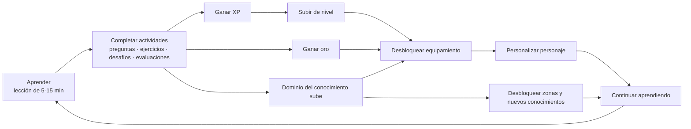
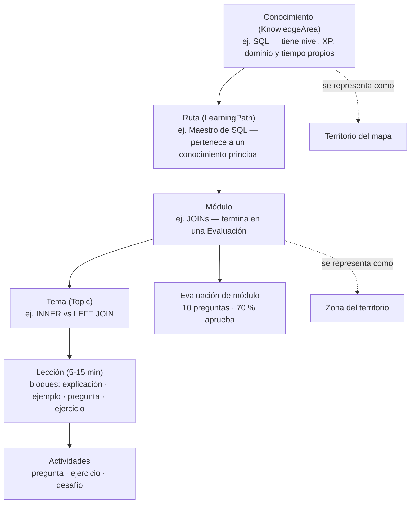
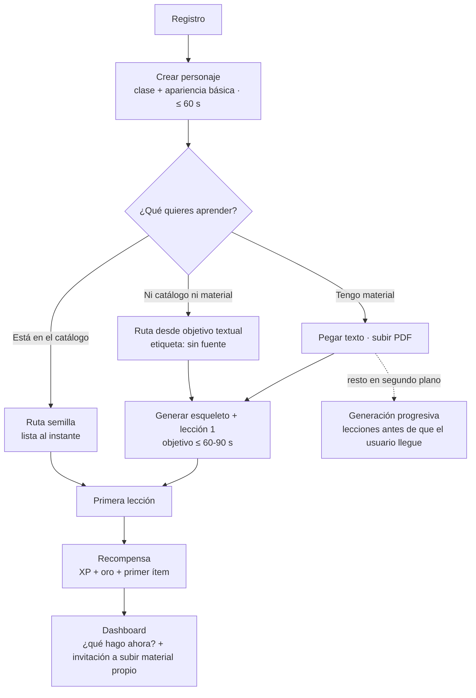
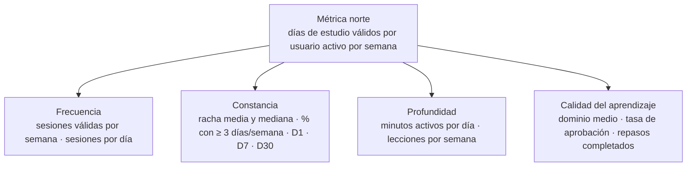

# 01 — Análisis del producto

> Auditoría previa a la implementación — punto 1 de la sección 46 del brief.
> Proyecto: **Atenea** (nombre de trabajo) · Mundo: **"Reino del Conocimiento"** (provisional).
> Fecha: 2026-09-10 · Estado: borrador para revisión del fundador · Fuente de verdad: `docs/00-brief-producto.md`.
> Este documento fija definiciones, hipótesis, métricas y principios que el resto de la auditoría (arquitectura, IA, RAG, datos, gamificación, UX, costos, riesgos) debe respetar. Cuando aquí se dice "valor inicial configurable", el número es una propuesta de partida que debe vivir en configuración de backend, nunca hardcodeado.

---

## Índice

0. Resumen ejecutivo
1. Propuesta de valor, tesis y "por qué ahora"
2. El problema real: constancia, no contenido (jobs-to-be-done)
3. Público objetivo: segmento inicial, personas y segmentos futuros
4. El ciclo central y dónde se rompe la sensación "estoy progresando"
5. Diferenciadores y panorama competitivo (mecánicas genéricas)
6. Definiciones operativas de conceptos clave (glosario normativo)
7. El problema del arranque en frío y sus mitigaciones
8. Hipótesis a validar con el MVP (ordenadas por riesgo)
9. Métrica norte e indicadores medibles
10. Criterio de éxito del MVP como embudo con umbrales
11. Principios de diseño de producto
12. Riesgos de producto de alto nivel
13. Naming y marca
14. Alcance del MVP desde la perspectiva de producto (qué entra, qué queda fuera y por qué)
15. Decisiones pendientes y preguntas abiertas
16. Supuestos

---

## 0. Resumen ejecutivo

- **Tesis**: Atenea convierte el material de estudio que una persona ya tiene (o el objetivo que tiene en la cabeza) en una ruta de aprendizaje jugable, donde la única forma de hacer crecer al personaje es **demostrar que aprendió**. No es "un chatbot que genera cursos" ni "un juego donde a veces estudias": es un RPG cuyo sistema de progresión es el aprendizaje real.
- **El problema que resuelve no es la falta de contenido, sino la falta de constancia y de señales de progreso.** El material sobra (documentación, PDFs, cursos); lo que falta es un sistema que lo convierta en pasos diarios cortos, evalúe si realmente se aprendió y haga visible el avance.
- **Por qué ahora**: los modelos generativos actuales (contexto de 1M tokens, entrada nativa de PDF, salidas estructuradas, citas sobre documentos, precios por token en caída) hacen viable, por centavos o pocos dólares por ruta, transformar material arbitrario en lecciones, preguntas y evaluaciones con trazabilidad a la fuente. Hace tres años esto requería contenido curado a mano; hoy es un problema de ingeniería de producto.
- **Segmento inicial recomendado**: profesionales y estudiantes avanzados de datos/tecnología hispanohablantes (partiendo por Chile y LatAm) que estudian por cuenta propia SQL, BigQuery, GCP, Data Engineering, BI e IA aplicada. Razones: el fundador domina el campo (puede juzgar la calidad de lo que genera la IA), el material es abundante y estructurado, las respuestas técnicas son verificables, hay objetivos concretos (certificación, cambio de rol) y la comunidad es alcanzable sin presupuesto de marketing.
- **Diferenciador**: la intersección de cinco cosas que hoy no coexisten en un mismo producto: material propio del usuario + IA generativa con trazabilidad + progresión RPG + equipamiento que representa conocimiento + dominio demostrado (no horas acumuladas). Ninguna pieza por sí sola es defendible; la combinación y el foco en un nicho sí.
- **Mayor riesgo de producto**: que el público adulto/profesional no quiera aprender contenido técnico con una capa RPG (deseabilidad), seguido de la calidad y latencia de la generación por IA y del arranque en frío (hay que subir material antes de aprender).
- **Mitigación del arranque en frío**: catálogo semilla de 3-5 rutas pre-generadas del nicho inicial, rutas desde un objetivo textual marcadas "sin fuente", pegar texto como vía de ingesta barata, y un onboarding que garantice la **primera lección terminada en menos de 5 minutos desde el registro** (valor inicial configurable).
- **Métrica norte propuesta**: *días de estudio válidos por usuario activo por semana*, descompuesta en frecuencia (sesiones/semana), constancia (racha media, D1/D7/D30), profundidad (minutos activos/día) y calidad (dominio medio, tasa de aprobación).
- **Criterio de éxito del MVP**: los 12 pasos del brief convertidos en un embudo instrumentado con umbrales objetivo y umbrales de alarma (sección 10). Para una cohorte beta de 50-150 usuarios reclutados a mano, proponemos D1 ≥ 40 %, D7 ≥ 25 %, D30 ≥ 12 % como objetivo y D1 < 25 %, D7 < 12 %, D30 < 5 % como alarma.
- **Principio rector**: cada mecánica de gamificación está ligada a aprendizaje demostrado. Nunca pay-to-win; nunca bloquear el aprendizaje tras un pago; IA solo donde aporta valor real (generación, evaluación de respuestas abiertas, explicaciones alternativas), reglas determinísticas para todo lo demás (XP, oro, rachas, misiones, desbloqueos).

---

## 1. Propuesta de valor, tesis y "por qué ahora"

### 1.1 Tesis del producto

> **Atenea convierte cualquier conocimiento en una aventura: el usuario aporta el material (o el objetivo), la IA construye la ruta, y el personaje solo avanza cuando el usuario demuestra que aprendió.**

| Dimensión | Enunciado |
|---|---|
| **Para quién** | Personas que estudian por cuenta propia material técnico con un objetivo concreto (certificación, cambio de rol, brecha de habilidades) y que abandonan por falta de estructura, constancia y señales de progreso. |
| **Problema** | Tienen el material pero no la disciplina ni la estructura; estudian pasivamente (ver, leer) sin verificar que aprendieron; no saben qué hacer hoy ni cuánto han avanzado. |
| **Solución** | Una app móvil que transforma material arbitrario en una ruta progresiva de lecciones cortas con preguntas, ejercicios y evaluaciones, envuelta en una progresión RPG (XP, nivel, oro, equipamiento, territorios) que solo se alimenta de aprendizaje demostrado. |
| **Por qué es distinta** | Material propio + IA con trazabilidad a la fuente + RPG con avatar y equipamiento que representa conocimiento + dominio medido por desempeño, no por horas. |
| **Por qué es creíble** | Los modelos actuales generan contenido estructurado con citas a fragmentos del documento a costo marginal bajo; las mecánicas de constancia (racha, objetivo diario) están validadas masivamente en otras categorías; el fundador conoce el dominio inicial y puede auditar la calidad. |
| **Promesa al usuario** | "Aprende. Juega. Evoluciona." — cada nuevo aprendizaje hace más poderoso a tu personaje, y nada más lo hace. |

### 1.2 Por qué ahora

La visión ("convierte cualquier conocimiento en una aventura") no era ejecutable con un equipo de 1-3 personas hasta hace muy poco. Lo que cambió:

| Capacidad tecnológica | Qué habilita en Atenea | Antes (≈2022-2023) |
|---|---|---|
| Contexto de 1M tokens (claude-sonnet-5 / claude-opus-5) y entrada nativa de PDF | Un libro o guía de examen completa cabe en el contexto para planificar la **estructura** de la ruta con visión global; el RAG queda para la generación de lecciones y preguntas puntuales. | Había que fragmentar todo y planificar "a ciegas" desde fragmentos. |
| Salidas estructuradas (`output_config.format`) | Ruta → módulos → temas → lecciones → preguntas como JSON válido garantizado; menos ingeniería de parsing y reintentos. | Prompts frágiles, parseo manual, tasas de error altas. |
| Citas nativas (citations) sobre bloques de documento | Trazabilidad "contenido generado a partir de: documento X, página Y" casi gratis; base para "consultar la fuente original" (brief §25-26). | Construir la trazabilidad a mano con embeddings y heurísticas. |
| Precios: haiku $1/$5, sonnet $2/$10, opus $5/$25 por millón de tokens; Batch API −50 %; prompt caching | Generar una ruta completa cuesta centavos o pocos dólares (estimación detallada en el documento de costos); el modelo económico free/premium es viable. | Generar un curso completo costaba dólares de dos dígitos y era lento. |
| Evaluación de respuestas abiertas y técnicas por LLM | Preguntas abiertas, casos prácticos y ejercicios SQL corregidos con rúbrica, no solo selección múltiple. | Solo opción múltiple o corrección humana. |
| Embeddings multilingües asequibles (Voyage, OpenAI, open-source) | Recuperación sobre material en español e inglés mezclados, típico del nicho tech. | Embeddings pobres en español. |

A esto se suma un cambio cultural: la gamificación del aprendizaje ya es un hábito masivo aceptado (idiomas, programación básica), pero esas plataformas solo funcionan con **su propio contenido curado**. El hueco es evidente: *"quiero esa constancia, pero con MI material y MI objetivo"*. Los chatbots de estudio cubren el material propio pero no tienen progresión, constancia ni estructura. Atenea se ubica exactamente en ese vacío.

### 1.3 Qué NO es Atenea (para evitar derivas)

| No es | Por qué importa |
|---|---|
| Un chatbot que genera cursos | El chat es una herramienta interna; el usuario no "conversa con la IA", juega una ruta. La IA es invisible salvo donde agrega valor (ver principios). |
| Un juego con minijuegos educativos | No hay combates, mapas 3D ni mecánicas que consuman tiempo sin aprender. El "juego" es la progresión; la acción es estudiar. |
| Una plataforma de cursos con medallas | El contenido no es un catálogo fijo; nace del material del usuario. Las medallas no son decorativas: el equipamiento representa dominio. |
| Un sistema de flashcards con XP | La repetición espaciada es una pieza (repaso), no el producto. Hay estructura progresiva, evaluaciones y desafíos prácticos. |
| Una app de idiomas con temática medieval | Idiomas queda explícitamente fuera del foco inicial (ver 3.3). |

### 1.4 Apuestas centrales

1. **Las personas quieren aprender su propio material**, no solo lo que ofrece un catálogo. Si esto es falso, Atenea se reduce a "otra plataforma de cursos" y pierde su razón de ser.
2. **Una progresión RPG cosmética motiva a adultos profesionales** si la estética es madura y el vínculo con el conocimiento es honesto. Si esto es falso, el avatar y el equipamiento son costo sin retorno.
3. **La IA genera rutas de calidad suficiente desde material arbitrario** para que el usuario las perciba útiles y confiables. Si esto es falso, la primera experiencia destruye la confianza.
4. **Un dominio "honesto" (que no sube solo con horas) se percibe como valor y no como castigo.** Si esto es falso, hay que revisar la visibilidad del dominio, no su cálculo.

---

## 2. El problema real: constancia, no contenido

### 2.1 Diagnóstico

El mercado de aprendizaje autodirigido tiene una paradoja: nunca hubo tanto material gratuito y de calidad (documentación oficial, libros, cursos abiertos, videos) y las tasas de finalización de cursos abiertos en línea siguen siendo típicamente bajas (cifras públicas de la industria hablan de un dígito o poco más de un dígito porcentual; tomar como referencia aproximada). El cuello de botella está en tres fallas de comportamiento:

| Falla | Cómo se ve | Qué necesita el usuario |
|---|---|---|
| **"El PDF guardado"** | El material se acumula (descargas, favoritos, pestañas) y nunca se estudia porque no tiene forma de "pasos". | Que alguien lo convierta en un primer paso de 10 minutos, hoy. |
| **Aprendizaje pasivo** | Ver videos y leer sin verificar; sensación de haber aprendido sin poder demostrarlo. | Preguntas y ejercicios inmediatos; corrección; saber qué no sabe. |
| **Abandono silencioso** | Sin señales de progreso ni de retorno, se pierde el hilo después de 3-5 días; volver cuesta más que empezar. | Progreso visible en varias escalas de tiempo; una razón concreta para volver mañana; un "continúa aquí" inequívoco. |

Por eso la métrica fundamental del brief está bien elegida: **¿la gamificación aumenta la frecuencia y la constancia del aprendizaje?** No preguntamos si la gente aprende más rápido, sino si **vuelve**.

### 2.2 Jobs-to-be-done

| Tipo | Job (formato "cuando… quiero… para…") | Cómo lo atiende Atenea |
|---|---|---|
| **Funcional principal** | Cuando tengo material técnico que necesito dominar (una certificación, un cambio de rol), quiero convertirlo en pasos diarios manejables sin tener que organizarlo yo, para llegar a dominarlo en semanas y no abandonarlo. | Ruta generada por IA desde el material; lecciones de 5-15 min; objetivo diario. |
| **Funcional secundario** | Cuando creo que ya sé algo, quiero comprobarlo con preguntas y ejercicios reales, para no llegar a un examen o entrevista con falsa confianza. | Evaluaciones por módulo, ejercicios técnicos corregidos, dominio medido por desempeño. |
| **Funcional terciario** | Cuando fallo en algo, quiero que me lo expliquen de otra forma y me den más práctica, para no quedarme trabado. | Repaso recomendado, explicación alternativa, nuevos ejercicios (adaptativo básico en MVP). |
| **Emocional** | Quiero sentir que avanzo cada día y no culpa por lo que no estudié. | Recompensas inmediatas, racha, "estoy progresando" en 7 dimensiones; rachas sin humillación. |
| **Emocional 2** | Quiero que estudiar se sienta como un rato agradable y no como una obligación. | Envoltorio RPG, avatar, mundo, celebraciones breves. |
| **Social (futuro)** | Quiero poder mostrar lo que domino, a mí mismo y eventualmente a otros. | Perfil de conocimiento; equipamiento que representa dominio; social en fases posteriores. |

### 2.3 Lo que el usuario debe poder responder en todo momento

El diseño de producto se juzga por tres preguntas que la app debe contestar en menos de dos segundos desde cualquier pantalla principal:

1. **¿Qué hago ahora?** (una única acción principal: "Continúa: SQL — JOINs, +50 XP").
2. **¿Cuánto avancé?** (racha, objetivo diario, dominio por conocimiento, nivel).
3. **¿Qué gané?** (XP, oro, ítems, zonas; siempre asociado a *qué aprendí* para ganarlo).

---

## 3. Público objetivo

### 3.1 Segmento inicial recomendado

> **Profesionales y estudiantes avanzados de datos/tecnología, hispanohablantes (Chile y LatAm primero), 22-40 años, que estudian por cuenta propia para certificarse, cambiar de rol o cerrar brechas en SQL, BigQuery, GCP, Data Engineering, Business Intelligence e IA aplicada.**

Los ejemplos del propio brief (Castillo de SQL, Torre de GCP, Montañas de Data Engineering, Ciudad de BI) apuntan a este segmento, y es la elección correcta para empezar:

| Criterio | Evaluación para el segmento data/tech | Peso |
|---|---|---|
| **Dominio del fundador** | Perfil data/BI (SQL, BigQuery, GCP, Python): puede juzgar si una lección generada es correcta, escribir las rutas semilla, diseñar rúbricas y hacer *dogfooding* diario. Es la ventaja más difícil de replicar en un equipo de 1-3 personas. | Muy alto |
| **Material abundante y estructurado** | Documentación oficial, guías de examen, libros técnicos, apuntes de cursos: texto denso, bien jerarquizado, ideal para RAG y para planificar rutas. | Alto |
| **Respuestas verificables** | SQL y muchos ejercicios técnicos tienen corrección objetiva (resultado esperado), lo que hace creíble el "dominio demostrado" y reduce la dependencia del juicio del LLM. | Alto |
| **Objetivo concreto y fecha** | Certificaciones (GCP, cloud), entrevistas, cambios de rol: motivación extrínseca ya presente que la app puede canalizar. | Alto |
| **Disposición a pagar** | Adultos con ingreso, acostumbrados a pagar suscripciones de herramientas y cursos. Facilita el freemium futuro. | Medio-alto |
| **Comunidad alcanzable** | Comunidades de datos en LatAm (grupos, meetups, LinkedIn, Discord/Slack) concentradas y accesibles sin presupuesto de marketing; el fundador ya pertenece a ellas. | Alto |
| **Benchmark de calidad público** | Temarios de certificación y exámenes de práctica públicos permiten medir si la ruta generada "cubre lo que hay que cubrir". | Medio |
| **Contras** | Mercado más pequeño que idiomas o escolar; público adulto puede rechazar una estética "infantil"; contenido técnico exige mayor rigor a la IA (una consulta SQL incorrecta se nota). | — |

**Por qué empezar acotado y no "cualquier conocimiento" desde el día uno**: la promesa de la visión es universal, pero la ejecución de calidad no lo es. Cada dominio necesita plantillas de ruta, rúbricas de corrección, tipos de ejercicio y ejemplos de referencia distintos (un caso clínico no se evalúa como una consulta SQL). Un equipo pequeño solo puede hacer esto bien en un dominio a la vez. La arquitectura debe ser agnóstica al dominio (el brief lo exige), pero **el producto, el marketing, las rutas semilla y la calidad se optimizan primero para datos/tech**. Cuando la métrica norte esté validada en el nicho, se abre el siguiente segmento con sus propias plantillas.

### 3.2 Personas (arquetipos)

#### Persona A — "Camila", 29, analista de datos que quiere ser Data Engineer

| Aspecto | Detalle |
|---|---|
| Contexto | Usa SQL a diario en su trabajo; quiere aprender BigQuery, GCP y pipelines para cambiar de rol con mejor sueldo. Tiene PDFs de cursos, documentación guardada y un curso online al 20 %. |
| Momento de uso | Noche, 20-30 minutos en el celular, en el sofá o en el transporte. Fines de semana a veces más tiempo. |
| Motivaciones | Cambio de rol concreto; sentir que "esta vez sí avanzo"; poder mostrar en una entrevista lo que domina. |
| Fricciones | No sabe por dónde empezar; los videos la aburren; no mide su progreso; se pierde tras una semana sin estudiar. |
| Qué necesita en la primera sesión | Ver una lección concreta hecha **de su material** (o de una ruta semilla de BigQuery) en menos de 5 minutos, responder bien un par de preguntas y ver algo cambiar (XP, ítem, avatar). |
| Riesgos | Si la estética le parece infantil no la va a compartir con colegas; si la generación tarda 10 minutos, cierra la app. |
| Qué la retiene | La racha, el objetivo diario alcanzable en 15 minutos y ver el "Dominio BigQuery" subir de 20 % a 60 % en semanas. |

#### Persona B — "Rodrigo", 36, líder de BI preparando una certificación cloud de datos

| Aspecto | Detalle |
|---|---|
| Contexto | Tiene la guía oficial del examen (PDF largo), apuntes propios y documentación. Fecha de examen en 8 semanas. Poco tiempo, mucha presión. |
| Momento de uso | Sesiones cortas entre reuniones y una sesión más larga el fin de semana. Móvil para estudiar; computador para subir material. |
| Motivaciones | Aprobar el examen; identificar debilidades rápido; sensación de cobertura ("ya vi todo el temario"). |
| Fricciones | Material voluminoso y desordenado; no sabe qué temas domina; los simuladores de examen son caros o de mala calidad. |
| Qué necesita en la primera sesión | Subir 2-3 PDFs y obtener una ruta con módulos que calcen con el temario del examen, con evaluaciones por módulo. Tolera esperar unos minutos **si ve progreso de la generación** y mientras tanto puede hacer una lección. |
| Relación con el RPG | Le importa el dominio %, la racha y el calendario; el avatar le es indiferente al inicio, pero un ítem "Cetro de BigQuery — dominio ≥ 80 %" le parece una meta legítima. Es el usuario que exige que el dominio sea creíble. |
| Riesgos | Si detecta una lección con un error técnico deja de confiar en toda la ruta. Necesita ver la fuente ("generado a partir de: guía oficial, pág. 41"). |

#### Persona C — "Tomás", 22, estudiante/junior aprendiendo SQL desde cero

| Aspecto | Detalle |
|---|---|
| Contexto | No tiene material propio; quiere "aprender SQL" porque lo piden en todas las ofertas. Le gustan los videojuegos. Tiempo disponible, poca disciplina. |
| Momento de uso | Ratos libres, varias veces al día, sesiones de 5-10 minutos. |
| Motivaciones | Logros, niveles, coleccionar; sentir que "sube"; conseguir su primer trabajo. |
| Fricciones | Se frustra si falla mucho; abandona si no hay feedback inmediato; puede intentar "farmear" XP repitiendo lo fácil. |
| Qué necesita en la primera sesión | Ruta semilla "SQL desde cero" lista al instante; primera lección con ejercicios ejecutables; primer ítem desbloqueado en la primera sesión. |
| Riesgos | Es el que más pone a prueba las reglas anti-abuso (XP por acciones triviales, repetir lecciones) y el que más se queja si el dominio no sube "aunque estudié horas". |
| Qué lo retiene | Misiones diarias, equipamiento visible, la promesa de la "Espada del SQL" al completar la ruta. |

**Resumen de personas**

| | Camila (A) | Rodrigo (B) | Tomás (C) |
|---|---|---|---|
| Trae material propio | Sí, parcial | Sí, mucho | No |
| Objetivo | Cambio de rol | Certificación con fecha | Primer empleo / base |
| Sesión típica | 20-30 min noche | 10-15 min + sesión larga fin de semana | 5-10 min varias veces al día |
| Motor principal | Progreso visible + racha | Dominio creíble + cobertura | Colección + niveles + misiones |
| Prueba de fuego | Primera lección de su material en < 5 min | Confianza en la calidad y la fuente | Primer ítem en la primera sesión |
| Riesgo | Estética infantil, latencia | Error técnico, dominio poco creíble | Farmeo, frustración |

El MVP debe funcionar para las tres, pero la **prioridad de diseño es A**, porque combina material propio (la apuesta 1) con motivación por progreso (la apuesta 2) y representa el centro del segmento.

### 3.3 Segmentos futuros (no en el MVP)

| Segmento | Atractivo | Por qué después |
|---|---|---|
| Estudiantes universitarios (apuntes de cátedra, ramos) | Volumen grande; material propio abundante; ciclo de exámenes marcado. | Baja disposición a pagar; estacionalidad; requiere plantillas por disciplina; posible presión sobre costos de IA en free. |
| Certificaciones y exámenes profesionales no-tech (salud, derecho, contabilidad, seguridad) | Alta disposición a pagar; objetivo con fecha. | Exige rigor y rúbricas especializadas; riesgo reputacional si la IA se equivoca; requiere validación de expertos del dominio. |
| Equipos y empresas (L&D, onboarding técnico con material interno) | Ingreso B2B; material privado; un comprador paga por muchos usuarios. | Requiere administración de equipos, privacidad reforzada, reportes; fuera del MVP por complejidad. |
| Creadores de rutas públicas (fase 5 del brief) | Efecto de red; catálogo que crece solo. | Requiere moderación, derechos de autor, calidad; social fuera del MVP. |
| Idiomas | Mercado gigante. | **No recomendado**: incumbentes con contenido curado y años de ajuste; la ventaja "material propio" no aplica bien; competir ahí diluye la identidad. |

### 3.4 Anti-público del MVP

Niños y escolares (consentimiento parental, estética y contenidos distintos), aprendizaje de idiomas, quien busca una credencial formal reconocida (Atenea no certifica) y quien solo quiere un chat para preguntar dudas.

---

## 4. El ciclo central y dónde se rompe la sensación "estoy progresando"

### 4.1 El ciclo del brief, explicitado

El ciclo tiene **dos motores** que deben reforzarse y no competir:

- **Motor intrínseco**: dominio del conocimiento (saber más, comprobarlo, verlo subir).
- **Motor extrínseco**: XP, oro, nivel, equipamiento, zonas.

El riesgo clásico es que las recompensas extrínsecas desplacen a las intrínsecas (el usuario estudia "por el XP" y deja de estudiar cuando el XP deja de sorprender). La defensa de producto es que **todas las recompensas extrínsecas se ganan por desempeño demostrado**, que las celebraciones destaquen el aprendizaje ("Dominaste JOINs") por sobre la moneda, y que los ítems más valiosos sean los de conocimiento (requisitos de dominio), no los comprados con oro.

### 4.2 Eslabón por eslabón: dónde se rompe y cómo se protege

| # | Eslabón | Lo que debe sentir el usuario | Dónde se rompe | Mitigación de producto |
|---|---|---|---|---|
| 1 | Aprender (lección) | "Esto es de mi material, es concreto y lo termino en 10 minutos." | Lección larga o genérica; no reconoce su material; la generación tarda; texto plano sin ritmo. | Lecciones de 5-15 min (valor inicial configurable) en bloques cortos; "generado a partir de: X" visible; esqueleto + lección 1 generados primero, el resto en segundo plano; ruta semilla mientras se procesa. |
| 2 | Completar actividades | "Las preguntas son justas y me dicen qué no sé." | Preguntas triviales, ambiguas o con error; corrección injusta de respuestas abiertas; demasiadas preguntas del mismo tipo. | Botón "reportar pregunta" desde el día uno; regeneración; rúbricas con explicación de la corrección; mezcla de tipos limitada pero variada (ver alcance). |
| 3 | Ganar XP | "El XP refleja esfuerzo real." | XP arbitrario; farmeo de acciones triviales devalúa todo; la barra de nivel no se mueve. | XP solo por actividad educativa válida; topes diarios de repaso; curva de niveles con niveles tempranos rápidos y luego más lentos (detalle en el documento de niveles). |
| 4 | Subir de nivel | "Cambió algo: tengo un título, algo nuevo." | El nivel no cambia nada visible. | Título por rango de nivel ("Aprendiz", …), desbloqueo cosmético o de tienda por nivel, animación breve. |
| 5 | Ganar oro | "Puedo elegir en qué gastarlo y vale la pena." | Nada que comprar; precios desalineados; el oro se acumula sin uso (inflación) o nunca alcanza. | Tienda con catálogo suficiente en el MVP; precios calibrados a "1 ítem común cada 2-3 días de estudio" (valor inicial configurable, detalle en el documento de monedas); sin ítems de conocimiento comprables. |
| 6 | Desbloquear equipamiento | "Este ítem representa algo que logré." | Primer desbloqueo llega tarde; ítems de conocimiento invisibles hasta obtenerlos; requisitos opacos. | Primer ítem al completar la primera lección (ítem inicial de la clase, valor inicial configurable); ítems de conocimiento visibles como bloqueados con su requisito ("Espada del SQL: completa la ruta SQL"); progreso hacia el requisito visible. |
| 7 | Personalizar personaje | "Mi personaje se ve bien y refleja lo que aprendí." | Avatar poco visible o de baja calidad; demasiados slots con pocos ítems cada uno. | Avatar presente en el dashboard y el perfil; pocos slots bien resueltos en el MVP (ver alcance); equipamiento de conocimiento con identidad visual clara. |
| 8 | Desbloquear zonas y conocimientos | "El mundo crece porque yo aprendí." | Mapa decorativo sin relación con el progreso; territorios inventados que contradicen el contenido. | Territorio = conocimiento; zona = módulo; desbloqueo real por completar módulos/rutas; nombres derivados del contenido (ver 6.13). |
| 9 | Continuar aprendiendo | "Sé exactamente qué hacer ahora." | Dashboard sobrecargado; varias llamadas a la acción; no queda claro dónde quedé. | Una única acción principal ("Continúa") + objetivo diario; el resto secundario. |

### 4.3 Progreso en múltiples escalas de tiempo

La sensación "estoy progresando" se sostiene solo si hay algo que avanza en **cada** escala temporal. Las siete dimensiones del brief (§48) se distribuyen así:

| Escala | Qué avanza | Dimensión del brief | Señal de producto |
|---|---|---|---|
| Segundos | Respuesta correcta | ⭐ XP | "+10 XP" animado; explicación si falla. |
| Minutos | Lección completada | ⭐ XP, 🪙 oro, 🧠 dominio (pequeño) | Pantalla de recompensa; barra de lección → módulo. |
| Día | Objetivo diario cumplido, racha mantenida | 🔥 racha, ⏱ horas | Check del día; racha +1; calendario. |
| Semana | Módulo completado, evaluación aprobada, misión semanal, ítem obtenido | ⚔️ nivel, 🎒 equipamiento, 🧠 dominio | Zona desbloqueada; "Nuevo equipamiento"; dominio salta. |
| Mes | Ruta completada, ítem de conocimiento, territorio completo | 🗺️ mundo, 🎒 equipamiento legendario | "Espada del SQL"; territorio iluminado. |
| Trimestre | Conocimiento dominado (≥ 80 %), varios conocimientos | 🧠 dominio, 🎒 "Corona del Maestro" | Perfil de conocimiento; logros especiales. |

Si una escala queda vacía (por ejemplo, semanas sin ningún ítem ni módulo), el usuario siente estancamiento aunque el XP suba. El diseño de misiones, economía y curva de niveles (documentos correspondientes) debe garantizar que **ninguna semana activa termine sin al menos un hito visible** (valor inicial configurable: ≥ 1 hito semanal para un usuario que cumple el objetivo diario 4 de 7 días).

### 4.4 La ruptura en el minuto cero: latencia de generación

El brief supone que el usuario "carga material → recibe una ruta generada". En la práctica, procesar 200 páginas, indexar y generar la ruta completa toma minutos, y es exactamente el momento de mayor abandono. Recomendaciones de producto (la implementación es asunto de los documentos de IA y arquitectura):

1. **Generación por etapas**: primero el esqueleto (módulos y temas) y la lección 1 — objetivo: primera lección disponible en ≤ 60-90 s desde la carga (valor inicial configurable) —; el resto en segundo plano, con las lecciones generadas justo antes de que el usuario llegue a ellas.
2. **Espera narrada y con progreso real**: "El cartógrafo está trazando tu ruta… 3 de 8 módulos", no un spinner.
3. **Alternativa inmediata**: mientras se procesa su material, el usuario puede hacer la lección 1 de una ruta semilla o personalizar su avatar (esto último sin XP).
4. **Notificación de "tu ruta está lista"** si el usuario cerró la app.

---

## 5. Diferenciadores y panorama competitivo

### 5.1 Cuadro comparativo de mecánicas genéricas

La comparación es por **categoría de producto** y por **mecánicas genéricas** (racha, XP, niveles, avatar, repetición espaciada son patrones de diseño de uso común, no elementos protegidos). No se copian nombres, personajes, diseños ni recorridos visuales de ninguna plataforma.

| Mecánica / atributo | Apps de idiomas gamificadas | Plataformas de cursos / MOOC | Apps de flashcards / repetición espaciada | Chatbots y asistentes de estudio con IA | **Atenea** |
|---|---|---|---|---|---|
| ¿Quién crea el contenido? | La plataforma (curado, fijo) | Instructores (catálogo) | El usuario (tarjetas) o mazos compartidos | La IA, bajo demanda, sin estructura | **La IA a partir del material del usuario**, con catálogo semilla |
| Funciona con material propio del usuario | No | No | Sí, pero manual | Sí (subir PDF, preguntar) | **Sí, automático y estructurado** |
| Estructura progresiva (ruta → módulos → lecciones) | Sí, fija | Sí, lineal | No | No (conversación) | **Sí, generada y desbloqueable** |
| Lecciones cortas (5-15 min) | Sí | No (videos largos) | Sí (sesiones de repaso) | Variable | **Sí, por diseño** |
| Evaluación con corrección automática | Sí (cerrada) | Parcial (quizzes) | Autoevaluación | Sí, pero sin registro de progreso | **Sí, cerrada + abierta + técnica, con registro** |
| Racha y objetivo diario | Sí, central | Rara | A veces | No | **Sí, central, ligada a actividad válida** |
| XP y niveles | Sí | Rara (insignias) | Rara | No | **Sí, solo por aprendizaje demostrado** |
| Avatar / personaje personalizable | Limitado o inexistente | No | No | No | **Sí, pieza central** |
| Equipamiento que representa conocimiento | No | No (certificados) | No | No | **Sí, mecánica distintiva** |
| Dominio medido por desempeño (no por horas) | Parcial (fuerza de habilidad) | No (finalización) | Sí (retención de tarjetas) | No | **Sí, por conocimiento, explicable** |
| Repetición espaciada / repaso | Sí | No | Sí, central | No | **Sí, como pieza (repaso recomendado); completo en fases posteriores** |
| Trazabilidad a la fuente | No aplica | La fuente es el curso | No aplica | Parcial | **Sí: documento, fragmento, fecha** |
| Adaptatividad a errores | Sí (dentro del contenido curado) | No | Algorítmica (intervalos) | Conversacional, sin memoria de progreso | **Sí: detección de debilidad → repaso → explicación alternativa** |
| Costo marginal de nuevo contenido | Muy alto (equipo editorial) | Alto (instructor) | Cero (lo hace el usuario) | Bajo (IA) | **Bajo (IA) + reutilizable (caché)** |
| Mundo / progresión espacial | Recorrido lineal | No | No | No | **Sí: territorios = conocimientos, zonas = módulos** |

### 5.2 Qué hace única a Atenea

No es ninguna fila aislada: cada mecánica existe en alguna categoría. Lo único es la **intersección** de cinco pilares y su regla de vinculación:

1. **Material propio del usuario** (lo que las plataformas de contenido curado no pueden ofrecer).
2. **IA generativa con trazabilidad** (estructura + preguntas + corrección, respaldadas por la fuente).
3. **Progresión RPG con avatar** (lo que los chatbots y las flashcards no tienen).
4. **Equipamiento que representa conocimiento** (mecánica de firma: la "Espada del SQL" solo existe si completaste la ruta SQL; nadie puede comprarla).
5. **Dominio demostrado** (el perfil de conocimiento es creíble porque no sube con horas, sube con desempeño).

**Regla de vinculación** (principio fundamental del brief §44): ninguna mecánica de juego se alimenta de algo que no sea aprendizaje. Esa regla es la que convierte la intersección en una identidad y no en una lista de features.

### 5.3 Defensibilidad y riesgo de imitación

- La tecnología no es defendible (cualquier equipo puede llamar al mismo modelo). Lo defendible es: el **perfil de conocimiento acumulado del usuario** (cuesta abandonarlo), la **biblioteca de rutas generadas y validadas** (caché reutilizable que mejora el costo y la calidad), la **identidad RPG** y, más adelante, la comunidad.
- Un incumbente de idiomas podría añadir "sube tu material", pero su identidad de marca y su modelo editorial lo hacen improbable a corto plazo; un chatbot podría añadir gamificación, pero sin estructura ni avatar. El riesgo real son otros equipos pequeños con la misma idea: la ventaja es **velocidad de ejecución en el nicho** y calidad en datos/tech.

---

## 6. Definiciones operativas de conceptos clave (glosario normativo)

Estas definiciones son **normativas** para el resto de documentos (modelo de datos, motor de gamificación, sistema de dominio, UX). Resuelven dos ambigüedades detectadas en el brief:

- **Ambigüedad 1 — "tema"**: en §8 "dominio por tema" los ejemplos (SQL, BigQuery, GCP) son áreas de conocimiento; en §19 "Topic" es una unidad dentro de un módulo. **Resolución**: el nivel superior se llama **Conocimiento** (entidad `KnowledgeArea`) y tiene nivel, XP, dominio y tiempo propios; **Tema** (`Topic`) es la unidad conceptual dentro de un módulo. El "dominio por tema" del brief §8 se lee como **dominio por conocimiento**; también existe un dominio por tema como sub-métrica interna que alimenta el repaso.
- **Ambigüedad 2 — territorios**: §3 usa "Castillo de SQL" como territorio (categoría) y §27 usa "Bosque de SQL → Castillo de JOINs" (mezcla conocimiento y módulo). **Resolución**: **Territorio** = Conocimiento; **Zona** (lugar dentro del territorio) = Módulo. Un territorio se ilumina completo cuando se completa la ruta.
- **Ambigüedad 3 — "desafío" vs "evaluación"**: §7 da XP distinto a "desafío" (+250) y "evaluación" (+300) pero §23 llama "Desafío del Castillo" a la evaluación de módulo. **Resolución**: **Desafío** = actividad práctica extendida (ejercicio técnico o caso) dentro de una lección o como cierre de tema; **Evaluación** = examen de módulo. El nombre narrativo de la evaluación no debe usar la palabra "desafío" (propuesta: "Prueba del Castillo", "Juicio de la Torre", etc.), para no confundir al usuario ni al equipo.

### 6.1 Jerarquía de contenido

### 6.2 Conocimiento (KnowledgeArea)

- **Definición**: área de conocimiento de nivel superior sobre la que se mide progresión propia (nivel, XP acumulado, dominio 0-100 %, tiempo). Ejemplos: SQL, BigQuery, GCP, Data Engineering, BI, IA.
- **Reglas**: un conocimiento puede tener **varias rutas** (SQL básico y SQL avanzado alimentan el mismo dominio "SQL"). Cada ruta pertenece a **un conocimiento principal**. Existe una **taxonomía semilla** curada por el equipo para el nicho inicial; cuando un usuario crea una ruta, la IA propone mapearla a un conocimiento existente o crear uno nuevo, con normalización de nombres (evitar "SQL", "Sql" y "Structured Query Language" como tres conocimientos distintos). El usuario confirma.
- **Se representa** como un **territorio** en el mapa.

### 6.3 Ruta (LearningPath)

- **Definición**: secuencia ordenada de módulos generada para un objetivo concreto ("Quiero aprender SQL", "Aprobar la certificación X"), a partir de material del usuario, de un objetivo textual o del catálogo semilla.
- **Atributos de origen**: `con_fuente` (material del usuario o semilla curada) o `sin_fuente` (solo objetivo textual; ver sección 7). Nivel declarado por el usuario (inicial / intermedio / avanzado).
- **Reglas**: los módulos se desbloquean progresivamente (completar el módulo N desbloquea N+1; valor inicial: secuencial estricto, configurable para permitir saltos por evaluación diagnóstica en fases posteriores). Completar una ruta = completar todos sus módulos con sus evaluaciones aprobadas. Otorga XP de ruta (+1.000 en el brief, valor inicial configurable) y puede ser requisito de ítems.

### 6.4 Módulo

- **Definición**: agrupación temática dentro de una ruta (ej. "JOINs"), compuesta por 2-5 temas (valor inicial configurable) y cerrada por **una evaluación**.
- **Reglas**: se completa al aprobar la evaluación (≥ 70 %, valor inicial configurable). Otorga XP de módulo (+150 en el brief, valor inicial configurable). Se representa como una **zona** del territorio.

### 6.5 Tema (Topic)

- **Definición**: unidad conceptual dentro de un módulo (ej. "LEFT JOIN"), compuesta por 1-3 lecciones (valor inicial configurable). Es la granularidad a la que se rastrean **debilidades** para el repaso y la adaptatividad.

### 6.6 Lección

- **Definición**: unidad mínima de aprendizaje que otorga la recompensa "lección completada". Duración objetivo 5-15 minutos (valor inicial configurable). Compuesta por **bloques** ordenados: explicación, ejemplo, imagen/diagrama cuando corresponda, preguntas, ejercicio o mini-desafío, recompensa.
- **Reglas**: una lección **debe** incluir al menos una actividad evaluada (pregunta o ejercicio) para poder completarse; leer sin responder no la completa. Se completa una sola vez para efectos de XP de lección; volver a hacerla se registra como **repaso** (ver 6.10). Cada lección mantiene trazabilidad a los fragmentos de origen (documento, fragmento, fecha de procesamiento) cuando `con_fuente`.

### 6.7 Actividad (Activity) y sus tipos

| Tipo | Definición | Corrección | En el MVP |
|---|---|---|---|
| Pregunta cerrada | Selección múltiple, verdadero/falso, completar con opciones, relacionar, ordenar | Determinística | Sí (selección múltiple, V/F, completar; relacionar/ordenar si el costo de UI lo permite) |
| Pregunta abierta corta | Respuesta libre de una o dos frases | LLM con rúbrica + explicación | Sí, limitada (1 por lección como máximo, valor inicial configurable) |
| Ejercicio técnico | Escribir una consulta SQL, un fragmento de código, una configuración | LLM con rúbrica; ejecución real en entorno controlado deseable en fase 2 | Sí, con corrección por LLM y comparación con solución de referencia |
| Desafío | Actividad práctica extendida o caso que integra varios temas | LLM con rúbrica | Sí, 1 por módulo como máximo (valor inicial configurable) |
| Evaluación | Examen de módulo (10 preguntas, valor inicial configurable) | Mixta | Sí |
| Repaso | Sesión corta de preguntas sobre temas débiles o antiguos | Determinística / LLM | Sí, versión básica (temas fallados); repetición espaciada completa después |

### 6.8 Evaluación

- **Definición**: examen de cierre de módulo. Valores iniciales configurables: 10 preguntas; 70 % aprueba; 90 % recompensa adicional; 100 % logro especial. Si falla, no pierde progreso: se identifican temas débiles y se recomienda repaso; puede reintentar tras completar el repaso recomendado (valor inicial: sin límite de intentos, con un intervalo mínimo de 10 minutos entre intentos, configurable).
- **Regla de dominio**: para el cálculo de dominio cuenta el **primer intento** con peso completo y los reintentos con peso reducido (detalle en el documento de dominio), de modo que reintentar hasta aprobar no infle el dominio.

### 6.9 Actividad educativa válida

Esta definición es la que gobierna la **racha**, el **objetivo diario** y las **misiones**. Es deliberadamente estricta.

**Cuenta como actividad educativa válida** (cualquiera de estas, dentro de un mismo día local del usuario):

1. Completar una lección **no completada antes** (incluye responder sus actividades).
2. Completar una **evaluación** (aprobada o no).
3. Completar un **desafío**.
4. Completar una **sesión de repaso** con al menos 5 preguntas respondidas (valor inicial configurable).
5. Responder al menos 5 preguntas en total en el día (valor inicial configurable) dentro de cualquier actividad, con al menos 1 correcta.

**No cuenta**: abrir la app; mirar el mapa, el perfil o las estadísticas; comprar o equipar ítems; personalizar el avatar; releer una lección completada sin responder preguntas; crear una ruta o subir material (se recompensa aparte, una sola vez, y no mantiene la racha).

**Anti-abuso** (valores iniciales configurables): una respuesta emitida en menos de 3 segundos desde que se mostró la pregunta no cuenta para la racha ni otorga XP; repetir la misma lección cuenta como repaso solo una vez por día por lección; el XP total obtenible por repaso tiene un tope diario; las preguntas de repaso no repiten exactamente las mismas de la lección original cuando existan variantes.

### 6.10 Repaso

Actividad generada a partir de temas con dominio bajo o con errores recientes. Otorga XP reducido respecto a una lección nueva (valor inicial: 40 % del XP de lección, configurable) y sí mueve el dominio del tema. Es la vía legítima para "recuperar" y para mantener la racha en días de poco tiempo.

### 6.11 Sesión de estudio y tiempo de estudio

- **Sesión de estudio**: ventana de actividad que empieza con la primera interacción educativa (abrir una lección, responder) y termina tras **10 minutos de inactividad** (valor inicial configurable) o al cerrar la app por más de 2 minutos (valor inicial configurable). Una sesión puede contener varias actividades.
- **Tiempo de estudio**: suma del tiempo **activo** dentro de las actividades, con tope por actividad (valor inicial: 3 × la duración estimada de la actividad, configurable) para que dejar la app abierta no infle las horas. Es la métrica "⏱ Tiempo" del perfil y **no influye en el dominio**.

### 6.12 Objetivo diario, racha y día

- **Día**: se define en la **zona horaria del usuario**, con corte a medianoche local (valor inicial configurable; alternativas en decisiones pendientes).
- **Racha**: número de días consecutivos con al menos una actividad educativa válida. Se muestra racha actual, mejor racha, calendario y días activos. Las recompensas por hitos (7, 14, 30, 100 días) son valores iniciales configurables. La **protección de racha**, si existe, se gana **estudiando** (ítem comprable con oro o recompensa de misión), nunca con dinero real en el MVP; su detalle va en el documento de rachas.
- **Objetivo diario**: meta elegida por el usuario en tres intensidades (valor inicial: relajado / regular / intenso), expresada en una unidad común que se puede cumplir con **cualquier** actividad válida. Recomendación de producto: unidad = XP (por ejemplo 50 / 100 / 200 XP, valores iniciales configurables), mostrada al usuario con su equivalente aproximado en minutos ("≈ 10 / 20 / 35 min"). Los minutos son intuitivos pero manipulables; el XP está ligado a desempeño. **Cumplir el objetivo diario no es requisito para mantener la racha**; la racha exige solo una actividad válida (valor inicial configurable; ver decisiones pendientes).

### 6.13 Territorio y zona (mundo)

- **Territorio**: representación visual de un **conocimiento** en el mapa. Aparece (en niebla) cuando el usuario tiene una ruta en ese conocimiento; se ilumina completo al completar una ruta; puede tener nombre narrativo derivado del contenido ("Castillo de SQL") generado una vez por conocimiento y cacheado, o tomado de la taxonomía semilla. La IA **no** inventa temáticas que contradigan el contenido (brief §3).
- **Zona**: lugar dentro del territorio que representa un **módulo**; se desbloquea al completar el módulo anterior.

### 6.14 XP, nivel global y nivel por conocimiento

- **XP**: puntos otorgados exclusivamente por actividades educativas válidas y hitos de aprendizaje (lección, módulo, ruta, evaluación, desafío, misión). Cada transacción de XP lleva el conocimiento asociado, de modo que **una misma transacción** alimenta el nivel global y el nivel del conocimiento sin duplicar datos.
- **Nivel global**: función del XP total acumulado; tiene títulos por rango ("Aprendiz", …).
- **Nivel por conocimiento**: función del XP acumulado en ese conocimiento.
- Los valores de la tabla del brief §7 (+50 lección, +10 respuesta correcta, +150 módulo, +250 desafío, +300 evaluación, +100 misión diaria, +1.000 ruta) son **valores iniciales configurables** que el documento de XP calibrará.

### 6.15 Oro

Moneda blanda ganada por lecciones, misiones, rachas, logros, desafíos y evaluaciones, gastable solo en cosméticos y conveniencias (protección de racha ganada). **Nunca** compra ítems de conocimiento ni XP ni dominio. Detalle en el documento de monedas.

### 6.16 Dominio y "conocimiento dominado"

- **Dominio**: métrica 0-100 % por conocimiento que mide **conocimiento demostrado**. Restricciones que el documento de dominio debe respetar: (a) no aumenta con tiempo ni con XP por sí solos; (b) depende principalmente del desempeño en evaluaciones y ejercicios, secundariamente de preguntas de lección; (c) es reproducible y **explicable al usuario** ("63 % porque aprobaste 5 de 8 módulos con 78 % promedio y tienes 2 temas débiles"); (d) el primer intento pesa más que los reintentos; (e) un decaimiento suave por falta de repaso es deseable pero se pospone a fases posteriores.
- **Orientación inicial de pesos** (valores iniciales configurables, a calibrar en el documento de dominio): evaluaciones 60 %, ejercicios y desafíos 25 %, preguntas de lección 15 %; cobertura (proporción de módulos completados) como factor multiplicador para que no se pueda tener 95 % de dominio con un solo módulo.
- **Conocimiento dominado**: dominio ≥ 80 % **y** ruta completa (valores iniciales configurables). Es el requisito de ítems como el "Cetro de BigQuery" y de la "Corona del Maestro" (5 conocimientos dominados).

### 6.17 Ítem, equipamiento y requisito de desbloqueo

- **Ítem**: objeto cosmético con nombre, descripción, rareza, categoría (slot), imagen, precio (si es comprable), requisitos, estado y fecha de adquisición.
- **Ítems de conocimiento**: no tienen precio; su único requisito es un logro de aprendizaje (completar ruta X, dominio ≥ N % en Y, dominar Z conocimientos). Son la mecánica distintiva y deben ser los de mayor rareza.
- **Equipar**: colocar un ítem del inventario en su slot del avatar. No afecta capacidades educativas ni recompensas (sin bonificadores de XP por ítems en el MVP; ver decisiones pendientes).

### 6.18 Misión y logro

- **Misión**: objetivo con plazo (diaria, semanal, especial) generado por **plantillas determinísticas** (no por IA en el MVP), que recompensa XP, oro, ítems o logros. Cumplible por diferentes acciones cuando sea posible.
- **Logro**: hito permanente sin plazo (primera lección, primera evaluación al 100 %, 7 días de racha, primer conocimiento dominado). Puede desbloquear ítems.

---

## 7. El problema del arranque en frío y sus mitigaciones

### 7.1 El problema

El criterio de éxito del brief exige: crea personaje → crea ruta → **carga material** → recibe ruta → completa lección. Ese orden introduce tres fricciones exactamente en el momento más frágil (los primeros 5 minutos):

1. **No tengo el material a mano en el celular** (está en el computador, en el correo, en un enlace).
2. **Subir un PDF grande desde el móvil** es lento y poco habitual.
3. **Esperar la generación** (minutos) sin haber experimentado aún ningún valor.

Si no se mitiga, el embudo se rompe antes de la primera lección y nunca sabremos si la mecánica RPG funciona (la hipótesis principal quedaría sin probar por un problema de onboarding).

### 7.2 Opciones de mitigación

| Opción | Descripción | Ventajas | Costos / riesgos | Recomendación |
|---|---|---|---|---|
| **A. Catálogo semilla de rutas** | 3-5 rutas del nicho pre-generadas y **revisadas por el equipo**: "SQL desde cero", "SQL avanzado (window functions, optimización)", "BigQuery esencial", "Fundamentos de GCP para datos", "Conceptos de Data Engineering". | Valor inmediato sin subir nada; demuestra la calidad esperada; sirve de plantilla; permite validar la mecánica RPG aislada del riesgo de generación. | Requiere autoría/revisión (semanas de trabajo del fundador); las fuentes deben ser propias o con licencia permisiva (no reproducir documentación con licencia restrictiva); riesgo de que los usuarios nunca suban material propio (apuesta 1 sin probar). | **MVP. Imprescindible.** Con etiqueta "Ruta del Reino" para diferenciarla de las propias. |
| **B. Ruta desde solo un objetivo textual** | El usuario escribe "Quiero aprender SQL para entrevistas" + nivel; la IA genera la ruta desde su conocimiento general, marcada **"sin fuente"**. | Fricción mínima; cubre cualquier tema del día uno; cumple la visión "cualquier conocimiento". | Sin trazabilidad; mayor riesgo de errores; hay que comunicar la diferencia con honestidad; costo de IA sin material que lo justifique. | **MVP**, con etiqueta visible "sin fuente: generada desde conocimiento general" y la opción "agregar material después" para enriquecer la ruta. |
| **C. Plantillas por tema** | Esqueletos de módulos curados para temas frecuentes del nicho (SQL, BigQuery, GCP…) que la IA rellena, con o sin material. | Mejora la calidad y consistencia de B; reduce tokens; acelera la generación. | Trabajo de curaduría; solo cubre el nicho. | **MVP como mecanismo interno** de B y de la generación con material (la IA parte de la plantilla si el tema coincide). |
| **D. Pegar texto** | Campo para pegar apuntes, un artículo, un fragmento de documentación. | Ingesta barata desde el móvil; sin subir archivos; suficiente para una ruta corta. | Rutas pequeñas; el usuario puede pegar contenido con derechos de terceros (uso privado). | **MVP.** Es la vía de ingesta móvil más natural. |
| **E. Subir PDF/archivo** | Ingesta principal según el brief. | Cubre el caso de Rodrigo (guía de examen). | Fricción móvil; tamaño; procesamiento. | **MVP**, con límites de tamaño y páginas (valores iniciales configurables) y **preferiblemente también desde una web mínima** (ver decisiones pendientes). |
| **F. Ingesta por URL** | Pegar un enlace a documentación o artículo. | Muy natural para el nicho (docs oficiales). | Scraping, términos de uso, contenido dinámico. | **Fase 2.** |
| **G. Primero la lección, después el material** | Onboarding que garantiza la primera lección (semilla) antes de pedir material; el material se pide en el momento en que el usuario ya experimentó valor ("¿quieres que la próxima ruta sea de TU material?"). | Maximiza la tasa de primera lección; respeta la secuencia de valor. | Cambia el orden de los pasos 2-3 del brief (se registra en decisiones pendientes). | **MVP.** |

### 7.3 Flujo de onboarding recomendado

**Objetivos de producto del onboarding** (valores iniciales configurables): primera lección terminada en ≤ 5 minutos desde el registro para el camino semilla; ≤ 8 minutos para el camino con material; creación de personaje en ≤ 60 segundos con una sola pantalla de personalización (el resto, después).

### 7.4 Consideraciones sobre el catálogo semilla

- **Autoría y licencias**: las rutas semilla deben generarse a partir de material **escrito por el equipo** o con licencia que permita el uso (por ejemplo, contenido propio del fundador, licencias abiertas compatibles). No reproducir documentación de terceros con licencia restrictiva ni libros con derechos. Registrar la fuente y la licencia de cada ruta semilla.
- **Revisión humana**: cada ruta semilla se revisa completa antes de publicarla (es la vitrina de calidad).
- **Cantidad**: 3 rutas en el lanzamiento de la beta, 5 al cierre del MVP (valor inicial configurable). Más rutas no validan más hipótesis.
- **Trazabilidad**: las rutas semilla son `con_fuente` (la fuente es el material propio del equipo).

---

## 8. Hipótesis a validar con el MVP (ordenadas por riesgo)

Cada hipótesis lleva su experimento, métrica, umbral de éxito y umbral de alarma. Cohorte de referencia: **50-150 usuarios beta reclutados a mano** en el nicho (comunidades de datos de Chile/LatAm), durante **6-8 semanas**. Con este tamaño, los A/B tests estadísticamente sólidos no son viables; se combinan métricas de embudo con investigación cualitativa (entrevistas, encuesta).

| # | Hipótesis | Riesgo | Experimento | Métrica | Umbral de éxito | Alarma |
|---|---|---|---|---|---|---|
| H1 | **Adultos del nicho quieren aprender contenido técnico con una mecánica RPG** (deseabilidad). | Muy alto | Beta cerrada; entrevistas a 10-15 usuarios en la semana 2 y 6; encuesta tipo "¿cómo te sentirías si Atenea desapareciera?" | % "muy decepcionado"; D7; % que menciona espontáneamente el avatar/equipamiento como motivo de volver. | ≥ 40 % "muy decepcionado"; D7 ≥ 25 % | < 20 % "muy decepcionado"; D7 < 12 %; comentarios recurrentes de "infantil" |
| H2 | **La IA genera rutas útiles y confiables desde material arbitrario.** | Alto | Cada lección tiene "¿te sirvió?" (sí/no) y "reportar error"; muestra revisada por el fundador (20 lecciones/semana); comparación de rutas generadas con temarios públicos de certificación. | % lecciones útiles; tasa de reporte de error por lección; cobertura del temario. | ≥ 85 % útiles; ≤ 3 % con error reportado; cobertura ≥ 80 % de los temas del temario | < 70 % útiles; > 8 % con error |
| H3 | **La capa RPG aumenta frecuencia y constancia** (métrica norte). | Alto | Sin A/B en el MVP (N pequeño). Proxies: (a) comparar retención de usuarios que interactúan con la capa RPG (equipan, visitan tienda/avatar) vs. los que no (correlacional, con cautela); (b) % de sesiones iniciadas desde una notificación de racha/misión; (c) % de días en que el usuario "rescata" la racha en la noche; (d) sesiones que continúan después de cumplir el objetivo diario. Experimento controlado ("modo sobrio" sin capa RPG) recién en fase 2 con N ≥ 1.000. | Días de estudio válidos/usuario/semana; racha media; diferencia de D7 entre grupos (a). | ≥ 3 días válidos/semana en usuarios activos; racha media ≥ 5 días; grupo RPG con D7 al menos 1,5× el grupo no-RPG | < 2 días/semana; racha media < 3; sin diferencia entre grupos |
| H4 | **Los usuarios suben material propio** (no solo usan semilla). | Medio-alto | Invitación a subir material tras la primera lección; medir en 7 días. | % de usuarios activos con al menos una ruta `con_fuente` propia en D7; % con ruta `sin_fuente`. | ≥ 40 % con material propio en D7 | < 20 % |
| H5 | **Las sesiones cortas (5-15 min) calzan con el momento de uso.** | Medio | Medir duración de lecciones y sesiones; tasa de abandono a mitad de lección. | Mediana de duración de lección; % lecciones abandonadas; sesiones/día. | Mediana 6-12 min; abandono < 15 % | Mediana > 18 min o abandono > 30 % |
| H6 | **El costo de IA por usuario activo es sostenible.** | Medio | Medir tokens por ruta, por lección, por corrección; costo por usuario activo semanal. | USD/usuario activo/mes. | ≤ 1,0 USD/usuario activo/mes en free (valor inicial, a calibrar en el documento de costos) | > 3 USD |
| H7 | **El equipamiento cosmético motiva.** | Medio | Primer ítem en la primera sesión; tienda visible; ítems de conocimiento bloqueados visibles. | % que equipa un ítem en la 1ª sesión; % que abre la tienda en la semana 1; % que compra algo con oro en 14 días. | ≥ 70 % equipa; ≥ 50 % abre tienda; ≥ 30 % compra | < 40 % equipa |
| H8 | **El dominio "honesto" se percibe como justo.** | Medio-bajo | Pantalla "¿por qué este dominio?"; entrevistas; reportes de "esto no es justo". | % que consulta la explicación; menciones negativas en entrevistas. | Menciones negativas < 20 % de los entrevistados | Quejas recurrentes o pedidos de "que suba con horas" |
| H9 | **El arranque en frío está resuelto.** | Medio | Medir el embudo de la sección 10. | Tiempo hasta la primera lección; % que completa la 1ª lección. | Mediana ≤ 5 min; ≥ 70 % completa 1ª lección | Mediana > 10 min; < 50 % |

Los umbrales son propuestas para discutir con el fundador, no promesas; lo importante es fijarlos **antes** de ver los datos.

---

## 9. Métrica norte e indicadores medibles

### 9.1 Traducción de la pregunta del brief

La pregunta "¿la gamificación aumenta la frecuencia y la constancia del aprendizaje?" se operacionaliza en una **métrica norte**:

> **Días de estudio válidos por usuario activo por semana** (un día cuenta si hubo al menos una actividad educativa válida, según 6.9).

Es una métrica de comportamiento, no de vanidad; mide exactamente lo que el producto promete (volver a estudiar) y no puede inflarse con acciones triviales porque hereda la definición estricta de actividad válida.

### 9.2 Tabla de indicadores

| Indicador | Definición operativa | Por qué importa | Objetivo beta (propuesto) | Alarma |
|---|---|---|---|---|
| **% que completa la 1ª lección** | Usuarios registrados que completan una lección en las primeras 24 h. | Activación; prueba de que el arranque en frío está resuelto. | ≥ 70 % | < 50 % |
| **Tiempo hasta la 1ª lección** | Mediana de minutos entre registro y primera lección completada. | Fricción del onboarding. | ≤ 5 min (semilla) / ≤ 8 min (material) | > 10 min |
| **% que vuelve el día 2** | Usuarios con actividad válida el día local siguiente al registro. | Primer indicio de constancia; equivale al paso 8 del brief. | ≥ 35 % | < 25 % |
| **Retención D1 / D7 / D30** | % de usuarios con actividad válida el día 1 / 7 / 30 después del registro (ventana ±1 día para D7 y D30). | Estándar de la industria; comparable. | 40 % / 25 % / 12 % | 25 % / 12 % / 5 % |
| **Racha media y mediana** | Longitud de la racha actual promediada sobre usuarios activos en la semana; mediana para evitar sesgo de outliers. | Constancia directa. | media ≥ 5 días a la semana 4 | < 3 |
| **% con ≥ 3 días válidos/semana** | Sobre usuarios activos de la semana. | Hábito real vs. uso esporádico. | ≥ 50 % | < 30 % |
| **Sesiones válidas por semana** | Por usuario activo. | Frecuencia. | ≥ 4 | < 2 |
| **Minutos activos por día** | Tiempo de estudio (6.11) en días activos. | Profundidad; debe ser corto por diseño. | 12-25 min | < 6 o > 45 (señal de diseño roto) |
| **Lecciones por usuario por semana** | Lecciones nuevas completadas. | Ritmo de avance. | ≥ 5 | < 2 |
| **% que equipa un ítem** | En la primera sesión / en la primera semana. | Adopción de la capa RPG (paso 10 del brief). | ≥ 70 % / ≥ 85 % | < 40 % |
| **% que abre la tienda / compra con oro** | Semana 1 / 14 días. | Economía viva. | ≥ 50 % / ≥ 30 % | < 25 % / < 10 % |
| **% que sube material propio** | Ruta `con_fuente` propia en D7. | Apuesta 1. | ≥ 40 % | < 20 % |
| **% que completa la 1ª evaluación** | Sobre quienes completaron ≥ 3 lecciones. | Compromiso con el aprendizaje demostrado. | ≥ 60 % | < 35 % |
| **Tasa de aprobación de evaluaciones (1er intento)** | Aprobadas / realizadas. | Calibración de dificultad: ni trivial ni frustrante. | 55-75 % | < 40 % o > 90 % |
| **Dominio medio por conocimiento activo** | A los 30 días. | Progreso intelectual. | ≥ 40 % | < 20 % |
| **Utilidad de lecciones** | % de "sí" en "¿te sirvió?". | Calidad de la IA (H2). | ≥ 85 % | < 70 % |
| **Reportes de error por lección** | Reportes / lecciones vistas. | Confianza. | ≤ 3 % | > 8 % |
| **Costo de IA por usuario activo/mes** | Tokens × precio + embeddings. | Viabilidad (H6). | ≤ 1 USD | > 3 USD |
| **DAU/WAU/MAU** | Usuarios con actividad válida. | Volumen; de contexto en la beta. | DAU/MAU ≥ 0,25 | < 0,12 |

Los benchmarks de retención de aplicaciones educativas móviles (aproximados, de referencia pública de la industria, a verificar) rondan D1 25-35 %, D7 10-15 % y D30 4-8 % para tráfico orgánico; las mejores apps de la categoría superan D1 40-50 %. Los objetivos propuestos son más altos que la media porque la cohorte beta es reclutada a mano y motivada; si ni así se alcanzan, la señal es clara.

### 9.3 Definición de "usuario activado"

Para efectos de todos los porcentajes anteriores que dicen "usuario activo", **activado** = completó al menos una lección; **activo en la semana** = tuvo al menos una actividad educativa válida en la semana. Los registros que nunca completan una lección se analizan en el embudo, no en la retención.

---

## 10. Criterio de éxito del MVP como embudo con umbrales

Los 12 pasos del brief (§47) se convierten en un embudo instrumentado. Cada paso emite un evento (nombres propuestos; el documento de eventos los fijará). Los porcentajes son sobre el paso anterior salvo indicación; valores propuestos para la cohorte beta.

| Paso | Criterio del brief | Evento propuesto | Objetivo (% del paso anterior) | Mínimo aceptable | Nota de diseño |
|---|---|---|---|---|---|
| 1 | Crea un personaje | `CHARACTER_CREATED` | 90 % de los registros | 80 % | Una sola pantalla; ≤ 60 s; se puede refinar después. |
| 2 | Crea una ruta | `PATH_CREATED` (origen: semilla / material / objetivo) | 85 % | 70 % | Elegir una ruta semilla **cuenta** como crear una ruta. |
| 3 | Carga material | `DOCUMENT_UPLOADED` / `TEXT_PASTED` | 40 % en la primera sesión; **60 % acumulado a D7** sobre activados | 25 % / 40 % | Se mide aparte porque el camino semilla no lo requiere (cambio de orden respecto al brief; ver decisiones pendientes). |
| 4 | Recibe una ruta generada por IA | `PATH_GENERATED` (esqueleto listo) | 95 % de las cargas terminan en ruta válida; p50 ≤ 90 s hasta lección 1 | 90 %; p50 ≤ 3 min | Fallos de generación deben tener recuperación visible ("el material no fue suficiente para X; ¿agregas más o continúo sin fuente?"). |
| 5 | Completa una lección | `LESSON_COMPLETED` | 75 % de quienes tienen ruta, en las primeras 24 h | 55 % | Activación. |
| 6 | Gana XP | `XP_GRANTED` | 100 % de 5 (automático) | — | Instrumentar que la **pantalla de recompensa fue vista** (`REWARD_VIEWED`) ≥ 95 %. |
| 7 | Gana monedas | `GOLD_GRANTED` | 100 % de 5 (automático) | — | Ídem. |
| 8 | Mantiene una racha | `STREAK_EXTENDED` (día 2) | 35 % de los activados vuelven el día 2; 25 % alcanzan racha ≥ 3 | 25 % / 15 % | Es el paso más duro y el más importante. |
| 9 | Desbloquea un objeto | `ITEM_UNLOCKED` | 100 % de 5 (ítem inicial al completar la 1ª lección) | — | Diseño deliberado para mostrar el ciclo completo en la 1ª sesión. Segundo ítem por aprendizaje en la semana 1: ≥ 60 %. |
| 10 | Equipa el objeto | `ITEM_EQUIPPED` | 80 % de 9 en la 1ª sesión | 60 % | Invitación a equipar desde la pantalla de recompensa, sin obligar. |
| 11 | Visualiza su progreso | `PROFILE_VIEWED` / `KNOWLEDGE_VIEWED` | 70 % en la semana 1 | 50 % | El dashboard ya muestra progreso; este paso mide la visita voluntaria al perfil o al mapa. |
| 12 | Quiere volver a estudiar al día siguiente | D1, D7, D30 + encuesta | D1 40 % · D7 25 % · D30 12 % · ≥ 40 % "muy decepcionado si desapareciera" | D1 25 % · D7 12 % · D30 5 % | Criterio final del MVP. |

**Lectura del embudo**: partiendo de 100 registros con los objetivos propuestos, ~90 crean personaje, ~77 crean ruta, ~58 completan la primera lección y ~20 vuelven el día siguiente. El MVP **se considera exitoso** si se cumplen los objetivos de los pasos 5, 8 y 12 (activación, día 2 y retención) y no hay alarma en H1-H2; los demás pasos son diagnósticos para saber dónde arreglar.

---

## 11. Principios de diseño de producto

1. **Estudiar es el juego.** Toda mecánica de juego se alimenta exclusivamente de aprendizaje demostrado. Prueba ácida para cualquier feature: "¿se puede ganar algo aquí sin aprender?" Si la respuesta es sí, se rediseña.
2. **Nunca pay-to-win; nunca bloquear el aprendizaje tras un pago.** Los ítems de conocimiento no se compran; el XP y el dominio no se compran; lo premium (futuro) amplía generación, personalización y estadísticas, nunca el acceso a aprender lo que ya se cargó.
3. **IA solo donde aporte valor real; reglas determinísticas para todo lo demás.**

   | Dónde SÍ usar IA | Dónde NO usar IA |
   |---|---|
   | Planificar la ruta desde el material u objetivo | Motor de gamificación (XP, oro, niveles, rachas, desbloqueos): reglas |
   | Generar lecciones, preguntas, ejercicios, evaluaciones | Misiones diarias/semanales: plantillas determinísticas |
   | Corregir respuestas abiertas y técnicas con rúbrica | Economía y precios: configuración |
   | Explicación alternativa y nuevos ejercicios ante debilidades | Recomendación "qué hacer ahora": reglas (continuar ruta, repaso pendiente, evaluación disponible); IA en fases posteriores |
   | Nombrar territorios y dar sabor narrativo, **una vez**, cacheado | Chat abierto con el usuario (no en el MVP) |
   | Mapear una ruta nueva a la taxonomía de conocimientos | Cálculo de dominio: fórmula reproducible y explicable |

4. **Progreso visible en todas las escalas de tiempo.** Segundos, minutos, día, semana, mes, trimestre: siempre hay algo que avanza (4.3). Ninguna semana activa termina sin un hito.
5. **Sesiones cortas con cierre limpio.** Lecciones de 5-15 min; siempre se puede terminar "algo" en 5 minutos (un repaso); el estado se guarda en cada respuesta.
6. **Fuente antes que invención.** Contenido respaldado por el material; lo "sin fuente" se etiqueta con honestidad; la fuente es consultable.
7. **Dominio honesto y explicable.** El usuario siempre puede ver por qué su dominio es el que es; nada lo infla artificialmente.
8. **Configurable desde backend.** Todo valor de juego es configuración versionada, nunca constante en el cliente.
9. **Fricción cero al inicio, profundidad después.** Primera lección en < 5 minutos; personalización, material propio y estadísticas avanzadas se descubren progresivamente.
10. **Respeto al usuario: sin patrones oscuros.** Racha sin culpa (recuperación por aprendizaje), notificaciones útiles y limitadas (máximo una diaria por defecto, valor inicial configurable), sin cuentas regresivas artificiales, sin "ofertas" agresivas.
11. **Estética RPG madura y premium.** Fantasía medieval moderna, limpia y colorida, pensada para adultos profesionales: el usuario debe estar dispuesto a mostrar la app a un colega.
12. **Medir antes de creer.** Cada mecánica del MVP tiene un evento y un indicador; las hipótesis y umbrales se fijan antes de ver los datos.

---

## 12. Riesgos de producto de alto nivel

Resumen ejecutivo; el detalle, la cuantificación y los planes de contingencia van en el documento de riesgos (doc 12 según el plan de la auditoría).

| # | Riesgo | Prob. | Impacto | Señal temprana | Mitigación de producto |
|---|---|---|---|---|---|
| R1 | El público adulto/profesional percibe el RPG como infantil o como ruido. | Media | Muy alto | Comentarios "infantil", baja adopción de avatar/tienda, D7 bajo con buena utilidad de lecciones. | Estética madura; el RPG es opcionalmente discreto (el dashboard prioriza "qué hago ahora"); entrevistas tempranas; prototipo visual validado antes de producir assets. |
| R2 | Calidad insuficiente o errores en el contenido generado (en especial técnico). | Media | Muy alto | Reportes de error > 3 %, utilidad < 85 %, abandono tras la primera lección. | Plantillas por tema; revisión humana de rutas semilla; "reportar error" y regeneración; modelo más capaz para planificación y corrección, más económico para tareas simples; citas a la fuente. |
| R3 | Latencia de generación rompe el onboarding. | Alta | Alto | Tiempo hasta la 1ª lección > 10 min; abandono en la pantalla de espera. | Generación por etapas; ruta semilla mientras se procesa; espera narrada con progreso real. |
| R4 | Arranque en frío: nadie sube material; la app se vuelve "catálogo". | Media | Alto | % con material propio en D7 < 20 %. | Pegar texto; invitación en el momento de valor; web mínima para subir desde el computador; rutas semilla limitadas para que el catálogo no sustituya la propuesta. |
| R5 | La racha genera culpa y abandono al romperse. | Media | Alto | Caída de retención justo después de romper rachas largas. | Recuperación por aprendizaje (repaso), protección ganada con oro, mensajes sin culpa, "días activos del mes" como métrica alternativa visible. |
| R6 | Inflación/farmeo de XP y oro devalúa la progresión. | Media | Medio | XP por usuario muy superior a lo esperado; oro acumulado sin gasto; repasos masivos. | Definición estricta de actividad válida; topes de repaso; economía calibrada; auditoría semanal de distribuciones. |
| R7 | Costo de IA por usuario free insostenible. | Media | Alto | USD/usuario activo/mes > 3. | Caché de contenido generado; límites de generación en free; modelos económicos para tareas simples; batch para generación en segundo plano. |
| R8 | Derechos de autor y privacidad del material subido. | Media | Alto | Usuarios suben libros completos; material corporativo confidencial. | Términos claros: uso privado, sin rutas públicas en el MVP; no redistribuir material; separación estricta de datos; borrado a petición. |
| R9 | Alcance excesivo para un equipo de 1-3 personas (avatar con 19 categorías, 6 rarezas, mascotas, monturas, mapa). | Alta | Alto | Retraso del MVP; assets incompletos; features a medias. | Recorte explícito (sección 14): pocos slots, pocas rarezas visibles, sin mascotas/monturas, mapa simple; arquitectura modular para crecer. |
| R10 | Dependencia de un solo proveedor de IA (precio, disponibilidad, cambios de modelo). | Baja-media | Medio | Cambios de precio o deprecaciones. | Capa de abstracción de proveedor; prompts y esquemas versionados; contenido generado persistido (no se regenera). |
| R11 | El dominio se percibe como injusto o desmotivante. | Baja-media | Medio | Quejas; pedidos de que suba con horas. | Explicabilidad; celebrar avances de dominio; mostrar "temas débiles" como oportunidad, no como castigo. |

---

## 13. Naming y marca

Este apartado ofrece criterios y observaciones; **la decisión es del fundador** y debe tomarse tras verificar disponibilidad legal.

### 13.1 "Atenea" como nombre de trabajo

| A favor | En contra |
|---|---|
| Evoca sabiduría, estrategia y protección; asociación natural con aprender y con "aventura". | Muy usado: existen marcas "Athena/Atenea" en educación, seguros, salud, tecnología y consultoría en varios países; riesgo de colisión de marca y de posicionamiento en tiendas de apps y buscadores. |
| Corto, pronunciable en español e inglés, memorable. | Mitología griega vs. mundo "medieval/fantástico": inconsistencia temática leve (subsanable si el mundo se define como fantasía inspirada libremente en lo medieval, con una figura tutelar llamada así). |
| Funciona como nombre de una mentora/Game Master dentro del juego. | Descriptivo del "saber" pero no del "juego"; no comunica RPG. |

**Recomendación**: mantener "Atenea" como nombre de trabajo interno y **no invertir en identidad visual definitiva** hasta hacer una búsqueda de marca (INAPI en Chile; clases relevantes de software y educación; USPTO/EUIPO si se prevé expansión), de disponibilidad de dominio y de nombre en App Store / Google Play. Si "Atenea" resulta inviable como marca principal, puede sobrevivir como el nombre de la mentora/Game Master del juego, lo que preserva la continuidad.

### 13.2 "Reino del Conocimiento" como mundo provisional

Es funcional y descriptivo, pero genérico y largo para UI móvil. Criterios para el nombre definitivo del mundo: corto (1-2 palabras), evocador de aventura y saber, fácil de declinar en nombres de territorios ("Castillo de…", "Torre de…"), coherente con la estética madura. El nombre del mundo puede ser distinto del nombre de la app (la app es la puerta; el mundo es el lugar).

### 13.3 Criterios para la marca definitiva

1. Pronunciable y escribible sin ambigüedad en español e inglés; ≤ 3 sílabas idealmente.
2. No descriptivo (más protegible), pero evocador de aventura + conocimiento.
3. Sin colisión con edtech, plataformas de idiomas ni videojuegos conocidos; no aludir a mascotas, colores o recorridos característicos de plataformas existentes.
4. Disponible como dominio (.com o .app), en tiendas de apps y en redes.
5. Nombre inventado o compuesto (más fácil de registrar) por sobre nombres mitológicos comunes.
6. Que funcione como sustantivo y como verbo en el lenguaje de la comunidad ("hoy hice mi Atenea" / "vamos a ateneizar esto") es un plus, no un requisito.

Direcciones posibles a explorar (a título de ejemplo, no de decisión): nombres inventados con raíces de "saber/camino/forja" (la idea de forjar el conocimiento en equipamiento es central), nombres del lugar (el mundo) usados como marca, o un nombre de mentor/a distinto de una deidad conocida. El lema **"Aprende. Juega. Evoluciona."** es sólido y debe conservarse independientemente del nombre.

---

## 14. Alcance del MVP desde la perspectiva de producto

El brief (§41-42) define el MVP y lo que queda fuera. Aquí se afina desde el punto de vista de producto para un equipo de 1-3 personas, con la razón de cada recorte. El detalle técnico va en los documentos de arquitectura, UX y roadmap.

### 14.1 Entra en el MVP

| Área | Alcance mínimo viable | Razón |
|---|---|---|
| Usuario | Registro, login, perfil de videojuego. | Base. |
| Personaje y avatar | Elección de clase (visual/narrativa, sin efecto educativo) entre 4 clases iniciales (valor inicial configurable; brief lista 8 ejemplos, ampliables); avatar 2D por capas con **5 slots visibles**: cabeza, cuerpo, arma, escudo/capa, accesorio. Rostro/cabello: opciones básicas. | Cada slot multiplica el trabajo de arte; 5 slots bien hechos comunican más que 10 vacíos. La arquitectura de slots es modular (brief §4) para crecer. |
| Rutas | Crear ruta desde: catálogo semilla (3-5 rutas), texto pegado, PDF, objetivo textual "sin fuente". Estructura Ruta → Módulo → Tema → Lección → Actividades; Evaluación por módulo. | Núcleo de la propuesta. |
| Actividades | Selección múltiple, V/F, completar, pregunta abierta corta (limitada), ejercicio técnico corregido por LLM, desafío (1 por módulo), evaluación, repaso básico. | Variedad suficiente para el nicho sin explotar el costo de UI (relacionar/ordenar solo si son baratos). |
| Adaptativo | Versión mínima: detectar temas débiles por errores → recomendar repaso → explicación alternativa generada bajo demanda. | Es la promesa del brief §24 en su forma más simple y de mayor valor. |
| Gamificación | XP, niveles con títulos, oro, racha (actual, mejor, calendario), objetivo diario, misiones diarias por plantilla (1-3 activas), logros básicos (10-15), progreso por conocimiento (nivel, XP, dominio, tiempo). | Núcleo del ciclo. |
| RPG | Inventario, equipamiento, tienda básica con oro, ítems de conocimiento (al menos 1 por ruta semilla + "Corona del Maestro"), ítem inicial al completar la 1ª lección. Rarezas: usar la escala completa del brief en datos, pero **exponer visualmente 4** (común, raro, épico, legendario) en el MVP. | Mecánica distintiva presente desde el día uno; las rarezas intermedias no aportan sin un catálogo grande. |
| Mundo | Mapa simple: lista/ilustración de territorios (uno por conocimiento) con zonas (módulos) bloqueadas/desbloqueadas. Sin navegación libre ni exploración. | Cumple "ver el mundo crecer" sin construir un juego de mapa. |
| Dashboard | "¿Qué hago ahora?": continuar, objetivo diario, racha, XP/nivel, conocimientos, estadísticas mínimas. | Brief §28. |
| Trazabilidad | "Generado a partir de: documento X" por lección y opción de ver el fragmento. | Confianza (H2). |
| Feedback | Animaciones breves para respuesta correcta, lección, nivel, ítem, racha. | Brief §29. |
| Analytics | Eventos del embudo (sección 10) e indicadores (sección 9). | Sin esto no se valida nada. |

### 14.2 Queda fuera del MVP (y por qué)

| Fuera | Razón |
|---|---|
| Gemas / moneda premium y cualquier pago | El brief lo pospone; añade complejidad legal y de tiendas; no valida la hipótesis principal. |
| Social, rankings, amigos, comunidad, rutas públicas, marketplace | Explícitamente fuera en el brief; requieren moderación y derechos de autor. |
| Mascotas y monturas | Arte costoso; sin relación directa con el aprendizaje en el MVP. |
| Combates, PvP, mundo 3D, exploración libre | Fuera en el brief; convertirían la app en "un juego donde a veces estudias". |
| Repetición espaciada completa | Alto valor pero el repaso básico cubre el MVP; se agrega cuando haya datos de olvido reales. |
| Ejecución real de SQL/código en sandbox | Muy deseable para la credibilidad técnica; en el MVP la corrección es por LLM con solución de referencia. Prioridad alta para la fase 2. |
| Ingesta por URL, audio, video | Fase 2. |
| Game Master narrativo con IA en tiempo real | Costoso y de valor incierto; en el MVP la narrativa es de plantilla y el "GM" es un conjunto de reglas de recomendación. |
| Bonificadores de XP por equipamiento | Rompen "estudiar es el juego" (se ganaría más XP por lo que se viste, no por lo que se aprende). Ver decisiones pendientes. |
| Misiones generadas por IA | Plantillas determinísticas bastan y son auditables. |
| Estadísticas avanzadas, exportación del perfil de conocimiento | Premium futuro. |
| App web completa | Mobile first; se evalúa una **web mínima solo para subir material** (decisión pendiente). |

---

## 15. Decisiones pendientes y preguntas abiertas

1. **Orden de los pasos del criterio de éxito**: este documento propone que la primera lección (vía ruta semilla) pueda ocurrir **antes** de cargar material, invirtiendo los pasos 3 y 5 del brief para la mayoría de usuarios. ¿El fundador acepta medir "carga material" como métrica a D7 en vez de en la primera sesión?
2. **Web mínima para subir material**: la carga de PDFs desde el móvil es una fricción real (persona B). ¿Se incluye en el MVP una página web mínima autenticada solo para subir archivos, o se acepta la fricción móvil inicialmente? (Impacta stack y arquitectura.)
3. **Unidad del objetivo diario**: propuesta XP con equivalencia en minutos; alternativa "minutos activos" o "actividades". Decidir en el documento de misiones; requiere validación con usuarios.
4. **¿La racha exige cumplir el objetivo diario o basta una actividad válida?** Propuesta: basta una actividad válida (más indulgente, menos culpa); el objetivo diario da recompensa extra. Alternativa más exigente a evaluar.
5. **Definición de "día" para la racha**: medianoche local propuesta; alternativas: corte a las 4:00 local (favorece a quien estudia tarde) o ventana de 24 h desde la última actividad. Decidir en el documento de rachas.
6. **Protección de racha**: ¿existe en el MVP? Si existe, se gana con oro o misión; nunca con dinero real. Riesgo: quita significado a la racha si es fácil de obtener.
7. **Bonificadores de XP por equipamiento**: recomendación de este documento: **no** (rompe el principio 1). Confirmar, porque es una tentación habitual de diseño RPG.
8. **Nombre narrativo de la evaluación**: evitar "Desafío" (colisiona con la actividad "desafío"). Proponer "Prueba de…" u otro. Decisión de UX/narrativa.
9. **Taxonomía semilla de conocimientos**: ¿quién la define y con qué granularidad (SQL como un conocimiento, o "SQL" y "SQL avanzado" separados)? Propuesta: un conocimiento por tecnología/disciplina; las rutas dan la granularidad.
10. **Rutas "sin fuente"**: ¿se permiten en free sin límite? Son las más caras (sin material que acote) y las menos trazables. Propuesta: permitidas con un límite mensual bajo en free (valor inicial configurable).
11. **Corrección de ejercicios técnicos**: ¿LLM solo en el MVP o se prioriza un sandbox SQL (por ejemplo, ejecución sobre una base embebida) desde el inicio para el nicho? Fuerte impacto en credibilidad (persona B) y en alcance.
12. **Idioma**: UI en español; ¿el contenido generado sigue el idioma del material (mucha documentación está en inglés) o el idioma del usuario? Propuesta: idioma del usuario con términos técnicos en inglés preservados; configurable por ruta.
13. **Tamaño de la cohorte beta y canal de reclutamiento**: 50-150 usuarios de comunidades de datos; confirmar la capacidad del fundador para entrevistar a 10-15.
14. **Nombre y marca**: verificación legal de "Atenea"; decisión de si el nombre del mundo y el de la app coinciden.
15. **Licencias del catálogo semilla**: confirmar que el material de las rutas semilla será propio o con licencia compatible, y quién lo escribe.
16. **Umbrales**: todos los umbrales de las secciones 8-10 son propuestas a fijar con el fundador **antes** de la beta.
17. **Contradicciones resueltas en este documento que otros deben adoptar** (registradas para trazabilidad): "tema" → Conocimiento vs Tema; territorio → Conocimiento y zona → Módulo; "desafío" ≠ "evaluación".

---

## 16. Supuestos

1. **Equipo pequeño (1-3 personas)** con un fundador de perfil data/BI (SQL, BigQuery, GCP, Python), sin diseñador dedicado al inicio; los assets de avatar y mundo se resolverán con un ilustrador freelance o con paquetes de arte con licencia comercial (decisión en el documento de UX).
2. **Hosting en Railway** (cuenta existente) y **Anthropic Claude** como proveedor principal de IA (claude-opus-5 $5/$25, claude-sonnet-5 $2/$10, claude-haiku-4-5 $1/$5 por millón de tokens de entrada/salida; Batch −50 %; prompt caching; salidas estructuradas; PDF nativo; citas). Embeddings de un proveedor externo (Voyage AI, OpenAI u open-source autoalojado), con precios aproximados a verificar en el documento de costos.
3. **Sin código previo**: proyecto greenfield; esta auditoría precede a cualquier implementación (brief §46).
4. **Mercado inicial hispanohablante**, partiendo por Chile y LatAm; la UI es en español; el material del usuario puede estar en inglés.
5. **Sin monetización en el MVP**; la arquitectura debe permitir free/premium después, sin bloquear nunca el aprendizaje.
6. **La cohorte beta es reclutada a mano** por el fundador en comunidades de datos; por eso los objetivos de retención propuestos son superiores a los benchmarks orgánicos de la industria.
7. **Los benchmarks de retención citados** (D1 25-35 %, D7 10-15 %, D30 4-8 % para apps educativas móviles; D1 40-50 % en las mejores) son cifras aproximadas de referencia pública, no mediciones propias, y deben verificarse.
8. **Todos los valores numéricos de juego** (XP, oro, umbrales, duraciones, topes, número de slots, cantidad de rutas semilla) son valores iniciales configurables desde backend, sujetos a calibración en sus documentos respectivos y a ajuste con datos de la beta.
9. **El material subido por los usuarios se usa solo de forma privada** para generar su propia ruta; no se comparte ni se publica en el MVP.
10. **La mecánica RPG es cosmética y narrativa**: ninguna clase, ítem o nivel altera las capacidades educativas ni las recompensas de aprendizaje (brief §5, §16, §44).
