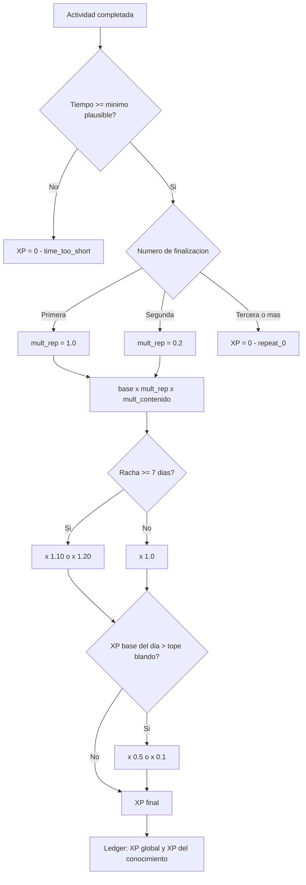
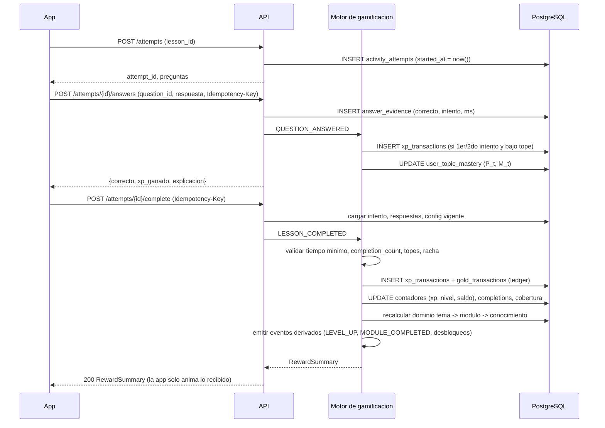
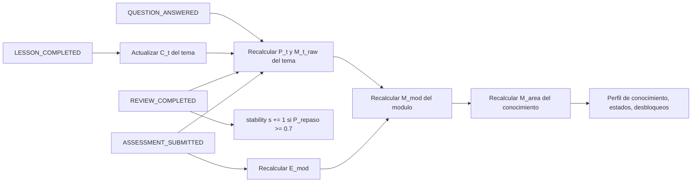
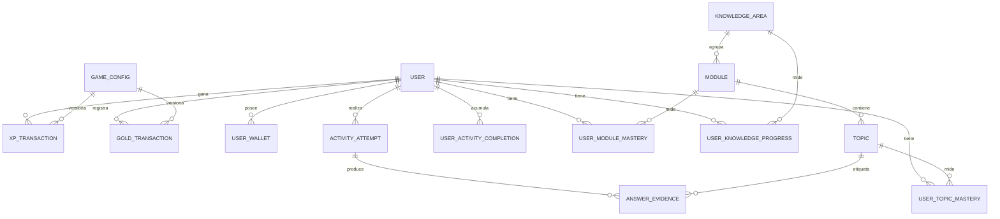

# 06a — Economía y progresión: XP, niveles, oro y dominio

> Auditoría previa a la implementación (brief §46, puntos 8 · Sistema de XP, 9 · Sistema de niveles, 11 · Sistema de monedas y 16 · Sistema de dominio).
> Proyecto: Atenea / "Reino del Conocimiento" (nombre provisional). Fecha: 2026-09-10. Estado: propuesta para decisión, sin código.
> Fuente de verdad: `docs/00-brief-producto.md`. Este es el primer documento de la carpeta `auditoria/`; los demás (modelo de datos, motor de eventos, rachas, misiones, logros, inventario, costos) deben respetar las entidades, eventos y valores que aquí se fijan, o registrar la discrepancia.

**Convención numérica.** Todos los valores de juego de este documento (XP, oro, precios, pesos, umbrales, tiempos) son **valores iniciales configurables**: se cargan como semilla en la tabla `game_config` (§2.8) y se ajustan con datos reales sin desplegar la app. Cuando un valor está escrito en tabla, se asume esa condición aunque no se repita la etiqueta.

---

## 0. Resumen ejecutivo

| Sistema | Decisión central | Cifra clave |
|---|---|---|
| **XP** | Solo actividades reales de aprendizaje generan XP; XP completo la primera vez, 20 % la segunda, 0 después. Todo se calcula en servidor y se registra en un ledger inmutable. | Lección 50 · pregunta 10 (tope 60/lección) · desafío 200 · evaluación 300 · módulo 200 · ruta 1.000 |
| **Niveles** | Curva potencial `XP_acum(n) = 80 × (n−1)^2,2`, 50 niveles, 11 rangos con nombres propios. Nivel 2 en la primera sesión, nivel 10 en ~3–4 semanas, nivel 30 en ~10 meses a 20 min/día. | L5 = 1.690 · L10 = 10.060 · L20 = 52.040 · L30 = 131.940 · L50 = 418.330 |
| **Nivel por conocimiento** | Misma forma de curva, 62,5 % del XP (`50 × (n−1)^2,2`); solo cuenta XP de actividades del conocimiento. | Un usuario enfocado en un conocimiento ve nivel global y de conocimiento avanzar en paralelo |
| **Oro** | Fuentes: actividades completadas (primera vez), objetivo diario, misiones, rachas, logros, subir de nivel. Sumidero único en MVP: tienda cosmética con precios por rareza escalonados ×2,5–3. Ledger, nunca sobrescritura de saldo. | ~1.000 🪙/semana típico · Común 150 · Poco común 500 · Raro 1.200 · Épico 3.000 · Legendario 8.000 · Mítico no comprable |
| **Dominio** | Modelo de evidencias ponderadas (dificultad × contexto × recencia) con prior bayesiano, factor de cobertura, resultado de evaluación con penalización por reintento y decaimiento suave (curva de olvido) recuperable con repaso. Tres niveles: Tema → Módulo → Conocimiento. | Umbral "dominado" ≥ 80 % + evaluación aprobada · sin evidencia nueva un tema al 90 % baja de 80 % a los ~36 días |
| **Tres medidores** | XP (juego), Tiempo (dedicación), Dominio (conocimiento demostrado) se calculan, almacenan y muestran por separado. Ninguno se deriva de otro. | El tiempo **nunca** alimenta XP ni dominio; solo el objetivo diario |
| **Simulación 30 días** | 20 min/día, racha perfecta: 15.111 XP, nivel 11 (Escriba), 6.115 🪙 ganados, 44 lecciones, 4 módulos, dominio SQL 47 %, puede comprar 1 común + 1 poco común + 1 raro + 1 épico. | Ritmo satisfactorio; capacidad de sumidero del catálogo ≈ 4× el ingreso de 90 días → no inflacionario |

---

## 1. Alcance, principios y glosario

### 1.1 Principios rectores (derivados del brief)

1. **"Estudiar es el juego"** (brief §44). Ningún XP, oro ni dominio se obtiene por acciones triviales (abrir la app, mirar el mapa, cambiar el avatar, pulsar botones).
2. **Server-authoritative** (brief §6, §39). El cliente informa hechos (empecé, respondí, terminé); el servidor decide recompensas, valida plausibilidad y persiste. El cliente jamás envía cantidades de XP u oro.
3. **Tres medidores separados** (brief §9): XP mide progresión de juego, Tiempo mide dedicación, Dominio mide conocimiento demostrado. No se derivan entre sí.
4. **Nunca pay-to-win, nunca aprendizaje tras un pago** (brief §14, §16, §36). El oro compra solo cosmética; el nivel desbloquea solo cosmética y acceso a tienda; ningún contenido educativo depende de nivel, oro ni gemas.
5. **Configurable desde backend** (brief §7, §10, §13). Ningún valor de juego se compila en la app.
6. **Basado en eventos** (brief §34). Cada mecánica consume eventos de dominio (`LESSON_COMPLETED`, etc.); agregar una mecánica no exige tocar las demás.
7. **Anti-sobreingeniería.** Se prefiere un modelo explicable con 10 parámetros a un modelo psicométrico que el equipo no pueda depurar. Lo que se descarta para el MVP está en §9.

### 1.2 Glosario y jerarquía de contenido

El brief usa "tema" con dos sentidos (§8 "Dominio por tema: SQL…" y §19 "Módulos → Temas → Lecciones"). Este documento fija la jerarquía y el vocabulario que deben adoptar el modelo de datos y la UI:

| Nivel | Entidad (modelo de datos) | Ejemplo | Qué se mide aquí |
|---|---|---|---|
| **Conocimiento** | `knowledge_area` | SQL, BigQuery, GCP | Nivel de conocimiento, XP de conocimiento, **Dominio %** (el que ve el usuario), Tiempo. Es lo que el brief §8 llama "tema" y §17 "conocimiento". Un territorio del mapa = un conocimiento. |
| **Ruta** | `learning_path` | "Maestro de SQL" | Completitud (0–100 %), evento `PATH_COMPLETED`. Un conocimiento puede tener varias rutas (básica, avanzada). |
| **Módulo** | `module` | "JOINs" | Dominio de módulo, evaluación de módulo (`ASSESSMENT`), `MODULE_COMPLETED`. |
| **Tema** | `topic` | "INNER JOIN vs LEFT JOIN" | Unidad atómica de dominio: aquí se acumulan las evidencias de preguntas. |
| **Lección** | `lesson` | 5–15 min, explicación + 4–6 preguntas | `LESSON_COMPLETED`, XP, oro, cobertura del tema. |
| **Pregunta** | `question` | Selección múltiple, completar, ejercicio técnico | Evidencia de dominio; XP por acierto dentro de una lección en curso. |
| **Desafío** | `challenge` | Ejercicio práctico de ~10 min por tema ("escribe la consulta que…") | `CHALLENGE_COMPLETED`; evidencia con peso alto. |
| **Evaluación** | `assessment` | 10 preguntas al final del módulo ("Desafío del Castillo") | `ASSESSMENT_SUBMITTED`; 70 % aprueba, 90 % bono, 100 % logro. |
| **Repaso** | `review` | 4–8 preguntas rotativas generadas cuando un tema decae o muestra debilidad | `REVIEW_COMPLETED`; recupera dominio, XP reducido. |

"Tema dominado" en el sentido del brief §18 ("8 temas dominados") se llama aquí **conocimiento dominado**. Ver §5.7.

### 1.3 Los tres medidores y el nivel derivado

| Medidor | Qué mide | Fuente de verdad | ¿Puede bajar? | Fórmula |
|---|---|---|---|---|
| ⭐ **XP** | Progresión dentro del juego (cantidad de aprendizaje *realizado*) | `xp_transactions` (ledger) | Nunca | Suma de transacciones |
| ⚔️ **Nivel** | Rango del personaje | Derivado de XP | Nunca | §3.2 |
| ⏱ **Tiempo** | Dedicación (minutos activos en actividades) | `study_sessions` con latidos de actividad | Nunca | Suma de segundos activos con actividad abierta, tope de inactividad 120 s |
| 🧠 **Dominio** | Conocimiento *demostrado* en preguntas, desafíos y evaluaciones | `answer_evidence` + `assessment_attempts` | Sí, suavemente (olvido); se recupera con repaso | §5 |

Regla dura: **el tiempo no alimenta XP ni dominio.** Su único efecto de juego es cumplir el objetivo diario "estudia 20 min" (que a su vez da XP fijo, no proporcional al tiempo). Así se cumple el brief §9: no se alcanza dominio acumulando horas.

---

## 2. Sistema de XP

### 2.1 Eventos que otorgan XP y valores iniciales

Se parte de la tabla de ejemplo del brief §7 y se ajusta donde hay razón. Todos los valores son iniciales configurables.

| Evento (nombre canónico) | XP inicial | Brief | Alcance | Justificación del ajuste |
|---|---|---|---|---|
| `LESSON_COMPLETED` | **50** | 50 | Global + conocimiento | Igual al brief. Se paga completo solo en la 1.ª finalización (§2.2). |
| `QUESTION_ANSWERED_CORRECT` (1.er intento) | **10** | 10 | Global + conocimiento | Igual. Solo dentro de una lección/desafío/evaluación en curso; **tope 60 XP por lección** (6 preguntas). |
| `QUESTION_ANSWERED_CORRECT` (2.º intento, tras fallar) | **4** | — | Global + conocimiento | Premia recuperar el error sin igualar el acierto directo. 3.er intento o más: 0. |
| `CHALLENGE_COMPLETED` | **200** | 250 | Global + conocimiento | Se baja de 250 para que la evaluación (300) sea el hito de mayor valor del módulo, como pide §23. Un desafío es ~10 min de ejercicio práctico. |
| `ASSESSMENT_PASSED` (≥ 70 %) | **300** | 300 | Global + conocimiento | Igual. Solo la primera aprobación paga completo. |
| `ASSESSMENT_BONUS_90` (≥ 90 %) | **+100** | "recompensa adicional" | Global + conocimiento | Una sola vez por evaluación. |
| `ASSESSMENT_BONUS_100` (100 %) | **+200** (acumulable con el de 90) | "logro especial" | Global + conocimiento | Una sola vez. Dispara además el logro (doc de logros). |
| `MODULE_COMPLETED` | **200** | 150 | Global + conocimiento | Sube de 150: exige todas las lecciones + evaluación aprobada; debe sentirse como cierre de capítulo. |
| `PATH_COMPLETED` | **1.000** | 1.000 | Global + conocimiento | Igual. Además desbloquea territorio/equipamiento (docs de mapa/inventario). |
| `REVIEW_COMPLETED` (repaso recomendado) | **30** + 5 por acierto (tope 30) | — | Global + conocimiento | Solo si el sistema lo recomendó (dominio en riesgo o debilidad). Máximo 3 repasos remunerados por día. Es la vía legítima de XP por repetir. |
| `DAILY_OBJECTIVE_COMPLETED` | **100** | 100 ("misión diaria") | Solo global | Un objetivo diario por día (brief §11). |
| `DAILY_MISSION_COMPLETED` (misiones diarias adicionales, si el doc de misiones las define) | **50** c/u, máx. 2/día | — | Solo global | Complementan al objetivo diario sin duplicar su valor. |
| `WEEKLY_MISSION_COMPLETED` | **300** | — | Solo global | Una por semana. |
| `STREAK_MILESTONE` 7 / 14 / 30 / 100 días | **50 / 100 / 300 / 1.000** | "recompensa" | Solo global | Valores a reconciliar con el doc de rachas; aquí solo se fija el evento y la semilla. |
| `FIRST_ACTIVITY_OF_DAY` | **+20** | — | Solo global | Micro-bono que refuerza el hábito de volver. |
| `ACHIEVEMENT_UNLOCKED` | **0–500** según tier (doc de logros) | — | Solo global | El logro define su recompensa; el motor solo la registra. |
| `LEVEL_UP` | **0 XP** (da oro, §4.1) | — | — | El XP no se auto-alimenta. |

**Lo que NO da XP (explícito):** abrir la app, iniciar sesión, ver el mapa, cambiar equipamiento, comprar en la tienda, crear una ruta, subir documentos, ver una explicación sin responder, responder incorrectamente, tiempo transcurrido, ver un anuncio (no hay anuncios).

**Proporciones resultantes** (lección típica de 9 min con 5 preguntas, 75 % de aciertos al 1.er intento): 50 + ~42 ≈ **92 XP por lección**, ≈ 10 XP/min. Un módulo tipo (9 lecciones, 3 desafíos, 1 evaluación) rinde ≈ 830 + 600 + 300–600 + 200 ≈ **2.000 XP** por ~126 min de estudio.

### 2.2 Reglas anti-abuso (obligatorias, todas en servidor)

| # | Regla | Mecanismo | Código de razón en ledger |
|---|---|---|---|
| A1 | **XP completo solo la primera vez** que se completa una actividad (lección, desafío, evaluación, módulo, ruta). | Tabla `user_activity_completions (user_id, activity_id)` con `completion_count`. Multiplicadores de repetición: `[1,0 · 0,2 · 0]` → 2.ª vez 20 %, 3.ª+ 0. Configurable como lista `xp.repeat_multipliers`. | `first_completion`, `repeat_20`, `repeat_0` |
| A2 | **XP por respuesta correcta solo dentro de una actividad en curso.** | Cada respuesta referencia un `activity_attempt_id` abierto (`status = in_progress`, creado por `POST /attempts`), que expira a las 2 h. Respuestas fuera de intento o sobre preguntas que no pertenecen a la actividad → rechazadas (HTTP 409). Cada pregunta se puntúa una sola vez por intento. Los reintentos de la actividad (A1) aplican su multiplicador también al XP de preguntas. | `question_first_try`, `question_second_try`, `question_no_attempt` |
| A3 | **Tope por lección** de XP por preguntas. | `xp.question_cap_per_lesson = 60`. Si el generador produce 8 preguntas, solo las 6 primeras correctas pagan. | `question_cap_reached` |
| A4 | **Tiempo mínimo plausible.** Una lección terminada demasiado rápido se marca completada (no se bloquea el avance) pero **no paga XP ni oro** y no cuenta como "primera finalización" pagada. | `elapsed_server = submitted_at − started_at` (relojes del servidor, no del cliente). Mínimo = `max(60 s, 0,25 × estimated_seconds)`; para una lección de 9 min → 135 s. Desafío: `max(90 s, 0,25 × est.)`. Evaluación: `max(20 s × n_preguntas, …)`. Respuesta individual en < 2 s → sin XP para esa pregunta (la evidencia sí se registra). | `time_too_short`, `answer_too_fast` |
| A5 | **Topes diarios blandos.** No cortan, atenúan. | Sobre el XP *base de actividades* del día (lecciones, preguntas, desafíos, evaluaciones, módulos; excluye objetivo/misiones/racha): hasta 1.500 XP → ×1,0; 1.500–3.000 → ×0,5; > 3.000 → ×0,1. Un usuario de 20 min/día (~300–450 XP base) jamás lo toca; una sesión intensa de 90 min lo roza. Día = zona horaria del usuario. | `daily_softcap_50`, `daily_softcap_10` |
| A6 | **Server-authoritative e idempotente.** | El cliente envía hechos con `Idempotency-Key` (UUID por evento). `UNIQUE (user_id, event_id)` en el ledger: un reintento de red no duplica XP. El servidor responde el `RewardSummary` y la app solo *anima* lo que el servidor devolvió. | — |
| A7 | **Finalización verificable.** `LESSON_COMPLETED` solo se acepta si todas las preguntas del intento tienen respuesta registrada. `MODULE_COMPLETED` solo si todas las lecciones están completas y la evaluación aprobada. `PATH_COMPLETED` solo si todos los módulos están completos. Son derivados por el servidor, no eventos que el cliente pueda emitir. | — |
| A8 | **Contenido trivial.** Rutas generadas a partir de material insuficiente (< N tokens útiles, definido en el doc de IA/RAG) producen lecciones marcadas `low_content = true` que pagan 50 % de XP y oro. Límite de generación de rutas por día (doc de costos) reduce el incentivo a fabricar contenido para farmear. | `low_content_50` |
| A9 | **Ajustes administrativos auditables.** Cualquier corrección manual es una transacción `adjustment` con `created_by` y motivo; nunca un `UPDATE` del contador. | `admin_adjustment` |

### 2.3 Bonificaciones

| Bonificación | Regla inicial | Sobre qué aplica | Nota |
|---|---|---|---|
| **Racha** | Racha ≥ 7 días → ×1,10; ≥ 30 días → ×1,20 (tope) | Solo XP base de actividades (no sobre objetivo diario, misiones, hitos de racha ni logros) | Evita capitalización de bonos sobre bonos. El multiplicador se lee de la racha vigente al momento del evento. |
| **Primera actividad del día** | +20 XP planos | Primera actividad completada del día | Refuerza el "vuelvo mañana". |
| **Evaluación 90 %** | +100 XP, +50 🪙 | Primera vez que se alcanza en esa evaluación | Marca ⭐ en la evaluación. |
| **Evaluación 100 %** | +200 XP adicionales, +100 🪙, logro | Primera vez | Marca 🏆. |
| **Sin ayuda** (futuro) | ×1,05 si no se usó pista | — | Fuera del MVP; se deja el `reason_code` reservado. |

### 2.4 Fórmula de cálculo de un evento de XP

```
xp_final = redondear(
    base(evento, config)
    × mult_repeticion(completion_count)          -- 1,0 / 0,2 / 0
    × mult_contenido(low_content)                -- 1,0 / 0,5
    × mult_racha(racha_actual)                    -- 1,0 / 1,10 / 1,20   (solo eventos de actividad)
    × mult_tope_diario(xp_base_dia_acumulado)     -- 1,0 / 0,5 / 0,1     (solo eventos de actividad)
)
si tiempo_transcurrido < minimo_plausible → xp_final = 0, reason = time_too_short
```

Cada factor se persiste en la transacción (`base_amount`, `multiplier`, `amount`, `reason_code`) para que "¿por qué gané 44 XP y no 50?" tenga respuesta en una consulta.



### 2.5 XP global vs XP por conocimiento: mismos eventos, dos contadores

- Cada transacción de XP lleva `knowledge_area_id` (nullable) y `topic_id` (nullable).
- **XP global** = suma de todas las transacciones del usuario.
- **XP del conocimiento** = suma de las transacciones con ese `knowledge_area_id`. Solo los eventos de actividad (lección, pregunta, desafío, evaluación, módulo, ruta, repaso) lo llevan; los eventos "meta" (objetivo diario, misiones, racha, logros, primera actividad del día) son solo globales.
- No se guardan dos ledgers: es **una** transacción con dos dimensiones. Los contadores materializados (`user_progress.xp_total`, `user_knowledge_progress.xp`) se actualizan en la misma transacción SQL y se reconcilian de noche contra `SUM(amount)`.
- Consecuencia numérica: para un usuario enfocado en un conocimiento, el XP del conocimiento ≈ 65 % del global. Por eso la curva de nivel por conocimiento usa el 62,5 % del XP (§3.6).

### 2.6 Flujo server-authoritative



`RewardSummary` de ejemplo (lo único que la app usa para las animaciones del brief §29):

```json
{
  "event": "LESSON_COMPLETED",
  "xp": { "amount": 55, "base": 50, "multipliers": { "repeat": 1.0, "streak": 1.10, "daily_cap": 1.0 }, "reason": "first_completion" },
  "gold": { "amount": 20, "balance_after": 1245 },
  "level": { "before": 6, "after": 7, "rank_after": "Iniciado/a", "leveled_up": true, "gold_bonus": 50 },
  "knowledge": { "id": "sql", "xp_after": 3420, "level_after": 8, "mastery_after": 0.47 },
  "mastery_delta": [{ "topic_id": "joins-inner-left", "before": 0.63, "after": 0.71 }],
  "unlocks": [],
  "missions_progress": [{ "mission_id": "daily-3-lessons", "progress": "2/3" }],
  "config_version": 17
}
```

### 2.7 Ledger de XP

```
xp_transactions
  id                 uuid PK
  user_id            uuid  FK users
  event_id           uuid  -- Idempotency-Key del cliente o UUID generado por el motor para eventos derivados
  event_type         text  -- LESSON_COMPLETED, QUESTION_ANSWERED_CORRECT, ...
  source_type        text  -- lesson | question | challenge | assessment | module | path | review | daily_objective | mission | streak | achievement | adjustment
  source_id          uuid  null
  knowledge_area_id  uuid  null
  topic_id           uuid  null
  base_amount        int
  multiplier         numeric(5,3)
  amount             int   -- final; >= 0 salvo source_type = adjustment
  reason_code        text
  config_version     int
  created_at         timestamptz
  UNIQUE (user_id, event_id)
  INDEX (user_id, created_at), INDEX (user_id, knowledge_area_id)
```

Reglas: `INSERT` only; sin `UPDATE`/`DELETE` (política a nivel de rol de base de datos). Contadores materializados en `user_progress` y `user_knowledge_progress`, actualizados en la misma transacción con `SELECT … FOR UPDATE` de la fila del usuario. Job nocturno de reconciliación: `SUM(amount)` vs contador; discrepancia → alerta y corrección por `adjustment`.

### 2.8 Tabla de configuración (`game_config`)

Sustituye a cualquier constante en código. Se propone una tabla clave-valor con versionado y vigencia:

```
game_config
  key           text          -- namespaced: xp.lesson_completed, level.base, gold.price.rare, mastery.weight.difficulty.hard
  version       int           -- incremental por clave
  value         jsonb         -- escalar, lista o mapa
  value_type    text          -- int | decimal | bool | list | map
  valid_from    timestamptz
  valid_to      timestamptz   null  -- null = vigente
  description   text
  created_by    uuid
  created_at    timestamptz
  PRIMARY KEY (key, version)
```

Reglas de uso:

- **Resolución:** valor vigente = fila con `valid_from ≤ now() < coalesce(valid_to, ∞)` y mayor `version`. Caché en memoria del backend con TTL 60 s (o invalidación por evento de cambio). Latencia nula en el camino caliente.
- **Vigencia futura:** permite programar cambios (p. ej. una semana de "XP doble" en Fase 2) sin desplegar; el motor toma el valor según el `created_at` del evento.
- **Trazabilidad:** un contador global `config_version` (entero monótono, se incrementa con cualquier cambio) se guarda en cada transacción de XP/oro. Permite reproducir cualquier recompensa histórica.
- **Validación:** un esquema (JSON Schema por prefijo de clave) valida tipo y rango al insertar; p. ej. `xp.*` entero 0–10.000, `mastery.weight.*` decimal 0–5.
- **Lectura por la app:** un endpoint `GET /config/public` expone solo las claves marcadas públicas (precios, tabla de niveles, nombres de rango) para renderizar barras y tienda; las reglas anti-abuso no se exponen.
- **Semilla inicial:** §8 de este documento.

---

## 3. Sistema de niveles

### 3.1 Alternativas de curva

| Curva | Fórmula XP acumulado | Nivel 2 | Nivel 10 | Nivel 30 | Nivel 50 | Pros | Contras |
|---|---|---|---|---|---|---|---|
| Lineal por nivel | `100 × n(n−1)/2` | 100 | 4.500 | 43.500 | 122.500 | Simple | Niveles altos demasiado rápidos; L50 en 9 meses |
| **Potencial 2,2** (recomendada) | `80 × (n−1)^2,2` | 80 | 10.060 | 131.940 | 418.330 | Primer nivel casi inmediato, medio estable, largo plazo aspiracional; un solo par de parámetros | Ninguno relevante; requiere tabla precalculada para la UI (trivial) |
| Por tramos | 100/nivel hasta 5, 1.000 hasta 20, 5.000 hasta 50 | 100 | 5.400 | 66.400 | 166.400 | Control fino | Escalones perceptibles al cambiar tramo; más parámetros; más difícil de explicar |
| Exponencial | `100 × 1,25^(n−1) − 100` | 25 | 645 | 64.000 | 5,6 M | Tramo inicial rápido | Explota: L50 inalcanzable, L40 ya absurdo |

**Decisión:** curva potencial con exponente 2,2. Justificación: (1) el primer *level up* llega dentro de la primera lección (80 XP) — el gancho de la sesión 1; (2) el XP por nivel crece de forma suave y predecible (≈ +370 XP por nivel adicional a lo largo de la tabla), sin escalones; (3) con 20 min/día el nivel 10 llega a las ~3–4 semanas y el 30 a los ~10 meses, lo que deja recorrido para un año de uso antes del último rango; (4) dos parámetros (`level.base = 80`, `level.exponent = 2,2`) bastan para recalibrar toda la curva.

### 3.2 Fórmula

```
XP_acumulado(n) = redondear_a_10( 80 × (n − 1)^2,2 )        para n = 2..50 ; XP(1) = 0
nivel(xp)       = max { n : XP_acumulado(n) ≤ xp }            (tope 50 en MVP)
progreso_barra  = (xp − XP(n)) / (XP(n+1) − XP(n))
```

La tabla de 50 filas se materializa en `level_thresholds (level, xp_required, rank_title)` al arrancar el backend desde `game_config`, y se expone a la app por `GET /config/public`.

### 3.3 Tabla de niveles 1–50

Rangos y títulos propios (no se copia ninguna plataforma). Se muestran con la forma de género elegida por el usuario al crear el personaje, o la variante neutra. Columna "Días" = días estimados a ~3.000 XP/semana (20 min/día, ver §7).

| Nivel | XP acumulado | XP del nivel | Rango (título) | Variante neutra | Días (20 min/día) |
|---|---|---|---|---|---|
| 1 | 0 | — | Aprendiz | Aprendiz | 0 |
| 2 | 80 | 80 | Aprendiz | | 1.ª sesión |
| 3 | 370 | 290 | Aprendiz | | 1 |
| 4 | 900 | 530 | Aprendiz | | 2 |
| 5 | 1.690 | 790 | **Iniciado/a** | Iniciante | 4 |
| 6 | 2.760 | 1.070 | Iniciado/a | | 6 |
| 7 | 4.120 | 1.360 | Iniciado/a | | 10 |
| 8 | 5.790 | 1.670 | Iniciado/a | | 14 |
| 9 | 7.760 | 1.970 | Iniciado/a | | 18 |
| 10 | 10.060 | 2.300 | **Escriba** | Escriba | 23 |
| 11 | 12.680 | 2.620 | Escriba | | 30 |
| 12 | 15.640 | 2.960 | Escriba | | 36 |
| 13 | 18.940 | 3.300 | Escriba | | 44 |
| 14 | 22.580 | 3.640 | Escriba | | 53 |
| 15 | 26.580 | 4.000 | **Erudito/a** | Persona erudita → "Erudito" en UI neutra | 62 |
| 16 | 30.940 | 4.360 | Erudito/a | | 72 |
| 17 | 35.660 | 4.720 | Erudito/a | | 83 |
| 18 | 40.750 | 5.090 | Erudito/a | | 95 |
| 19 | 46.210 | 5.460 | Erudito/a | | 108 |
| 20 | 52.040 | 5.830 | **Adepto/a** | Adepte | 121 |
| 21 | 58.260 | 6.220 | Adepto/a | | 136 |
| 22 | 64.860 | 6.600 | Adepto/a | | 151 |
| 23 | 71.850 | 6.990 | Adepto/a | | 168 |
| 24 | 79.230 | 7.380 | Adepto/a | | 185 |
| 25 | 87.010 | 7.780 | **Guardián/a del Saber** | Guardia del Saber | 203 |
| 26 | 95.180 | 8.170 | Guardián/a del Saber | | 222 |
| 27 | 103.760 | 8.580 | Guardián/a del Saber | | 242 |
| 28 | 112.740 | 8.980 | Guardián/a del Saber | | 263 |
| 29 | 122.130 | 9.390 | Guardián/a del Saber | | 285 |
| 30 | 131.940 | 9.810 | **Sabio/a** | Sabie | 308 |
| 31 | 142.150 | 10.210 | Sabio/a | | 332 |
| 32 | 152.790 | 10.640 | Sabio/a | | 357 |
| 33 | 163.840 | 11.050 | Sabio/a | | 382 |
| 34 | 175.320 | 11.480 | Sabio/a | | 409 |
| 35 | 187.220 | 11.900 | **Maestro/a** | Maestre | 437 |
| 36 | 199.540 | 12.320 | Maestro/a | | 466 |
| 37 | 212.300 | 12.760 | Maestro/a | | 495 |
| 38 | 225.490 | 13.190 | Maestro/a | | 526 |
| 39 | 239.120 | 13.630 | Maestro/a | | 558 |
| 40 | 253.180 | 14.060 | **Gran Maestro/a** | Gran Maestre | 591 |
| 41 | 267.680 | 14.500 | Gran Maestro/a | | 625 |
| 42 | 282.630 | 14.950 | Gran Maestro/a | | 659 |
| 43 | 298.020 | 15.390 | Gran Maestro/a | | 695 |
| 44 | 313.850 | 15.830 | Gran Maestro/a | | 732 |
| 45 | 330.130 | 16.280 | **Archimaestro/a** | Archimaestre | 770 |
| 46 | 346.860 | 16.730 | Archimaestro/a | | 809 |
| 47 | 364.050 | 17.190 | Archimaestro/a | | 849 |
| 48 | 381.690 | 17.640 | Archimaestro/a | | 891 |
| 49 | 399.780 | 18.090 | Archimaestro/a | | 933 |
| 50 | 418.330 | 18.550 | **Leyenda del Reino** | Leyenda del Reino | 976 |

Los nombres de rango son propuesta inicial configurable (`level.rank_titles`); la variante neutra en "-e" es opcional y debe validarse con usuarios chilenos (puede sonar forzada; alternativa: usar solo sustantivos neutros como Aprendiz, Escriba, Leyenda y "Guardia del Saber").

### 3.4 Tiempo estimado por perfil de uso

| Nivel | XP | 20 min/día realista (~2.200 XP/sem) | 20 min/día típico (~3.000 XP/sem) | 60 min/día (~6.500 XP/sem) |
|---|---|---|---|---|
| 2 | 80 | 1.ª sesión | 1.ª sesión | 1.ª sesión |
| 5 | 1.690 | 5 días | 4 días | 2 días |
| 10 | 10.060 | 32 días | 23 días | 11 días |
| 15 | 26.580 | 85 días | 62 días | 29 días |
| 20 | 52.040 | 5,5 meses | 4 meses | 8 semanas |
| 30 | 131.940 | 14 meses | 10 meses | 4,7 meses |
| 40 | 253.180 | 2,2 años | 1,6 años | 9 meses |
| 50 | 418.330 | 3,6 años | 2,7 años | 15 meses |

Lectura: el rango **Escriba (10)** es el objetivo natural del primer mes; **Adepto/a (20)** el del primer cuatrimestre; **Sabio/a (30)** el del primer año. Un usuario intenso no rompe la curva (L50 en 15 meses porque el XP meta no escala con el tiempo y los topes blandos atenúan).

### 3.5 Qué desbloquea subir de nivel (y qué nunca)

| Al subir | Recompensa | Notas |
|---|---|---|
| Cada nivel | +50 🪙 (`gold.level_up_bonus`) y animación ⚡ | Momento de celebración barato de producir. |
| Cambio de rango (5, 10, 15, …) | Título nuevo visible en perfil; marco/borde de avatar del rango (cosmético); +100 🪙 extra | Los marcos son 11 assets, uno por rango. |
| Nivel 3 | Acceso a la tienda (antes se muestra pero con candado "disponible al nivel 3") | Evita que el oro de bienvenida se gaste sin entender el juego; llega en el día 1–2. |
| Nivel 5 / 10 / 15 / 20 / 25 | Se habilitan en tienda ítems con `min_level` = poco común 3, raro 8, épico 15, legendario 25 (`shop.min_level_by_rarity`) | El nivel ordena la exclusividad cosmética; nunca el contenido. |
| Nivel 10 / 20 | Nuevas ranuras de personalización si existen en catálogo (mascota, montura) | Sujeto al alcance del doc de inventario; puede quedar fuera del MVP. |

**Nunca desbloquea:** lecciones, módulos, rutas, evaluaciones, número de rutas generables, calidad de generación IA, repasos, estadísticas de aprendizaje. Todo lo educativo es accesible a nivel 1.

### 3.6 Nivel por conocimiento (curva más corta)

- Fórmula: `XP_conocimiento(n) = redondear_a_10( 50 × (n − 1)^2,2 )` — misma forma que la global, base 50 en lugar de 80 (62,5 %).
- Razón del 62,5 %: el XP de conocimiento excluye el XP meta (≈ 35 % del total). Así un usuario enfocado en un solo conocimiento ve **ambos niveles avanzar en paralelo** (en la simulación de §7: global 11, SQL 12), y uno que reparte su estudio en tres conocimientos ve niveles de conocimiento menores que el global — exactamente el patrón del ejemplo del brief §8/§18 (global 18; SQL 12, BigQuery 7, GCP 4).
- Títulos de conocimiento (`knowledge.rank_titles`), se concatenan con el nombre: 1–4 *Novato/a en SQL*, 5–9 *Practicante de SQL*, 10–14 *Competente en SQL*, 15–19 *Avanzado/a en SQL*, 20–29 *Experto/a en SQL*, 30+ *Maestro/a de SQL*. Regla de coherencia: el título **Maestro/a** exige además dominio del conocimiento ≥ 80 % en ese momento; si no, se muestra *Veterano/a de SQL* hasta que el dominio llegue. Así el título máximo por XP no contradice el dominio.
- Sin tope duro; la tabla se materializa hasta 50 como la global.

| Nivel conoc. | XP | Δ | Días (un solo conocimiento, ~2.300 XP/sem de actividad) |
|---|---|---|---|
| 2 | 50 | 50 | 1.ª lección |
| 3 | 230 | 180 | 1 |
| 4 | 560 | 330 | 2 |
| 5 | 1.060 | 500 | 3 |
| 6 | 1.720 | 660 | 5 |
| 7 | 2.580 | 860 | 8 |
| 8 | 3.620 | 1.040 | 11 |
| 9 | 4.850 | 1.230 | 15 |
| 10 | 6.280 | 1.430 | 19 |
| 11 | 7.920 | 1.640 | 24 |
| 12 | 9.770 | 1.850 | 30 |
| 13 | 11.840 | 2.070 | 36 |
| 14 | 14.110 | 2.270 | 43 |
| 15 | 16.610 | 2.500 | 51 |
| 16 | 19.340 | 2.730 | 59 |
| 17 | 22.290 | 2.950 | 68 |
| 18 | 25.470 | 3.180 | 78 |
| 19 | 28.880 | 3.410 | 88 |
| 20 | 32.530 | 3.650 | 99 |
| 25 | 54.380 | — | 166 |
| 30 | 82.460 | — | 251 |

---

## 4. Oro (🪙)

### 4.1 Fuentes

Principio: el oro premia **actividades completadas** (nunca respuestas individuales, para impedir micro-farmeo) y hitos de constancia. Todas las fuentes de actividad pagan **solo la primera vez** (sin regla del 20 %: el oro es más sensible a la inflación que el XP).

| Evento | 🪙 inicial | Frecuencia típica | Nota |
|---|---|---|---|
| Bolsa de bienvenida (crear personaje) | 100 | Una vez | Permite la primera compra el día 1 (criterio de éxito §47, puntos 9–10). |
| `LESSON_COMPLETED` (1.ª vez) | 20 | ~9/semana | Brief §21. |
| `CHALLENGE_COMPLETED` (1.ª vez) | 60 | ~3/semana | |
| `ASSESSMENT_PASSED` (1.ª vez) | 100 | ~1/semana | +50 si ≥ 90 %, +100 si 100 % (una vez). |
| `MODULE_COMPLETED` | 80 | ~1/semana | |
| `PATH_COMPLETED` | 500 | ~1/2 meses | Además del ítem vinculado (doc de inventario). |
| `REVIEW_COMPLETED` (recomendado) | 10 | 0–3/día | Símbolo, no fuente. |
| `DAILY_OBJECTIVE_COMPLETED` | 30 | 7/semana | |
| `DAILY_MISSION_COMPLETED` (si existen) | 15 c/u, máx. 2/día | | |
| `WEEKLY_MISSION_COMPLETED` | 150 | 1/semana | |
| `STREAK_MILESTONE` 7 / 14 / 30 / 100 | 100 / 200 / 500 / 1.500 | hitos | 30 y 100 entregan además ítem especial/legendario (doc de rachas). |
| `LEVEL_UP` | 50 (+100 al cambiar de rango) | ~2/semana el 1.er mes, luego menos | |
| `ACHIEVEMENT_UNLOCKED` | 50 / 100 / 200 / 300 según tier | irregular | El doc de logros fija tiers; aquí la semilla. |

**No dan oro:** respuestas correctas, tiempo, repetir actividades, iniciar sesión, ver anuncios (no hay).

### 4.2 Sumideros: tienda cosmética y precios por rareza

Único sumidero del MVP: **tienda de cosmética para el avatar** (brief §13, §15, §16). Precios base por rareza, con factor ×2,5–3 entre tiers para que cada salto se sienta:

| Rareza | Precio base 🪙 | Nivel mínimo | Vía de obtención | Tiempo de ahorro a ~1.000 🪙/sem | Cantidad sugerida en catálogo MVP |
|---|---|---|---|---|---|
| ⚪ Común | 150 | 1 (tienda desde nivel 3) | Tienda | ~1 día | 12 |
| 🟢 Poco común | 500 | 3 | Tienda | ~3,5 días | 12 |
| 🔵 Raro | 1.200 | 8 | Tienda | ~8 días | 8 |
| 🟣 Épico | 3.000 | 15 | Tienda (parte) + logros/racha 30 | ~3 semanas | 5 en tienda + 3 por logro |
| 🟠 Legendario | 8.000 | 25 | Tienda (pocos) + rutas completadas + racha 100 | ~8 semanas | 3 en tienda + ítems vinculados al conocimiento |
| 🔴 Mítico | No comprable | — | Solo dominio ≥ 80 % de un conocimiento, "dominar 5 conocimientos", eventos | — | Solo por logro |

Un ítem puede tener `price_gold` nulo (no comprable) y `unlock_requirement` (nivel, logro, dominio, ruta). La rareza afecta apariencia y exclusividad, nunca capacidades (brief §16).

Sumidero opcional a decidir con el doc de rachas: **Protector de racha** comprable con oro (300 🪙, máximo 1 en inventario, 1 compra cada 7 días). Es un sumidero sano y una herramienta de retención; no es pay-to-win porque el oro solo se gana estudiando. Se deja como decisión pendiente (§10).

### 4.3 Balance: ingreso esperado, tiempo por rareza y ratio fuentes/sumideros

**Ingreso semanal en régimen (usuario de 20 min/día, 1 módulo/semana):**

| Fuente | 🪙/semana |
|---|---|
| 9 lecciones × 20 | 180 |
| 3 desafíos × 60 | 180 |
| 1 evaluación (100 + bono medio 20) | 120 |
| 1 módulo | 80 |
| 7 objetivos diarios × 30 | 210 |
| 1 misión semanal | 150 |
| ~2 subidas de nivel × 50 | 100 |
| **Total régimen** | **≈ 1.020** |
| Extras primer mes (bienvenida 100, hitos de racha 800, logros iniciales ~600) | ≈ 1.500 repartidos |

La simulación de §7 arroja **6.115 🪙 en 30 días** (≈ 1.430/semana incluyendo extras del primer mes) y ~1.050/semana en las semanas 3–4.

**Ratio fuentes/sumideros objetivo:** capacidad de gasto del catálogo alcanzable en 90 días ≥ 3× el ingreso de 90 días.
- Ingreso 90 días ≈ 13 × 1.020 + 1.500 ≈ **14.800 🪙**.
- Catálogo comprable MVP: 12 × 150 + 12 × 500 + 8 × 1.200 + 5 × 3.000 + 3 × 8.000 = **56.400 🪙** → ratio ≈ 3,8×. Siempre hay algo que ahorrar; el usuario gasta ~80 % de su ingreso si compra lo que quiere y sigue con metas.

**KPIs económicos a vigilar desde el día 1** (doc de analytics): saldo mediano (p50) y p90 por cohorte semanal; tasa de gasto (oro gastado / oro ganado, objetivo 0,6–0,85); ítems comprados por usuario/semana (objetivo ~1). Regla de intervención: si p50 del saldo > 3× ingreso semanal durante 4 semanas → subir precios de tiers altos o agregar sumideros; si tasa de gasto > 0,95 → el catálogo es pobre o los precios bajos.

### 4.4 Mecanismos anti-inflación

| Mecanismo | Implementación |
|---|---|
| Oro solo por actividades completadas, primera vez | Sin oro por preguntas; `completion_count > 1` → 0 🪙. |
| Tope diario blando | Oro de actividades > 500/día → ×0,5; > 1.000 → ×0,1 (`gold.daily_softcap`). Excluye hitos, logros y misiones. |
| Precios crecientes por rareza | Factor ×2,5–3,3 entre tiers; los tiers altos se encarecen más que proporcionalmente respecto al ingreso. |
| Ítems limitados por logro/dominio | Legendario y mítico mayoritariamente no comprables: la exclusividad viene del aprendizaje, no del ahorro. |
| Requisito de nivel en tienda | Impide gastar el oro de bienvenida antes de entender el juego y espacia las compras aspiracionales. |
| Sin conversión oro↔dinero real, sin regalo ni intercambio entre usuarios | No hay marketplace (brief §42). El oro no tiene valor externo → no hay incentivo a bots. |
| Sin devolución al vender | En MVP los ítems no se venden de vuelta (evitar arbitraje con cambios de precio). |
| Precios y recompensas en `game_config` | Ajuste sin despliegue; el `config_version` en el ledger permite auditar el efecto de cada cambio. |
| Ledger inmutable con `balance_after` | Detecta cualquier anomalía (saldos negativos, saltos) en una consulta. |

### 4.5 Ledger de oro y compra atómica

```
gold_transactions
  id              uuid PK
  user_id         uuid
  event_id        uuid            -- idempotencia
  currency        text  DEFAULT 'GOLD'   -- 'GEM' reservado (§4.6)
  direction       text            -- credit | debit
  source_type     text            -- lesson | challenge | assessment | module | path | review | daily_objective | mission | streak | achievement | level_up | welcome | purchase | adjustment
  source_id       uuid  null      -- item_id en purchase
  amount          int   CHECK (amount > 0)
  balance_after   int   CHECK (balance_after >= 0)
  config_version  int
  created_at      timestamptz
  UNIQUE (user_id, event_id)

user_wallets
  user_id   uuid, currency text, balance int CHECK (balance >= 0), version int, updated_at
  PRIMARY KEY (user_id, currency)
```

Compra (pseudocódigo, una transacción SQL):

```
BEGIN
  wallet := SELECT * FROM user_wallets WHERE user_id = ? AND currency = 'GOLD' FOR UPDATE
  item   := SELECT * FROM items WHERE id = ? AND price_gold IS NOT NULL
  verificar: nivel_usuario ≥ item.min_level, requisitos (logro/dominio) cumplidos, no lo posee ya
  si wallet.balance < item.price_gold → ROLLBACK, 402 "oro insuficiente"
  INSERT gold_transactions (debit, purchase, item.id, price, balance_after = balance − price)
  UPDATE user_wallets SET balance = balance − price, version = version + 1
  INSERT user_inventory (user_id, item_id, acquired_at, acquired_via = 'purchase')
COMMIT
```

El saldo **nunca** se escribe desde un valor calculado en el cliente ni se "setea": siempre `balance − price` / `balance + amount` bajo bloqueo de fila. Reconciliación nocturna `SUM(credit) − SUM(debit) = balance`.

### 4.6 Gemas: la puerta que se deja abierta (fuera del MVP)

- El ledger y la billetera ya son multi-moneda (`currency`). Agregar 💎 = insertar `'GEM'`, sin migración.
- `items` tendrá `price_gold` y `price_gems` (ambos nullable) desde el MVP; en MVP `price_gems` siempre nulo.
- **Reglas que se fijan hoy** para cuando existan gemas: no se compran con oro ni se convierten a oro; nunca compran contenido educativo, generación de rutas ni repasos; usos previstos: cosmética exclusiva, protección de racha, eventos. Ningún ítem vinculado al conocimiento (brief §17) podrá comprarse con gemas: su único requisito es aprender.
- Cualquier ítem de gemas debe tener un equivalente funcional obtenible sin pagar (regla de diseño anti pay-to-win, brief §14/§36).

---

## 5. Dominio (mastery)

### 5.1 Requisitos y alternativas de modelo

Requisitos (brief §8, §9, §23, §24): depende del desempeño demostrado y no de horas; explicable al usuario ("¿por qué 63 %?"); reacciona a cada evento; detecta debilidades para el aprendizaje adaptativo; tolera bancos de preguntas generados por IA sin calibración previa; y resiste "repetir la evaluación hasta pasar".

| Modelo | Explicable | Datos necesarios | Complejidad | Veredicto |
|---|---|---|---|---|
| % de aciertos simple | Sí | Pocos | Muy baja | Insuficiente: ignora dificultad, recencia, olvido y evaluaciones; se infla repitiendo preguntas fáciles |
| **Evidencias ponderadas + prior + cobertura + decaimiento** (propuesto) | Sí, cada factor es una frase | Pocos (funciona desde la 1.ª pregunta) | Baja (≈ 12 parámetros, aritmética) | **Recomendado para MVP** |
| Bayesian Knowledge Tracing (BKT) | Media (probabilidades latentes) | Muchas respuestas por habilidad para estimar 4 parámetros | Media-alta | Fase 3+, cuando haya datos por tema |
| IRT / Elo por pregunta | Baja para el usuario | Miles de respuestas por pregunta para calibrar | Alta | Inviable con preguntas generadas ad hoc por usuario |

### 5.2 Evidencias

Cada respuesta genera una fila en `answer_evidence`:

| Campo | Valores | Uso |
|---|---|---|
| `topic_id` | tema al que la pregunta está etiquetada (el generador etiqueta cada pregunta con exactamente un tema) | Agregación |
| `correctness` `c` | **1** acierto al 1.er intento · **0,5** acierto al 2.º intento · **0** fallo (o 3.er intento) | Núcleo de la precisión |
| `difficulty` `d` | fácil 1,0 · media 1,5 · difícil 2,0 (asignada por el generador; recalibrable con datos en Fase 3) | Peso |
| `context` | lección 1,0 · repaso 1,0 · desafío 1,5 · evaluación 2,0 | Peso: las evaluaciones son el "desempeño demostrado" por excelencia |
| `attempt_no` | número de intento de la actividad (para reintentos de evaluación) | Peso de reintento 1,0 / 0,6 / 0,3 |
| `answered_at`, `response_ms`, `is_first_response` | | Recencia y plausibilidad |

Solo la **primera respuesta** a cada pregunta dentro de un intento crea evidencia (el 2.º intento actualiza `c` de 0 a 0,5); pedir pista o ver la explicación no cambia la evidencia.

### 5.3 Nivel Tema: precisión ponderada `P_t`, cobertura `C_t`, dominio `M_t`

**Precisión ponderada con prior** (evita que 2 aciertos den 100 %):

```
w_i  = w_dif(d_i) × w_ctx(ctx_i) × w_rec(edad_i) × w_reint(attempt_no_i)
w_rec(edad) = 0,5 ^ (edad_días / 30)            -- edad medida respecto a la evidencia más reciente del tema
P_t  = ( Σ w_i × c_i  +  m × p0 ) / ( Σ w_i  +  m )      con m = 3 , p0 = 0,5
```

- `m = 3, p0 = 0,5`: equivale a "3 preguntas fáciles imaginarias al 50 %". Con 5 aciertos fáciles, `P = (5 + 1,5)/(5 + 3) = 0,81`; con 10, 0,885; con 20, 0,935. Nadie domina un tema con dos preguntas.
- Ventana: se consideran las últimas 40 evidencias del tema o las de los últimos 180 días, lo que sea mayor en cobertura; la recencia ya atenúa lo antiguo.

**Cobertura** (evita dominar un tema sin haberlo estudiado):

```
C_t  = lecciones_completadas_del_tema / lecciones_del_tema        ∈ [0, 1]
g(C) = 0,6 + 0,4 × C
```

Con cero lecciones el dominio se limita al 60 % de la precisión (un usuario que ya sabe puede demostrarlo en la evaluación, pero para "dominar" tiene que cubrir el tema). Una futura "prueba de nivel/convalidación" fijaría `C_t = 1` (§9).

**Dominio del tema (valor crudo, sin olvido):**

```
M_t_raw = P_t × g(C_t)
```

### 5.4 Decaimiento (curva de olvido) y recuperación

Sin evidencia nueva, el dominio decae suavemente hacia un piso (no se olvida todo), con un periodo de gracia, y **cada repaso exitoso alarga la vida media** (estabilidad, espíritu de repetición espaciada):

```
Δ        = días desde la última evidencia del tema
h        = min( 60 × 1,5^s , 365 )         -- s = repasos/evaluaciones exitosas posteriores al primer dominio
D(Δ)     = 1                                              si Δ ≤ 7
D(Δ)     = 0,6 + 0,4 × 0,5 ^ ((Δ − 7) / h)                si Δ > 7
M_t      = M_t_raw × D(Δ)
```

| Días sin evidencia | D (s = 0) | D (s = 1) | D (s = 2) | D (s = 3) |
|---|---|---|---|---|
| 7 | 1,000 | 1,000 | 1,000 | 1,000 |
| 14 | 0,969 | 0,979 | 0,986 | 0,991 |
| 30 | 0,907 | 0,935 | 0,955 | 0,970 |
| 45 | 0,858 | 0,899 | 0,929 | 0,951 |
| 60 | 0,817 | 0,866 | 0,905 | 0,934 |
| 90 | 0,753 | 0,811 | 0,861 | 0,901 |
| 180 | 0,654 | 0,706 | 0,765 | 0,821 |
| 365 | 0,606 | 0,625 | 0,664 | 0,718 |

Un tema al 90 % cae bajo el umbral de 80 % a los **36 días** (s = 0), **50 días** (s = 1) o **71 días** (s = 2). Ese cruce dispara el estado "en riesgo" y un **repaso recomendado** (4–8 preguntas rotativas, ~4 min). El repaso inserta evidencia nueva (recencia alta → domina el promedio), resetea Δ a 0 y, si `P_repaso ≥ 0,7`, incrementa `s`. El decaimiento **se aplica en lectura** (`M_t = M_t_raw × D(now − last_evidence_at)`); no requiere job para ser correcto. Un job diario materializa `mastery_effective` para el dashboard y la lista de repasos.

### 5.5 Nivel Módulo: evaluación con penalización por reintento y umbral

```
E_mod = max_k ( puntaje_k − 0,05 × (k − 1) )       -- k = número de intento; penalización máx. 0,15
M_mod = 0,70 × promedio_ponderado_t( M_t , peso = lecciones_del_tema ) + 0,30 × E_mod
Módulo dominado ⇔ M_mod ≥ 0,80  Y  evaluación aprobada (puntaje_k ≥ 0,70 en algún k)
```

- Sin evaluación rendida, `E_mod = 0` → `M_mod ≤ 0,70`: **imposible dominar un módulo sin evaluación**, sin reglas especiales.
- Aprobar justo (70 %) con temas al 85 % da `0,595 + 0,21 = 0,805` → dominado por poco; con temas al 80 % da 0,77 → hay que practicar más. El umbral exige práctica sólida *y* evaluación.
- Las preguntas de la evaluación además entran como evidencia de sus temas (peso de contexto 2,0). Es doble uso deliberado: la evaluación es la señal más fuerte, y así también corrige el dominio fino por tema.

### 5.6 Nivel Conocimiento y perfil de conocimiento

```
M_area = Σ_mod ( lecciones_mod × M_mod ) / Σ_mod lecciones_mod      sobre TODOS los módulos de las rutas activas del conocimiento
Conocimiento dominado ⇔ M_area ≥ 0,80  Y  existe ≥ 1 ruta del conocimiento completa con todas sus evaluaciones aprobadas
```

- Los módulos no iniciados pesan con `M_mod = 0`: el dominio de SQL es "cuánto del SQL que te propusiste aprender dominas". Al agregar una ruta avanzada, el porcentaje baja — se comunica como "tu horizonte de SQL se amplió". Rutas archivadas no cuentan. (Alternativa "solo módulos iniciados" descartada porque permite "SQL 82 %" tras un módulo; ver §10.)
- **Perfil de conocimiento** (brief §8, §18): por conocimiento → nivel, XP, dominio %, tiempo, estado, módulos dominados / total, temas débiles. Global → número de conocimientos dominados (alimenta "Corona del Maestro: dominar 5 conocimientos"), sin promedio global de dominio (mezclar SQL con Historia no significa nada).
- **Permanencia de desbloqueos:** un ítem otorgado por dominio ≥ 80 % no se revoca si el dominio decae; el dashboard muestra "en riesgo" y sugiere repaso. Quitar equipamiento castiga y no enseña.

### 5.7 Estados y umbrales

| Estado | Condición | Efecto en UI / motor |
|---|---|---|
| Sin evidencia | 0 evidencias y 0 lecciones | Gris; "Empieza aquí" |
| En progreso | 0 < M < 0,80 y nunca dominado | Barra; "Continúa" |
| **Dominado** | M ≥ 0,80 (+ evaluación aprobada en módulo; + ruta completa en conocimiento) | Sello ✅; evento `TOPIC_MASTERED` / `MODULE_MASTERED` / `KNOWLEDGE_MASTERED` → logros, ítems vinculados |
| En riesgo | Fue dominado y ahora 0,70 ≤ M < 0,80 por decaimiento | Ámbar; "Repaso recomendado (4 min)"; misión de repaso |
| Debilitado | Fue dominado y ahora M < 0,70 | Rojo suave; repaso prioritario |
| Débil (debilidad detectada) | `P_t < 0,50` con ≥ 5 evidencias | Dispara aprendizaje adaptativo (brief §24): explicación alternativa + nuevos ejercicios |

### 5.8 Protección contra "repetir la evaluación hasta pasar"

| Medida | Regla inicial |
|---|---|
| Banco rotativo | Cada evaluación tiene un banco ≥ 2,5× las preguntas mostradas (25 para 10); cada intento muestrea con ≤ 30 % de solapamiento con el intento anterior. El banco se genera al crear la ruta (10 + 15 diferidas a la primera aprobación/reprobación para ahorrar tokens; detalle en el doc de costos de IA). |
| Enfriamiento con salida por aprendizaje | Tras reprobar: 1.er reintento a las 4 h, 2.º a las 24 h, 3.º+ a las 48 h. **El enfriamiento se anula si el usuario completa el repaso de debilidades** que la evaluación le recomendó (brief §23: identificar debilidades y recomendar repaso). Reintentar = repasar. |
| Peso menor de reintentos | `E_mod` resta 0,05 por intento previo (máx. 0,15); la evidencia de preguntas en el 2.º/3.º+ intento pesa 0,6/0,3. |
| Recompensas solo la primera vez | XP/oro de `ASSESSMENT_PASSED` completos solo en la primera aprobación; repetir para mejorar puntaje paga 20 % (XP) y 0 (oro); bonos 90/100 una sola vez. |
| Sin "reintentar pregunta" en evaluación | Dentro de una evaluación no hay segundo intento por pregunta (`c ∈ {0, 1}`); el feedback llega al final. |
| Máximo de intentos por día | 2 por evaluación (además del enfriamiento). |

### 5.9 Recálculo por evento y tablas



Costo: cada evento toca 1 fila de tema, 1 de módulo y 1 de conocimiento (≈ 3 `UPDATE` + lectura de ≤ 40 evidencias). Sin colas ni procesamiento en lote para el MVP.

```
user_topic_mastery      (user_id, topic_id) PK, practice_score_raw, coverage, mastery_raw, last_evidence_at, stability_s, evidence_count, ever_mastered_at, updated_at
user_module_mastery     (user_id, module_id) PK, mean_topic_mastery, assessment_best_effective, assessment_attempts, assessment_passed_at, mastery, status, updated_at
user_knowledge_progress (user_id, knowledge_area_id) PK, xp, level, mastery, study_seconds, modules_mastered, modules_total, status, mastered_at, updated_at
assessment_attempts     id, user_id, assessment_id, attempt_no, started_at, submitted_at, score, question_ids[], cooldown_until
```



### 5.10 Ejemplo numérico paso a paso

Tema **"JOINs"** (3 lecciones), dentro del módulo "Consultas relacionales" (3 temas de 3 lecciones). Pesos: fácil 1 · media 1,5 · difícil 2; lección 1 · desafío 1,5 · evaluación 2; `m = 3`, `p0 = 0,5`.

**Día 1 — Lección 1** (5 preguntas: fácil ✓, fácil ✓, media ✓, media ✗→✓ 2.º intento, difícil ✓):

```
Σ w·c = 1·1 + 1·1 + 1,5·1 + 1,5·0,5 + 2·1 = 6,25        Σ w = 1 + 1 + 1,5 + 1,5 + 2 = 7
P_t = (6,25 + 3·0,5) / (7 + 3) = 7,75 / 10 = 0,775
C_t = 1/3 → g = 0,6 + 0,4·0,333 = 0,733
M_t = 0,775 × 0,733 = 0,568  → "JOINs 57 %"
```

**Día 2 — Lección 2** (fácil ✓, media ✓, media ✗, difícil ✓, difícil ✗→✓). Las evidencias del día 1 tienen ahora edad 1 día → `w_rec = 0,5^(1/30) = 0,977`.

```
Σ w·c = 11,61     Σ w = 14,84
P_t = (11,61 + 1,5) / (14,84 + 3) = 0,735          (bajó: dos fallos en preguntas de peso)
C_t = 2/3 → g = 0,867
M_t = 0,735 × 0,867 = 0,637  → "64 %"
```

**Día 3 — Lección 3** (fácil ✓, fácil ✓, media ✓, difícil ✓, difícil ✓):

```
Σ w·c = 18,84     Σ w = 22,00
P_t = (18,84 + 1,5) / 25,00 = 0,814
C_t = 1 → g = 1
M_t = 0,814  → "81 %"  → TOPIC_MASTERED (≥ 0,80)
```

**Día 4 — Desafío** (1 ejercicio difícil ✓, contexto 1,5 → w = 3):

```
Σ w·c = 21,41     Σ w = 24,50      P_t = M_t = 0,833  → "83 %"
```

**Día 6 — Evaluación del módulo**, 10 preguntas, 8 correctas (80 %, 1.er intento). 4 preguntas eran de JOINs (media ✓, media ✓, difícil ✓, difícil ✗; contexto 2,0):

```
JOINs:  Σ w·c = 30,45   Σ w = 37,39   P_t = (30,45 + 1,5) / 40,39 = 0,791  → "79 %"
        (una pregunta difícil de evaluación fallada pesa 4: el tema queda al borde → el sistema sugiere un repaso corto de JOINs)
Módulo: temas = 0,86 · 0,90 · 0,79 → promedio 0,850 ;  E_mod = 0,80
        M_mod = 0,70 × 0,850 + 0,30 × 0,80 = 0,595 + 0,240 = 0,835  → MÓDULO DOMINADO (≥ 0,80 y aprobado)
Variante: si hubiera reprobado el día 6 (60 %) y aprobado el día 7 con 85 %: E_mod = max(0,60 ; 0,85 − 0,05) = 0,80 → mismo 0,835.
```

**45 días sin tocar el módulo (día 51):**

```
D(45) = 0,6 + 0,4 × 0,5^((45−7)/60) = 0,858
JOINs: 0,791 × 0,858 = 0,679 ;  otros temas: 0,86 → 0,738 ; 0,90 → 0,772
M_mod = 0,70 × 0,730 + 0,30 × 0,80 = 0,751  → EN RIESGO → "Repaso recomendado: Consultas relacionales (4 min)"
```

**Día 51 — Repaso** de JOINs (6 preguntas: media ✓, media ✓, difícil ✓, difícil ✓, fácil ✓, difícil ✗→✓). Las evidencias antiguas pesan `0,5^(45/30) = 0,35`:

```
Σ w·c = 19,76     Σ w = 23,22
P_t = (19,76 + 1,5) / 26,22 = 0,811 ;  Δ = 0 → D = 1 ;  s = 1 → próxima vida media 90 días
Con los otros dos temas repasados igual: M_mod = 0,70 × 0,857 + 0,24 = 0,840 → DOMINADO otra vez
```

**Conocimiento SQL** con ruta de 8 módulos, tras dominar 3 (0,86 · 0,84 · 0,835), uno al 0,30 y cuatro sin iniciar:

```
M_area = (9×0,86 + 9×0,84 + 9×0,835 + 9×0,30 + 4×9×0) / 72 = 0,354  → "SQL 35 %"
```

---

## 6. XP vs Tiempo vs Dominio: qué muestra cada pantalla

| Pantalla | ⭐ XP / ⚔️ Nivel | ⏱ Tiempo | 🧠 Dominio | 🪙 Oro |
|---|---|---|---|---|
| **Dashboard** (brief §28) | Nivel + barra al siguiente; XP total | Tiempo esta semana | "Tus conocimientos": barra por conocimiento con estado (✅ dominado / ⚠ en riesgo) y CTA "Repasar (4 min)" | Saldo en cabecera |
| **Fin de lección** (brief §21) | "+50 XP" con desglose si hay multiplicador; barra de nivel animada | Duración de la lección | "JOINs 64 % → 71 %" (delta del tema) | "+20 🪙" |
| **Fin de evaluación** | +300 (+bono) | — | Puntaje, `E_mod`, temas débiles con botón de repaso; si reprobó: enfriamiento y "repasa para reintentar antes" | +100 (+bono) |
| **Perfil** (brief §18) | Nivel global, rango, XP | Horas totales | "N conocimientos dominados"; lista con % | — |
| **Detalle de conocimiento** (brief §8) | Nivel y XP del conocimiento, título ("Competente en SQL") | Tiempo en el conocimiento | Dominio % con explicación de 1 línea ("Práctica 81 % · Evaluaciones 85 % · 5/8 módulos"); árbol de módulos y temas con estados | — |
| **Tienda** | Nivel requerido por ítem | — | Requisito de dominio en ítems vinculados ("Cetro de BigQuery: dominio ≥ 80 %, tienes 63 %") | Saldo y precios |
| **Mapa** | — | — | Territorios coloreados por dominio; desbloqueo por rutas completadas (doc de mapa) | — |

Regla de comunicación: cada número lleva su verbo. XP "ganado", tiempo "dedicado", dominio "demostrado". Cuando el dominio baja, la UI nunca dice "perdiste": dice "conviene repasar".

---

## 7. Simulación: 20 min/día durante 30 días

### 7.1 Supuestos

- Contenido: ruta de SQL con 8 módulos; módulo = 3 temas × 3 lecciones (9 min c/u, 5 preguntas) + 3 desafíos (10 min) + 1 evaluación (15 min) = 126 min.
- Usuario: 20 min/día exactos, todo el tiempo en actividades (escenario "ideal"), racha perfecta, 75 % aciertos al 1.er intento, 15 % al 2.º, evaluaciones con 70–100 % (se obtuvo 90, 80, 90, 90), cumple objetivo diario y misión semanal.
- Valores: los de §2, §3, §4 (multiplicador de racha ×1,10 desde el día 7). Logros iniciales asumidos: primera lección 50 🪙, primer desafío 50, primera evaluación 100, primer módulo 100, 10 lecciones 75, nivel 5 100, nivel 10 150.
- Sin decaimiento visible en 30 días salvo el calculado en §7.5.

### 7.2 Día a día

L = lección · D = desafío · E(p) = evaluación con puntaje p · M = módulo completado. XP y oro son ganados en el día; "Acum." es acumulado.

| Día | Actividades | XP día | XP acum. | Nivel (rango) | 🪙 día | 🪙 acum. | Lecc./Des./Mód. |
|---|---|---|---|---|---|---|---|
| 1 | L L | +320 | 320 | 2 (Aprendiz) | +170 (+100 bienvenida) | 270 | 2/0/0 |
| 2 | L D | +414 | 734 | 3 (Aprendiz) | +210 | 480 | 3/1/0 |
| 3 | L L | +294 | 1.028 | 4 (Aprendiz) | +120 | 600 | 5/1/0 |
| 4 | L D | +414 | 1.442 | 4 | +110 | 710 | 6/2/0 |
| 5 | L L | +320 | 1.762 | 5 (Iniciado/a) | +220 | 930 | 8/2/0 |
| 6 | L D | +414 | 2.176 | 5 | +110 | 1.040 | 9/3/0 |
| 7 | E(90) + M, L | +1.240 | 3.416 | 6 | +855 | 1.895 | 10/3/1 |
| 8 | L L | +311 | 3.727 | 6 | +70 | 1.965 | 12/3/1 |
| 9 | D L | +437 | 4.164 | 7 | +160 | 2.125 | 13/4/1 |
| 10 | L L D | +560 | 4.724 | 7 | +130 | 2.255 | 15/5/1 |
| 11 | L L | +322 | 5.046 | 7 | +70 | 2.325 | 17/5/1 |
| 12 | L D | +439 | 5.485 | 7 | +110 | 2.435 | 18/6/1 |
| 13 | E(80) + M | +670 | 6.155 | 8 | +260 | 2.695 | 18/6/2 |
| 14 | L L L | +812 | 6.967 | 8 | +440 | 3.135 | 21/6/2 |
| 15 | D L | +439 | 7.406 | 8 | +110 | 3.245 | 22/7/2 |
| 16 | L L | +314 | 7.720 | 8 | +70 | 3.315 | 24/7/2 |
| 17 | D L | +450 | 8.170 | 9 | +160 | 3.475 | 25/8/2 |
| 18 | L L | +333 | 8.503 | 9 | +70 | 3.545 | 27/8/2 |
| 19 | D, E(90) + M | +1.000 | 9.503 | 9 | +320 | 3.865 | 27/9/3 |
| 20 | L L | +318 | 9.821 | 9 | +70 | 3.935 | 29/9/3 |
| 21 | L D | +750 | 10.571 | **10 (Escriba)** | +460 | 4.395 | 30/10/3 |
| 22 | L L | +311 | 10.882 | 10 | +70 | 4.465 | 32/10/3 |
| 23 | L D | +432 | 11.314 | 10 | +110 | 4.575 | 33/11/3 |
| 24 | L L L | +412 | 11.726 | 10 | +90 | 4.665 | 36/11/3 |
| 25 | D | +340 | 12.066 | 10 | +90 | 4.755 | 36/12/3 |
| 26 | E(90) + M, L | +868 | 12.934 | 11 | +330 | 5.085 | 37/12/4 |
| 27 | L L | +300 | 13.234 | 11 | +70 | 5.155 | 39/12/4 |
| 28 | D L L | +829 | 14.063 | 11 | +280 | 5.435 | 41/13/4 |
| 29 | L D | +426 | 14.489 | 11 | +110 | 5.545 | 42/14/4 |
| 30 | L L | +622 | 15.111 | 11 (Escriba) | +570 | 6.115 | 44/14/4 |

### 7.3 Resultados

| Indicador | Valor a 30 días | Lectura |
|---|---|---|
| XP total | **15.111** (≈ 3.500/semana) | Origen: lecciones 4.311 (29 %) · desafíos 3.020 (20 %) · evaluaciones+módulos 2.530 (17 %) · objetivo diario 3.000 (20 %) · misión semanal 1.200 · primera actividad 600 · hitos de racha 450. El 66 % del XP viene de actividades de aprendizaje; el resto de constancia. |
| Nivel global | **11 — Escriba** (nivel 10 el día 21) | Objetivo "Escriba en el primer mes" cumplido; 9 subidas de nivel en 30 días (una cada ~3 días; en el primer día, dos). |
| Nivel SQL | **12 — Competente en SQL** (9.861 XP de conocimiento) | Paralelo al global, como se diseñó. |
| Oro ganado | **6.115 🪙** | Lecciones 880 · desafíos 840 · evaluaciones 550 · módulos 320 · objetivo diario 900 · misión semanal 600 · racha 800 · logros 625 · niveles 500 · bienvenida 100. |
| Contenido | 44 lecciones, 14 desafíos, 4 evaluaciones aprobadas, 4 módulos de 8 | 10 horas de estudio efectivo. |
| Tiempo | 10 h 00 m | Se muestra tal cual; no influye en nada más. |

### 7.4 Plan de compras posible (sin contar ítems regalados por logros/racha)

| Día | Compra | Precio | Saldo tras compra |
|---|---|---|---|
| 1 | Ítem común (tienda desde nivel 3: se alcanza el día 2 → compra el día 2 en la práctica) | 150 | 330 |
| 5 | Ítem poco común | 500 | 280 |
| 9 | Ítem raro (nivel 8 requerido: se alcanza el día 13 → compra real el día 13) | 1.200 | 295 (día 13) |
| 26 | Ítem épico (nivel 15 requerido: **no alcanzable el primer mes** → el usuario ahorra; compra ~día 62) | 3.000 | — |
| 30 | Saldo disponible | — | **≈ 4.265** → 1 raro más + ahorro, o esperar el épico |

Con los requisitos de nivel, el primer mes rinde: **1 común + 1 poco común + 1 raro comprados**, más los ítems regalados (inicial por primera lección, racha 7, racha 30 especial, evaluación 100 % si ocurre). El épico llega en el segundo mes y el legendario (8.000, nivel 25) alrededor del mes 7. Ritmo: una compra cada ~1–2 semanas con rarezas crecientes; siempre un objetivo de ahorro visible. Si los datos muestran acumulación (p50 saldo > 3.000 al día 30), la palanca es bajar `min_level` del épico a 10.

### 7.5 Dominio alcanzado en SQL

Con decaimiento aplicado al día 30 (módulo 1 dominado el día 7, etc.), temas ≈ 0,85 al momento de la evaluación:

| Módulo | Día de evaluación | E_mod | Días sin evidencia | D | M_mod al día 30 | Estado |
|---|---|---|---|---|---|---|
| 1 | 7 | 0,90 | 23 | 0,933 | 0,825 | Dominado (cruzará a "en riesgo" ~día 42) |
| 2 | 13 | 0,80 | 17 | 0,956 | 0,809 | Dominado (en riesgo ~día 34: evaluación justa → repaso antes) |
| 3 | 19 | 0,90 | 11 | 0,982 | 0,854 | Dominado |
| 4 | 26 | 0,90 | 4 | 1,000 | 0,865 | Dominado |
| 5 | en curso (6/9 lecciones) | 0 | — | — | 0,397 | En progreso |
| 6–8 | sin iniciar | — | — | — | 0 | Sin evidencia |

```
M_area(SQL) = (0,825 + 0,809 + 0,854 + 0,865 + 0,397 + 0 + 0 + 0) / 8 = 0,469  → "SQL 47 %"
```

Detalle del conocimiento al día 30: **SQL — Nivel 12 · 9.861 XP · Dominio 47 % · 10 h 00 m · 4/8 módulos dominados**. En la semana 5 aparecerán los primeros "repasos recomendados" (módulo 2, luego 1): 4 minutos cada uno que restauran el dominio y alargan su vida media — la repetición espaciada emerge del modelo sin un sistema aparte.

### 7.6 Sensibilidad

| Escenario | XP 30 d | Nivel | 🪙 30 d | Dominio SQL | Comentario |
|---|---|---|---|---|---|
| Ideal (tabla §7.2) | 15.100 | 11 | 6.100 | 47 % | 100 % del tiempo en actividades, racha perfecta |
| **Realista**: 75 % del tiempo efectivo, 2 días perdidos (racha reiniciada el día 12), 65 % aciertos | ≈ 10.500 | 10 | ≈ 4.300 | ≈ 36 % | Sigue llegando a Escriba y compra común + poco común + raro |
| Intenso: 60 min/día | ≈ 33.000 | 16 | ≈ 11.500 | ≈ 95 % de la ruta (completa ~día 32) | El XP meta no escala; el tope blando no se activa (≈ 1.000 XP base/día) |
| Farmeo sin aprender: repetir la lección 1 cien veces | +60 XP total (50 + 10) y 0 🪙 | 2 | 0 extra | Sin cambio | Reglas A1–A4 funcionan |

### 7.7 Veredicto

- **Satisfactorio:** *level up* en la primera lección, rango nuevo en la primera semana, Escriba en 3 semanas, una compra semanal con rareza creciente, dominio visible que sube módulo a módulo y un primer "repaso recomendado" en la semana 5 que introduce la repetición espaciada de forma natural.
- **No inflacionario:** el oro por actividad está limitado a la primera finalización; el catálogo alcanzable vale ~4× el ingreso de 90 días; los tiers altos están detrás de nivel y logros; sin conversión externa.
- **No abusable:** repetir no paga; farmear preguntas no paga; el tiempo no paga; la evaluación no se aprueba a fuerza de reintentos sin repasar.
- **Riesgo a vigilar:** el 34 % de XP "meta" (objetivo diario, misiones, racha) es el máximo aceptable; si el doc de misiones agrega más misiones diarias con XP, hay que bajar `xp.daily_objective` para mantener ≥ 65 % del XP proveniente de aprendizaje.

---

## 8. Parámetros configurables (semilla de `game_config`)

| Clave | Valor inicial | Tipo | Descripción |
|---|---|---|---|
| `xp.lesson_completed` | 50 | int | XP lección (1.ª vez) |
| `xp.question_first_try` | 10 | int | XP acierto 1.er intento |
| `xp.question_second_try` | 4 | int | XP acierto 2.º intento |
| `xp.question_cap_per_lesson` | 60 | int | Tope XP por preguntas por lección |
| `xp.challenge_completed` | 200 | int | |
| `xp.assessment_passed` | 300 | int | |
| `xp.assessment_bonus_90` | 100 | int | |
| `xp.assessment_bonus_100` | 200 | int | |
| `xp.module_completed` | 200 | int | |
| `xp.path_completed` | 1000 | int | |
| `xp.review_completed` | 30 | int | + `xp.review_per_correct` 5, `xp.review_correct_cap` 30, `xp.review_max_paid_per_day` 3 |
| `xp.daily_objective` | 100 | int | |
| `xp.daily_mission` | 50 | int | `xp.daily_mission_max_per_day` 2 |
| `xp.weekly_mission` | 300 | int | |
| `xp.streak_milestones` | {7:50, 14:100, 30:300, 100:1000} | map | A reconciliar con doc de rachas |
| `xp.first_activity_of_day` | 20 | int | |
| `xp.repeat_multipliers` | [1.0, 0.2, 0.0] | list | Por número de finalización |
| `xp.low_content_multiplier` | 0.5 | decimal | Lecciones de material insuficiente |
| `xp.streak_multiplier` | {7:1.10, 30:1.20} | map | Sobre XP base de actividades |
| `xp.daily_softcap` | [{limit:1500, mult:0.5}, {limit:3000, mult:0.1}] | list | XP base de actividades por día |
| `xp.min_time.lesson` | {abs_seconds:60, ratio:0.25} | map | Tiempo mínimo plausible |
| `xp.min_time.challenge` | {abs_seconds:90, ratio:0.25} | map | |
| `xp.min_time.assessment_per_question` | 20 | int | segundos |
| `xp.min_time.answer_ms` | 2000 | int | Respuesta más rápida → sin XP |
| `xp.attempt_ttl_hours` | 2 | int | Expiración de un intento abierto |
| `level.base` | 80 | int | Curva global |
| `level.exponent` | 2.2 | decimal | |
| `level.max` | 50 | int | |
| `level.rank_titles` | {1:"Aprendiz",5:"Iniciado/a",10:"Escriba",15:"Erudito/a",20:"Adepto/a",25:"Guardián/a del Saber",30:"Sabio/a",35:"Maestro/a",40:"Gran Maestro/a",45:"Archimaestro/a",50:"Leyenda del Reino"} | map | |
| `knowledge.level.base` | 50 | int | Curva por conocimiento |
| `knowledge.level.exponent` | 2.2 | decimal | |
| `knowledge.rank_titles` | {1:"Novato/a en",5:"Practicante de",10:"Competente en",15:"Avanzado/a en",20:"Experto/a en",30:"Maestro/a de"} | map | `knowledge.master_title_requires_mastery` 0.80; fallback "Veterano/a de" |
| `gold.welcome` | 100 | int | |
| `gold.lesson_completed` | 20 | int | |
| `gold.challenge_completed` | 60 | int | |
| `gold.assessment_passed` | 100 | int | `gold.assessment_bonus_90` 50, `gold.assessment_bonus_100` 100 |
| `gold.module_completed` | 80 | int | |
| `gold.path_completed` | 500 | int | |
| `gold.review_completed` | 10 | int | |
| `gold.daily_objective` | 30 | int | |
| `gold.daily_mission` | 15 | int | máx. 2/día |
| `gold.weekly_mission` | 150 | int | |
| `gold.streak_milestones` | {7:100, 14:200, 30:500, 100:1500} | map | |
| `gold.level_up_bonus` | 50 | int | `gold.rank_up_bonus` 100 |
| `gold.achievement_tiers` | {bronze:50, silver:100, gold:200, epic:300} | map | |
| `gold.daily_softcap` | [{limit:500, mult:0.5}, {limit:1000, mult:0.1}] | list | Oro de actividades por día |
| `shop.price_by_rarity` | {common:150, uncommon:500, rare:1200, epic:3000, legendary:8000, mythic:null} | map | Precio base; cada ítem puede sobrescribir |
| `shop.min_level_by_rarity` | {common:1, uncommon:3, rare:8, epic:15, legendary:25} | map | |
| `shop.unlock_level` | 3 | int | Nivel para comprar |
| `shop.streak_protector` | {enabled:false, price:300, max_held:1, cooldown_days:7} | map | Decisión pendiente |
| `mastery.weight.difficulty` | {easy:1.0, medium:1.5, hard:2.0} | map | |
| `mastery.weight.context` | {lesson:1.0, review:1.0, challenge:1.5, assessment:2.0} | map | |
| `mastery.weight.retake` | [1.0, 0.6, 0.3] | list | Por intento de evaluación |
| `mastery.correctness_second_try` | 0.5 | decimal | |
| `mastery.recency_half_life_days` | 30 | int | |
| `mastery.prior_m` | 3 | decimal | |
| `mastery.prior_p0` | 0.5 | decimal | |
| `mastery.evidence_window` | {max_items:40, max_days:180} | map | |
| `mastery.coverage_floor` | 0.6 | decimal | g(C) = floor + (1−floor)×C |
| `mastery.decay` | {grace_days:7, floor:0.6, half_life_days:60, stability_factor:1.5, half_life_max_days:365} | map | |
| `mastery.module.weight_topics` | 0.70 | decimal | `mastery.module.weight_assessment` 0.30 |
| `mastery.assessment.pass_score` | 0.70 | decimal | |
| `mastery.assessment.retake_penalty` | {per_attempt:0.05, max:0.15} | map | |
| `mastery.assessment.cooldown_hours` | [4, 24, 48] | list | Anulable con repaso de debilidades |
| `mastery.assessment.max_attempts_per_day` | 2 | int | |
| `mastery.assessment.bank_ratio` | 2.5 | decimal | Banco / preguntas mostradas |
| `mastery.assessment.max_overlap` | 0.30 | decimal | Solapamiento entre intentos |
| `mastery.threshold.mastered` | 0.80 | decimal | |
| `mastery.threshold.at_risk` | 0.70 | decimal | |
| `mastery.threshold.weak_practice` | 0.50 | decimal | con `mastery.weak_min_evidence` 5 |
| `mastery.review.stability_min_score` | 0.70 | decimal | Para incrementar s |
| `mastery.review.questions` | {min:4, max:8} | map | |
| `time.idle_cap_seconds` | 120 | int | Tope de inactividad en tiempo de estudio |

---

## 9. Qué queda fuera del MVP (y por qué)

| Elemento | Por qué se excluye | Puerta que se deja |
|---|---|---|
| 💎 Gemas y compras dentro de la app | Validar primero si la mecánica RPG aumenta la constancia (brief §42, §47); monetizar antes distorsiona la señal | Ledger multi-moneda, `price_gems` nullable, reglas anti pay-to-win ya fijadas (§4.6) |
| Eventos de XP doble / temporadas | Requiere calendario y comunicación; no necesario para validar | `valid_from`/`valid_to` en `game_config` |
| Tienda rotativa, ítems por tiempo limitado, precios dinámicos | Complejidad de catálogo y percepción de presión comercial | Campos `available_from/to` en `items` pueden añadirse después |
| Venta de ítems de vuelta, regalos, intercambio, marketplace | Vectores de inflación y fraude; brief §42 | — |
| Prestigio/reinicio de nivel más allá de 50 | A 20 min/día se alcanza en ~2,7 años | `level.max` configurable |
| Modelos BKT / IRT / Elo para dominio | Necesitan datos que no existen; no explicables al usuario | El modelo de evidencias guarda todo lo necesario (`answer_evidence`) para entrenarlos en Fase 3 |
| Calibración de dificultad de preguntas con datos | Sin volumen aún | `difficulty` por pregunta ya se almacena; recalibrable |
| Prueba de nivel / convalidación de temas | Exige banco de preguntas amplio por conocimiento antes de estudiar | Regla `C_t = 1` documentada en §5.3 |
| Notificaciones push de "repaso recomendado" | El job y la lógica de repaso sí van; la notificación depende de infraestructura de push | El job diario ya materializa la lista de repasos |
| Leaderboards y comparación de XP | Brief §42; además elevaría el incentivo a abusar del XP | Las reglas anti-abuso ya están dimensionadas para cuando lleguen |
| Ítems con estadísticas / efectos de juego | Contradice "cosmético, nunca capacidades" (brief §16) | Nunca |
| Multiplicador "sin pistas" | Requiere sistema de pistas | `reason_code` reservado |

---

## 10. Decisiones pendientes y preguntas abiertas

1. **Terminología "tema"/"conocimiento".** Este documento fija Conocimiento → Ruta → Módulo → Tema → Lección y usa "conocimiento" para la entidad con nivel/XP/dominio/tiempo (brief §8). El modelo de datos y la UI deben adoptar la misma convención o proponer otra antes de implementar. Pregunta de producto: ¿la UI dice "conocimientos" o "temas" al usuario?
2. **Valores de hitos de racha (XP y oro).** Semilla aquí (7/14/30/100 → 50/100/300/1.000 XP y 100/200/500/1.500 🪙); el doc de rachas es dueño de la mecánica y debe confirmar o ajustar. Si agrega recompensas, revisar el tope de 35 % de XP "meta".
3. **Misiones diarias adicionales.** ¿Existe solo el objetivo diario (+100) o también 2 misiones diarias (+50 c/u)? Si existen ambas, considerar bajar `xp.daily_objective` a 80 para mantener el aprendizaje ≥ 65 % del XP.
4. **Protector de racha comprable con oro** (300 🪙, máx. 1, cada 7 días). Recomendación: sí, como sumidero sano; decisión conjunta con el doc de rachas.
5. **Requisito de nivel del épico (15) vs. ritmo de compras.** En la simulación el usuario acumula ~4.000 🪙 al día 30 sin poder gastar en épico. Alternativa: `min_level` épico = 10. Decidir con los primeros datos (p50 de saldo al día 30).
6. **Semántica del dominio por conocimiento.** Se eligió "todos los módulos de las rutas activas" (honesto, evita "SQL 82 %" tras un módulo). Alternativa: mostrar dos números (dominio de lo estudiado y cobertura de la ruta). Validar con usuarios.
7. **Un conocimiento con varias rutas.** Cuando el usuario crea "SQL avanzado" tras "SQL básico", el dominio de SQL baja. ¿Se comunica como ampliación de horizonte o se crea un conocimiento aparte? Recomendación: mismo conocimiento, mensaje de ampliación.
8. **Nombres de rango y género.** Validar con usuarios chilenos los títulos y la variante neutra ("Iniciante", "Maestre"). Alternativa: sustantivos neutros únicamente.
9. **Etiquetado de preguntas a un solo tema.** El modelo asume que el generador etiqueta cada pregunta con exactamente un `topic_id`. Si el doc de IA decide etiquetado múltiple, la evidencia se repartiría con peso 1/k; hay que fijarlo.
10. **Tamaño del banco de evaluación y costo de tokens.** 25 preguntas por evaluación (10 iniciales + 15 diferidas) es la propuesta; el doc de costos de IA debe validar el costo por ruta y podría bajar a 20 con `max_overlap` 0,4.
11. **Zona horaria del "día"** para topes blandos y objetivo diario: se propone la del dispositivo del usuario guardada en perfil, con cambio máximo una vez cada 7 días (evita explotar el cambio de zona para duplicar días). Confirmar con el doc de rachas.
12. **Dificultad asignada por el generador.** Los pesos 1/1,5/2 dependen de que la IA etiquete la dificultad de forma consistente. Definir la rúbrica en el doc de IA (p. ej. fácil = recuerdo literal, media = aplicación, difícil = análisis/ejercicio técnico).
13. **Auditoría/panel de configuración.** ¿Se edita `game_config` por SQL, por un endpoint admin o por un panel mínimo? Recomendación MVP: migraciones versionadas + endpoint admin protegido; panel en Fase 2.
14. **Contradicción interna del brief.** El ejemplo del perfil (§18: nivel 18 con 12.840 XP y 87 h) no es consistente con la tabla de XP del propio brief (§7: ~600 XP/hora ⇒ 87 h ≈ 50.000+ XP). Se toma la tabla de XP como vinculante y el ejemplo como ilustrativo. Registrar para que otros documentos no calibren sobre ese ejemplo.

---

## 11. Supuestos

1. **Equipo** de 1–3 personas, fundador con perfil data/BI (SQL, BigQuery, GCP, Python). Por eso el modelo de dominio es aritmética explicable en SQL y no un modelo estadístico latente; y por eso los ledgers y la reconciliación nocturna se apoyan en consultas simples.
2. **Base de datos relacional (PostgreSQL)** con transacciones y bloqueo de fila, alojada en Railway. Los esquemas de este documento son orientativos; el doc de modelo de datos los normaliza.
3. **Motor de gamificación síncrono** dentro de la petición HTTP para el MVP (≈ 3–6 escrituras por evento). Colas o procesamiento asíncrono no son necesarios a la escala de validación.
4. **Estructura de contenido típica**: módulo = 3 temas × 3 lecciones + 3 desafíos + 1 evaluación de 10 preguntas; lección de 9 min con 5 preguntas. Si el generador produce estructuras distintas, las proporciones de XP se recalibran vía `game_config`, no cambiando reglas.
5. **Un objetivo diario por día** (brief §11) y una misión semanal; las misiones diarias adicionales son opcionales (decisión 3).
6. **Sin funciones sociales ni leaderboards en MVP** (brief §42): la integridad del XP importa para el propio usuario y para las métricas, no para competir; por eso los topes son blandos y no duros.
7. **Sin monetización en MVP**: no hay gemas, anuncios ni suscripción; el oro no tiene valor externo.
8. **Zona horaria por usuario** conocida y persistida en su perfil.
9. **El generador de IA etiqueta** cada pregunta con un `topic_id` y una `difficulty` (fácil/media/difícil) y estima `estimated_seconds` por lección/desafío; sin estas etiquetas el modelo de dominio y la validación de tiempo degradan a pesos uniformes.
10. **La app mide tiempo activo** con latidos mientras hay una actividad abierta y la app está en primer plano; el servidor descarta lagunas > 120 s. El tiempo es informativo y para el objetivo diario, nunca fuente de XP ni de dominio.
11. **Simulaciones** de §7 hechas con un modelo determinista-estocástico simple (semilla fija); son estimaciones de orden de magnitud para validar el ritmo, no predicciones de comportamiento real. La primera cohorte real recalibra `game_config`.
