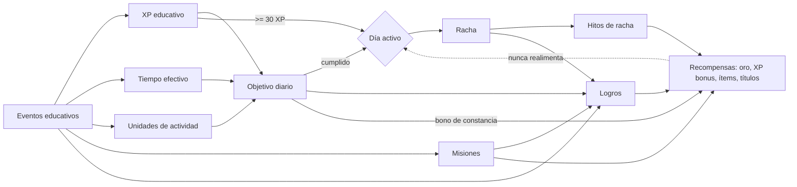
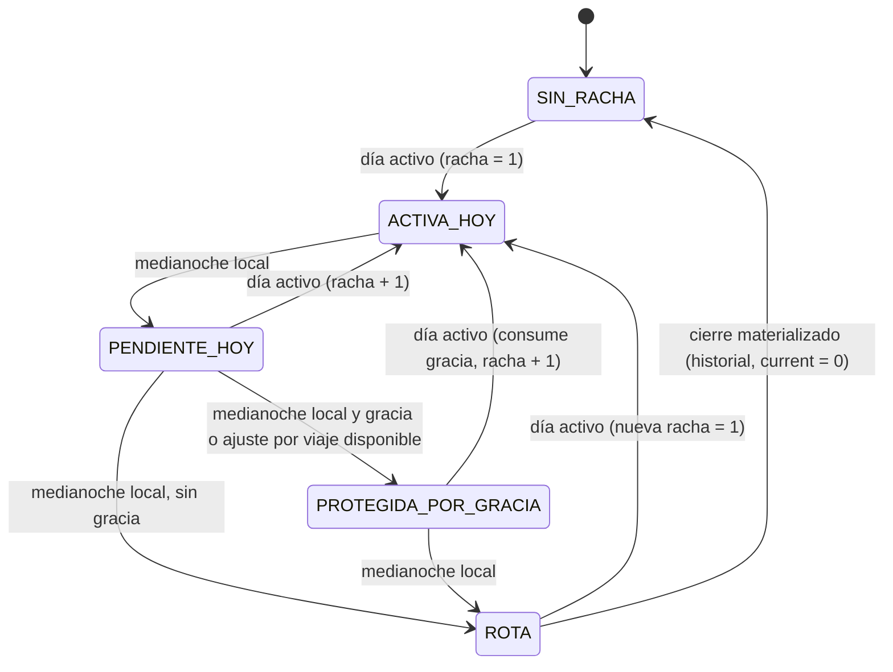
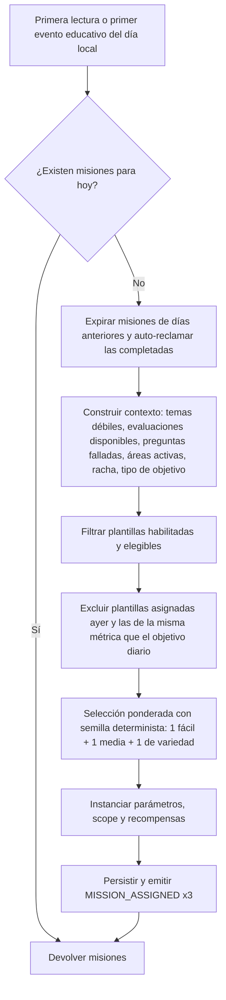
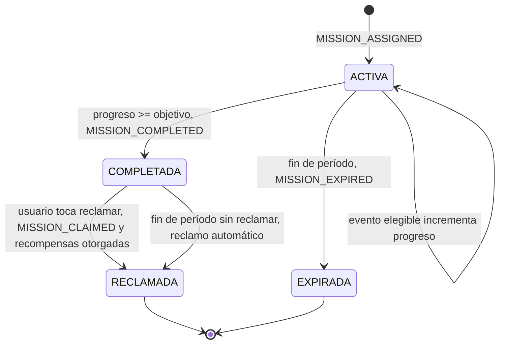
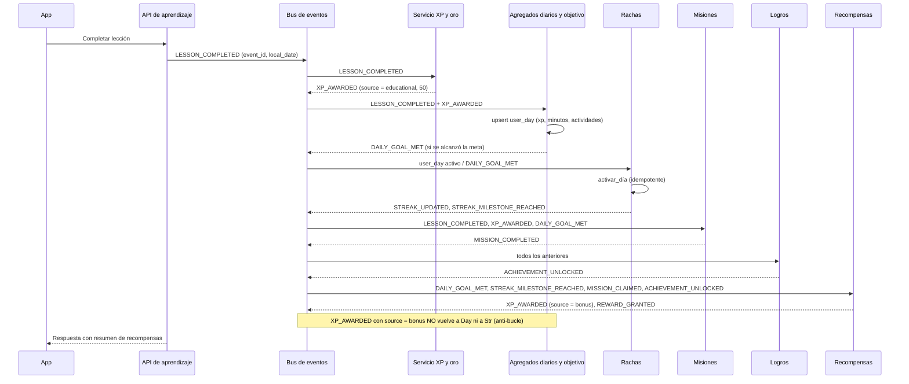
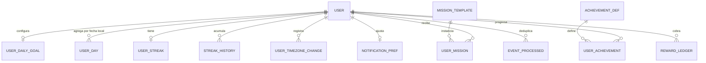

# 06b — Rachas, objetivos diarios, misiones y logros

> Proyecto **Atenea** (nombre de trabajo; el mundo se llama provisionalmente "Reino del Conocimiento").
> Auditoría previa a la implementación — cubre los puntos **10 (rachas), 14 (logros) y 15 (misiones)** de la sección 46 del brief, más el objetivo diario (sección 11) porque es la pieza que une a los tres.
> Fecha: 2026-09-10. Estado: propuesta para decisión. No se implementa nada todavía.
>
> Fuente de verdad: `docs/00-brief-producto.md`. Al momento de redactar este documento no existía ningún otro documento de la auditoría en `docs/auditoria/`; por eso aquí se fijan nombres de eventos, tablas y parámetros que los documentos hermanos (XP y niveles, economía/oro, motor de eventos, modelo de datos, dominio, inventario/equipamiento, UX) deben respetar o discutir explícitamente en sus propias "decisiones pendientes".

---

## 0. Resumen ejecutivo

1. **Día activo** = el usuario cumple su objetivo diario **o** acumula al menos `streak.min_daily_educational_xp` (valor inicial: **30 XP educativo**) en su fecha local. Abrir la app, mirar el mapa o comprar en la tienda **nunca** cuentan.
2. **Racha**: se calcula en el servidor a partir de agregados por fecha local (`user_day`), de forma perezosa e idempotente; medianoche local del usuario como hora de corte; tolerancia de sincronización de 10 minutos.
3. **Perdón**: 1 día de gracia por mes calendario, automático y gratuito, aplicado al volver (MVP). Congelación de racha (pagada con gemas/premium) y "misión de redención" quedan para Fase 2.
4. **Hitos de racha** en 7 / 14 / 30 / 60 / 100 / 365 días con XP de bonificación, oro e **ítems cosméticos exclusivos de racha** (no comprables). Sin multiplicador de XP por racha: la bonificación diaria de constancia se paga en oro.
5. **Objetivo diario**: tres tipos (minutos, actividades, XP educativo), un solo objetivo activo, opciones escalonadas, cambios efectivos al día siguiente, recomendación adaptativa semanal que el usuario acepta con un toque.
6. **Misiones**: generadas desde un **catálogo de plantillas parametrizadas** (sin IA en tiempo real). MVP: **3 misiones diarias** + **misiones de ruta** (especiales, 3 por ruta creada). Misiones semanales: Fase 2. Estados: activa → completada → reclamada / expirada; las completadas nunca se pierden (reclamo automático al expirar).
7. **Logros**: catálogo inicial de **32 logros** en 6 categorías, con reglas declarativas evaluables por el motor de eventos (tipos `counter`, `sum`, `consecutive`, `distinct_count`, `stat_threshold`), niveles bronce/plata/oro donde aplica, visibles y ocultos.
8. **Separación clave**: `XP educativo` (actividades de aprendizaje) alimenta objetivo diario, racha, dominio y misiones; `XP de bonificación` (misiones, hitos, logros) solo suma al nivel global. Esto evita bucles y evita que las recompensas "compren" la racha.
9. Todo valor numérico es **valor inicial configurable** en backend (namespace `streak.*`, `goal.*`, `missions.*`, `achievements.*`, `notifications.*`).

---

## 1. Alcance, principios y vocabulario

### 1.1 Principios que gobiernan este documento

| # | Principio | Consecuencia práctica |
|---|---|---|
| P1 | **Estudiar es el juego** (brief §44) | Ninguna misión, logro o día activo puede completarse sin al menos una acción educativa válida. Los pocos logros "de onboarding" (crear personaje, crear ruta) dan recompensas mínimas y existen solo para encender el bucle. |
| P2 | **Nunca castigar; recuperar siempre es posible** | Perder la racha no quita XP, oro, ítems ni dominio. La "mejor racha" se conserva. Tono de recuperación, no de culpa. |
| P3 | **Servidor autoritativo** | El cliente muestra estado optimista, pero racha, objetivo, misiones y logros se calculan en servidor a partir de eventos. |
| P4 | **Idempotencia** | Reprocesar un evento no duplica progreso ni recompensas. Cada evento tiene `event_id` único y cada mecánica registra qué eventos ya procesó. |
| P5 | **Configurable, no hardcodeado** (brief §7, §10, §13) | Parámetros en configuración de backend con versionado; cambiar un umbral no requiere despliegue móvil. |
| P6 | **Sin IA en tiempo real para estas mecánicas** (brief §38, §40) | Plantillas y reglas declarativas. Costo de IA de estas mecánicas: cero en MVP. La IA como "Game Master" podrá, en Fase 3, elegir o parametrizar plantillas del catálogo, nunca inventar reglas. |
| P7 | **Nunca pay-to-win ni bloquear aprendizaje tras pago** (brief §14, §16, §36) | Ningún ítem de racha o logro se compra; la congelación premium (futura) protege la racha, no otorga XP ni dominio. |

### 1.2 Vocabulario

| Término | Definición operativa | Se usa en |
|---|---|---|
| **XP educativo** | XP otorgado por eventos de aprendizaje: `LESSON_COMPLETED`, `QUESTION_ANSWERED`, `CHALLENGE_COMPLETED`, `ASSESSMENT_COMPLETED`, `REVIEW_COMPLETED`, `MODULE_COMPLETED`, `PATH_COMPLETED`. | Objetivo diario (tipo XP), día activo, misiones, XP por tema |
| **XP de bonificación** | XP otorgado por mecánicas de gamificación: misiones, hitos de racha, logros. Solo suma al nivel global. | Nivel global |
| **Tiempo efectivo** | Segundos en pantalla de actividad educativa con interacción reciente, reportados por *heartbeats* y validados en servidor (`STUDY_TIME_TICKED`). | Objetivo diario (tipo minutos), misiones de tiempo, perfil |
| **Actividad** (unidad) | Lección completada (1), bloque de práctica de ≥5 preguntas (1), repaso completado (1), desafío completado (1), evaluación completada (2). | Objetivo diario (tipo actividades) |
| **Fecha local** | Fecha calendario en la zona horaria IANA del usuario, calculada en servidor a partir de `occurred_at`. | Todo |
| **Día activo** | Fecha local en la que se cumplió el objetivo diario **o** el XP educativo ≥ umbral mínimo. | Racha, calendario, "días activos" |
| **Objetivo diario** | Meta personal, persistente, del mismo tipo cada día (minutos / actividades / XP). Binaria: cumplida o no. | Racha, bono de constancia |
| **Racha** | Cantidad de fechas locales consecutivas activas (con gracia y ajuste por viaje). | Perfil, dashboard, hitos |
| **Misión** | Tarea concreta, con plazo, generada desde plantilla, con recompensa. Diaria, semanal (Fase 2) o especial (de ruta). | Dashboard, pantalla de misiones |
| **Logro** | Reconocimiento permanente, acumulativo, sin plazo, con niveles opcionales. Se gana una vez por nivel. | Perfil ("sala de trofeos") |
| **Hito de racha** | Longitud de racha que dispara recompensa (7, 14, 30…). | Racha |
| **Gracia** | Perdón automático de un día inactivo aislado; 1 por mes calendario en MVP. | Racha |
| **`counts_for_progress`** | Bandera que el dominio de aprendizaje pone en cada evento para indicar si la acción es "aprendizaje real" (p. ej. `false` si la pregunta ya fue acertada hoy o es repetición trivial). | Objetivo, misiones, logros |

### 1.3 Cómo se relacionan las cuatro mecánicas



La flecha punteada es la regla anti-bucle: **ninguna recompensa de gamificación cuenta como aprendizaje**.

---

## 2. Rachas

### 2.1 Definición de "día activo"

Una fecha local `D` es activa para el usuario si, y solo si, se cumple al menos una de estas condiciones con eventos cuya fecha local sea `D`:

1. `user_day[D].goal_met_at IS NOT NULL` (el objetivo diario del usuario se cumplió), **o**
2. `user_day[D].educational_xp >= streak.min_daily_educational_xp` (valor inicial: **30 XP**, ≈ una lección corta o tres respuestas correctas con `counts_for_progress = true`).

**Por qué el "o":** si solo contara el objetivo diario, un usuario con meta de 45 minutos que estudia 20 perdería la racha pese a haber aprendido: castigo desproporcionado y fuente clásica de abandono. Si solo contara el umbral de XP, el objetivo diario perdería sentido para la racha. Con el "o", la racha tiene un **piso universal bajo** (30 XP) y el objetivo diario es la meta personal que da bono extra y "día perfecto" en el calendario.

**Qué no cuenta nunca:** abrir la app, ver el mapa, personalizar el avatar, comprar en la tienda, reclamar misiones, leer el perfil, XP de bonificación. El umbral usa exclusivamente `educational_xp`.

**Dependencia:** el documento de XP debe garantizar que las acciones repetitivas sin valor (responder la misma pregunta ya acertada, releer una lección completada) otorguen 0 XP o marquen `counts_for_progress = false`; de lo contrario el piso de 30 XP se vuelve trivial.

### 2.2 Zona horaria y hora de corte

| Aspecto | Decisión (MVP) | Justificación |
|---|---|---|
| Zona horaria del usuario | Campo `users.timezone` (IANA, p. ej. `America/Santiago`). Se captura del dispositivo en el registro; el cliente la envía en cada arranque y el servidor la actualiza si cambia. | Un solo valor por usuario simplifica todo el cálculo. |
| Hora de corte | **Medianoche local (00:00)**. | Coincide con la intuición de "día". Hora de corte configurable (p. ej. 03:00 para noctámbulos) queda en Fase 2. |
| Fecha local de un evento | `local_date = occurred_at (UTC) convertida a users.timezone` en el momento de procesar el evento. Se persiste en el evento y en `user_day`. | Cálculo único, auditable. |
| Marca de tiempo del evento | `occurred_at` = marca del cliente si `|cliente − servidor| ≤ streak.sync_tolerance_min` (valor inicial **10 min**); si no, marca del servidor. | Tolera latencia y relojes desfasados; acota el abuso a 10 minutos. |
| Cambios de zona horaria | Se aceptan como máximo 1 cambio efectivo cada 24 h; se guarda historial (`user_timezone_changes`). Cambios con `|delta| < 3 h` no activan el ajuste por viaje. | Ver casos borde (§2.10). |

### 2.3 Modelo de cálculo y pseudocódigo idempotente

La racha **no se calcula contando eventos**, sino a partir del estado de los días (`user_day.day_status`). Activar dos veces el mismo día es una no-operación. El estado materializado vive en `user_streak`, y siempre es recomputable desde `user_day`.

```
función procesar_actividad(user, evento):            # se ejecuta tras otorgar XP
    fecha = fecha_local(evento.occurred_at, user.timezone)
    día = upsert user_day(user, fecha)  ← acumula educational_xp, effective_seconds, activity_units...
    evaluar_objetivo_diario(user, día)               # puede emitir DAILY_GOAL_MET
    si día.day_status == 'inactive'
       y (día.goal_met_at != null o día.educational_xp >= cfg.streak.min_daily_educational_xp):
        día.day_status = 'active'
        activar_día(user, fecha)

función activar_día(user, hoy):                       # bloqueo por fila en user_streak
    s = user_streak[user]
    si s.last_active_date == hoy:            retornar   # idempotente
    si s.last_active_date == hoy − 1:        s.current += 1 ; motivo = 'extended'
    sino si s.last_active_date == hoy − 2:
        día_perdido = hoy − 1
        si viaje_hacia_el_este_entre(hoy − 2, hoy) y ajuste_viaje_disponible(s):
            marcar user_day[día_perdido].day_status = 'travel'; s.current += 1; motivo = 'travel_skip'
        sino si gracia_disponible(s, mes(día_perdido)):
            marcar user_day[día_perdido].day_status = 'grace'
            s.grace_used_for_month = mes(día_perdido); s.current += 1; motivo = 'grace_used'
        sino: cerrar_racha(s, motivo_cierre = 'broken'); s.current = 1; motivo = 'started'
    sino:
        si s.current > 0: cerrar_racha(s, 'broken')      # registra STREAK_HISTORY
        s.current = 1 ; motivo = 'started'
    s.last_active_date = hoy
    s.total_active_days += 1
    s.best = max(s.best, s.current)
    emitir STREAK_UPDATED{previous, current, best, motivo}
    si s.current ∈ cfg.streak.milestones o (s.current > 100 y s.current % 50 == 0):
        emitir STREAK_MILESTONE_REACHED{length = s.current, first_time = no_alcanzado_antes(user, s.current)}

función estado_visible(s, hoy):                       # solo lectura, no muta
    si s.last_active_date == hoy:                    → ACTIVA_HOY
    si s.last_active_date == hoy − 1:                → PENDIENTE_HOY
    si s.last_active_date == hoy − 2 y gracia_disponible(...): → PROTEGIDA_POR_GRACIA
    en otro caso:                                    → ROTA (mostrar 0 y "última racha: N")
```

**Cierre perezoso vs. tarea nocturna:** el estado visible se deriva en lectura, así no hace falta un cron por zona horaria. Además, una tarea de mantenimiento diaria (una pasada por hora sobre usuarios cuyo `last_active_date ≤ hoy_local − 2` sin gracia) materializa el cierre (`STREAK_HISTORY`, `current = 0`) para que analítica y notificaciones lean un estado consistente. Ambos caminos producen el mismo resultado.

### 2.4 Diagrama de estados

Los estados son **derivados**, no almacenados; lo almacenado es `last_active_date`, `current_length`, `best_length` y los marcadores de gracia/viaje.



### 2.5 Perder un día, gracia y congelación

| Situación | Comportamiento MVP | Fase futura |
|---|---|---|
| Un día inactivo aislado, gracia disponible ese mes | Al volver, la racha continúa; el día se marca "gracia" en el calendario; mensaje explícito: "Usaste tu día de gracia de septiembre". | — |
| Un día inactivo aislado, sin gracia | Racha rota. Se guarda en `STREAK_HISTORY`; "mejor racha" se conserva; el usuario ve "Última racha: 21 días" y comienza una nueva con el primer día activo. | **Misión de redención** (Fase 2): recuperar la racha completando el doble del objetivo diario durante 2 días seguidos en las siguientes 72 h. Ligada al aprendizaje, no al pago. |
| Dos o más días inactivos seguidos | Racha rota (la gracia cubre un solo día). | **Congelación** (Fase 2, premium/gemas): el usuario la activa **antes** de ausentarse; congela hasta N días; nunca otorga XP, oro ni dominio. **Descansos planificados** (Fase 2, gratis): hasta 2 días/mes declarados con antelación; no consumen gracia. |
| Reposición de la gracia | El primer día de cada mes calendario (según la fecha local del día perdido). No acumulable. | Alternativa a evaluar: ganar 1 gracia cada 30 días activos (ligada al esfuerzo). |
| Reparación pagando oro | **No** en MVP. | Decidir en Fase 2 con datos; riesgo de convertir la constancia en transacción. |

**Por qué gracia mensual automática y no congelación en MVP:** la congelación requiere una acción anticipada del usuario (UX adicional), una economía de gemas que el brief pospone (§14) y reglas de expiración. La gracia automática se implementa con dos columnas y elimina la causa número uno de frustración (el día que se te pasó) sin diseñar una tienda.

### 2.6 Hitos y recompensas de racha

Valores iniciales configurables (`streak.milestones`). Los ítems se otorgan **una sola vez** por usuario aunque el hito se repita en rachas posteriores; XP y oro sí se repiten.

| Hito | XP bonus | Oro | Ítem exclusivo de racha (no comprable) | Otros |
|---|---|---|---|---|
| 7 días | +50 | +50 | **Insignia de la Llama** (accesorio, común) | Logro "Guardián de la Llama" bronce |
| 14 días | +100 | +100 | — | Título "Constante" |
| 30 días | +200 | +200 | **Capa de Brasas** (capa, raro) | Logro "Guardián de la Llama" plata |
| 60 días | +300 | +300 | **Yelmo del Vigía** (cabeza, épico) | — |
| 100 días | +500 | +500 | **Estandarte de los Cien Días** (accesorio de espalda, legendario) | Logro "Guardián de la Llama" oro |
| 365 días | +1.000 | +1.000 | **Corona del Año Perpetuo** (cabeza, mítico) | Logro oculto "Llama Perpetua" |
| Cada 50 días después de 100 (150, 200…) | +250 | +250 | — | Repetible |

Los ítems de racha son la señal social más clara de constancia (Fase 4: perfiles públicos), por eso no deben venderse jamás. Nombres y categorías son propuestas; el documento de inventario define las ranuras definitivas (ver dependencia sobre "accesorio de espalda" y "títulos").

### 2.7 Bonificación por racha, mejor racha y días activos

- **Bonificación diaria de constancia (en oro, no en XP):** al cumplir el objetivo diario se otorga `goal.bonus_gold_base + min(racha_actual, goal.bonus_gold_cap_days)` → valores iniciales **10 + min(racha, 20)** oro (entre 11 y 30 oro/día). Un día activo solo por el piso de 30 XP no da bono: la racha se protege, pero el bono premia la meta personal.
- **Sin multiplicador de XP por racha.** Dos usuarios que aprenden lo mismo deben tener niveles comparables; un multiplicador rompería la lectura del nivel como progreso de aprendizaje y presionaría la ansiedad por no perder "el x1.5". El documento de XP debe alinearse con esta decisión.
- **Mejor racha (`best_length`)**: nunca disminuye. Se muestra junto a la actual (brief §10).
- **Días activos totales (`total_active_days`)**: contador de por vida; alimenta el logro "Peregrino/a" y el perfil.
- **Historial (`STREAK_HISTORY`)**: cada racha cerrada con inicio, fin, longitud y motivo. Permite el gráfico "tus rachas" en estadísticas (Fase 2) y analítica de retención.

### 2.8 Calendario mensual

Vista mensual derivada 1:1 de `user_day`. Estados de celda:

| Estado | Fuente | Representación sugerida |
|---|---|---|
| Inactivo | sin fila o `day_status = inactive` en fecha pasada | celda apagada |
| Activo | `day_status = active`, `goal_met_at IS NULL` | llama |
| Día perfecto | `goal_met_at IS NOT NULL` | llama dorada / anillo completo |
| Gracia | `day_status = grace` | llama tenue con escudo pequeño |
| Viaje | `day_status = travel` | ícono de brújula |
| Hoy | fecha local actual | anillo de progreso del objetivo (0–100 %) |
| Futuro | fecha > hoy | vacío |

Al tocar una celda: minutos, XP educativo, actividades, misiones completadas ese día. El calendario también muestra "Días activos este mes: 18/30" y "Mejor racha: 37".

### 2.9 Notificaciones de recordatorio

| Tipo | Canal | Cuándo | Condiciones | Opt-out |
|---|---|---|---|---|
| **Recordatorio diario** | Push | A la *hora habitual* del usuario + `notifications.reminder.offset_min` (45 min). Hora habitual = mediana de la hora local de `DAILY_GOAL_MET` (o del primer evento educativo) en los últimos 14 días activos; sin historial → `notifications.reminder.default_hour` (19:00). Se acota a la ventana 08:00–21:30. | Hoy aún no es día activo; no se envió recordatorio hoy. | Sí, por tipo |
| **Última llamada** | Push | 21:30 local (`notifications.last_call.hour`) | Racha ≥ 7 (`notifications.last_call.min_streak`), hoy no activo, usuario opt-in explícito. | Opt-in (desactivado por defecto) |
| **Racha protegida por gracia** | In-app (banner) | Al abrir la app en estado `PROTEGIDA_POR_GRACIA` | — | — |
| **Hito alcanzado / logro / misión completada** | In-app (cola de celebraciones) | Al finalizar la actividad, nunca en medio de una pregunta | — | — |
| **Misiones nuevas del día** | Ninguno en MVP | — | — | — |

Reglas globales: máximo `notifications.max_per_day.streak_goal = 2` pushes de racha/objetivo al día y `notifications.max_per_day.total = 3` en total; horas de silencio 22:00–08:00 local; el usuario puede fijar una hora manual que reemplaza la inteligente. La tarea de envío corre cada 15 minutos y selecciona usuarios cuyo minuto local coincide con su franja (sin cron por zona horaria). Si el usuario se desactiva las notificaciones, la app **no** insiste con modales.

### 2.10 Casos borde

| Caso | Regla |
|---|---|
| **Actividad a las 23:59** | Cuenta para el día en que ocurre `occurred_at` (con tolerancia de 10 min si el cliente marcó antes de medianoche y el servidor recibió después). Una lección iniciada 23:50 y completada 00:05 cuenta para el nuevo día; las respuestas correctas anteriores a medianoche ya sumaron al día previo. La UI muestra "quedan 25 min para tu día" a partir de las 23:00 solo si hoy no es activo (sin alarma sonora). |
| **Viaje hacia el este (p. ej. Santiago → Madrid, +5 h)** | Puede "desaparecer" la ventana de un día local. Si el día perdido está entre un cambio de zona ≥ 3 h y la vuelta del usuario, se marca `travel` sin consumir gracia (máx. 1 cada 30 días, `streak.travel_skip_per_30d`). |
| **Viaje hacia el oeste** | El usuario gana horas; el día ya activo sigue activo. Sin efecto negativo ni ganancia material (no se otorga XP por el calendario). |
| **Cambio manual de zona horaria para "ganar" días** | El agresor solo desplaza su calendario; sigue necesitando actividad educativa real cada ~24 h y no obtiene XP, oro ni dominio extra. Límite: 1 cambio efectivo por 24 h; anomalías (>3 cambios/semana) se registran para analítica. |
| **Reloj del dispositivo adelantado/atrasado** | Si difiere > 10 min del servidor, se usa la hora del servidor. |
| **Fallo de sincronización / reintentos** | Eventos con `event_id` UUID generado en cliente; el servidor deduplica. El cliente muestra estado optimista y reconcilia con `GET /me/streak` al recuperar red. Nunca se rompe una racha por un evento duplicado o tardío dentro de tolerancia. |
| **Uso offline** | MVP es *online-first* (generación y evaluación requieren servidor). El cliente encola eventos durante cortes breves y los reenvía; solo se aceptan con marca de cliente si están dentro de la tolerancia; fuera de ella se atribuyen a la hora del servidor. Modo offline real (lecciones descargadas) → Fase 3, y requerirá una ventana de tolerancia mayor con firma de eventos. |
| **Usuario nuevo el día 31 a las 23:58** | Primer día activo = fecha local del evento. Sin casos especiales. |
| **Cambio de objetivo diario a mitad del día** | Efectivo al día siguiente (evita bajar la meta para "cumplir" retroactivamente). Subir la meta puede aplicarse de inmediato. |
| **Gracia en el mes de febrero / cambio de mes** | La gracia se asocia al mes del **día perdido**, no al mes en que el usuario vuelve. |
| **Cuenta eliminada / restaurada** | `user_day` se borra con la cuenta; no hay "racha fantasma". |

### 2.11 Ansiedad, burnout y cómo mitigarlos

Las rachas son la mecánica de retención más potente y la más peligrosa: convierten un hábito en una deuda. Decisiones de diseño para que la racha **acompañe** en lugar de **cobrar**:

1. **Piso bajo y claro** (30 XP): un día ocupado se salva en 5 minutos, y la UI lo dice: "Con una lección corta mantienes tu llama".
2. **Perdón automático** sin pedirlo y sin pagar; el usuario lo descubre al volver, no al fallar.
3. **No hay cuenta regresiva agresiva ni pushes de miedo.** Un recordatorio inteligente, una última llamada opcional.
4. **La pérdida no borra nada**: mejor racha, días activos totales, ítems de racha y logros permanecen.
5. **Copy de recuperación, no de culpa** (aplica al documento de UX):

| Situación | Evitar | Preferir |
|---|---|---|
| Recordatorio | "¡Vas a perder tu racha de 14 días!" | "Tu llama lleva 14 días. Una lección corta la mantiene encendida." |
| Racha rota | "Perdiste tu racha 😢" | "Tu racha de 21 días terminó, pero todo lo que aprendiste se queda. ¿Encendemos una nueva hoy?" |
| Gracia usada | "Te salvaste por poco" | "Usaste tu día de gracia de septiembre. Tu racha de 30 días sigue viva." |
| Día activo sin objetivo | "No cumpliste tu objetivo" | "Racha protegida. Te faltan 12 minutos para tu objetivo de hoy." |

6. **Recomendación adaptativa a la baja** (§3.4): si el usuario falla el objetivo repetidamente, la app le propone bajarlo, no lo presiona.
7. **Métrica de salud** (§9): si la tasa de bajas de notificaciones o la relación "días salvados por el piso / días perfectos" sube demasiado, el equipo revisa umbrales, no el usuario.

---

## 3. Objetivos diarios

### 3.1 Tipos y opciones

Un único objetivo activo por usuario (`user_daily_goal`). Opciones escalonadas para que "elegir" sea un gesto, no un formulario:

| Tipo | Métrica | Opciones (valor inicial configurable) | Etiquetas sugeridas | Por defecto |
|---|---|---|---|---|
| ⏱ Minutos | `effective_seconds / 60` | 10 / 20 / 30 / 45 | Tranquilo · Constante · Decidido · Intenso | **20 min** |
| 📚 Actividades | `activity_units` | 1 / 3 / 5 / 8 | idem | 3 |
| ⭐ XP | `educational_xp` | 50 / 100 / 200 / 350 | idem | 100 |

**Por qué minutos por defecto:** en el onboarding la pregunta "¿cuánto tiempo puedes dedicar al día?" es la única que un usuario nuevo puede responder con honestidad; XP y actividades aún no significan nada para él. El tipo puede cambiarse en cualquier momento.

**Guardas:** la opción mínima de cada tipo garantiza que cumplir el objetivo implique aprendizaje real (≥ 1 lección o equivalente), y el "o" del día activo (§2.1) garantiza que cumplir el objetivo siempre active el día.

### 3.2 Equivalencias: cualquier acción válida suma

El brief exige que el objetivo pueda cumplirse "mediante diferentes acciones" (§11). Por eso las tres métricas se alimentan de **todas** las actividades educativas:

| Acción (evento) | Minutos | Actividades | XP educativo |
|---|---|---|---|
| Lección completada (`LESSON_COMPLETED`) | tiempo efectivo de la lección | +1 | +50 (según doc. de XP) |
| Pregunta correcta (`QUESTION_ANSWERED`, `counts_for_progress`) | tiempo efectivo | cada 5 preguntas de práctica = +1 | +10 |
| Repaso completado (`REVIEW_COMPLETED`) | tiempo efectivo | +1 | según doc. de XP |
| Desafío completado (`CHALLENGE_COMPLETED`) | tiempo efectivo | +1 | +250 |
| Evaluación completada (`ASSESSMENT_COMPLETED`) | tiempo efectivo | +2 | +300 (aprobada) |
| Módulo / ruta completados | — | — | +150 / +1.000 |
| Recompensas de misiones, hitos, logros | — | — | **no cuenta** |

**Tiempo efectivo** (`STUDY_TIME_TICKED`): el cliente envía un *heartbeat* cada 30 s mientras hay una actividad educativa en primer plano y hubo interacción en los últimos 120 s; el servidor acepta ≤ 60 s por tick, descarta ticks fuera de una sesión abierta y limita el tiempo por lección a 3× su duración estimada. La definición completa pertenece al documento de sesiones/motor; aquí solo se fijan los requisitos para que "minutos" no sea manipulable dejando la app abierta.

### 3.3 Cómo elige y ajusta el usuario

- **Onboarding**: pantalla única "¿Cuánto tiempo al día?" con las 4 opciones de minutos; se explica que puede cambiar el tipo después.
- **Ajustes → Objetivo diario**: cambio de tipo y valor. Efectivo **al día siguiente** (`goal.change_effective = next_day`), salvo subidas, que se aplican de inmediato. El día actual conserva la meta con la que empezó (`user_day.goal_type_snapshot`, `goal_target_snapshot`), lo que hace el histórico auditable.
- **Dashboard**: tarjeta "Objetivo de hoy" con barra de progreso, texto "12 / 20 min" y, si aplica, "Racha protegida" cuando ya se alcanzó el piso de XP pero no la meta.

### 3.4 Recomendación adaptativa

Se calcula cada lunes (fecha local) sobre los últimos `goal.adapt.window_days = 14` días y se guarda en `user_daily_goal.recommendation`. **Nunca cambia la meta por su cuenta**: muestra una tarjeta con un botón de aceptación.

| Señal | Regla (valores iniciales) | Recomendación |
|---|---|---|
| Sobrecumplimiento sostenido | objetivo cumplido ≥ 12 de 14 días **y** logro medio ≥ 150 % de la meta | Subir un escalón ("Vas sobrado: ¿probamos 30 min?") |
| Meta demasiado alta | objetivo cumplido ≤ 4 de 14 días **y** días activos ≥ 8 | Bajar un escalón ("Estás estudiando casi todos los días; ajustemos la meta para que se note") |
| Sin actividad | días activos < 4 de 14 | Ninguna recomendación numérica; sugerir el tipo "actividades = 1" con tono de reinicio |
| Estable | resto | Ninguna |

Máximo una recomendación cada 14 días; si el usuario la rechaza, no se repite la misma dirección durante 28 días.

### 3.5 Recompensa por cumplir el objetivo

- Evento `DAILY_GOAL_MET` (una vez por fecha local; idempotente por `user_day.goal_met_at`).
- **Bono de constancia en oro**: `10 + min(racha_actual, 20)` (§2.7). Sin XP de bonificación por el objetivo diario: el XP ya se ganó aprendiendo.
- Celebración corta ("Objetivo cumplido · +18 oro · Racha 8 días") al cerrar la actividad en curso.

### 3.6 Objetivo diario vs. misión diaria vs. racha (para no confundir al usuario)

| | Objetivo diario | Misión diaria | Racha |
|---|---|---|---|
| Qué es | Meta personal fija | 3 tareas concretas y rotativas | Contador de días activos consecutivos |
| Quién la define | El usuario | El sistema (catálogo) | Derivada |
| Cambia cada día | No | Sí | — |
| Recompensa | Oro (bono de constancia) | XP bonus + oro (+ ítems en especiales) | Hitos: XP bonus, oro, ítems exclusivos |
| Afecta la racha | Sí (cumplirla activa el día) | No directamente (pero completarla implica aprender, lo que activa el día) | — |
| Dónde se ve | Tarjeta "Objetivo de hoy" en el dashboard | Sección "Misiones" (3 tarjetas) | Cabecera del dashboard y perfil |

**Ambigüedad del brief resuelta:** el dashboard de ejemplo (§28) muestra "Misión de hoy: Estudia 20 minutos", que es en realidad el objetivo diario. Se recomienda etiquetar **"Objetivo de hoy"** y, debajo, **"Misiones"**. Además, el generador de misiones excluye plantillas de la misma métrica que el tipo de objetivo del usuario (p. ej. no propone "Estudia 15 minutos" a quien tiene objetivo de minutos), para que ambas cosas no parezcan duplicadas. Registrado en §12.

---

## 4. Misiones

### 4.1 Tipos y alcance del MVP

| Tipo | Período | Cantidad simultánea | MVP | Justificación |
|---|---|---|---|---|
| **Diarias** | Fecha local; expiran a medianoche local | 3 | **Sí** | Núcleo del bucle diario (brief §41). |
| **De ruta (especiales)** | Sin expiración; ligadas a una ruta | 3 por ruta activa | **Sí (mínimo)** | Se instancian al crear la ruta desde 3 plantillas; conectan con desbloqueos de equipamiento y evaluaciones. Coste marginal: mismo motor. |
| **Semanales** | Lunes 00:00 → domingo 23:59 local | 3 | **Fase 2** | El MVP valida el retorno diario; añadir un segundo horizonte multiplica UI, pruebas y copy sin aportar a la métrica fundamental (brief §47). El motor ya soporta `period = weekly`, así que activar semanales en Fase 2 es configuración + UI. |
| **De evento / temporada** | Ventana global | — | Fase 3 | Requiere contenido y calendario editorial. |

### 4.2 Plantillas parametrizadas

Una plantilla define **qué se mide**, **con qué parámetros por dificultad**, **cuándo es elegible** y **qué recompensa da**. No hay IA en tiempo real: el "Game Master" del MVP es un selector determinista.

```json
{
  "id": "D02_CORRECT_ANSWERS",
  "period": "daily",
  "title_template": "Responde {n} preguntas correctamente",
  "narrative_key": "mission.d02.narrative",
  "metric": {
    "type": "counter",
    "event": "QUESTION_ANSWERED",
    "where": { "is_correct": true, "counts_for_progress": true }
  },
  "params": { "n": { "easy": 5, "medium": 10, "hard": 20 } },
  "scope": "any",
  "eligibility": [],
  "exclude_if_goal_type": [],
  "reward_profile": "daily_default",
  "weight": 3,
  "enabled": true,
  "version": 1
}
```

Campos relevantes:

| Campo | Significado |
|---|---|
| `metric.type` | `counter` (cuenta eventos), `sum` (suma un campo, p. ej. `seconds`), `max` (mejor valor, p. ej. `accuracy_pct`), `consecutive` (aciertos seguidos), `flag` (ocurre una vez, p. ej. `TOPIC_STARTED`). Mismos tipos que los logros (§5.2) para reutilizar el evaluador. |
| `scope` | `any`, `knowledge_area` (se fija al instanciar, p. ej. el área más débil), `path` (misiones de ruta). |
| `eligibility` | Predicados sobre el contexto del usuario: `has_weak_topic`, `has_available_assessment`, `has_unstarted_topic`, `has_failed_questions >= 3`, `active_areas >= 2`, `streak >= 3`, `has_available_challenge`. |
| `exclude_if_goal_type` | Evita duplicar el objetivo diario (p. ej. `["minutes"]` para la plantilla de tiempo). |
| `reward_profile` | `daily_default` = fácil 40 XP/10 oro · medio 100 XP/25 oro · difícil 180 XP/50 oro. `weekly_default` (Fase 2) = 300 XP/100 oro · 600 XP/200 oro. `path_special` = definido por plantilla (incluye ítems). |
| `weight` | Peso relativo en la selección aleatoria ponderada. |
| `version` | Las instancias guardan `template_version` para que cambiar una plantilla no altere misiones ya asignadas. |

Instancia asignada al usuario (`user_mission`):

```json
{
  "id": "8d1f…",
  "user_id": "u_123",
  "template_id": "D02_CORRECT_ANSWERS",
  "template_version": 1,
  "period": "daily",
  "tier": "medium",
  "params": { "n": 10 },
  "scope_ref": null,
  "title": "Responde 10 preguntas correctamente",
  "target": 10,
  "progress": 4,
  "status": "active",
  "assigned_for": "2026-09-10",
  "expires_at": "2026-09-11T03:00:00Z",
  "reward": { "xp": 100, "gold": 25, "items": [] },
  "completed_at": null,
  "claimed_at": null
}
```

### 4.3 Generación, selección y rotación

Generación **perezosa y determinista**: en la primera lectura de misiones de una fecha local (o en el primer evento educativo del día, lo que ocurra antes). Semilla = `hash(user_id, assigned_for)`, así un reintento produce el mismo conjunto (idempotencia sin bloqueos complicados).



Reglas de composición diaria (`missions.daily.tier_mix`):

1. **Fácil**: siempre alcanzable con una sola lección (D01 n=1, D07, D04 fácil). Garantiza que quien hace lo mínimo se lleve una recompensa.
2. **Media**: profundidad o cantidad (D02 n=10, D03 80 %, D05, D08, D12).
3. **De variedad**: prioriza plantillas que "mueven" al usuario hacia lo que necesita: repaso de tema débil, revancha, evaluación pendiente, área descuidada. Si no hay ninguna elegible, cae a una difícil genérica (D02 n=20, D09).
4. No repetir la misma plantilla en días consecutivos (`missions.daily.no_repeat_days = 1`); no repetir dos plantillas de la misma métrica en el mismo día.
5. Sin *reroll* en MVP (Fase 2: 1 cambio de misión al día, gratuito).

### 4.4 Progreso y estados



- El progreso se actualiza en la transacción del evento (`UPDATE ... SET progress = LEAST(target, progress + delta) WHERE status = 'active'`), tras verificar que el `event_id` no se procesó ya para esa misión.
- **Reclamar** existe porque abrir la recompensa es un momento satisfactorio (brief §29), pero **nunca se pierde**: al expirar el período, las misiones completadas se reclaman automáticamente. Sin castigo por olvidar.
- Las misiones **de ruta** no expiran; se cancelan (`status = cancelled`) solo si el usuario elimina la ruta.

### 4.5 Recompensas, límites y expiración

| Aspecto | Decisión (valores iniciales) |
|---|---|
| XP de misiones | Es **XP de bonificación**: suma al nivel global, no al XP por tema, no al objetivo diario, no al piso de racha. |
| Oro | Según perfil de recompensa. El documento de economía debe presupuestar ~85 oro/día de misiones + ~11–30 de bono de constancia como ingreso máximo por constancia. |
| Ítems | Solo en misiones de ruta y (Fase 2) semanales difíciles. Diarias: nunca ítems (evitaría el *grind* por cosméticos). |
| Logros | Indirectos: `MISSION_COMPLETED` alimenta "Aventurero/a"; una misión puede además marcar `unlock_hint` para mostrar el ítem que se desbloquea al terminar la ruta. |
| Desbloqueos | Las misiones de ruta anuncian y acompañan desbloqueos de equipamiento vinculado al conocimiento (brief §17), pero la **regla de desbloqueo vive en el ítem**, no en la misión (una sola fuente de verdad, documento de equipamiento). |
| Límites | 3 diarias activas; máx. 3 misiones de ruta por ruta; máx. 5 rutas con misiones activas mostradas (las demás quedan plegadas). |
| Expiración | Diarias: medianoche local del `assigned_for`. Ruta: sin expiración. |
| Requisito de aprendizaje | Toda plantilla tiene `metric.event` dentro de la lista de eventos educativos (§6.2) o de `DAILY_GOAL_MET`; una plantilla que no lo cumpla no pasa la validación del catálogo. |

### 4.6 Catálogo inicial de plantillas

Recompensas diarias por dificultad: **fácil 40 XP + 10 oro · media 100 XP + 25 oro · difícil 180 XP + 50 oro** (valores iniciales). "—" = la plantilla no se ofrece en esa dificultad.

#### Diarias (MVP)

| ID | Título (plantilla) | Métrica | Fácil / Media / Difícil | Elegibilidad | Peso |
|---|---|---|---|---|---|
| D01 | Completa {n} lecciones | `counter LESSON_COMPLETED` | 1 / 2 / 3 | — | 4 |
| D02 | Responde {n} preguntas correctamente | `counter QUESTION_ANSWERED[is_correct, counts_for_progress]` | 5 / 10 / 20 | — | 4 |
| D03 | Termina una lección con ≥ {p} % de precisión | `max LESSON_COMPLETED.accuracy_pct ≥ p` | — / 80 / 100 | — | 3 |
| D04 | Repasa un tema que se te resiste | `counter REVIEW_COMPLETED[topic ∈ débiles]` | 1 / — / — | `has_weak_topic` | 3 |
| D05 | Enfrenta una evaluación | `counter ASSESSMENT_COMPLETED` | — / 1 / — | `has_available_assessment` | 2 |
| D06 | Aprueba una evaluación | `counter ASSESSMENT_COMPLETED[passed]` | — / — / 1 | `has_available_assessment` | 2 |
| D07 | Adéntrate en un tema nuevo | `flag TOPIC_STARTED` | 1 / — / — | `has_unstarted_topic` | 3 |
| D08 | Gana {xp} XP en {área} | `sum XP_AWARDED[source=educational, area]` | — / 60 / 120 | `active_areas ≥ 2`; área = la más débil | 2 |
| D09 | Racha de aciertos: {n} seguidas | `consecutive QUESTION_ANSWERED[is_correct]` | — / 5 / 8 | — | 2 |
| D10 | Estudia {m} minutos efectivos | `sum STUDY_TIME_TICKED.seconds ≥ m·60` | — / 15 / 30 | `exclude_if_goal_type: [minutes]` | 2 |
| D11 | Supera un desafío | `counter CHALLENGE_COMPLETED` | — / — / 1 | `has_available_challenge` | 2 |
| D12 | Revancha: acierta {n} preguntas que fallaste | `counter QUESTION_ANSWERED[is_correct, is_retry_of_failed]` | — / 3 / 5 | `has_failed_questions ≥ 3` | 3 |
| D13 | Cumple tu objetivo antes de las {h}:00 | `flag DAILY_GOAL_MET[local_hour < h]` | — / 14 / — | `streak ≥ 3` | 1 |

#### De ruta / especiales (MVP mínimo; se instancian al crear la ruta)

| ID | Título (plantilla) | Métrica | Recompensa (valor inicial) |
|---|---|---|---|
| S01 | Primer bastión: completa el primer módulo de {ruta} | `flag MODULE_COMPLETED[path, module_index = 1]` | 150 XP + 75 oro |
| S02 | Prueba de maestría: obtén ≥ 90 % en una evaluación de {ruta} | `max ASSESSMENT_COMPLETED[path].score_pct ≥ 90` | 200 XP + 100 oro |
| S03 | Conquista {ruta}: completa la ruta | `flag PATH_COMPLETED[path]` | 300 XP + 300 oro + anuncia ítem vinculado (si la ruta lo tiene) |
| S04 | Dominio de {área}: alcanza 80 % de dominio | `stat_threshold MASTERY_UPDATED area_mastery_pct ≥ 80` | 250 XP + 200 oro — **Fase 2** (depende del documento de dominio) |

#### Semanales (Fase 2; incluidas para que el catálogo nazca completo)

| ID | Título (plantilla) | Métrica | Media / Difícil |
|---|---|---|---|
| W01 | Gana {xp} XP educativo esta semana | `sum XP_AWARDED[educational]` | 500 / 1.000 |
| W02 | Estudia {h} horas efectivas | `sum STUDY_TIME_TICKED` | 2 / 4 |
| W03 | Completa un módulo | `counter MODULE_COMPLETED` | 1 / — |
| W04 | Cumple tu objetivo diario {d} días de 7 | `counter DAILY_GOAL_MET` | 4 / 6 |
| W05 | Aprueba {n} evaluaciones | `counter ASSESSMENT_COMPLETED[passed]` | 1 / 2 |
| W06 | Sube el dominio de un tema en ≥ {p} puntos | `MASTERY_UPDATED delta` | 10 / 20 |

Total: 13 diarias + 4 de ruta + 6 semanales = **23 plantillas**. El texto narrativo (`narrative_key`) puede generarse **una vez** en lote con un modelo económico (Haiku, Batch API) y revisarse a mano; no es necesario para el MVP.

### 4.7 Ejemplo de un día

Usuario con objetivo "20 min", racha 8, tema débil "JOINs", una evaluación disponible en el módulo 4:

- Fácil → D04 "Repasa un tema que se te resiste (JOINs)" · 40 XP + 10 oro
- Media → D05 "Enfrenta una evaluación" · 100 XP + 25 oro
- Variedad → D12 "Revancha: acierta 3 preguntas que fallaste" · 100 XP + 25 oro

Las tres se cumplen estudiando lo que el sistema adaptativo ya recomienda (brief §24): las misiones son la **cara jugable del repaso**.

---

## 5. Logros

### 5.1 Naturaleza y diferencia con las misiones

Un logro reconoce algo que **ya ocurrió**, de forma acumulativa y permanente. No se asigna ni expira; su progreso se evalúa en segundo plano y se revela al alcanzarse. Las misiones son "lo que hago hoy"; los logros, "quién soy en el Reino".

### 5.2 Reglas declarativas evaluables por el motor

Cada definición (`achievement_def`) es un JSON versionado. El evaluador es el mismo que el de misiones: cinco tipos de regla cubren el catálogo completo.

| Tipo | Semántica | Evento(s) que lo disparan | Estado por usuario |
|---|---|---|---|
| `counter` | Cuenta eventos que cumplen `where` | El `event` indicado | entero |
| `sum` | Suma `field` de eventos que cumplen `where` | idem | entero |
| `consecutive` | Aciertos seguidos: +1 si `success_when`, reset si `reset_when`; guarda el máximo | idem | actual y máximo |
| `distinct_count` | Cardinalidad de `field` entre eventos que cumplen `where` | idem | conjunto (o tabla auxiliar) |
| `stat_threshold` | Compara un estadístico materializado (`streak.current`, `level`, `inventory.count`, `areas_mastered`) con el objetivo del nivel | `on_events` listados | sin estado (lee el estadístico) |

Ejemplo con niveles:

```json
{
  "id": "ACH_ORACLE",
  "name_key": "achievement.oracle.name",
  "category": "learning",
  "visibility": "visible",
  "rule": {
    "type": "counter",
    "event": "QUESTION_ANSWERED",
    "where": { "is_correct": true, "counts_for_progress": true }
  },
  "tiers": [
    { "tier": "bronze", "target": 100,  "reward": { "xp": 25,  "gold": 20 } },
    { "tier": "silver", "target": 500,  "reward": { "xp": 75,  "gold": 60 } },
    { "tier": "gold",   "target": 2000, "reward": { "xp": 200, "gold": 150, "title_id": "TITLE_ORACLE" } }
  ],
  "version": 1
}
```

Ejemplo `stat_threshold` (racha) y `consecutive` (aciertos):

```json
{
  "id": "ACH_FLAME_KEEPER",
  "category": "consistency",
  "visibility": "visible",
  "rule": { "type": "stat_threshold", "stat": "streak.current", "op": ">=", "on_events": ["STREAK_UPDATED"] },
  "tiers": [
    { "tier": "bronze", "target": 7,   "reward": { "xp": 25,  "gold": 20 } },
    { "tier": "silver", "target": 30,  "reward": { "xp": 75,  "gold": 60 } },
    { "tier": "gold",   "target": 100, "reward": { "xp": 200, "gold": 150, "title_id": "TITLE_FLAME_KEEPER" } }
  ]
}
```

```json
{
  "id": "ACH_SHARPSHOOTER",
  "category": "learning",
  "visibility": "visible",
  "rule": {
    "type": "consecutive",
    "event": "QUESTION_ANSWERED",
    "where": { "counts_for_progress": true },
    "success_when": { "is_correct": true },
    "reset_when": { "is_correct": false }
  },
  "tiers": [
    { "tier": "bronze", "target": 10, "reward": { "xp": 25, "gold": 20 } },
    { "tier": "silver", "target": 25, "reward": { "xp": 75, "gold": 60 } },
    { "tier": "gold",   "target": 50, "reward": { "xp": 200, "gold": 150 } }
  ]
}
```

Validación del catálogo (en CI): todo `rule.event` u `on_events` debe pertenecer a la lista de §6.2; `where` solo puede referenciar campos del payload documentado; los objetivos de niveles deben ser estrictamente crecientes.

### 5.3 Niveles, visibilidad y recompensas

| Elemento | Decisión (valores iniciales) |
|---|---|
| Niveles | Bronce / Plata / Oro cuando la métrica es acumulativa. Logros de un solo nivel para hechos únicos. |
| Recompensa por nivel | Bronce 25 XP + 20 oro · Plata 75 XP + 60 oro · Oro 200 XP + 150 oro + **título** (cuando aplique). Un solo nivel: 100 XP + 75 oro. Todo XP es de bonificación. |
| Títulos | Texto cosmético mostrado bajo el nombre del avatar ("Oráculo", "Guardián de la Llama"). Baratísimos de implementar y muy visibles. Requieren una categoría `title` en inventario (dependencia §12). |
| Visibles | Se muestran con progreso ("340 / 500 respuestas correctas"). |
| Ocultos | Se muestran como silueta con pista breve ("Algo despierta a quienes madrugan…") y se revelan al desbloquear. Nunca ocultar logros que orienten el aprendizaje; ocultar solo sorpresas. |
| Idempotencia | `user_achievement (user_id, achievement_id, tier)` con `unlocked_at`; el evento `ACHIEVEMENT_UNLOCKED` se emite dentro de la misma transacción que inserta la fila. |

### 5.4 Catálogo inicial (32 logros)

Notación de niveles: B / P / O = bronce / plata / oro. Nombres con identidad propia (medieval, neutros de género en la UI: "Guardián/a").

#### Aprendizaje

| ID | Nombre | Regla | Niveles (B / P / O) | Visib. |
|---|---|---|---|---|
| ACH_TIRELESS_READER | Lector/a Incansable | `counter LESSON_COMPLETED` | 10 / 50 / 200 | visible |
| ACH_ORACLE | Oráculo | `counter QUESTION_ANSWERED[is_correct, counts_for_progress]` | 100 / 500 / 2.000 | visible |
| ACH_SHARPSHOOTER | Puntería | `consecutive QUESTION_ANSWERED` aciertos seguidos | 10 / 25 / 50 | visible |
| ACH_FLAWLESS_LESSON | Impecable | `counter LESSON_COMPLETED[accuracy_pct = 100, questions_total ≥ 3]` | 1 / 10 / 50 | visible |
| ACH_CHALLENGER | Retador/a | `counter CHALLENGE_COMPLETED` | 5 / 25 / 100 | visible |
| ACH_REVENGE | Revancha | `counter QUESTION_ANSWERED[is_correct, is_retry_of_failed]` | 10 / 50 / 200 | visible |

#### Dominio

| ID | Nombre | Regla | Niveles | Visib. |
|---|---|---|---|---|
| ACH_PASSED | Aprobado/a | `counter ASSESSMENT_COMPLETED[passed]` | 1 / 10 / 50 | visible |
| ACH_OUTSTANDING | Sobresaliente | `counter ASSESSMENT_COMPLETED[score_pct ≥ 90]` | 1 / 10 / 30 | visible |
| ACH_NO_FLAWS | Sin Fallas | `counter ASSESSMENT_COMPLETED[score_pct = 100]` (el "logro especial" del brief §23) | 1 / 5 / 20 | visible |
| ACH_TOPIC_DOMINATOR | Dominador/a | `stat_threshold topics_mastered` (dominio de tema ≥ 80 %) sobre `MASTERY_UPDATED` | 1 / 5 / 15 | visible |
| ACH_REALM_MASTER | Maestro/a del Reino | `stat_threshold areas_mastered` (dominio de área ≥ 80 %) sobre `MASTERY_UPDATED` | 1 / 3 / 5 (O coincide con "Corona del Maestro", brief §17) | visible |
| ACH_FULL_TRAIL | Sendero Completo | `counter PATH_COMPLETED` | 1 / 3 / 10 | visible |
| ACH_BUILDER | Constructor/a | `counter MODULE_COMPLETED` | 5 / 20 / 60 | visible |

#### Constancia

| ID | Nombre | Regla | Niveles | Visib. |
|---|---|---|---|---|
| ACH_FLAME_KEEPER | Guardián/a de la Llama | `stat_threshold streak.current` sobre `STREAK_UPDATED` | 7 / 30 / 100 | visible |
| ACH_PERPETUAL_FLAME | Llama Perpetua | `stat_threshold streak.current ≥ 365` | único | **oculto** |
| ACH_PILGRIM | Peregrino/a | `stat_threshold streak.total_active_days` | 30 / 100 / 365 | visible |
| ACH_ACHIEVER | Cumplidor/a | `counter DAILY_GOAL_MET` | 10 / 50 / 200 | visible |
| ACH_PERFECT_WEEK | Semana Perfecta | `counter WEEK_PERFECT` (7/7 objetivos cumplidos, lunes-domingo local; derivado de `user_day` al cerrar la semana) | 1 / 5 / 20 | visible |
| ACH_ADVENTURER | Aventurero/a | `counter MISSION_COMPLETED` | 10 / 100 / 500 | visible |
| ACH_EARLY_BIRD | Madrugador/a | `counter DAILY_GOAL_MET[local_hour < 9]` | 10 (único) | **oculto** |

#### Colección

| ID | Nombre | Regla | Niveles | Visib. |
|---|---|---|---|---|
| ACH_FIRST_GEAR | Primer Ajuar | `flag ITEM_EQUIPPED` (primera vez) | único | visible |
| ACH_COLLECTOR | Coleccionista | `stat_threshold inventory.items_count` sobre `ITEM_ACQUIRED` | 5 / 20 / 50 | visible |
| ACH_FULL_ARMOR | Armadura Completa | `stat_threshold equipment.slots_filled = total` sobre `ITEM_EQUIPPED` | único | visible |
| ACH_FORGED_IN_KNOWLEDGE | Forjado/a con Saber | `counter ITEM_ACQUIRED[knowledge_linked = true]` | 1 / 5 / 10 | visible |
| ACH_RARE_TREASURE | Tesoro Raro | `flag ITEM_ACQUIRED[rarity ∈ {épico, legendario, mítico}]` | único | **oculto** |

#### Exploración

| ID | Nombre | Regla | Niveles | Visib. |
|---|---|---|---|---|
| ACH_CARTOGRAPHER | Cartógrafo/a | `stat_threshold territories_unlocked` sobre `TERRITORY_UNLOCKED` | 2 / 5 / todos (valor "todos" lo fija el documento de mundo) | visible |
| ACH_POLYMATH | Polímata | `stat_threshold active_paths_distinct_areas ≥ 3` sobre `PATH_CREATED`, `LESSON_COMPLETED` | único | visible |
| ACH_CURIOUS | Curioso/a | `distinct_count LESSON_COMPLETED.knowledge_area_id` | 2 / 4 / 6 | visible |

#### Hitos (onboarding y nivel)

| ID | Nombre | Regla | Niveles | Recompensa | Visib. |
|---|---|---|---|---|---|
| ACH_WELCOME | Bienvenido/a al Reino | `flag CHARACTER_CREATED` | único | 0 XP + 20 oro (solo enciende el bucle) | visible |
| ACH_FIRST_QUEST | Primera Aventura | `flag PATH_CREATED` | único | 0 XP + 20 oro | visible |
| ACH_FIRST_STEP | Primer Paso | `flag LESSON_COMPLETED` | único | 50 XP + 30 oro | visible |
| ACH_VETERAN | Veterano/a | `stat_threshold level` sobre `LEVEL_UP` | 5 / 15 / 30 (ajustar a la curva del documento de niveles) | estándar | visible |

Distribución: 6 aprendizaje · 7 dominio · 7 constancia · 5 colección · 3 exploración · 4 hitos = **32**. Los dos logros de onboarding sin aprendizaje (Bienvenido/a, Primera Aventura) dan **0 XP** y oro simbólico, en coherencia con P1.

### 5.5 Cómo se muestran

- **Sala de trofeos** en el perfil: pestañas por categoría, tarjetas con anillo de progreso, nivel actual en color (bronce/plata/oro), fecha de desbloqueo al tocar. Contador "24 / 32" en la cabecera (brief §18).
- **Cola de celebraciones**: `ACHIEVEMENT_UNLOCKED` no interrumpe una pregunta; se muestra al terminar la actividad, junto con misiones completadas e hitos, en un solo resumen de recompensas ("Lección completada · +50 XP · +20 oro · Misión completada · Logro: Oráculo plata").
- **"Casi lo tienes"**: el dashboard puede sugerir el logro más cercano (≥ 80 % de progreso) como motivador ligero; máximo uno.
- **Compartir** (imagen del logro): Fase 4 (social).

---

## 6. Interacción con el motor de eventos

Este es el contrato que el **documento del motor de eventos** debe respetar. Nombres en `MAYÚSCULAS_CON_GUIONES_BAJOS`.

### 6.1 Sobre (envelope) del evento

```json
{
  "event_id": "c1f4a4d2-…",
  "type": "LESSON_COMPLETED",
  "version": 1,
  "user_id": "u_123",
  "occurred_at": "2026-09-10T02:58:40Z",
  "received_at": "2026-09-10T02:58:41Z",
  "timezone": "America/Santiago",
  "local_date": "2026-09-09",
  "source": "learning",
  "payload": { "...": "..." }
}
```

`local_date` la calcula el servidor al ingerir (según §2.2) y viaja con el evento para que todos los consumidores usen la misma fecha.

### 6.2 Eventos consumidos y payload mínimo requerido

| Evento | Emitido por | Payload mínimo que estas mecánicas necesitan | Lo consumen |
|---|---|---|---|
| `CHARACTER_CREATED` | Usuario/avatar | `character_id` | Logros |
| `PATH_CREATED` | Aprendizaje | `path_id`, `knowledge_area_id` | Misiones de ruta (instanciación), Logros |
| `TOPIC_STARTED` | Aprendizaje | `topic_id`, `module_id`, `path_id`, `knowledge_area_id` | Misiones |
| `LESSON_COMPLETED` | Aprendizaje | `lesson_id`, `topic_id`, `module_id`, `path_id`, `knowledge_area_id`, `accuracy_pct`, `questions_total`, `questions_correct`, `duration_s`, `is_first_completion`, `counts_for_progress` | Objetivo (actividades), Misiones, Logros |
| `QUESTION_ANSWERED` | Aprendizaje | `question_id`, `lesson_id`/`assessment_id`, `topic_id`, `knowledge_area_id`, `is_correct`, `attempt_no`, `is_retry_of_failed`, `context` (`lesson`/`practice`/`assessment`/`review`), `counts_for_progress` | Objetivo (actividades por bloque), Misiones, Logros |
| `REVIEW_COMPLETED` | Aprendizaje adaptativo | `topic_id`, `knowledge_area_id`, `questions_total`, `accuracy_pct`, `topic_was_weak` | Objetivo, Misiones |
| `CHALLENGE_COMPLETED` | Aprendizaje | `challenge_id`, `topic_id`, `path_id`, `knowledge_area_id`, `passed` | Objetivo, Misiones, Logros |
| `ASSESSMENT_COMPLETED` | Evaluaciones | `assessment_id`, `module_id`, `path_id`, `knowledge_area_id`, `score_pct`, `passed`, `attempt_no` | Objetivo, Misiones, Logros |
| `MODULE_COMPLETED` | Aprendizaje | `module_id`, `module_index`, `path_id`, `knowledge_area_id` | Misiones de ruta, Logros |
| `PATH_COMPLETED` | Aprendizaje | `path_id`, `knowledge_area_id` | Misiones de ruta, Logros |
| `STUDY_TIME_TICKED` | Sesiones | `session_id`, `activity_type`, `activity_id`, `seconds` (≤ 60) | Objetivo (minutos), Misiones (tiempo) |
| `XP_AWARDED` | Servicio XP | `amount`, `source` (`educational` / `bonus`), `reason`, `ref_event_id`, `knowledge_area_id?` | Objetivo (XP), Día activo, Misiones (D08, W01) |
| `LEVEL_UP` | Servicio XP | `new_level` | Logros |
| `MASTERY_UPDATED` | Dominio | `topic_id`, `knowledge_area_id`, `old_pct`, `new_pct`, `topics_mastered`, `areas_mastered` | Misiones (S04, W06), Logros |
| `ITEM_ACQUIRED` | Inventario | `item_id`, `rarity`, `acquisition` (`shop`/`unlock`/`reward`), `knowledge_linked`, `items_count` | Logros |
| `ITEM_EQUIPPED` | Equipamiento | `item_id`, `slot`, `slots_filled`, `slots_total` | Logros |
| `TERRITORY_UNLOCKED` | Mundo | `territory_id`, `territories_unlocked` | Logros |

### 6.3 Eventos emitidos por estas mecánicas

| Evento | Cuándo | Payload | Lo consumen |
|---|---|---|---|
| `DAILY_GOAL_MET` | Una vez por fecha local al alcanzar la meta | `local_date`, `goal_type`, `goal_target`, `achieved`, `local_hour`, `streak_after` | Racha (activa día), Recompensas (bono de constancia), Misiones (D13, W04), Logros, Analítica |
| `STREAK_UPDATED` | Cada cambio de `user_streak` | `previous_length`, `current_length`, `best_length`, `change` (`started`/`extended`/`grace_used`/`travel_skip`/`broken`) | Logros, Notificaciones, Analítica |
| `STREAK_MILESTONE_REACHED` | Al alcanzar un hito | `length`, `first_time` | Recompensas (XP/oro/ítem), Logros, UI |
| `MISSION_ASSIGNED` | Al instanciar | `mission_id`, `template_id`, `period`, `tier`, `assigned_for` | UI, Analítica |
| `MISSION_COMPLETED` | Progreso ≥ objetivo | `mission_id`, `template_id`, `period`, `tier` | Logros (Aventurero/a), UI, Analítica |
| `MISSION_CLAIMED` | Reclamo manual o automático | `mission_id`, `reward`, `auto` | Recompensas (otorga XP/oro/ítems) |
| `MISSION_EXPIRED` | Fin del período sin completar | `mission_id`, `progress`, `target` | Analítica (calibración de dificultad) |
| `ACHIEVEMENT_UNLOCKED` | Inserción de `user_achievement` | `achievement_id`, `tier`, `reward` | Recompensas, UI, Analítica |
| `WEEK_PERFECT` | Al cerrar la semana local con 7/7 objetivos | `week_start_date` | Logros |
| `REWARD_GRANTED` | Emitido por el servicio de recompensas al aplicar XP/oro/ítem/título de cualquier mecánica | `reward`, `source_event_id` | XP, Economía, Inventario, UI (resumen de recompensas) |

### 6.4 Orden de procesamiento

El orden importa: el objetivo debe evaluarse **después** del XP, la racha **después** del objetivo, y los logros **al final** porque consumen `DAILY_GOAL_MET`, `STREAK_UPDATED` y `MISSION_COMPLETED`.



En el MVP el "bus" puede ser una **cola en la misma base de datos** (tabla `outbox` + trabajador) o incluso procesamiento síncrono en la misma transacción para las mecánicas rápidas (objetivo, racha, misiones) y asíncrono para logros. El documento del motor decide; este documento solo exige el orden, la idempotencia y la regla anti-bucle.

### 6.5 Idempotencia y reprocesamiento

- Tabla `event_processed (event_id, consumer, processed_at)` con clave única; cada consumidor inserta antes de aplicar efectos, dentro de la misma transacción.
- Los agregados de `user_day` se recalculan íntegramente desde eventos si hay que corregir un error (comando de *replay* por usuario y rango de fechas). La racha se recalcula desde `user_day`.
- Las recompensas otorgadas se registran en `reward_ledger` con `source_event_id` único → un *replay* no vuelve a pagar.

---

## 7. Modelo de datos



| Tabla | Columnas principales | Notas |
|---|---|---|
| `user_daily_goal` | `user_id PK`, `goal_type` (minutes/activities/xp), `goal_target`, `effective_from` (date), `pending_type`, `pending_target`, `pending_from`, `recommendation` (json), `updated_at` | Una fila por usuario; el cambio pendiente se aplica al cruzar `pending_from`. |
| `user_day` | `user_id`, `local_date` (PK compuesta), `educational_xp`, `bonus_xp`, `effective_seconds`, `activity_units`, `lessons_completed`, `questions_correct`, `questions_total`, `goal_type_snapshot`, `goal_target_snapshot`, `goal_met_at`, `day_status` (inactive/active/grace/travel), `first_activity_at`, `last_activity_at` | Fuente de verdad del calendario y de la racha. Índice `(user_id, local_date desc)`. |
| `user_streak` | `user_id PK`, `current_length`, `best_length`, `last_active_date`, `started_on`, `grace_used_for_month` (char 7), `travel_skip_used_on` (date), `total_active_days`, `updated_at` | Materialización; recomputable desde `user_day`. |
| `streak_history` | `id`, `user_id`, `started_on`, `ended_on`, `length`, `end_reason` (broken/reset_by_user) | Para estadísticas y analítica. |
| `user_timezone_change` | `id`, `user_id`, `old_tz`, `new_tz`, `changed_at`, `delta_minutes` | Soporta el ajuste por viaje y la detección de abuso. |
| `mission_template` | `id PK`, `period`, `title_template`, `narrative_key`, `metric` (json), `params` (json), `scope`, `eligibility` (json), `exclude_if_goal_type` (json), `reward_profile`, `weight`, `enabled`, `version` | Catálogo; editable sin despliegue. |
| `user_mission` | `id`, `user_id`, `template_id`, `template_version`, `period`, `tier`, `params` (json), `scope_ref`, `title`, `target`, `progress`, `status` (active/completed/claimed/expired/cancelled), `assigned_for`, `expires_at`, `reward` (json), `completed_at`, `claimed_at` | Índice `(user_id, status, expires_at)`. |
| `achievement_def` | `id PK`, `category`, `visibility`, `rule` (json), `tiers` (json), `version`, `enabled` | Catálogo. |
| `user_achievement_progress` | `user_id`, `achievement_id` (PK compuesta), `counter`, `max_consecutive`, `current_consecutive`, `distinct_values` (json o tabla auxiliar), `updated_at` | Estado para `counter`/`sum`/`consecutive`/`distinct_count`. |
| `user_achievement` | `user_id`, `achievement_id`, `tier` (PK compuesta), `unlocked_at`, `reward_granted` | Un nivel = una fila. |
| `notification_pref` | `user_id PK`, `reminder_enabled`, `reminder_mode` (smart/manual/off), `reminder_manual_time`, `last_call_enabled`, `quiet_hours_start`, `quiet_hours_end`, `last_reminder_sent_on` | |
| `event_processed` | `event_id`, `consumer` (PK compuesta), `processed_at` | Dedupe por consumidor. |
| `reward_ledger` | `id`, `user_id`, `source_event_id` (único), `source_type`, `xp`, `gold`, `item_id`, `title_id`, `granted_at` | Compartida con XP/economía; aquí solo se exige su existencia. |

Corresponde al documento de modelo de datos integrar estas tablas con `User`, `Streak`, `Mission`, `Achievement`, `Reward` y `StudyActivity` del brief (§33) sin duplicar información: `user_day` **reemplaza** cualquier contador diario redundante en `UserProgress`.

---

## 8. Parámetros configurables (valores iniciales)

| Clave | Valor inicial | Descripción |
|---|---|---|
| `streak.min_daily_educational_xp` | 30 | XP educativo mínimo para día activo |
| `streak.sync_tolerance_min` | 10 | Tolerancia entre marca de cliente y servidor |
| `streak.grace_per_month` | 1 | Días de gracia por mes calendario |
| `streak.travel_skip_per_30d` | 1 | Ajustes por viaje cada 30 días |
| `streak.tz_change_min_delta_h` | 3 | Delta mínimo para considerar viaje |
| `streak.tz_changes_max_per_24h` | 1 | Cambios de zona efectivos por día |
| `streak.milestones` | [7, 14, 30, 60, 100, 365] | Hitos con recompensa |
| `streak.repeat_milestone_every` | 50 (después de 100) | Hitos repetibles |
| `streak.milestone_rewards` | tabla §2.6 | XP, oro, ítem por hito |
| `goal.minutes.options` | [10, 20, 30, 45] | Opciones tipo minutos |
| `goal.activities.options` | [1, 3, 5, 8] | Opciones tipo actividades |
| `goal.xp.options` | [50, 100, 200, 350] | Opciones tipo XP |
| `goal.default` | `{type: minutes, target: 20}` | Objetivo por defecto |
| `goal.change_effective` | `next_day` | Subidas inmediatas, bajadas al día siguiente |
| `goal.activity_units` | lección 1 · 5 preguntas 1 · repaso 1 · desafío 1 · evaluación 2 | Equivalencias |
| `goal.bonus_gold_base` | 10 | Bono de constancia base |
| `goal.bonus_gold_cap_days` | 20 | Tope del componente de racha del bono |
| `goal.adapt.window_days` | 14 | Ventana de recomendación |
| `goal.adapt.up_rule` | met ≥ 12/14 y ratio ≥ 1,5 | Subir |
| `goal.adapt.down_rule` | met ≤ 4/14 y activos ≥ 8 | Bajar |
| `goal.adapt.cooldown_days` | 14 (28 tras rechazo) | Frecuencia máxima |
| `time.heartbeat_s` | 30 | Frecuencia de heartbeat |
| `time.max_tick_s` | 60 | Máximo por tick aceptado |
| `time.idle_cutoff_s` | 120 | Sin interacción → no cuenta |
| `time.max_lesson_multiplier` | 3× duración estimada | Tope por lección |
| `missions.daily.count` | 3 | Misiones diarias |
| `missions.daily.tier_mix` | [easy, medium, variety] | Composición |
| `missions.daily.no_repeat_days` | 1 | No repetir plantilla |
| `missions.daily.reward.easy` | 40 XP / 10 oro | |
| `missions.daily.reward.medium` | 100 XP / 25 oro | |
| `missions.daily.reward.hard` | 180 XP / 50 oro | |
| `missions.claim.auto_on_expiry` | true | Nunca perder recompensas |
| `missions.path.per_path` | 3 | Misiones de ruta por ruta |
| `missions.weekly.enabled` | false | Fase 2 |
| `missions.reroll.per_day` | 0 | Fase 2: 1 |
| `achievements.reward.bronze` | 25 XP / 20 oro | |
| `achievements.reward.silver` | 75 XP / 60 oro | |
| `achievements.reward.gold` | 200 XP / 150 oro (+ título) | |
| `achievements.reward.single` | 100 XP / 75 oro | |
| `achievements.near_unlock_pct` | 80 | Umbral de "casi lo tienes" |
| `notifications.reminder.default_hour` | 19:00 | Sin historial |
| `notifications.reminder.offset_min` | 45 | Tras la hora habitual |
| `notifications.reminder.window` | 08:00–21:30 | Ventana permitida |
| `notifications.last_call.hour` | 21:30 | Última llamada (opt-in) |
| `notifications.last_call.min_streak` | 7 | Racha mínima |
| `notifications.quiet_hours` | 22:00–08:00 | Silencio |
| `notifications.max_per_day.streak_goal` | 2 | |
| `notifications.max_per_day.total` | 3 | |

Todos viven en la configuración de gamificación del backend (tabla `game_config` versionada o archivo desplegable, según decida el documento del motor) y se exponen al cliente vía `GET /config/gamification` para render, nunca para cálculo.

---

## 9. Métricas de éxito y analítica

Las mecánicas de este documento existen para responder la pregunta fundamental del brief (§47): **¿la gamificación aumenta la frecuencia y constancia del aprendizaje?**

| Métrica | Definición | Señal de alerta (valor inicial) |
|---|---|---|
| % DAU con día activo | usuarios con `day_status ≠ inactive` / usuarios que abrieron la app | < 60 % → la app se abre pero no se estudia |
| % de días activos con objetivo cumplido | `goal_met_at` no nulo / días activos | < 50 % → metas demasiado altas |
| Distribución de racha actual | histograma 0, 1–2, 3–6, 7–13, 14–29, 30+ | vigilar caída en 3–6 (valle del hábito) |
| Retención D7 / D30 por racha ≥ 3 en D3 | cohortes | debe superar claramente a racha < 3; si no, la racha no retiene |
| Días salvados por gracia / total de días activos | | > 8 % → el piso es alto o el hábito frágil |
| Tasa de compleción por plantilla de misión | completadas / asignadas | > 90 % (trivial) o < 20 % (frustrante) → recalibrar parámetros |
| Tiempo hasta reclamar | mediana `claimed_at − completed_at` | alto → el flujo de reclamo no se ve |
| Curva de desbloqueo de logros | % de usuarios por logro y nivel | un logro que nadie alcanza en 90 días se revisa |
| Tasa de baja de notificaciones | opt-out / usuarios con push | > 15 % → tono o frecuencia excesivos |
| Aperturas desde recordatorio | sesiones iniciadas ≤ 30 min tras push / pushes | < 10 % → el horario inteligente no acierta |

Todos los eventos de §6 se replican al almacén analítico (BigQuery, dado el perfil del fundador) mediante la misma tabla de eventos; no se instrumenta nada adicional en el cliente para estas métricas.

---

## 10. Riesgos específicos y mitigaciones

| Riesgo | Tipo | Mitigación en este diseño |
|---|---|---|
| Ansiedad por racha y abandono tras romperla | Producto / retención | Piso bajo, gracia automática, copy de recuperación, sin castigos materiales, misión de redención (Fase 2). |
| Misiones convertidas en *grind* sin aprendizaje | Gamificación | Toda métrica proviene de eventos educativos con `counts_for_progress`; diarias sin ítems; variedad orientada al repaso. |
| Farmeo de preguntas fáciles para día activo / misiones | Abuso | `counts_for_progress = false` para repeticiones; piso en XP educativo; dependencia explícita con anti-abuso del documento de XP. |
| Tiempo "falso" con la app abierta | Abuso | Heartbeat con interacción, tope por tick y por lección; el tipo minutos no es el único camino. |
| Manipulación de zona horaria | Abuso | Sin ganancia material; límite de cambios; registro de anomalías. |
| Inflación de oro por constancia | Economía | Bono diario topado (≤ 30 oro); recompensas de misiones fijas; el documento de economía presupuesta sobre estos valores. |
| Duplicación de recompensas por reintentos | Técnico | `event_processed` por consumidor y `reward_ledger` con `source_event_id` único. |
| Confusión objetivo diario vs. misión | UX | Etiquetas distintas, exclusión de plantillas redundantes, tabla §3.6. |
| Fatiga de logros ("confeti constante") | UX | Cola de celebraciones al final de la actividad; un solo resumen; 32 logros, no 200. |
| Sobreingeniería del motor | Técnico | Cinco tipos de regla compartidos por misiones y logros; generación perezosa; sin cron por zona horaria; semanales desactivadas por configuración. |
| Notificaciones intrusivas | Producto | 1 recordatorio inteligente + 1 última llamada opt-in; horas de silencio; opt-out granular. |

---

## 11. Qué queda fuera del MVP y por qué

| Fuera del MVP | Fase sugerida | Justificación |
|---|---|---|
| Misiones semanales | 2 | Segundo horizonte temporal sin aporte a la métrica de retorno diario; el motor ya las soporta, se activan por configuración. |
| Congelación de racha (premium/gemas) | 2 | Depende de la moneda premium (brief §14) y de UX anticipada. La gracia automática cubre el caso más frecuente. |
| Misión de redención | 2 | Buena idea alineada con el aprendizaje, pero introduce un tipo de misión con temporizador y reglas de restauración; validar primero si la gracia basta. |
| Descansos planificados | 2 | Requiere calendario y límites; baja prioridad hasta tener datos de viajes/vacaciones. |
| *Reroll* de misiones | 2 | Añade una decisión más al día; primero medir tasas de compleción. |
| Misiones de evento / temporada | 3 | Requieren contenido editorial y calendario. |
| IA como Game Master que elige o narra misiones | 3 | El selector determinista cubre el MVP a costo cero; la IA se evaluará cuando existan datos de qué misiones mueven el aprendizaje. |
| Hora de corte configurable | 2 | Complica el cálculo de fecha local; pedir datos de uso nocturno primero. |
| Modo offline real | 3 | Requiere contenido descargable, firma de eventos y ventana de tolerancia amplia. |
| Compartir logros / rachas, rachas de amigos, rankings | 4 | Social, fuera del MVP por el brief (§42). |
| Reparación de racha con oro | Evaluar en 2 | Riesgo de transaccionalizar la constancia; decidir con datos. |
| Gráfico de historial de rachas en estadísticas | 2 | La tabla `streak_history` ya lo permite; la vista no es crítica. |
| Logros por tema o por ruta concreta ("Maestro/a de SQL") | 2–3 | Se cubren mediante equipamiento vinculado al conocimiento (brief §17); duplicar como logro es redundante hasta tener catálogo amplio. |

---

## 12. Decisiones pendientes y preguntas abiertas

1. **Etiqueta en el dashboard.** El brief (§28) llama "Misión de hoy" a lo que aquí se define como objetivo diario. Se propone "Objetivo de hoy" + sección "Misiones". Confirmar con el documento de UX.
2. **Sin multiplicador de XP por racha.** Decisión de este documento (bonificación en oro y en hitos). El documento de XP y niveles debe confirmarla o proponer una alternativa argumentada.
3. **Títulos como ítem cosmético.** Se proponen títulos (texto bajo el nombre) como recompensa de logros oro y del hito de 14 días. Requiere una categoría `title` (o mecanismo equivalente) en el documento de inventario/equipamiento. Alternativa si se rechaza: marcos de avatar.
4. **Ranura "accesorio de espalda"** para el Estandarte de los Cien Días: el brief lista "Capa" y "Accesorios"; el documento de inventario decide si es capa o accesorio.
5. **Propiedad de `counts_for_progress`.** Se asume que el dominio de aprendizaje (con las reglas anti-abuso del documento de XP) marca la bandera. Confirmar quién la calcula y con qué reglas (repetición de pregunta acertada en 24 h, relectura de lección, etc.).
6. **Definición de "tema débil"** (usada por D04 y la misión de variedad): se asume dominio < 60 % con al menos una lección completada. Depende del documento de dominio.
7. **Umbral de "dominado"** (80 %) para Dominador/a, Maestro/a del Reino y S04: tomado del brief §17 (Cetro de BigQuery ≥ 80 %). El documento de dominio debe ratificarlo.
8. **Niveles de Veterano/a (5/15/30)** dependen de la curva del documento de niveles.
9. **"Todos los territorios"** para Cartógrafo/a oro depende del catálogo del documento de mundo/mapa.
10. **Unidades de actividad** (evaluación = 2): confirmar con el documento de XP para que "3 actividades" y "100 XP" sean metas de esfuerzo comparable.
11. **Reposición de la gracia:** mensual automática (decidido) vs. ganada cada 30 días activos. Reevaluar con datos a los 60 días de lanzamiento.
12. **Reparación de racha con oro:** no en MVP; requiere decisión de producto explícita en Fase 2.
13. **Bus de eventos en MVP:** tabla *outbox* + trabajador vs. procesamiento síncrono parcial. Lo decide el documento del motor; este documento exige orden, idempotencia y anti-bucle.
14. **Definición completa de tiempo efectivo** (heartbeat, sesiones, topes) pertenece al documento de sesiones/motor; aquí se fijan los requisitos mínimos de §3.2.
15. **Proveedor de push y programación de recordatorios** (FCM/APNs, tarea cada 15 min): documento de infraestructura.
16. **Presupuesto de oro por constancia** (hasta ~115 oro/día entre misiones y bono): el documento de economía debe validar que no infle la tienda.
17. **Localización de nombres de logros/ítems** (español primero; neutralidad de género en UI: "Guardián/a" vs. formas alternas): documento de UX/contenido.
18. **¿Racha semanal alternativa?** Algunos productos usan "N días por semana" en lugar de días consecutivos, menos ansiógena. No se adopta en MVP (el brief pide racha diaria), pero se deja anotado como experimento de Fase 2 si la métrica de abandono tras romper racha resulta alta.

---

## 13. Supuestos

- Equipo de 1–3 personas; fundador con perfil data/BI (SQL, BigQuery, GCP, Python); sin diseñador dedicado al inicio. Por eso se privilegian mecánicas configurables por tabla y sin IA en tiempo real.
- Hosting en Railway; base de datos relacional (PostgreSQL) con soporte JSON para catálogos y parámetros; almacén analítico en BigQuery alimentado desde la tabla de eventos.
- Proveedor de IA principal Anthropic Claude; **estas mecánicas no consumen IA en tiempo real**. Uso opcional de Haiku vía Batch API para redactar narrativa de plantillas una sola vez.
- Aplicación *mobile first* y *online first*; el cliente es "tonto" respecto a racha, misiones y logros (renderiza lo que el servidor devuelve).
- Una zona horaria por usuario, tomada del dispositivo; sin cuentas compartidas entre husos.
- Los valores de XP del brief (§7) se toman como valores iniciales: lección 50, respuesta correcta 10, módulo 150, desafío 250, evaluación 300, misión diaria 100, ruta 1.000.
- El documento de XP incorporará reglas anti-abuso (rendimientos decrecientes, repetición sin XP) y marcará `counts_for_progress`.
- El documento de equipamiento define los ítems vinculados al conocimiento y sus reglas de desbloqueo; las misiones de ruta solo los anuncian.
- Los nombres de ítems, títulos y logros de este documento son propuestas con identidad propia y pueden cambiar sin afectar la arquitectura (todo se referencia por ID).
- Los valores numéricos son **valores iniciales configurables** y se calibrarán con las métricas de §9 tras el lanzamiento.
