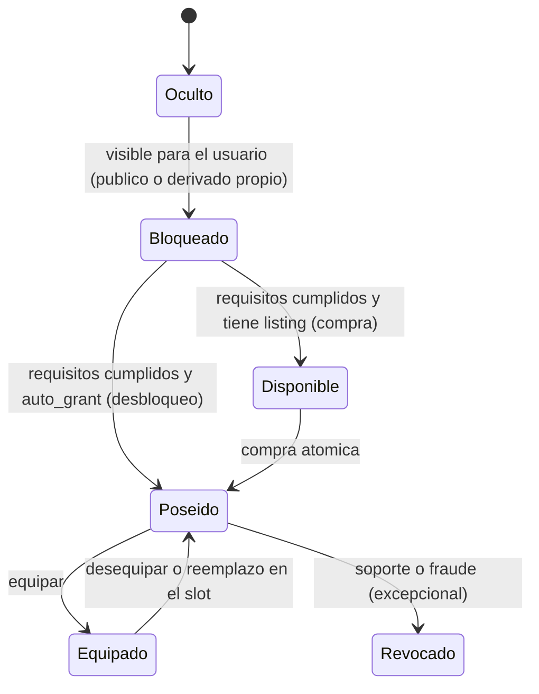
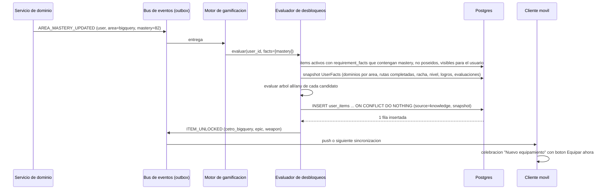
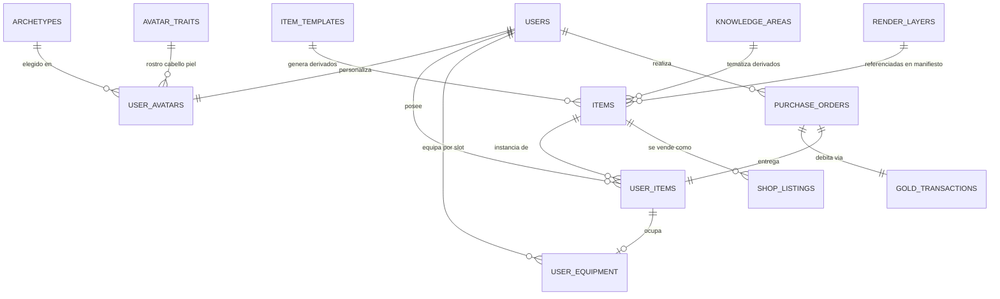

# 06c — Inventario, equipamiento, rarezas y tienda

> Auditoría previa a la implementación (sección 46 del brief), puntos **12 · Sistema de inventario** y **13 · Sistema de equipamiento**. Cubre además, porque son inseparables de ambos: el avatar modular (brief §4), los personajes/arquetipos (§5), las rarezas (§16), el equipamiento vinculado al conocimiento (§17) y la tienda básica del MVP (§41).
>
> Proyecto: **Atenea** (nombre de trabajo; el mundo se llama provisionalmente "Reino del Conocimiento"). Fecha: 2026-09-10. Estado: greenfield, sin código. Este documento **no implementa nada**: define el diseño, las decisiones y lo que el resto de la auditoría debe respetar.
>
> Convención: todo valor numérico de juego (precios, umbrales, porcentajes) es **valor inicial configurable** y vive en datos de backend, nunca en código de la app.

---

## 0. Resumen ejecutivo

| Tema | Decisión para el MVP |
|---|---|
| Avatar | "Muñeco de papel" 2D con **una sola silueta neutra** en pose única frontal 3/4, compuesto en el cliente por capas raster (WebP con alfa) sobre un lienzo maestro de 1024×1024. Sin animación esquelética; animación de conjunto (respiración, parpadeo). |
| Rasgos vs. equipo | Rostro, cabello (estilo + color), tono de piel y orejas son **rasgos gratuitos** del avatar. Todo lo demás son **ítems** que ocupan **8 slots activos** (cabeza, cuerpo, capa, guantes, botas, arma, secundario, accesorio) + 2 reservados (mascota, montura). |
| Arte | Pipeline híbrido: placeholders con licencia libre durante las primeras semanas → **pack propio comisionado a un ilustrador freelance** sobre plantilla y guía de estilo; IA generativa solo para concepts. Coste estimado del pack MVP: **USD 1.800–3.500**. |
| Arquetipos | 4 en el MVP (Acero, Arcano, Bosque, Muro), definidos por datos, **cero efecto educativo**; el usuario elige cuerpo, rostro, cabello y forma de tratamiento libremente. |
| Ítems | Catálogo global + instancias por usuario. 6 rarezas que afectan **solo** apariencia, exclusividad, requisitos y precio. Legendario y mítico **no se venden**; se ganan aprendiendo o con constancia. |
| Conocimiento → equipo | **Un solo motor de requisitos declarativos (JSON, AND/OR)** evaluado en servidor por eventos; sirve a la vez para desbloqueos, para gatear ítems de tienda y para explicar el progreso al usuario. |
| Rutas arbitrarias | Ítems **derivados de plantilla por área de conocimiento** (Capa del Estudiante/Maestro de <tema>, Insignia de la Perfección en <tema>) + 6 ítems curados para las áreas semilla del fundador (SQL, BigQuery, Data Engineering, IA). |
| Tienda | Catálogo **fijo** con 2–4 destacados configurables; vista previa en el avatar (también de ítems bloqueados); compra atómica contra el ledger de oro; sin dinero real; columnas preparadas para gemas pero desactivadas. |
| Catálogo inicial | **46 ítems**: 9 iniciales, 21 de tienda, 9 de conocimiento (6 fijos + 3 plantillas), 4 de racha, 3 de logro. |
| Fuera del MVP | Mascotas, monturas, conjuntos, tipos de cuerpo, tintes de ítems, rotación de tienda, venta/reventa, marketplace, cajas aleatorias, gemas. |

---

## 1. Alcance, principios y relación con otros documentos

### 1.1 Principios rectores (derivados del brief §14, §16, §44)

1. **Estudiar es el juego.** Todo ítem que represente conocimiento debe exigir al menos una condición de *desempeño* (ruta completada, dominio, evaluación). Nunca solo tiempo o repetición.
2. **Nunca pay-to-win, nunca pay-to-learn.** Los ítems son 100 % cosméticos y narrativos. No existe ningún campo de "estadística" en el modelo de ítem, a propósito: no hay dónde colgar una ventaja.
3. **El equipamiento cuenta una historia verificable.** Quien vea la "Espada del SQL" en un perfil (fase social) sabe que su portador completó una ruta de SQL. Por eso los ítems de conocimiento no se pueden comprar ni regalar.
4. **Modular por datos, no por código.** Nuevos slots, capas, arquetipos, ítems, requisitos y precios se agregan con filas y assets, sin release de la app (salvo nuevos *tipos* de condición).
5. **Un pequeño equipo debe poder producirlo.** Cada decisión de arte y arquitectura se evalúa por su coste de producción y mantenimiento, no solo por su atractivo.

### 1.2 Dependencias con otros documentos de la auditoría

A la fecha de redacción **no existe aún ningún otro documento** en `docs/auditoria/`. Por tanto:

| Dependencia | Qué necesito de allí | Qué hago mientras tanto |
|---|---|---|
| Economía / monedas (punto 11) | Ingreso diario de oro esperado, ledger, sumideros | Propongo bandas de precio marcadas **[PROVISIONAL-ECO]**; si ese documento fija otros valores, **prevalece él** y aquí solo cambian datos del catálogo. |
| Dominio (punto 16) | Definición de "tema dominado", escala 0–100 | Asumo **dominado = dominio ≥ 80 %** (coherente con el ejemplo del brief §17) **[PROVISIONAL-DOM]**. |
| Aprendizaje / rutas | Definición de "ruta completada"; entidad `KnowledgeArea` | Asumo ruta completada = todos los módulos completados y evaluación final aprobada; asumo que cada ruta pertenece a un área de conocimiento con dominio propio. |
| Modelo de datos (punto 6) | Convenciones (UUID, timestamps, soft delete) | Describo entidades y campos; el documento de datos las integra. |
| Eventos (punto 20) | Bus, outbox, nombres | Uso nombres `MAYUSCULA_SNAKE` y asumo patrón *transactional outbox*. |
| Logros (14) y rachas (10) | IDs de logros e hitos de racha | Referencio hitos 7/14/30/100 del brief y dos logros básicos que ese documento debe incluir. |
| UX/UI (17, 18) | Pantallas, tokens de color | Indico qué pantallas y estados necesita este sistema; los colores de rareza son placeholders. |

---

## 2. Avatar modular

### 2.1 Enfoque elegido: muñeco de papel 2D, pose única

El avatar es un **conjunto de imágenes transparentes apiladas** sobre un lienzo común. Cada rasgo o ítem aporta una o más imágenes que se dibujan en un orden fijo. Es la técnica más barata, la más predecible en móvil y la que permite a un ilustrador producir piezas compatibles sin conocer el código.

Decisiones que acotan el coste:

| Decisión | Alternativa descartada | Razón |
|---|---|---|
| **Una sola silueta corporal** neutra, proporción semi-chibi (cabeza ≈ 30 % de la altura) | 2–3 tipos de cuerpo | Cada tipo de cuerpo multiplica por N el arte de *todas* las prendas. La proporción semi-chibi lee bien a 120–240 dp, tolera menos detalle y es intrínsecamente neutra en género. |
| **Una sola pose** frontal 3/4 (idle) | Varias poses / animación por capas (Spine, Rive) | La animación esquelética exige rigging por ítem y herramientas de pago; el retorno en un producto de estudio es bajo. |
| **Animación de conjunto**: bob vertical sutil (loop ~2 s), parpadeo (frame alterno del rostro) | Animación por pieza | Da "vida" con dos frames extra por rostro y cero trabajo por ítem. |
| **Composición en cliente** (pila de imágenes posicionadas) | Render en servidor | Trivial en Flutter (`Stack` + `Positioned`) y en React Native; el servidor solo entrega un manifiesto. Render en servidor queda como extensión para compartir imágenes (fase social). |

### 2.2 Rasgos base vs. slots de equipamiento

El brief mezcla en §4 rasgos (rostro, cabello) con equipo (casco, capa). Los separo porque su ciclo de vida es distinto: los rasgos se eligen libremente y son gratuitos; los ítems se adquieren.

**Rasgos del avatar** (tabla `user_avatars`, cambiables en cualquier momento sin coste — *valor inicial configurable*):

| Rasgo | Valores MVP | Técnica |
|---|---|---|
| Tono de piel | 6 | Pre-renderizado (6 versiones del cuerpo base) para conservar el sombreado cálido. |
| Rostro | 4 (+1 frame de parpadeo cada uno) | Imagen por rostro. |
| Orejas | redondas / puntiagudas | Capa overlay opcional (habilita el arquetipo "élfico" sin arte adicional). |
| Estilo de cabello | 8 (cada uno con capa frontal y, si es largo, capa trasera) | Pintado en escala de grises, **tintado en runtime**. |
| Color de cabello | 10 | Paleta fija; tinte por `ColorFilter`/modulación. |
| Forma de tratamiento | masculina / femenina / neutra | Solo afecta textos (títulos, narrativa). |

**Slots de equipamiento** (enum `equipment_slot`, un ítem por slot):

| Slot | Clave | Ejemplos | MVP |
|---|---|---|---|
| Cabeza | `head` | casco, corona, capucha, sombrero | Sí |
| Cuerpo | `body` | túnica, jubón, armadura (torso + piernas en una pieza) | Sí |
| Capa | `cape` | capas, mantos | Sí |
| Guantes | `gloves` | guantes, guanteletes | Sí |
| Botas | `boots` | botas, sandalias | Sí |
| Arma principal | `weapon` | espada, bastón, arco, cetro | Sí |
| Secundario | `offhand` | escudo, tomo, farol | Sí |
| Accesorio | `accessory` | anteojos, morral, medallón, pluma | Sí (1 slot) |
| Mascota | `pet` | — | Reservado (fase 2+) |
| Montura | `mount` | — | Reservado (fase 3+) |

> "Cuerpo" une torso y piernas en una sola pieza a propósito: evita el problema de combinar pantalones con faldones/túnicas, que es donde los sistemas de capas suelen romperse visualmente.

### 2.3 Pila de capas (orden de dibujado)

El **slot** decide exclusividad (uno por slot); la **capa** decide dónde se dibuja. Un ítem puede aportar varias capas (una capa aporta `cape_back` y `cape_front`). Un accesorio elige su capa según su naturaleza. Esto desacopla el orden de dibujado de la categoría comercial.

| z | Capa (`layer_key`) | Origen habitual | Notas |
|---|---|---|---|
| 10 | `mount_back` | montura | reservado |
| 20 | `cape_back` | capa | tela que cae por la espalda |
| 25 | `aura_back` | ítems míticos | efecto opcional detrás del cuerpo |
| 30 | `hair_back` | rasgo cabello (estilos largos) | va **sobre** la capa y **bajo** el cuerpo |
| 40 | `body_base` | rasgo tono de piel | cuerpo completo, incluye cabeza |
| 45 | `ears` | rasgo orejas | solo variante puntiaguda |
| 50 | `boots` | botas | una túnica larga las cubre de forma natural |
| 60 | `outfit` | cuerpo | torso + piernas |
| 65 | `accessory_body` | accesorio | morral, cinturón, medallón |
| 70 | `gloves` | guantes | sobre las mangas |
| 80 | `offhand` | secundario | brazo izquierdo, delante del torso |
| 90 | `face` | rasgo rostro | ojos, cejas, boca (+ frame parpadeo) |
| 100 | `hair_front` | rasgo cabello | flequillo, volumen superior |
| 110 | `head` | cabeza | casco/corona/capucha |
| 115 | `accessory_face` | accesorio | anteojos, antifaz, pendientes |
| 130 | `weapon` | arma | mano derecha, delante de todo el cuerpo |
| 140 | `cape_front` | capa | broche, cuello, hombreras |
| 150 | `pet` | mascota | reservado |
| 160 | `mount_front` | montura | reservado |

Los saltos de 5–10 dejan espacio para capas futuras sin renumerar. La tabla de capas vive en datos (`render_layers`) y el cliente la lee del manifiesto: agregar una capa no requiere release.

### 2.4 Anclajes y sistema de coordenadas

Como la pose es única, **todas las imágenes comparten el mismo lienzo maestro de 1024×1024 px** (el avatar ocupa ~900 px de alto, centrado). Un asset se exporta recortado a su caja envolvente y el manifiesto guarda su desplazamiento `(x, y, w, h)` en coordenadas del lienzo. El cliente escala el lienzo completo al tamaño de destino y coloca cada recorte. No hay matemáticas de anclaje por pieza: el "anclaje" es el lienzo.

Además, el manifiesto del **cuerpo base** publica puntos nombrados para funciones futuras (no usados por el MVP, pero baratos de definir hoy):

```json
{
  "canvas": { "w": 1024, "h": 1024 },
  "anchors": {
    "head_top":   { "x": 512, "y": 96 },
    "hand_right": { "x": 700, "y": 640 },
    "hand_left":  { "x": 324, "y": 640 },
    "back_center":{ "x": 512, "y": 420 },
    "feet":       { "x": 512, "y": 980 },
    "pet_spot":   { "x": 860, "y": 900 }
  }
}
```

Usos previstos: posicionar mascotas, partículas de desbloqueo, globos de diálogo del Game Master, y ajustar la montura (que desplaza al avatar hacia arriba).

### 2.5 Reglas de compatibilidad entre piezas

Con una única silueta, toda prenda es geométricamente compatible. Las incompatibilidades restantes son visuales y se declaran en el manifiesto del ítem:

| Regla | Campo | Comportamiento |
|---|---|---|
| Casco cerrado oculta el cabello | `suppresses_layers: ["hair_front","hair_back"]` | El cliente omite esas capas mientras el ítem está equipado. Coronas, capuchas abiertas y sombreros no lo declaran (o solo `hair_front` parcial mediante un asset de cabello "aplastado" — fuera del MVP). |
| Arma a dos manos vs. secundario | `two_handed: true` en el arma | El secundario sigue equipado en datos pero no se dibuja; la UI lo muestra "guardado". En el MVP el arco y el báculo se dibujan a una mano en la pose, así que ningún ítem inicial activa la regla; existe para no rediseñar después. |
| Capa + cabello largo | orden z fijo | Cabello (30) sobre capa (20): correcto sin reglas. |
| Túnica larga + botas | orden z fijo | La túnica (60) cubre las botas (50): correcto sin reglas. |
| Accesorio facial + casco | orden z fijo | Anteojos (115) sobre casco (110): aceptable en estilo chibi; si un casco concreto lo rompe, declara `suppresses_layers: ["accessory_face"]`. |

Regla general: **la incompatibilidad se resuelve ocultando, nunca impidiendo equipar**. El usuario no debe pelear con el sistema.

### 2.6 Formato de assets, resolución y paleta

| Criterio | SVG en runtime | Raster (PNG/WebP) desde fuente vectorial | Elección |
|---|---|---|---|
| Nitidez en distintas densidades | Excelente | Buena exportando a 1024 y escalando hacia abajo | Raster suficiente |
| Rendimiento con 12–16 capas | Riesgo: parseo y rasterizado en CPU en cada rebuild; filtros/degradados limitados | Excelente: texturas en GPU, caché de imágenes | **Raster** |
| Tinte en runtime | Fácil (fill) | Fácil con `ColorFilter` sobre arte en gris | Empate |
| Peso | Muy bajo | Bajo con WebP sin pérdida + recorte | Empate |
| Libertad del ilustrador | Solo vector plano | Cualquier herramienta (Procreate, Krita, Photoshop, Illustrator) | **Raster** |
| Composición server-side futura | Requiere renderer SVG | Trivial (Pillow, sharp) | **Raster** |

**Decisión:** fuente en el formato nativo del ilustrador (vector preferido, pero no obligatorio); **entrega en WebP sin pérdida con canal alfa**, lienzo 1024×1024, recortado con offsets. PNG se conserva como exportación intermedia de referencia. Miniaturas: el cliente reduce el mismo asset (un ítem recortado funciona como icono); se permite un `icon` dedicado cuando el recorte no lee bien (capas, botas).

**Tamaño esperado:** un ítem recortado pesa 20–80 KB; el pack completo del MVP (base + 46 ítems) ronda **3–6 MB**. Se empaquetan con la app el cuerpo base, rostros, cabellos e ítems iniciales (~1,5 MB); el resto se descarga bajo demanda desde el bucket/CDN y se cachea (ver 2.8).

**Paleta maestra** (parte de la guía de estilo): ~48 colores — 6 tonos de piel, 10 de cabello, 3 rampas de metal (acero, cobre, oro), 2 de cuero, 6 familias de tela con 3 valores cada una, 6 acentos de rareza. Restringir la paleta es lo que hace que 46 piezas de un mismo ilustrador (o de dos) se vean de un mismo mundo.

### 2.7 Manifiesto de assets (JSON)

Cada ítem y cada rasgo publica un manifiesto; el catálogo lo guarda en `items.render_manifest` (JSONB). Ejemplo de una capa con dos capas de dibujo:

```json
{
  "item_id": "capa_plumas_nocturnas",
  "asset_version": 3,
  "canvas": { "w": 1024, "h": 1024 },
  "layers": [
    { "layer": "cape_back",  "src": "items/capa_plumas_nocturnas/back.v3.webp",  "x": 212, "y": 262, "w": 600, "h": 640 },
    { "layer": "cape_front", "src": "items/capa_plumas_nocturnas/front.v3.webp", "x": 380, "y": 300, "w": 264, "h": 120 }
  ],
  "suppresses_layers": [],
  "two_handed": false,
  "tint": null,
  "icon": "items/capa_plumas_nocturnas/icon.v3.webp"
}
```

Ejemplo de rasgo cabello tintable:

```json
{
  "trait_id": "hair_ondulado_largo",
  "layers": [
    { "layer": "hair_back",  "src": "traits/hair/ondulado_largo/back.v1.webp",  "x": 300, "y": 120, "w": 424, "h": 520 },
    { "layer": "hair_front", "src": "traits/hair/ondulado_largo/front.v1.webp", "x": 330, "y": 80,  "w": 364, "h": 260 }
  ],
  "tint": { "channel": "hair_color", "mode": "modulate" }
}
```

El endpoint `GET /avatar/manifest` devuelve la **lista ya resuelta de capas a dibujar** (rasgos + equipo, con supresiones aplicadas y ordenada por z): el cliente no necesita conocer reglas, solo pintar.

### 2.8 Entrega y caché

- Assets públicos, inmutables por versión (`.v3.webp`); un cambio de arte incrementa `asset_version` y la URL, lo que invalida caché sin lógica adicional.
- Almacenamiento en un bucket de objetos con CDN delante (Railway ofrece buckets; Cloudflare R2 es la alternativa si se busca egress gratuito — decisión para el documento de infraestructura).
- El cliente cachea en disco por URL; el manifiesto del avatar incluye una `etag` para no recomponer si nada cambió.

### 2.9 Pipeline de producción de arte: comparativa y decisión

| Opción | Coste MVP (USD) | Plazo | Consistencia | Riesgos |
|---|---|---|---|---|
| A. Pack prediseñado de "paper doll" (marketplaces de assets, licencias CC0/comerciales) | 0–200 | Días | Media–baja: raramente coincide con nuestros slots/pose; a menudo pixel art | Aspecto genérico; identidad débil; algunos packs prohíben uso en apps comerciales |
| B. Ilustrador freelance sobre plantilla y guía de estilo propia | 1.800–3.500 | 6–8 semanas (paralelo al desarrollo) | Alta | Dependencia de una persona; requiere brief y revisión rigurosos |
| C. IA generativa con control de estilo y pose (referencia de estilo, control de silueta), limpieza manual | 50–300 en herramientas + muchas horas del equipo | Semanas | Baja–media entre 46 piezas | Alineación al lienzo y recortes limpios exigen manos de artista; ambigüedad de licencia comercial según herramienta; riesgo reputacional en un producto "premium" |
| D. El propio equipo en vector plano | 0 | Lento | Media | Sin diseñador, el resultado rara vez alcanza el estándar "videojuego móvil moderno" del brief §30 |

**Decisión (híbrida, por fases):**

1. **Semanas 1–4:** placeholders de la opción A (o formas simples propias) para construir y probar la composición, el inventario y la tienda. No se invierte en arte hasta que el flujo funciona.
2. **Desde la semana 2, en paralelo:** comisionar la opción B. Entregables al ilustrador: (i) plantilla del lienzo con la silueta base, guías de capas y anclajes; (ii) guía de estilo (2.10); (iii) lista priorizada del catálogo (sección 8) con rareza, porque la rareza dicta el nivel de detalle.
3. **IA generativa solo para** moodboard, exploración de concepts y variantes rápidas que el ilustrador refina. **No** como asset final del MVP. Se reevalúa en fase 2 si aparece un flujo con licencia clara y control de pose fiable.
4. **Validador automático de assets** (script de ~100 líneas en el repo de contenido): comprueba lienzo, alfa, nombre de archivo, peso máximo, que el recorte cae dentro del lienzo, y genera el manifiesto. Es lo que permite que el ilustrador entregue sin tocar código.

```mermaid
flowchart LR
    A["Guia de estilo + plantilla del lienzo"] --> B["Concepts y moodboard (IA generativa permitida aqui)"]
    B --> C["Ilustracion final sobre plantilla (freelance)"]
    C --> D["Exportacion WebP alfa 1024, recorte con offsets"]
    D --> E["Validador automatico: lienzo, alfa, peso, nombres"]
    E --> F["Manifiesto JSON + subida a bucket/CDN versionado"]
    F --> G["Alta del item en catalogo por datos (sin release)"]
```



### 2.10 Guía de estilo mínima (para el brief del ilustrador)

- Estética: medieval-fantástica, **moderna, limpia, colorida y amigable** (brief §30). Formas redondeadas, sin gore, sin realismo.
- Proporción semi-chibi: cabeza ≈ 30 % de la altura; manos y armas ligeramente sobredimensionadas para leer en pantallas pequeñas.
- Sombreado plano: base + 1 sombra + 1 luz, luz desde arriba-izquierda. Contorno oscuro de grosor constante (~6 px a 1024).
- Paleta maestra obligatoria; los acentos de rareza (2.6) se usan **solo** en detalles (gemas, runas, bordados), nunca como color dominante, para que el ítem siga combinando con el resto.
- Nivel de detalle creciente con la rareza: común (1 material, sin ornamentos) → mítico (2–3 materiales, ornamentos, brillo sugerido). El detalle es el "premio" visual.
- Identidad propia: sin referencias a búhos, marcas ni personajes de otras plataformas; los emblemas del mundo se basan en el símbolo propio del Reino (a definir en UX: propongo una llave y un libro abierto como sello del Reino).

### 2.11 Coste estimado del pack MVP

| Bloque | Piezas | Precio unitario aprox. (USD) | Subtotal |
|---|---|---|---|
| Plantilla + guía de estilo + revisión | 1 | 200–400 | 200–400 |
| Cuerpo base (6 tonos) + orejas | 7 | incluido en bloque | 250–450 |
| Rostros (4) + parpadeo (4) | 8 | 20–35 | 160–280 |
| Cabellos (8, con capa trasera cuando aplica) | 8 | 25–45 | 200–360 |
| Ítems común / poco común | 26 | 20–35 | 520–910 |
| Ítems raros | 8 | 35–55 | 280–440 |
| Ítems épicos / legendarios / míticos | 12 | 55–90 | 660–1.080 |
| **Total** | | | **≈ 2.300–3.900**; con negociación por pack, **1.800–3.500** |

Plazo realista: 6–8 semanas con un ilustrador a tiempo parcial; el desarrollo no espera al arte gracias a los placeholders. Este presupuesto es la **mayor partida no técnica del MVP** y debe aprobarse explícitamente (ver Decisiones pendientes).

---

## 3. Personajes / arquetipos

### 3.1 Qué es un arquetipo

Un arquetipo es un **preset narrativo y visual**: una "Orden" a la que el personaje pertenece, un título (en la forma de tratamiento elegida), un color de acento para la UI del perfil y un **kit inicial** de ítems comunes. Nada más. El motor de gamificación **no lee** `archetype_id`; esa restricción se documenta y se prueba (un test de arquitectura que falle si el módulo de gamificación importa el de arquetipos es barato y evita la tentación futura).

El usuario elige, en este orden y de forma independiente: tono de piel → rostro → orejas → cabello y color → arquetipo → forma de tratamiento → nombre. **No existe la noción de género del personaje**; existe la forma gramatical con la que el juego se dirige al usuario.

### 3.2 Arquetipos del MVP y extensión por datos

| Clave | Orden (identidad propia) | Título m / f / neutro (epiceno) | Kit inicial | MVP |
|---|---|---|---|---|
| `acero` | Orden del Acero | Guerrero / Guerrera / Combatiente | Jubón de recluta, Espada de entrenamiento, Botas de camino | Sí |
| `arcano` | Círculo del Arcano | Mago / Maga / Arcanista | Túnica de iniciación, Bastón de aprendiz, Botas de camino | Sí |
| `bosque` | Hermandad del Bosque | Arquero / Arquera / Vigía del Bosque | Chaleco de explorador, Arco de fresno, Botas de camino | Sí |
| `muro` | Vigilia del Muro | Guardián / Guardiana / Centinela | Sobreveste de vigía, Escudo de madera, Espada de entrenamiento, Botas de camino | Sí |
| `estandarte` | Compañía del Estandarte | Caballero / Caballera / Paladín | — | Fase 2 |
| `corona` | Casa de la Corona | Príncipe / Princesa / Realeza | — | Fase 2 |
| `runas` | Cofradía de las Runas | Hechicero / Hechicera / Rúnico | — | Fase 2 |
| `bosque_antiguo` | Linaje del Bosque Antiguo | Elfo / Elfa / Del Linaje Antiguo | — | Fase 2 (usa orejas puntiagudas, ya disponibles como rasgo) |

Donde el español no ofrece un epiceno natural, la forma neutra usa un título poético o de pertenencia ("Vigía del Bosque", "Del Linaje Antiguo"). Todas las cadenas son datos revisables.

Esquema de datos de un arquetipo (tabla `archetypes`, o JSON de configuración versionado):

```json
{
  "id": "arcano",
  "order_name": "Círculo del Arcano",
  "titles": { "m": "Mago", "f": "Maga", "n": "Arcanista" },
  "description": "Quienes creen que todo poder empieza por entender.",
  "accent_color": "#6C4AB6",
  "starter_kit": ["tunica_iniciacion", "baston_aprendiz", "botas_camino"],
  "is_active": true,
  "sort_order": 2
}
```

Cambiar de arquetipo después de la creación: permitido, **gratis en el MVP** (valor inicial configurable; en fase 2 puede costar oro como sumidero suave). No se retiran los ítems del kit anterior: son cosméticos y ya "fueron ganados" por empezar.

---

## 4. Modelo de ítem

### 4.1 Catálogo vs. instancia

- **`items`** (catálogo): la definición. Global (visible a todos) o **derivada** (generada por plantilla para un usuario y un área de conocimiento; solo la ve su dueño).
- **`user_items`** (instancia): la posesión. Único por `(user_id, item_id)`: los cosméticos no se acumulan.
- **`user_equipment`**: qué instancia ocupa cada slot. Clave primaria `(user_id, slot)`, lo que hace imposible equipar dos ítems en el mismo slot por construcción.

### 4.2 Campos del ítem (catálogo)

| Campo | Tipo | Notas |
|---|---|---|
| `id` | slug estable | `espada_del_sql`; nunca cambia; los IDs de derivados se generan (`tpl_capa_maestro__<area_id>`) |
| `name`, `description` | texto | Español en el MVP; `i18n` JSONB reservado |
| `slot` | enum | ver 2.2 |
| `rarity` | enum | `common, uncommon, rare, epic, legendary, mythic` |
| `source_type` | enum | `starter, shop, achievement, streak, knowledge, event, mission` (etiqueta de origen principal, ver 4.4) |
| `requirements` | JSONB nullable | árbol declarativo (sección 5). Aplica tanto a desbloqueos automáticos como a gatear la compra |
| `requirement_facts` | text[] | familias de hechos que referencia (`mastery, path, streak, level, achievement, assessment`) para filtrar candidatos por evento |
| `auto_grant` | bool | `true`: al cumplirse requisitos se otorga solo (conocimiento, racha, logro). `false`: los requisitos solo habilitan la compra |
| `render_manifest` | JSONB | ver 2.7 |
| `template_id`, `owner_user_id`, `knowledge_area_id` | FK nullable | solo en ítems derivados |
| `set_id` | FK nullable | reservado para conjuntos (fase 2) |
| `visibility` | enum | `public` (todos lo ven aunque esté bloqueado), `owner` (derivados), `hidden` (eventos sorpresa) |
| `is_active`, `available_from`, `available_to` | bool, timestamps | retirar o ventana de evento sin borrar |
| `tier_required` | enum nullable | reservado para `premium` (brief §36); **prohibido** en ítems `knowledge` |
| `created_at`, `updated_at`, `catalog_version` | | |

El **precio no vive en `items`** sino en `shop_listings` (7.1): un mismo ítem puede tener precio distinto en otra moneda o en un evento, y los ítems no vendibles simplemente no tienen listing.

### 4.3 Campos de la instancia (`user_items`)

| Campo | Notas |
|---|---|
| `id`, `user_id`, `item_id` | único `(user_id, item_id)` |
| `acquired_at` | fecha de adquisición (brief §15) |
| `source_type` | mismo enum que el catálogo, pero **el origen real** de esta instancia (un ítem de tienda podría regalarse en un evento) |
| `source_ref` | JSONB: `{ "order_id" }`, `{ "achievement_id" }`, `{ "streak_days": 30 }`, `{ "trigger_event_id", "requirements_snapshot" }` |
| `is_new` | insignia "nuevo" en inventario hasta que se abre el detalle |
| `revoked_at`, `revoke_reason` | soft-revocación (fraude, reversión de compra por soporte); nunca borrado físico |

### 4.4 Rarezas y qué implica cada una

| Rareza | Color (placeholder UX) | Apariencia del ítem | Tratamiento en UI | Exclusividad / cómo se obtiene | Banda de precio en tienda [PROVISIONAL-ECO] |
|---|---|---|---|---|---|
| Común `common` | gris | 1 material, sin ornamento | marco plano | Kits iniciales, tienda, logros de onboarding | 150–300 🪙 |
| Poco común `uncommon` | verde | 1–2 materiales, un detalle | marco con borde | Tienda, racha 7/14, logros básicos | 400–700 🪙 |
| Raro `rare` | azul | 2 materiales, ornamento | marco + destello al abrir | Tienda (algunos con nivel mínimo), ruta completada, racha 14 | 900–1.500 🪙 |
| Épico `epic` | púrpura | 2–3 materiales, ornamentos, emblema | marco degradado + partículas al equipar | Tienda con nivel mínimo, dominio ≥ 80 %, evaluación 100 %, racha 30 | 2.000–3.500 🪙 |
| Legendario `legendary` | ámbar | detalle máximo, brillo sugerido en el arte | marco animado (shimmer) | **No se vende en el MVP.** Ruta completada en áreas curadas, 3 áreas dominadas, racha 100 | — (fase 2: excepcional en eventos, 5.000–8.000 🪙) |
| Mítico `mythic` | carmesí | como legendario + capa `aura_back` | marco animado + aura en el avatar | **Nunca se vende.** Hitos mayores de conocimiento (5 áreas dominadas) | — |

Lo que la rareza **no** hace, por diseño: no otorga XP, oro, protección de racha, ni ningún efecto sobre el aprendizaje. La rareza es exclusivamente un indicador de cuánto esfuerzo o constancia representa el ítem.

Distribución objetivo del catálogo (guía para futuras ampliaciones): común 30 % · poco común 25 % · raro 20 % · épico 13 % · legendario 8 % · mítico 4 %. El catálogo inicial (sección 8) se aproxima a esa curva.

### 4.5 Etiquetas de origen

| Etiqueta | Qué comunica | Ejemplo de texto en la ficha |
|---|---|---|
| `starter` | vino con el arquetipo | "Equipo de la Orden del Acero" |
| `shop` | comprado con oro ganado estudiando | "Adquirido en el Mercado del Reino" |
| `achievement` | logro concreto | "Otorgado por: Primera lección" |
| `streak` | constancia | "Forjado con 30 días de racha" |
| `knowledge` | desempeño demostrado | "Requisito: dominio de SQL ≥ 80 %" |
| `event` | ventana temporal | "Evento: Semana del Conocimiento 2027" |
| `mission` | recompensa de misión especial | "Recompensa: Domina un tema" |

La etiqueta se muestra en la ficha del ítem y en el perfil, y es lo que convierte el inventario en un **currículum visual**.

### 4.6 Estados desde la perspectiva del usuario

El estado "desbloqueado/bloqueado" del brief §15 es una **vista calculada**, no una columna:



Un ítem `Disponible` puede además estar "sin saldo suficiente": la UI lo muestra con el precio y cuánto falta ("Te faltan 340 🪙 ≈ 3 lecciones"), lo que reconecta la compra con estudiar.

---

## 5. Equipamiento vinculado al conocimiento

Es la característica diferenciadora del producto (brief §17). Un usuario debe poder mirar su avatar y leer en él lo que sabe.

### 5.1 Principios de diseño del motor

1. **Declarativo**: los requisitos son datos JSON, no código. Agregar un ítem con condiciones nuevas no requiere release; agregar un *tipo* de condición nuevo, sí (y es raro).
2. **Un solo evaluador** para tres usos: otorgar automáticamente (`auto_grant`), gatear compras, y **explicar** al usuario cuánto le falta. Si hubiera dos implementaciones, tarde o temprano dirían cosas distintas.
3. **Servidor autoritativo**: el cliente nunca evalúa requisitos ni decide desbloqueos; solo muestra el resultado.
4. **Idempotente y reevaluable**: otorgar es `INSERT ... ON CONFLICT DO NOTHING`; un job nocturno puede reevaluar todo sin efectos secundarios (recupera eventos perdidos).
5. **Regla de integridad educativa**: un ítem con `source_type = knowledge` debe contener al menos una condición de desempeño (`path_completed`, `mastery_gte`, `areas_mastered_gte`, `assessment_score_gte`). El validador de catálogo rechaza lo contrario. Tiempo de estudio y número de lecciones **no** bastan.

### 5.2 DSL de requisitos

```
Requirement  := Condition
              | { "all": [Requirement, ...] }        -- AND
              | { "any": [Requirement, ...] }        -- OR
Profundidad máxima: 2 (all de any, o any de all). Suficiente y legible.

Condition (campo "type"):
  path_completed        { area: AreaRef }                     -- alguna ruta del área completada
  mastery_gte           { area: AreaRef, value: 0..100 }
  areas_mastered_gte    { count: n, threshold?: 0..100 }      -- threshold por defecto = config "mastered_threshold" (80)
  assessment_score_gte  { area?: AreaRef, value: 0..100, count?: n=1 }
  streak_gte            { days: n, kind: "current" | "best" }
  level_gte             { level: n }
  achievement_unlocked  { achievement_id }
  lessons_completed_gte { count: n, area?: AreaRef }          -- solo para ítems no-knowledge (onboarding)
  within_window         { from, to }                          -- eventos

AreaRef := { "canonical": "sql" }    -- área del vocabulario canónico
         | { "self": true }           -- en plantillas: el área del ítem derivado
```

Cada `type` mapea a una **familia de hechos** (`requirement_facts`) para filtrar qué ítems reevaluar ante cada evento: `path`, `mastery`, `assessment`, `streak`, `level`, `achievement`, `lessons`, `time`.

### 5.3 Ejemplos JSON (los cinco del brief más dos del catálogo)

Espada del SQL — completar ruta SQL:

```json
{ "type": "path_completed", "area": { "canonical": "sql" } }
```

Cetro de BigQuery — dominio ≥ 80 %:

```json
{ "type": "mastery_gte", "area": { "canonical": "bigquery" }, "value": 80 }
```

Corona del Maestro — dominar 5 conocimientos:

```json
{ "type": "areas_mastered_gte", "count": 5 }
```

Báculo de la Maestría en IA — ruta avanzada de IA (interpretado como ruta completada **y** dominio alto):

```json
{
  "all": [
    { "type": "path_completed", "area": { "canonical": "inteligencia_artificial" } },
    { "type": "mastery_gte",    "area": { "canonical": "inteligencia_artificial" }, "value": 85 }
  ]
}
```

Plantilla "Insignia de la Perfección en <tema>" — un 100 % en cualquier evaluación del área (o dos 95 %, para no castigar un descuido):

```json
{
  "any": [
    { "type": "assessment_score_gte", "area": { "self": true }, "value": 100 },
    { "type": "assessment_score_gte", "area": { "self": true }, "value": 95, "count": 2 }
  ]
}
```

Armadura de placas pulidas (tienda, gateada por nivel; `auto_grant: false`):

```json
{ "type": "level_gte", "level": 5 }
```

Corona de Fuego Eterno — racha 100 (se usa la **mejor** racha: perder la racha después no debe quitar el mérito):

```json
{ "type": "streak_gte", "days": 100, "kind": "best" }
```

### 5.4 Evaluación por eventos

Los desbloqueos se calculan como reacción a eventos del motor de gamificación (brief §34). Tabla de disparo:

| Evento consumido | Familia de hechos reevaluada | Emisor esperado |
|---|---|---|
| `PATH_COMPLETED` | `path` | servicio de aprendizaje |
| `AREA_MASTERY_UPDATED` | `mastery` (y `areas_mastered`) | servicio de dominio |
| `ASSESSMENT_COMPLETED` | `assessment` | servicio de aprendizaje |
| `STREAK_UPDATED` | `streak` | motor de rachas |
| `LEVEL_UP` | `level` | motor de XP/niveles |
| `ACHIEVEMENT_UNLOCKED` | `achievement` | motor de logros |
| `LESSON_COMPLETED` | `lessons` | servicio de aprendizaje |
| `PATH_CREATED` / `KNOWLEDGE_AREA_CREATED` | — (materializa ítems derivados, 5.7) | servicio de aprendizaje |



Notas de implementación (sin código):

- **`UserFacts`** es una lectura, no una tabla nueva: se arma con consultas a las tablas de dominio, rutas, rachas, niveles y logros. Si el volumen lo pide (no en el MVP), se materializa como vista o tabla de lectura.
- El número de ítems con requisitos es pequeño (decenas, luego cientos); evaluar todos los candidatos por evento cuesta milisegundos. El filtro por `requirement_facts` (índice GIN) es una optimización, no una necesidad.
- La evaluación corre **dentro del mismo consumidor** que procesa el evento de gamificación (mismo worker), después de XP/oro/misiones/logros, para que `ACHIEVEMENT_UNLOCKED` y `LEVEL_UP` producidos en ese mismo ciclo puedan a su vez desbloquear ítems (encadenamiento a través del bus, no en memoria).
- **Job de reconciliación** diario: reevalúa todos los usuarios activos en los últimos 7 días. Corrige eventos perdidos y permite agregar ítems al catálogo con efecto retroactivo (quien ya dominaba SQL recibe la Espada al día siguiente, con notificación).

### 5.5 Explicabilidad y progreso ("motivación visible")

El mismo evaluador, en modo `explain`, devuelve por condición `{ met, current, target, label, cta }`. La UI del inventario muestra ítems bloqueados con barras de progreso y una acción directa:

| Condición | Plantilla de texto | CTA |
|---|---|---|
| `mastery_gte` | "Dominio de {area}: {current} / {target} %" | "Continuar {area}" → siguiente lección recomendada |
| `path_completed` | "Completa una ruta de {area} ({modules_done}/{modules_total} módulos)" o, si no hay ruta: "Aún no tienes una ruta de {area}" | "Ir a la ruta" / "Crear ruta de {area}" |
| `areas_mastered_gte` | "Áreas dominadas: {current} / {target}" | "Ver mis conocimientos" |
| `assessment_score_gte` | "Consigue {value} % en una evaluación de {area}" | "Ir a la evaluación del módulo" |
| `streak_gte` | "Racha: {current} / {target} días" | "Completa tu objetivo de hoy" |
| `level_gte` | "Nivel {current} / {target}" | "Continuar aventura" |

Esto convierte el inventario en un **segundo mapa de objetivos**, alineado con el principio "Estoy progresando" (brief §48), y cierra el ciclo del brief §2: ver el ítem → estudiar → desbloquear → equipar.

### 5.6 Ítems temáticos para rutas creadas por el usuario

El problema: el catálogo fijo conoce "SQL", pero el usuario puede subir un manual de apicultura. Si solo hay ítems para áreas curadas, la característica principal falla justo en el caso de uso principal ("convierte **cualquier** conocimiento en una aventura").

| Opción | Cobertura | Coste de arte | Especificidad percibida | Riesgos |
|---|---|---|---|---|
| A. Plantillas de ítem **por categoría** de conocimiento (Datos, Programación, Nube, IA, Negocios, Idiomas, Ciencias, Humanidades, Arte, Salud, Derecho, Otro) con nombre generado "<pieza> de <tema>" | Total | 12 categorías × N piezas (crece rápido) | Alta: la pieza "es" de esa disciplina | Clasificación errónea de la IA; mucho arte antes de validar el producto |
| B. Ítems **genéricos "del Maestro de <tema>"**: una familia de piezas, tintadas por categoría, con nombre y lore generados | Total | 3–4 piezas | Media: el nombre lleva la especificidad, la forma no | Menos "wow" visual; muchos usuarios lucen la misma silueta |
| C. Catálogo **fijo por área** solo para áreas curadas | Solo áreas conocidas | 1 pieza por área | Máxima | No escala a material arbitrario; contradice la visión |

**Decisión para el MVP: B + C.**

- **B — tres plantillas derivadas**, una por hito de aprendizaje, tintadas por categoría (el manifiesto usa `tint.channel = "category_color"`, misma técnica que el cabello) y con un emblema por categoría opcional en fase 2:
  - *Capa del Estudiante de <tema>* (raro) — ruta del área completada.
  - *Capa del Maestro de <tema>* (épico) — dominio del área ≥ 80 %.
  - *Insignia de la Perfección en <tema>* (épico, accesorio) — evaluación al 100 %.
- **C — seis ítems curados** con arte propio para las áreas semilla del fundador (que además serán las rutas de ejemplo del onboarding): Espada del SQL, Cetro de BigQuery, Escudo del Data Engineer, Báculo de la Maestría en IA, Corona del Maestro, Tomo del Erudito. Referencian áreas del **vocabulario canónico**; si la IA clasifica la ruta del usuario a `sql`, ese usuario también aspira a la Espada.
- **A se pospone a fase 2**, cuando la analítica diga qué categorías concentran usuarios: entonces se dibujan piezas específicas para las 3–4 categorías dominantes y las plantillas B pasan a segundo plano.

Por qué no A ahora: exigiría 24–36 piezas adicionales antes de saber si alguien quiere aprender apicultura con espadas; y la diferencia entre "Capa del Maestro de Apicultura" (tintada a la categoría Ciencias) y una "Colmena-yelmo" específica no cambia la hipótesis que el MVP valida (brief §42).

**Generación del nombre.** No requiere una llamada adicional al modelo: la generación de la ruta (documento de IA) ya debe devolver, en su salida estructurada, `knowledge_area.short_name` (≤ 18 caracteres, sin emojis, capitalización de título), `knowledge_area.canonical_slug` (o `null`) y `category`. El nombre del ítem es una plantilla: `"Capa del Maestro de {short_name}"`. Si `short_name` no pasa la lista de moderación (palabras ofensivas) o supera el largo, se usa el fallback `"Capa del Maestro"` + emblema de categoría y se marca para revisión. El lore es una de 3–4 descripciones por plantilla (datos); en fase 2 puede generarlo un modelo económico (≈ 300 tokens de salida, del orden de USD 0,002 por ítem con claude-haiku-4-5).

### 5.7 Plantillas y materialización de ítems derivados

- Tabla **`item_templates`**: `id`, `name_template`, `description_variants[]`, `slot`, `rarity`, `requirements` (con `AreaRef.self`), `render_manifest` (con `tint.channel = "category_color"`), `scope = per_knowledge_area`, `is_active`.
- Al recibirse `KNOWLEDGE_AREA_CREATED` para un usuario (o `PATH_CREATED` si la ruta crea un área nueva), se **materializan** filas en `items` con `template_id`, `owner_user_id`, `knowledge_area_id`, `visibility = owner`, únicas por `(template_id, owner_user_id, knowledge_area_id)`. Aparecen de inmediato en el inventario como bloqueadas: el usuario ve, antes de la primera lección, **qué ganará** por dominar ese material.
- Dos rutas del mismo usuario sobre la misma área **comparten** los ítems derivados (el dominio es por área, no por ruta). Si el usuario renombra el área, se actualiza `name` de los derivados.
- Se elige materializar (y no calcular al vuelo) porque simplifica listados, joins y analítica; el coste son unas pocas filas por área.

---

## 6. Inventario

### 6.1 Vista principal

- **Cabecera**: avatar grande (la composición completa), nombre, título del arquetipo, nivel; tocar un slot en el avatar filtra la cuadrícula por ese slot (interacción directa "visto → tocado").
- **Pestañas por slot** (Todo · Cabeza · Cuerpo · Capa · Guantes · Botas · Arma · Secundario · Accesorio). Mascota y Montura no aparecen hasta que existan ítems (no se enseña un slot vacío que nunca se llena).
- **Filtros**: rareza (multi), estado (Poseídos · Bloqueados · Nuevos), origen. **Orden** por defecto: equipado → nuevos → rareza descendente → nombre.
- **Tarjeta**: icono con marco de rareza, nombre, etiqueta de origen, insignia "Nuevo", candado con progreso resumido si está bloqueado ("63/80 %").

### 6.2 Ficha del ítem

Nombre, rareza, descripción/lore, origen (con fecha de adquisición si se posee), **vista previa en el avatar** (toggle "Probar"), y una de tres acciones:

- Poseído: **Equipar / Desequipar**.
- Bloqueado: barras de progreso por condición (5.5) y CTA que lleva a la acción de aprendizaje correspondiente.
- Disponible en tienda: precio y **Comprar** (misma ficha que en la tienda: una sola pantalla, dos contextos).

### 6.3 Equipar y desequipar

- `PUT /avatar/equipment` acepta un **mapa de slots** `{ "weapon": "<user_item_id>", "cape": null }` y es atómico: permite cambiar un atuendo completo en una llamada (base para "atuendos guardados" en fase 2).
- Validaciones en servidor: la instancia pertenece al usuario, no está revocada, su `slot` coincide con la clave; se aplican reglas de compatibilidad (2.5) y se devuelve el manifiesto resuelto.
- El cliente aplica actualización optimista y revierte si el servidor rechaza.
- Emite `ITEM_EQUIPPED` / `ITEM_UNEQUIPPED` (analítica y misiones del tipo "Equipa tu primer objeto", útil en onboarding).

### 6.4 Ítems bloqueados visibles

Reglas de visibilidad:

| Tipo de ítem | ¿Se muestra bloqueado? | Motivo |
|---|---|---|
| Racha, logro, nivel | Sí, a todos | Metas universales |
| Conocimiento curado (`canonical`) | Sí, a todos, con CTA "Crear ruta de {area}" si el usuario no tiene ruta en el área | Descubrimiento: el ítem vende la ruta |
| Derivados | Solo al dueño | Son suyos por definición |
| Tienda con requisito | Sí, con precio y requisito | Aspiración |
| `hidden` (evento sorpresa) | No | Sorpresa |

Orden dentro de "Bloqueados": primero los relacionados con áreas activas del usuario, luego los más cercanos a cumplirse (mayor `current/target`).

### 6.5 Duplicados

En el MVP **todas las fuentes son deterministas** (no hay cajas aleatorias, por diseño y por prudencia con las políticas de tiendas de apps sobre mecánicas tipo azar). Un duplicado solo puede surgir por un error de configuración (dos logros que otorgan el mismo ítem) y se maneja así: el otorgamiento es idempotente, se registra `ITEM_GRANT_SKIPPED_DUPLICATE` para auditoría y no se compensa. Si en el futuro aparecen recompensas aleatorias, la regla será compensar en oro un porcentaje del precio de referencia del ítem (valor inicial configurable, p. ej. 25 %).

### 6.6 Conjuntos

Fuera del MVP (sección 11). Queda el gancho `items.set_id` y la idea de que completar un conjunto **no** otorga bonificaciones de juego, solo un título y un efecto visual.

---

## 7. Tienda básica del MVP

### 7.1 Catálogo y listados

Tabla **`shop_listings`**: `id`, `item_id`, `currency` (`gold` | `gems`, solo `gold` activo), `price`, `available_from`, `available_to`, `is_featured`, `featured_order`, `is_active`. Los precios son datos: cambiarlos no requiere release.

**Rotación: fija en el MVP.** Todo el catálogo comprable está visible siempre, con una franja de 2–4 **destacados** que el equipo cambia a mano semanalmente (datos). Razones: (i) un catálogo pequeño rotado se siente vacío; (ii) la rotación temporal introduce FOMO, que choca con el tono "amigable" y con la métrica de éxito (constancia de estudio, no de compra); (iii) los ítems de racha y conocimiento ya aportan la sensación de novedad. La rotación ("Mercado ambulante") queda para fase 2, cuando el catálogo supere ~80 ítems.

### 7.2 Precios por rareza [PROVISIONAL-ECO]

A falta del documento de economía, propongo precios a partir de este supuesto de ingreso: **un usuario activo gana ≈ 80–120 🪙 al día** (2–3 lecciones a 20 🪙 + misión diaria + bonificaciones de racha; brief §13 y §21). Objetivo de "tiempo hasta compra":

| Rareza | Precio inicial MVP | Días de estudio activo ≈ | Comentario |
|---|---|---|---|
| Común | 200 🪙 | 2 | Primera compra en la primera semana: cierra el ciclo pronto |
| Poco común | 500 🪙 | 5 | Una compra semanal |
| Raro | 1.200 🪙 | 12 | Compra quincenal; algunos exigen nivel ≥ 5 |
| Épico | 2.500 🪙 | 25 | Compra mensual; exigen nivel ≥ 10 |
| Legendario | no se vende | — | fase 2: 5.000–8.000 🪙 solo en eventos |
| Mítico | no se vende | — | nunca |

Suma del catálogo comprable inicial: 5×200 + 8×500 + 5×1.200 + 3×2.500 = **18.500 🪙** ≈ 6 meses de un usuario activo. Suficiente sumidero para el MVP; fase 2 amplía el catálogo antes de que los usuarios más constantes lo agoten. El documento de economía debe validar el ingreso diario y puede reescalar estas bandas manteniendo las proporciones (1 : 2,5 : 6 : 12,5).

### 7.3 Vista previa

La ficha del ítem (misma del inventario) ofrece **"Probar"**: el cliente compone el avatar con el ítem sobrepuesto en su slot, sin llamada al servidor (el manifiesto del ítem es público). Se permite probar también ítems **bloqueados** y de conocimiento: "así te verías con la Espada del SQL" es la mejor publicidad de la ruta de SQL. La vista previa emite `ITEM_PREVIEWED` (analítica) para medir qué ítems motivan.

### 7.4 Compra atómica con ledger

```mermaid
sequenceDiagram
    participant C as Cliente
    participant API as API Tienda
    participant DB as Postgres
    participant B as Outbox / Bus
    C->>API: POST /shop/purchase {listing_id, expected_price, idempotency_key}
    API->>DB: BEGIN; bloquear billetera del usuario (SELECT ... FOR UPDATE)
    API->>DB: validar: listing activo y en ventana, precio == expected_price, requisitos cumplidos, no poseido, saldo suficiente
    alt alguna validacion falla
        API->>DB: ROLLBACK
        API-->>C: 409 {code: INSUFFICIENT_GOLD | ALREADY_OWNED | REQUIREMENTS_NOT_MET | PRICE_CHANGED | UNAVAILABLE}
    else todo valido
        API->>DB: INSERT gold_transactions (amount=-precio, type=PURCHASE, ref=order_id)
        API->>DB: INSERT purchase_orders (status=completed)
        API->>DB: INSERT user_items (source=shop, source_ref={order_id})
        API->>DB: INSERT outbox (ITEM_PURCHASED); COMMIT
        API-->>C: 200 {user_item, new_balance, manifest}
        B->>B: publica ITEM_PURCHASED (analitica, misiones, logros)
    end
```

Reglas:

- El cliente **nunca envía el precio como verdad**; `expected_price` solo sirve para devolver `PRICE_CHANGED` si el catálogo cambió entre pantalla y compra.
- `idempotency_key` única por `(user_id, key)`: un reintento devuelve la misma orden, no una segunda compra.
- El saldo es autoritativo en el ledger del documento de economía (`gold_transactions`); la billetera cacheada (si existe) se actualiza en la misma transacción. Restricción: el saldo nunca es negativo.
- **Sin reembolsos ni reventa en el MVP.** Un botón "Deshacer" de 60 segundos es barato y evita tickets de soporte por toques accidentales: se recomienda como *nice-to-have* (valor inicial configurable) y se implementa como reversión de la orden (transacción inversa en el ledger + revocación de la instancia), no como venta.
- Rate limit por usuario en el endpoint (p. ej. 10 compras/minuto) y registro de auditoría de toda orden.

### 7.5 Sin dinero real; puerta para gemas

Ni compras dentro de la app ni pasarela de pago en el MVP (brief §14, §41). Preparación deliberada y barata:

- `shop_listings.currency` y `gold_transactions.currency` (o ledger separado por moneda, según decida economía) admiten `gems` desde el día 1; feature flag `gems_enabled = false`.
- Regla de producto a fijar hoy: los ítems `knowledge`, `streak` y `achievement` **jamás** tendrán listing en gemas; las gemas solo podrán comprar cosméticos `shop`/`event` o servicios (protección de racha, si el documento de rachas lo aprueba).
- `items.tier_required = premium` (brief §36) queda reservado y prohibido para ítems de conocimiento.

---

## 8. Catálogo inicial del MVP (46 ítems)

Leyenda de rareza: C común · PC poco común · R raro · E épico · L legendario · M mítico. Precios y umbrales: **valores iniciales configurables** [PROVISIONAL-ECO / PROVISIONAL-DOM].

### 8.1 Kits iniciales (`starter`, 9 ítems, C)

| id | Nombre | Slot | Kit |
|---|---|---|---|
| `jubon_recluta` | Jubón de recluta | body | Acero |
| `espada_entrenamiento` | Espada de entrenamiento | weapon | Acero, Muro |
| `tunica_iniciacion` | Túnica de iniciación | body | Arcano |
| `baston_aprendiz` | Bastón de aprendiz | weapon | Arcano |
| `chaleco_explorador` | Chaleco de explorador | body | Bosque |
| `arco_fresno` | Arco de fresno | weapon | Bosque |
| `sobreveste_vigia` | Sobreveste de vigía | body | Muro |
| `escudo_madera` | Escudo de madera | offhand | Muro |
| `botas_camino` | Botas de camino | boots | todos |

### 8.2 Tienda (`shop`, 21 ítems)

| id | Nombre | Slot | Rareza | Precio | Requisito |
|---|---|---|---|---|---|
| `capucha_viajero` | Capucha de viajero | head | C | 200 | — |
| `guantes_cuero` | Guantes de cuero | gloves | C | 200 | — |
| `capa_lana_gris` | Capa de lana gris | cape | C | 200 | — |
| `morral_estudiante` | Morral de estudiante | accessory (body) | C | 200 | — |
| `sandalias_erudito` | Sandalias del erudito | boots | C | 200 | — |
| `yelmo_guardia` | Yelmo de la guardia | head | PC | 500 | — |
| `cota_escamas_cobre` | Cota de escamas de cobre | body | PC | 500 | — |
| `capa_carmesi` | Capa carmesí | cape | PC | 500 | — |
| `guanteletes_acero` | Guanteletes de acero | gloves | PC | 500 | — |
| `botas_reforzadas` | Botas reforzadas | boots | PC | 500 | — |
| `espada_corta_acero` | Espada corta de acero | weapon | PC | 500 | — |
| `escudo_roble` | Escudo redondo de roble | offhand | PC | 500 | — |
| `anteojos_erudito` | Anteojos de erudito | accessory (face) | PC | 500 | — |
| `sombrero_estrellado` | Sombrero estrellado | head | R | 1.200 | — |
| `armadura_placas` | Armadura de placas pulidas | body | R | 1.200 | nivel ≥ 5 |
| `capa_plumas_nocturnas` | Capa de plumas nocturnas | cape | R | 1.200 | — |
| `arco_bosque_antiguo` | Arco largo del Bosque Antiguo | weapon | R | 1.200 | nivel ≥ 5 |
| `escudo_blason_reino` | Escudo con blasón del Reino | offhand | R | 1.200 | — |
| `corona_laurel_plata` | Corona de laurel plateada | head | E | 2.500 | nivel ≥ 10 |
| `tunica_constelaciones` | Túnica de las constelaciones | body | E | 2.500 | nivel ≥ 10 |
| `espada_obsidiana` | Espada de obsidiana | weapon | E | 2.500 | nivel ≥ 10 |

### 8.3 Conocimiento (`knowledge`, 6 fijos + 3 plantillas)

| id | Nombre | Slot | Rareza | Requisito (DSL resumido) |
|---|---|---|---|---|
| `espada_del_sql` | Espada del SQL | weapon | L | `path_completed(sql)` |
| `cetro_bigquery` | Cetro de BigQuery | weapon | E | `mastery_gte(bigquery, 80)` |
| `escudo_data_engineer` | Escudo del Data Engineer | offhand | L | `path_completed(data_engineering)` |
| `baculo_maestria_ia` | Báculo de la Maestría en IA | weapon | L | `path_completed(ia) AND mastery_gte(ia, 85)` |
| `tomo_erudito` | Tomo del Erudito | offhand | L | `areas_mastered_gte(3)` |
| `corona_del_maestro` | Corona del Maestro | head | M | `areas_mastered_gte(5)` |
| `tpl_capa_estudiante` | Capa del Estudiante de {tema} | cape | R | `path_completed(self)` |
| `tpl_capa_maestro` | Capa del Maestro de {tema} | cape | E | `mastery_gte(self, 80)` |
| `tpl_insignia_perfeccion` | Insignia de la Perfección en {tema} | accessory (body) | E | `assessment_score_gte(self, 100) OR assessment_score_gte(self, 95, count=2)` |

> Las áreas canónicas `sql`, `bigquery`, `data_engineering`, `inteligencia_artificial` deben existir en el vocabulario canónico del documento de IA/aprendizaje. La Corona del Maestro y el Tomo del Erudito son globales (no dependen de área) y son los dos ítems que premian **amplitud** de conocimiento, no solo profundidad.

### 8.4 Racha (`streak`, 4 ítems)

| id | Nombre | Slot | Rareza | Requisito |
|---|---|---|---|---|
| `antorcha_constancia` | Antorcha de la Constancia | accessory (body) | PC | `streak_gte(7, best)` |
| `botas_caminante` | Botas del Caminante Incansable | boots | R | `streak_gte(14, best)` |
| `capa_llamas_persistentes` | Capa de las Llamas Persistentes | cape | E | `streak_gte(30, best)` |
| `corona_fuego_eterno` | Corona de Fuego Eterno | head | L | `streak_gte(100, best)` |

Se usa `best` (mejor racha): la constancia demostrada no se pierde por un día perdido. Coordinar con el documento de rachas para que sus hitos 7/14/30/100 emitan `STREAK_UPDATED` con `best_streak`.

### 8.5 Logro (`achievement`, 3 ítems)

| id | Nombre | Slot | Rareza | Requisito |
|---|---|---|---|---|
| `pluma_primer_paso` | Pluma del Primer Paso | accessory (face) | C | `achievement_unlocked(first_lesson_completed)` |
| `escudo_primer_desafio` | Escudo del Primer Desafío | offhand | PC | `achievement_unlocked(first_assessment_passed)` |
| `yelmo_veterano` | Yelmo del Veterano | head | R | `level_gte(10)` |

La **Pluma del Primer Paso** es la pieza más importante del catálogo: garantiza que el criterio de éxito 9–10 del brief §47 ("desbloquea un objeto, equipa el objeto") ocurra en la **primera sesión**, tras la primera lección. El documento de logros debe incluir `first_lesson_completed` y `first_assessment_passed`.

### 8.6 Resumen por rareza y origen

| | C | PC | R | E | L | M | Total |
|---|---|---|---|---|---|---|---|
| starter | 9 | | | | | | 9 |
| shop | 5 | 8 | 5 | 3 | | | 21 |
| knowledge | | | 1 | 3 | 4 | 1 | 9 |
| streak | | 1 | 1 | 1 | 1 | | 4 |
| achievement | 1 | 1 | 1 | | | | 3 |
| **Total** | 15 | 10 | 8 | 7 | 5 | 1 | **46** |

Cobertura por slot: head 8 · body 8 · cape 7 · gloves 2 · boots 5 · weapon 10 · offhand 6 · accessory 5. Guantes es el slot más pobre a propósito: es el menos visible; fase 2 lo completa.

---

## 9. Eventos y modelo de datos

### 9.1 Eventos emitidos por este sistema

| Evento | Cuándo | Consumidores previstos |
|---|---|---|
| `ITEM_UNLOCKED` | otorgamiento automático (conocimiento, racha, logro, evento) | notificaciones/celebración en cliente, analítica, misiones ("Desbloquea un objeto"), logros ("Coleccionista") |
| `ITEM_PURCHASED` | compra completada | analítica, misiones, logros |
| `ITEM_EQUIPPED` / `ITEM_UNEQUIPPED` | cambio de slot | analítica, misiones de onboarding |
| `AVATAR_TRAITS_UPDATED` | cambio de rostro/cabello/piel/arquetipo | analítica |
| `ITEM_PREVIEWED` | "Probar" en ficha | analítica (qué ítems motivan) |
| `ITEM_GRANT_SKIPPED_DUPLICATE` | intento de otorgar algo ya poseído | auditoría |
| `DERIVED_ITEMS_MATERIALIZED` | ítems de plantilla creados para un área | analítica, depuración |

### 9.2 Eventos consumidos

`PATH_COMPLETED`, `AREA_MASTERY_UPDATED`, `ASSESSMENT_COMPLETED`, `STREAK_UPDATED`, `LEVEL_UP`, `ACHIEVEMENT_UNLOCKED`, `LESSON_COMPLETED`, `KNOWLEDGE_AREA_CREATED` / `PATH_CREATED` (ver 5.4). Los payloads de estos eventos deben incluir, como mínimo, `user_id` y el hecho cambiado (`area_id` + `mastery`, `best_streak`, `level`, `achievement_id`, `score`), para que el evaluador filtre sin consultas extra.

### 9.3 Payloads de ejemplo

```json
{
  "event": "ITEM_UNLOCKED",
  "event_id": "8f0c…",
  "occurred_at": "2026-09-10T14:03:22Z",
  "user_id": "u_…",
  "payload": {
    "user_item_id": "ui_…",
    "item_id": "cetro_bigquery",
    "slot": "weapon",
    "rarity": "epic",
    "source_type": "knowledge",
    "source_ref": { "trigger_event_id": "ev_…", "knowledge_area_id": "ka_…" },
    "requirements_snapshot": { "type": "mastery_gte", "area": { "canonical": "bigquery" }, "value": 80, "observed": 82 }
  }
}
```

```json
{
  "event": "ITEM_PURCHASED",
  "user_id": "u_…",
  "payload": {
    "order_id": "po_…",
    "listing_id": "sl_…",
    "item_id": "capa_plumas_nocturnas",
    "rarity": "rare",
    "currency": "gold",
    "price": 1200,
    "balance_after": 340,
    "gold_transaction_id": "gt_…"
  }
}
```

```json
{
  "event": "ITEM_EQUIPPED",
  "user_id": "u_…",
  "payload": { "slot": "cape", "user_item_id": "ui_…", "item_id": "capa_plumas_nocturnas", "replaced_user_item_id": "ui_…" }
}
```

### 9.4 Entidades y relaciones



Esquemas resumidos (el documento de modelo de datos define tipos exactos, UUID y auditoría):

**`items`** — `id (slug PK)`, `name`, `description`, `i18n jsonb`, `slot`, `rarity`, `source_type`, `requirements jsonb`, `requirement_facts text[] (GIN)`, `auto_grant bool`, `render_manifest jsonb`, `template_id FK?`, `owner_user_id FK?`, `knowledge_area_id FK?`, `set_id FK?`, `visibility`, `tier_required?`, `is_active`, `available_from?`, `available_to?`, `catalog_version`, `created_at`, `updated_at`. Índices: `(owner_user_id)`, `(is_active, visibility)`, único `(template_id, owner_user_id, knowledge_area_id)`.

**`item_templates`** — `id`, `name_template`, `description_variants jsonb`, `slot`, `rarity`, `requirements jsonb`, `render_manifest jsonb`, `scope`, `is_active`.

**`user_items`** — `id PK`, `user_id FK`, `item_id FK`, `acquired_at`, `source_type`, `source_ref jsonb`, `is_new`, `revoked_at?`, `revoke_reason?`. Único `(user_id, item_id)`.

**`user_equipment`** — `user_id FK`, `slot`, `user_item_id FK`, `equipped_at`. PK `(user_id, slot)`.

**`user_avatars`** — `user_id PK`, `archetype_id FK`, `skin_tone`, `face_id`, `ear_style`, `hair_style_id`, `hair_color`, `address_form (m|f|n)`, `display_name`, `updated_at`.

**`archetypes`** — ver 3.2. **`avatar_traits`** — `id`, `kind (face|hair|skin|ears)`, `render_manifest jsonb`, `is_active`, `unlock_item_id FK?` (gancho para peinados desbloqueables en fase 2). **`render_layers`** — `layer_key PK`, `z int`, `label`.

**`shop_listings`** — `id`, `item_id FK`, `currency`, `price`, `available_from?`, `available_to?`, `is_featured`, `featured_order?`, `is_active`. **`purchase_orders`** — `id`, `user_id`, `listing_id`, `item_id`, `currency`, `price`, `status (completed|reversed)`, `idempotency_key`, `gold_transaction_id FK`, `created_at`, `reversed_at?`. Único `(user_id, idempotency_key)`.

**Externas que este sistema necesita** (dueños: otros documentos): `gold_transactions` (economía: `type = PURCHASE|REVERSAL`, `ref_id`), `knowledge_areas` (aprendizaje: `short_name`, `canonical_slug`, `category`), `user_area_progress` (dominio: `mastery 0..100`), `user_paths` (estado `completed`), `streaks` (`current`, `best`), `user_levels`, `user_achievements`, `assessment_attempts` (`score`, `area_id`).

### 9.5 API mínima del MVP

| Método y ruta | Uso |
|---|---|
| `GET /avatar` | rasgos + arquetipo + equipo + manifiesto resuelto |
| `PUT /avatar/traits` | cambiar rasgos/arquetipo/forma de tratamiento |
| `PUT /avatar/equipment` | mapa slot → user_item_id o null (atómico) |
| `GET /inventory?slot=&rarity=&state=` | poseídos + bloqueados visibles, con progreso de requisitos |
| `GET /items/{id}` | ficha, manifiesto, progreso de requisitos (`explain`) |
| `GET /shop` | listados activos, destacados, saldo actual |
| `POST /shop/purchase` | compra atómica (7.4) |
| `POST /shop/orders/{id}/reverse` | deshacer en ventana corta (opcional) |
| `GET /catalog/manifest` | versiones de assets para precarga y caché |

---

## 10. Seguridad y antiabuso específicos

- **Servidor autoritativo** en precios, saldo, requisitos y desbloqueos; el cliente solo pinta.
- **Idempotencia** en compras y otorgamientos; **transacción única** para ledger + orden + instancia; saldo con restricción de no negatividad.
- **Sin transferencia entre usuarios** en el MVP: elimina de raíz el lavado de oro, las cuentas granja y el "pay-to-win" indirecto vía marketplace.
- **Validador de catálogo** en CI del repositorio de contenido: rareza coherente con el origen (mítico nunca en tienda), ítems `knowledge` con condición de desempeño, manifiestos con capas válidas, slugs únicos.
- **Moderación** de `short_name` para nombres de derivados (lista de palabras + longitud), con fallback seguro.
- **Rate limiting** en compra y equipamiento; auditoría de órdenes y revocaciones.
- **Assets** públicos e inmutables, sin datos personales; URLs versionadas para evitar cachés envenenadas.

---

## 11. Qué queda fuera del MVP y por qué

| Fuera | Por qué ahora no | Gancho dejado |
|---|---|---|
| **Mascotas** | Arte adicional con "personalidad" (idle propio), nueva capa, y no hay aún una mecánica de aprendizaje que las justifique; riesgo de convertirse en el "juego dentro del juego" que el brief §44 quiere evitar | slot `pet`, capa 150, anclaje `pet_spot` |
| **Monturas** | Desplazan al avatar (pose distinta), capas delante/detrás, arte caro; sin vínculo educativo claro | slot `mount`, capas 10/160 |
| **Conjuntos** | Requieren ≥ 3 piezas coherentes por conjunto; con 46 ítems el catálogo no lo soporta; el bono debe ser solo visual/título | `items.set_id` |
| **Tipos de cuerpo** | Multiplican el arte por N | silueta única documentada |
| **Tintes de ítems** | Técnica ya disponible (tinte de cabello y plantillas), pero exige decidir qué se puede teñir y cobrar por ello: fase 2 | `render_manifest.tint` |
| **Rotación de tienda / eventos temporales** | FOMO contrario al tono; catálogo pequeño | `available_from/to`, `source_type = event`, `within_window` |
| **Venta, reventa, regalos, marketplace** | Excluido por el brief §42; abre abuso económico | ninguno a propósito |
| **Cajas aleatorias / gacha** | Riesgo de percepción de azar y de políticas de tiendas; desconecta recompensa de aprendizaje | regla de compensación de duplicados |
| **Gemas y dinero real** | Brief §14; primero validar la hipótesis | `currency`, `tier_required`, flag |
| **Atuendos guardados / múltiples loadouts** | Comodidad, no valor de validación | `PUT /avatar/equipment` ya es atómico por mapa |
| **Render de avatar en servidor / compartir imagen** | Solo útil en fase social | manifiesto resuelto + assets raster |
| **Evolución de ítems** (una pieza que cambia con el dominio) | Idea potente para fase 2: reemplaza pares Estudiante→Maestro por una pieza que "sube de rango" | ítems derivados por área ya separan hitos |
| **Peinados como ítems desbloqueables** | Los rasgos son gratuitos en el MVP para no frenar la creación de personaje | `avatar_traits.unlock_item_id` |

---

## 12. Riesgos específicos de este sistema

| Riesgo | Impacto | Mitigación |
|---|---|---|
| El arte llega tarde o inconsistente | La promesa "videojuego moderno" se rompe en la primera impresión | Placeholders desde la semana 1; plantilla y guía de estilo antes de comisionar; hitos de entrega por rareza (primero comunes y kits) |
| La IA clasifica mal el área o genera un `short_name` ridículo | Ítems derivados absurdos ("Capa del Maestro de Documento1") | Salida estructurada con reglas; moderación y fallback; el usuario puede renombrar el área |
| Umbral de dominio mal calibrado | O nadie desbloquea nada, o todos lo hacen en dos días | Umbral en datos; el job de reconciliación permite ajustar retroactivamente; medir tiempo hasta primer ítem de conocimiento |
| Precios desalineados con el ingreso real | Inflación (todo comprado en una semana) o frustración | Bandas proporcionales; documento de economía valida el ingreso; precios en datos |
| El inventario se percibe como "tienda de skins" y no como currículum | Se pierde la diferenciación | Etiquetas de origen visibles siempre; ítems de conocimiento en la cabecera del perfil; legendario/mítico no vendibles |
| Composición pesada en dispositivos modestos | Jank en la pantalla más vista | ≤ 16 capas, WebP, caché de imágenes, precomposición de la miniatura del avatar para listas |
| Requisitos que refieren áreas canónicas que nadie estudia | Ítems curados inalcanzables | Rutas semilla de onboarding en esas áreas; CTA "Crear ruta de {area}" desde el ítem |

---

## 13. Decisiones pendientes y preguntas abiertas

1. **Aprobación del presupuesto de arte** (USD 1.800–3.500) y elección del ilustrador. Sin esto, el MVP sale con placeholders. ¿Quién produce la plantilla del lienzo: el ilustrador o el equipo?
2. **Ingreso diario de oro** (supuesto: 80–120 🪙). El documento de economía debe confirmarlo; las bandas 200/500/1.200/2.500 se reescalan proporcionalmente si cambia.
3. **Umbral de "dominado"** (supuesto: ≥ 80 %) y definición exacta de "ruta completada". Los fija el documento de dominio/aprendizaje; aquí solo se parametrizan.
4. **Entidad `KnowledgeArea` por usuario con vocabulario canónico**: ¿cómo mapea la IA una ruta arbitraria a `canonical_slug`? ¿Qué pasa si dos rutas del mismo usuario caen en áreas distintas pero equivalentes ("SQL" y "Bases de datos SQL")? Propuesta: el usuario puede fusionar áreas; los ítems derivados se reasignan.
5. **Corona del Maestro**: ¿5 áreas dominadas de cualquier tipo o de categorías distintas? Propongo "cualquier tipo" en el MVP (más alcanzable), revisar con analítica.
6. **Deshacer compra (60 s)**: incluir o no en el MVP. Propuesta: sí, es barato y evita soporte.
7. **Cambio de arquetipo**: gratis (propuesta MVP) o con coste en oro (fase 2 como sumidero).
8. **Arco y báculo a una mano en la pose** vs. regla `two_handed` activa desde el inicio. Propuesta: una mano en el MVP; la regla existe pero ningún ítem la usa.
9. **Nombres de eventos** (`AREA_MASTERY_UPDATED`, `STREAK_UPDATED`, `KNOWLEDGE_AREA_CREATED`) y patrón outbox: deben confirmarse en el documento de eventos; aquí se asumen.
10. **Logros requeridos** `first_lesson_completed` y `first_assessment_passed`: el documento de logros debe incluirlos con esos IDs o indicar los suyos.
11. **Bucket/CDN**: Railway buckets vs. Cloudflare R2 para assets públicos. Decisión del documento de infraestructura; este sistema solo requiere URLs públicas versionadas.
12. **Colores de rareza y símbolo del Reino** (llave + libro abierto propuestos): los define el documento de UX/UI; aquí son placeholders.
13. **Visibilidad de ítems curados a usuarios sin ruta en esa área**: propuesta "sí, con CTA de crear ruta". Validar que no sature el inventario cuando el catálogo curado crezca (regla: máximo N ítems curados bloqueados visibles, ordenados por afinidad).
14. **Vista previa de ítems bloqueados**: propuesta "sí". Confirmar que no desincentiva (riesgo bajo; medir con `ITEM_PREVIEWED`).
15. **Framework móvil** (Flutter vs. React Native): la composición por capas es viable en ambos; si se elige RN, verificar rendimiento de `ColorFilter`/tintes (en Flutter es nativo).

---

## 14. Supuestos

- Equipo de 1–3 personas, fundador con perfil data/BI, **sin diseñador dedicado** al inicio; hosting en Railway; Postgres como base de datos principal; Anthropic Claude como proveedor de IA (la generación de rutas devuelve salida estructurada con `short_name`, `canonical_slug` y `category` del área).
- El motor de gamificación es **orientado a eventos** con patrón *transactional outbox* y un worker consumidor; el evaluador de desbloqueos corre en ese worker.
- Existe un **ledger de oro** (`gold_transactions`) definido por el documento de economía, con tipo de transacción y referencia externa; el saldo es derivable del ledger.
- Cada ruta pertenece a un **área de conocimiento** con dominio propio 0–100; "dominado" = ≥ 80 %; "ruta completada" = módulos completados y evaluación final aprobada (≥ 70 %, brief §23).
- Ingreso de oro de un usuario activo ≈ 80–120 🪙/día.
- No hay dinero real, gemas, transferencias entre usuarios ni azar en el MVP.
- Los hitos de racha del brief (7/14/30/100) se emiten como eventos con la mejor racha histórica.
- Precios de arte freelance basados en tarifas habituales de ilustración 2D de props y prendas en estilo plano; **estimación a verificar** con cotizaciones reales.
- El vocabulario canónico inicial incluye al menos `sql`, `bigquery`, `data_engineering`, `inteligencia_artificial`, `gcp`, `python`, `business_intelligence`, coherente con los territorios de ejemplo del brief §3.
- Mobile first; la composición del avatar se hace en el cliente con imágenes raster; no se requiere render en servidor en el MVP.
