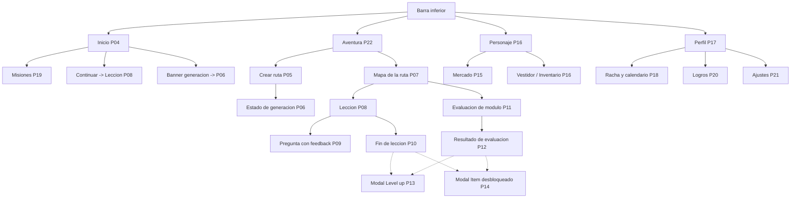
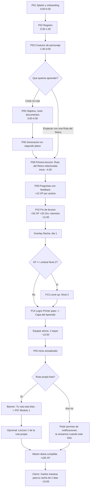
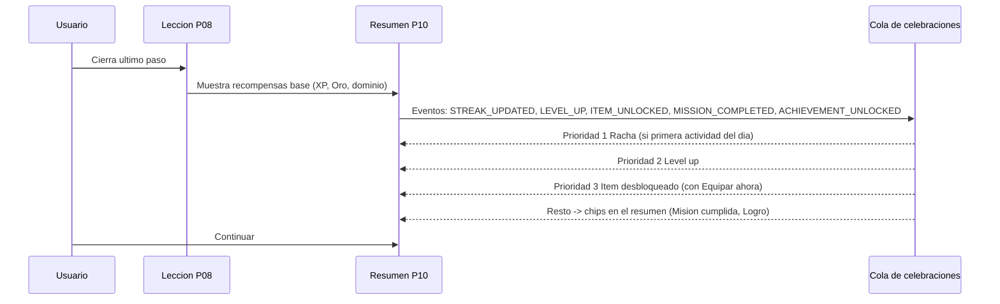
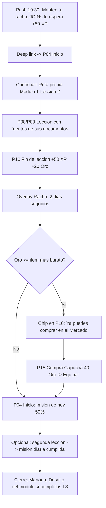
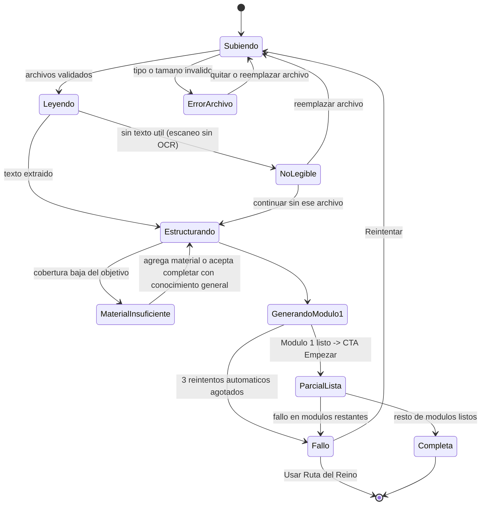

# 07 — Experiencia UX/UI, pantallas del MVP y flujo completo del usuario

> Auditoría previa a la implementación (sección 46 del brief, puntos 17, 18 y 19).
> Proyecto: Atenea (nombre de trabajo provisional; el mundo se llama provisionalmente "Reino del Conocimiento").
> Fecha: 2026-09-10. Estado: greenfield, sin código. Este documento no implementa nada: define la experiencia que el resto de la arquitectura debe servir.
> Fuente de verdad: `docs/00-brief-producto.md`. Al momento de redactar, no existía ningún otro documento en `docs/auditoria/`; las dependencias hacia otros documentos se listan en la sección 11.

---

## 0. Resumen ejecutivo

Decisiones principales de este documento:

1. **La pantalla de Inicio responde "¿qué hago ahora?" con un único botón primario ("Continuar")** visible sin scroll, encima de todo lo demás. Todo lo demás en Inicio es contexto (racha, misión de hoy, conocimientos, estadísticas).
2. **Tema oscuro por defecto ("Noche del Reino") con tema claro completo ("Día del Reino") desde el MVP**, gobernados por tokens semánticos. El oscuro define identidad de videojuego y hace brillar oro/XP/rarezas; el claro existe por accesibilidad y lectura prolongada, y es barato si se usan tokens desde el primer día.
3. **Navegación con barra inferior de 4 destinos: Inicio, Aventura, Personaje, Perfil.** Tienda y equipamiento viven dentro de Personaje; misiones dentro de Inicio; racha, logros y ajustes dentro de Perfil. Lecciones y evaluaciones son flujos inmersivos a pantalla completa sin barra.
4. **22 pantallas en el MVP** (P01–P22), cada una con objetivo, elementos, acciones, estados y wireframe textual.
5. **Del registro a la primera lección en menos de 5 minutos (p50)** usando una "Ruta del Reino" (ruta semilla curada y pregenerada) mientras la ruta propia se genera en segundo plano. La generación es **progresiva**: el primer módulo se libera antes que el resto.
6. **Los 12 pasos del criterio de éxito del brief ocurren dentro del día 1** en un flujo de 12 a 15 minutos; el ítem "Capa del Aprendiz" se desbloquea al terminar la primera lección (logro "Primer paso") y se equipa con un solo toque desde el modal de desbloqueo.
7. **Cola de celebraciones**: como máximo 3 overlays encadenados (fin de lección → racha → level up / ítem); el resto se colapsa en chips dentro del resumen. Nunca dos celebraciones simultáneas.
8. **Cero castigo**: las respuestas incorrectas no restan XP; reprobar una evaluación se comunica como "aún no" y abre un repaso.
9. Fuera del MVP: mapa del mundo explorable, animaciones complejas del avatar, mascotas/monturas, personalización profunda, temporizadores, sonido/narrativa elaborada.

---

## 1. Principios de experiencia

Los principios derivan directamente del brief; cada uno tiene una traducción concreta a interfaz y una forma de medirse.

| # | Principio | Origen (brief) | Traducción a la interfaz | Cómo se mide |
|---|---|---|---|---|
| 1 | **"¿Qué hago ahora?" en 1 segundo** | §28 | Inicio muestra un solo CTA primario ("Continuar"), en el primer tercio de la pantalla, con la actividad concreta y su recompensa (+50 XP). Nada compite con él en color ni tamaño. | Tiempo desde abrir la app hasta iniciar actividad (p50 < 10 s en usuarios recurrentes). |
| 2 | **Sensación constante de progreso** | §48 | Toda pantalla muestra al menos un indicador de progreso (barra de XP, dominio, racha, nodo del mapa). Toda acción de aprendizaje tiene una consecuencia visible en < 1 s. | % de sesiones que terminan con al menos una recompensa mostrada. |
| 3 | **Sesiones de 5–15 minutos** | §21 | Lecciones divididas en pasos de una pantalla; se puede abandonar y retomar en el mismo paso; ninguna unidad de trabajo obligatoria supera 2 minutos. | Duración de lección p50 entre 5 y 12 min; tasa de abandono a mitad de lección < 15 %. |
| 4 | **Feedback inmediato** | §29 | Respuesta visual < 100 ms al tocar; resultado de pregunta < 300 ms; recompensa animada < 1 s tras completar. | Latencia percibida instrumentada por evento. |
| 5 | **Videojuego móvil moderno, no app educativa** | §30 | El avatar aparece en Inicio y Personaje; el lenguaje es de aventura (Ruta, Módulo, Desafío, Territorio); las recompensas se celebran; la tipografía y color son de juego, no de LMS. | Encuesta cualitativa en pruebas de usuario ("¿esto parece un juego o una app de estudio?"). |
| 6 | **Sin sobrecarga** | §29, §30 | Máximo 1 CTA primario por pantalla; máximo 3 overlays de celebración encadenados; animaciones ≤ 2,5 s y siempre omitibles con un toque. | Tasa de "saltar" celebraciones; quejas en feedback. |
| 7 | **Estudiar es el juego** | §44 | No existe ninguna acción que dé XP sin aprendizaje. La tienda solo acepta oro ganado aprendiendo. Los ítems "de conocimiento" no se pueden comprar. | Auditoría de eventos: 100 % de XPTransaction con origen educativo. |
| 8 | **Honestidad con las fuentes** | §25, §26 | Cada bloque de explicación lleva un chip "Fuente" que abre el fragmento original; el contenido que no proviene de los documentos del usuario se marca como "Conocimiento general". | % de lecciones con fuente consultada; reportes de "esto está inventado". |
| 9 | **Cero castigo, siempre camino** | §23 | Ningún error resta XP, oro ni racha. Reprobar abre un repaso recomendado, no un muro. | Tasa de retorno tras evaluación reprobada. |

### 1.1 Anti-patrones que este diseño evita explícitamente

- Pantallas tipo "lista de cursos" con miniaturas y porcentajes (aspecto LMS).
- Muros de texto: ningún paso de lección supera ~120 palabras visibles sin interacción.
- Recompensas por abrir la app, ver anuncios, compartir o invitar (no son aprendizaje).
- Temporizadores por pregunta (generan ansiedad y problemas de accesibilidad; se reevalúan post-MVP como modo opcional).
- Pedir permiso de notificaciones o calificación en la tienda antes de que el usuario haya vivido una recompensa.
- Mascotas o narradores que hablan más que el contenido.

---

## 2. Dirección visual propia

Identidad propia, sin copiar diseños, personajes ni nombres de otras plataformas. El concepto visual interno se llama **"Crónica luminosa"**: un reino nocturno, elegante y limpio donde el conocimiento es luz (oro, XP, dominio brillan sobre fondos profundos). Medieval en la forma, moderno en la ejecución.

### 2.1 Tema oscuro vs claro: decisión

| Criterio | Oscuro por defecto | Claro por defecto |
|---|---|---|
| Identidad de videojuego móvil moderno (§30) | Alta: los acentos de oro/XP/rareza "brillan" | Media: se acerca a app educativa |
| Lectura de textos largos (lecciones) | Buena con contraste ≥ 7:1 y párrafos cortos | Muy buena |
| Contexto de uso (rachas suelen mantenerse de noche) | Menos deslumbramiento | Más deslumbramiento |
| Batería en OLED | Mejor | Peor |
| Costo de ofrecer el otro tema | Bajo si hay tokens semánticos desde el inicio | Igual |

**Decisión:** tema oscuro por defecto ("Noche del Reino"); tema claro completo ("Día del Reino") disponible desde el MVP siguiendo la preferencia del sistema, con selector en Ajustes (Sistema / Oscuro / Claro). Ambos temas comparten los mismos acentos semánticos. Los bloques de lectura de la lección usan una superficie ligeramente más clara dentro del tema oscuro para favorecer la lectura sin romper la identidad.

### 2.2 Paleta (tokens semánticos)

Los valores hexadecimales son propuesta inicial; se ajustan al validar contraste real con la tipografía elegida.

| Token | Uso | Noche (oscuro) | Día (claro) |
|---|---|---|---|
| `bg.base` | Fondo de pantalla | `#0F1420` azul noche | `#F6F1E7` pergamino claro |
| `bg.surface` | Tarjetas | `#1A2233` | `#FFFFFF` |
| `bg.surface.raised` | Tarjetas elevadas, sheets | `#243048` | `#FFF9EF` |
| `bg.reading` | Bloques de lectura de lección | `#1F2940` | `#FFFDF8` |
| `text.primary` | Texto principal | `#F2EDE4` marfil | `#1B2233` |
| `text.secondary` | Texto secundario | `#A9B2C3` | `#5B667A` |
| `accent.arcane` | Acción primaria, foco, enlaces | `#7C6CF0` violeta arcano | `#5B4BD6` |
| `accent.gold` | Oro, XP, recompensas | `#F2B84B` | `#C98A12` |
| `accent.ember` | Racha | `#FF7A3D` | `#E2622A` |
| `accent.mastery` | Dominio | `#4DD0E1` cian | `#0E8FA3` |
| `state.success` | Respuesta correcta | `#3DC48A` | `#1F9D66` |
| `state.error` | Respuesta incorrecta | `#E5605E` | `#C43E3C` |
| `state.warning` | Advertencias | `#F29E4C` | `#B86A12` |
| `state.info` | Información neutra | `#6FA8FF` | `#2F6FD6` |

Colores de rareza (coherentes con los seis niveles del brief §16; se muestran siempre con etiqueta textual, nunca solo color):

| Rareza | Color | Tratamiento |
|---|---|---|
| Común | `#9AA3B2` gris piedra | Borde plano |
| Poco común | `#4CC38A` verde musgo | Borde plano |
| Raro | `#4DA3FF` azul zafiro | Borde + brillo suave |
| Épico | `#A66BFF` violeta | Borde + brillo |
| Legendario | `#FF9A3D` ámbar | Borde + brillo + partículas en celebración |
| Mítico | `#FF4D6D` carmesí | Borde + brillo + partículas + ornamento |

### 2.3 Tipografía

| Rol | Fuente (Google Fonts, licencia OFL) | Uso | Regla |
|---|---|---|---|
| Display | **Cinzel** (alternativa más suave: Marcellus) | Títulos de pantalla de recompensa, nombres de nivel, nombres de ítems y territorios | Solo en mayúsculas/versalitas, tamaño ≥ 20 pt, nunca en cuerpo de texto ni en botones. |
| UI y cuerpo | **Nunito Sans** (fallback: fuente del sistema) | Todo el resto: botones, párrafos, listas, preguntas | Cuerpo mínimo 16 pt, interlineado 1,5. |
| Números | Misma fuente de UI con numerales tabulares (`tnum`); si la fuente no lo soporta bien, usar Inter solo para cifras | Contadores de XP, oro, porcentajes, temporizadores de estudio | Evita que las cifras "bailen" al animarse. |

Escala tipográfica (dp): 12 (leyendas) · 14 (secundario) · 16 (cuerpo) · 20 (subtítulo) · 24 (título) · 32 (display) · 44 (números héroe en recompensas). Soporte de tamaño dinámico del sistema hasta 130 % sin truncar textos críticos.

### 2.4 Iconografía

- **Iconos de UI**: set de línea de 2 px con esquinas redondeadas de una biblioteca open source (Lucide o Phosphor) para navegación, ajustes y acciones. Evita dibujar 200 iconos sin diseñador.
- **Iconos "de juego" propios (6 medallones)**: XP (estrella facetada), Oro (moneda con sello del Reino), Racha (llama), Dominio (cerebro/cristal), Tiempo (reloj de arena), Nivel (escudo con número). Son las únicas ilustraciones propias imprescindibles del MVP, además del avatar y los ítems.
- **Emblemas de territorio (6–8)**: uno por categoría de conocimiento (datos, programación, negocio, ciencia, idiomas, humanidades, salud, otros). Sustituyen al mapa del mundo en el MVP.
- **Emojis**: el brief los usa como marcadores de posición. En la interfaz final no se usan emojis del sistema como iconos (inconsistencia entre plataformas); pueden usarse temporalmente en desarrollo hasta que existan los medallones.

### 2.5 Tratamiento medieval-moderno

| Hacer | No hacer |
|---|---|
| Flat / semi-flat con radios generosos (16 dp tarjetas, 12 dp botones, 999 chips) | Skeuomorfismo pesado (madera, cuero, metal fotorrealista) |
| Ornamentos de esquina y filigranas **solo** en pantallas de celebración y en tarjetas de ítem | Ornamentos en toda la UI |
| Textura de pergamino a ≤ 6 % de opacidad en `bg.reading` | Fondos ilustrados detrás de texto |
| "Brillo" (glow) de color de rareza como sombra suave | Sombras duras o múltiples |
| Bordes biselados de 1 px en tarjetas de recompensa | Bordes gruesos tipo tabla |
| Ilustración de avatar en 2D por capas, estilo limpio y colorido | Pixel art, 3D o realismo (costo y coherencia) |

### 2.6 Tono de copy

- **Idioma**: español neutro con tuteo (sin "vos", sin "usted"), sin modismos locales en UI. Lenguaje inclusivo cuando no encarezca la lectura (arquetipos con doble forma: "Guerrero/a", o forma neutra "Guardián" según el ítem).
- **Voz**: cercana, épica ligera, con humor sutil. Nunca infantil, nunca sarcástica ante el error. Segunda persona, verbos de acción.
- **Narrador**: en el MVP no hay mascota ni personaje guía (requiere arte y guion). La "voz del Reino" aparece en frases cortas de onboarding, generación y cierre de lección. Se registra como decisión pendiente si el Game Master de IA (§38) tendrá voz propia.

| Situación | Copy propuesto |
|---|---|
| Saludo de Inicio | "Buenas tardes, Rodrigo. El Reino te esperaba." |
| CTA principal | "Continuar" (con subtítulo: "SQL · JOINs · +50 XP") |
| Respuesta correcta | "Correcto. +10 XP" |
| Respuesta incorrecta | "Aún no. Mira por qué:" |
| Fin de lección | "Lección completada" |
| Racha | "4 días seguidos. La constancia forja maestría." |
| Level up | "Nivel 2 alcanzado" + título de nivel |
| Ítem desbloqueado | "Nuevo equipamiento: Capa del Aprendiz" |
| Evaluación aprobada | "Desafío superado" |
| Evaluación reprobada | "Aún no. Reforcemos dos temas y vuelve a intentarlo." |
| Generación en curso | "Estamos construyendo tu ruta. Mientras tanto, tu primera aventura te espera." |
| Sin conexión | "Sin conexión. Puedes seguir con la lección descargada." |
| Material insuficiente | "Tu material alcanza para 2 módulos. ¿Agregas más o completamos con conocimiento general (marcado)?" |

Glosario de términos propios (usar siempre igual en UI, copy y código): **Reino** (mundo), **Territorio** (categoría de conocimiento), **Ruta** (learning path), **Módulo**, **Lección**, **Paso** (unidad dentro de lección), **Desafío del módulo** (evaluación), **Misión** (diaria/semanal/especial), **Logro**, **Oro**, **XP**, **Nivel**, **Dominio**, **Racha**, **Objetivo diario**, **Ruta del Reino** (ruta semilla curada), **Vestidor** (inventario/equipar), **Mercado** (tienda).

### 2.7 Accesibilidad (requisitos del MVP)

- Contraste WCAG AA: texto ≥ 4,5:1, componentes ≥ 3:1, en ambos temas.
- Áreas táctiles ≥ 48 × 48 dp; separación ≥ 8 dp entre opciones de respuesta.
- El color nunca es el único portador de significado (rareza con etiqueta; correcto/incorrecto con icono y texto).
- Respeto a "reducir movimiento" del sistema: toda celebración tiene versión estática (aparece el resultado sin animación de partículas).
- Etiquetas de lector de pantalla en contadores ("340 de 500 puntos de experiencia").
- Tamaño de fuente dinámico hasta 130 %; layouts que crecen en vertical, sin truncar preguntas ni opciones.
- Sin temporizadores por pregunta en el MVP.
- Haptics y sonido opcionales (activados por defecto, respetando el modo silencio), desactivables en Ajustes.

### 2.8 Tokens base

| Grupo | Valores iniciales |
|---|---|
| Espaciado | 4, 8, 12, 16, 24, 32, 48 dp |
| Radios | 8 (chips pequeños), 12 (botones), 16 (tarjetas), 24 (sheets) |
| Elevación | 0 (plano), 1 (tarjeta), 2 (sheet/modal); en oscuro la elevación se expresa con tono, no con sombra |
| Movimiento | micro 150–250 ms; transición 300–450 ms; celebración 1,2–2,5 s; curva estándar ease-out; entrada "spring" suave solo en recompensas |
| Anchura máxima de lectura | 40–60 caracteres por línea |

---

## 3. Arquitectura de navegación

### 3.1 Cuántos destinos

| Opción | Destinos | Ventajas | Desventajas |
|---|---|---|---|
| 3 | Inicio, Aventura, Personaje | Mínima | El perfil/estadísticas (§18, prioridad del brief) queda escondido |
| **4 (elegida)** | **Inicio, Aventura, Personaje, Perfil** | Cubre las 8 prioridades del brief (§30) en ≤ 2 toques; tienda y vestidor comparten el avatar en Personaje; misiones nacen en Inicio | Tienda sin acceso directo (mitigado con atajo desde Inicio cuando hay oro suficiente) |
| 5 | + Tienda o Misiones | Acceso directo a la tienda | Compite con el mensaje "estudiar es el juego"; barra saturada en pantallas pequeñas |

### 3.2 Jerarquía



Flujo de entrada (sin barra): Splash/Onboarding (P01) → Registro/Login (P02) → Creación de personaje (P03) → Inicio.

### 3.3 Reglas de navegación

1. La barra inferior solo aparece en los 4 destinos raíz y sus pantallas de lista (Misiones, Mercado, Vestidor, Racha, Logros, Ajustes). Lección, Evaluación, Crear ruta y Generación son **flujos inmersivos** a pantalla completa con botón de cierre (X) arriba a la izquierda.
2. Cerrar una lección a medias pide confirmación ligera ("Guardamos tu avance en este paso") y **conserva el paso**.
3. Los modales de celebración (P13, P14) son overlays que se cierran con un toque en el CTA o fuera; nunca bloquean más de 2,5 s sin permitir continuar.
4. Los detalles (fuente de un bloque, ficha de ítem, detalle de misión) se abren como **bottom sheets**, no como pantallas nuevas, para no perder contexto.
5. El botón "atrás" del sistema en Android replica la X; en la raíz, sale de la app (sin doble toque).
6. Deep links (para notificaciones): `atenea://home`, `atenea://route/{id}`, `atenea://route/{id}/generation`, `atenea://lesson/{id}`, `atenea://missions`, `atenea://streak`, `atenea://shop`, `atenea://profile`.

---

## 4. Inventario de pantallas del MVP

### 4.1 Tabla resumen

| ID | Pantalla | Zona | Criterio de éxito (§47) que sirve |
|---|---|---|---|
| P01 | Splash y onboarding | Entrada | — |
| P02 | Registro / Login | Entrada | — |
| P03 | Creación de personaje | Entrada | 1. Crea un personaje |
| P04 | Inicio (dashboard) | Raíz | 11. Visualiza progreso; 12. Quiere volver |
| P05 | Crear ruta | Aventura | 2. Crea ruta; 3. Carga material |
| P06 | Estado de generación | Aventura | 4. Recibe ruta generada |
| P07 | Mapa de la ruta | Aventura | 4, 11 |
| P08 | Lección | Inmersivo | 5. Completa una lección |
| P09 | Pregunta con feedback | Inmersivo | 5, 6 |
| P10 | Fin de lección | Inmersivo | 6. Gana XP; 7. Gana monedas; 8. Racha |
| P11 | Evaluación de módulo | Inmersivo | — (día 3+) |
| P12 | Resultado de evaluación | Inmersivo | — |
| P13 | Modal Subida de nivel | Overlay | 6 |
| P14 | Modal Ítem desbloqueado | Overlay | 9. Desbloquea; 10. Equipa |
| P15 | Mercado (tienda) | Personaje | 7 |
| P16 | Vestidor (inventario/equipar) | Personaje (raíz) | 10 |
| P17 | Perfil | Raíz | 11 |
| P18 | Racha y calendario | Perfil | 8 |
| P19 | Misiones | Inicio | 6, 7 |
| P20 | Logros | Perfil | 9 |
| P21 | Ajustes | Perfil | — |
| P22 | Aventura (mis rutas y territorios) | Raíz | 2, 4 |

Componentes transversales (no cuentan como pantalla): sheet "Fuente" (fragmento original + documento + fecha de procesamiento), sheet "Ficha de ítem", sheet "Confirmar compra", banner de estado de red, banner de generación, skeleton loaders, toast de error.

Estados comunes a todas las pantallas con datos remotos: **carga** (skeleton con la forma del contenido, nunca spinner a pantalla completa), **vacío** (ilustración pequeña + frase + CTA), **error** (mensaje breve + "Reintentar"; nunca código técnico visible).

---

### P01 — Splash y onboarding

- **Objetivo**: transmitir la promesa ("Convierte cualquier conocimiento en una aventura") en ≤ 30 s y llevar al registro.
- **Elementos**: logotipo; 3 tarjetas deslizables (1: "Carga lo que quieres aprender", 2: "La IA lo convierte en una ruta", 3: "Aprende, sube de nivel, equipa a tu personaje") con ilustración simple del avatar evolucionando; indicador de página; botón "Empezar"; enlace "Ya tengo cuenta".
- **Acciones**: deslizar, "Saltar", "Empezar", "Ya tengo cuenta".
- **Estados**: solo se muestra en la primera apertura; si hay sesión válida, el splash dura < 1 s y va a Inicio.

```
+--------------------------------+
|                         Saltar |
|        [ilustracion avatar]    |
|                                |
|   Convierte cualquier          |
|   conocimiento en una aventura |
|   Carga tu material y la IA    |
|   construye tu ruta.           |
|            o o .               |
|   [        Empezar        ]    |
|      Ya tengo cuenta           |
+--------------------------------+
```

### P02 — Registro / Login

- **Objetivo**: crear cuenta en < 60 s.
- **Elementos**: botones de proveedor (Google; Apple obligatorio en iOS si se ofrece cualquier login de terceros), correo + contraseña, enlace de recuperación, aceptación de términos y privacidad (checkbox único), alternar registro/login.
- **Acciones**: registrarse, iniciar sesión, recuperar contraseña.
- **Estados**: carga (botón con spinner interno, deshabilita el resto); error de credenciales ("Correo o contraseña incorrectos"), correo ya existente (ofrece iniciar sesión), sin conexión (mensaje y reintento); éxito → P03 (nuevo) o Inicio (existente).
- **Nota**: no pedir nombre aquí; el nombre se define en la creación de personaje (evita duplicar pasos).

```
+--------------------------------+
|  Crea tu cuenta                |
|  [ G  Continuar con Google  ]  |
|  [ A  Continuar con Apple   ]  |
|  ------------ o -------------- |
|  Correo   [__________________] |
|  Clave    [__________________] |
|  [x] Acepto terminos y privac. |
|  [        Crear cuenta      ]  |
|  Ya tienes cuenta? Inicia sesion|
+--------------------------------+
```

### P03 — Creación de personaje

- **Objetivo**: que el usuario tenga un avatar con el que se identifique en ≤ 90 s, sin bloquearse en decisiones.
- **Elementos**: vista previa grande del avatar (2D por capas) que se actualiza en vivo; 4 pestañas: **Arquetipo** (8 del brief §5, libres de género; solo afecta atuendo inicial y título narrativo), **Cuerpo** (2 siluetas, 8 tonos de piel), **Rostro** (6 rostros predefinidos), **Cabello** (8 estilos × 8 colores); campo "Nombre de tu personaje" (prellenado con el nombre de la cuenta si existe); botón "Aleatorio"; CTA "Entrar al Reino".
- **Acciones**: elegir opciones, aleatorio, escribir nombre, confirmar. Todo tiene un valor por defecto: se puede confirmar sin tocar nada.
- **Estados**: carga de assets (silueta base con shimmer); error de guardado (reintento sin perder la selección); nombre inválido (3–20 caracteres, sin ofensas; validación local + servidor).
- **Regla del brief §5**: el arquetipo no afecta capacidades educativas. Se muestra una línea aclaratoria: "Elige por estilo: tu personaje aprende igual que tú".

```
+--------------------------------+
| X   Crea tu personaje          |
|                                |
|         [  avatar  ]           |
|         [  grande  ]   Aleatorio|
|                                |
| Arquetipo | Cuerpo | Rostro | Cabello
| ( Guerrero/a ) ( Mago/a ) ...  |
| ( Arquero/a ) ( Elfo/a ) ...   |
|                                |
| Nombre [ Rodrigo____________ ] |
| [      Entrar al Reino      ]  |
+--------------------------------+
```

### P04 — Inicio (dashboard principal)

- **Objetivo**: responder "¿qué hago ahora?" en 1 segundo (§28) y mostrar el estado del héroe.
- **Elementos** (orden vertical fijo): cabecera con saludo, avatar pequeño, nivel + título, barra de XP hacia el siguiente nivel, racha y oro; tarjeta **Misión de hoy** con progreso del objetivo diario; tarjeta **Continúa tu aventura** con la siguiente actividad concreta y su recompensa + CTA "Continuar"; lista **Tus conocimientos** (dominio por tema, máximo 3 visibles + "Ver todo"); fila **Estadísticas** (tiempo esta semana, logros).
- **Acciones**: Continuar (a la siguiente lección o evaluación); tocar misión (P19); tocar conocimiento (P07); tocar racha (P18); tocar avatar (P16); "Crear nueva ruta" (P05) cuando hay < 3 rutas.
- **Estados**:
  - *Sin rutas aún* (día 1 sin generación): la tarjeta principal ofrece "Empieza tu primera aventura" (Ruta del Reino) y "Crear mi ruta".
  - *Generando*: banner arriba "Construyendo tu ruta de SQL · 2 min aprox." con progreso; la tarjeta principal apunta a la Ruta del Reino.
  - *Ruta lista*: banner dorado "Tu ruta está lista" → P07.
  - *Objetivo diario cumplido*: la tarjeta de misión cambia a "Objetivo cumplido" con check, y "Continuar" sigue disponible.
  - *Carga*: skeleton por tarjeta. *Error*: se muestran datos en caché con aviso discreto.

```
+--------------------------------+
| Buenas tardes, Rodrigo         |
| [av] Nv 2 Aprendiz             |
|      XP [#######---] 180/250   |
|  Racha 1 dia   |  Oro 20       |
+--------------------------------+
| MISION DE HOY                  |
| Gana 100 XP   [######----] 60% |
+--------------------------------+
| CONTINUA TU AVENTURA           |
| SQL > Modulo 1 > Filtros  +50XP|
| [        Continuar  >       ]  |
+--------------------------------+
| TUS CONOCIMIENTOS              |
| SQL       [########--] 82%     |
| BigQuery  [#####-----] 54%     |
| + Crear nueva ruta             |
+--------------------------------+
| ESTA SEMANA 3h 42m | 18 logros |
+--------------------------------+
| Inicio | Aventura | Pers. | Perfil
```

### P05 — Crear ruta

- **Objetivo**: capturar objetivo, nivel y material en ≤ 2 minutos, dejando claro que la IA hará el resto.
- **Elementos** (un formulario en 3 pasos con indicador): **1. Objetivo**: campo de texto libre ("Quiero aprender SQL para analizar datos") + sugerencias tocables; **2. Nivel**: chips (Desde cero / Algo sé / Quiero profundizar) y tiempo disponible por día (5 / 10 / 20 min, informativo); **3. Material**: zona de carga (PDF, TXT, MD, DOCX; límite inicial configurable, p. ej. 10 archivos / 50 MB en total) con lista de archivos, tamaño y estado; opción "Sin material: construye con conocimiento general (marcado)"; CTA "Construir mi ruta".
- **Acciones**: escribir, elegir chips, agregar/quitar archivos, confirmar. Se puede crear ruta sin documentos (se avisa que el contenido será "conocimiento general" hasta que agregue material).
- **Estados**: archivo rechazado (tipo o tamaño) con explicación; carga con progreso por archivo y opción de cancelar; sin conexión (bloquea el envío, guarda borrador local); límite de rutas del plan alcanzado (mensaje honesto, sin bloquear el aprendizaje de rutas existentes).

```
+--------------------------------+
| X   Nueva ruta         1 2 3   |
|                                |
| Que quieres aprender?          |
| [ Quiero aprender SQL para... ]|
| Sugerencias: SQL | Python | ...|
|                                |
| Tu nivel                       |
| (Desde cero) (Algo se) (Profund.)
|                                |
| Material (opcional pero mejor) |
| [ + Agregar PDF, DOCX, TXT ]   |
|  manual_sql.pdf   2.1 MB  ok   |
|  apuntes.docx     0.4 MB  ...  |
|                                |
| [     Construir mi ruta     ]  |
+--------------------------------+
```

### P06 — Estado de generación

- **Objetivo**: hacer tolerable una espera de minutos y convertirla en una primera actividad útil.
- **Principios**: nunca una barra vacía. Se muestran **etapas con nombre** (Leyendo documentos → Extrayendo conceptos → Diseñando módulos → Escribiendo el primer módulo → Completando la ruta), estimación honesta ("2–5 min"), y **qué hacer mientras**. La generación es **progresiva**: cuando el Módulo 1 está listo se habilita "Empezar el Módulo 1" aunque el resto siga en curso (requisito para el documento de arquitectura de IA).
- **Elementos**: lista de etapas con check/animación; texto de la etapa actual con un dato real extraído ("Encontramos 14 conceptos clave en tu material"); tarjeta "Mientras tanto": Ruta del Reino relacionada (CTA primario), personalizar personaje, explorar el Reino; aviso "Puedes salir; te avisamos cuando esté lista".
- **Acciones**: empezar Ruta del Reino, salir (la generación sigue en segundo plano), cancelar generación (con confirmación), reintentar si falla.
- **Estados**: en curso; parcial (Módulo 1 listo → CTA dorado); completa (→ P07 con animación de nodos apareciendo); material insuficiente (ver §8); fallo (ver §8); tiempo excedido (> 10 min: "Está tardando más de lo normal; te avisamos, no necesitas esperar aquí").

```
+--------------------------------+
| X   Construyendo tu ruta       |
|                                |
|  [ok] Leyendo documentos       |
|  [ok] Extrayendo conceptos     |
|  [..] Disenando modulos        |
|  [  ] Escribiendo Modulo 1     |
|  [  ] Completando la ruta      |
|  Encontramos 14 conceptos      |
|  clave en tu material.         |
|  Tiempo estimado: 2-5 min      |
+--------------------------------+
| MIENTRAS TANTO                 |
| Tu primera aventura te espera  |
| Ruta del Reino: Fundamentos    |
| de datos  (7 min)              |
| [   Empezar ahora  +50 XP   ]  |
| Personalizar personaje  >      |
+--------------------------------+
```

### P07 — Mapa de la ruta

- **Objetivo**: mostrar el camino completo (módulos y lecciones) con bloqueo progresivo y sensación de aventura, sin construir un mapa del mundo.
- **Elementos**: cabecera con emblema del territorio, nombre de la ruta, dominio del tema (%), XP del tema y tiempo; **camino vertical serpenteante** de nodos: módulo (nodo grande) → lecciones (nodos pequeños) → Desafío del módulo (nodo con escudo). Estados de nodo: completado (check + estrellas de evaluación 0–3), actual (pulso suave), bloqueado (candado + "Completa Filtros para desbloquear"). Al final: nodo "Ruta completada" con el ítem de conocimiento asociado ("Espada del SQL") en silueta.
- **Acciones**: tocar nodo actual → P08 / P11; tocar nodo completado → repetir lección (sin XP de lección, marcado "repaso"); tocar nodo bloqueado → sheet explicando requisito; tocar fuentes → lista de documentos de la ruta; menú (…) → renombrar, agregar material, eliminar ruta.
- **Estados**: ruta parcial (módulos aún generándose se muestran como nodos en construcción con animación sutil); ruta con material insuficiente (módulos marcados "Conocimiento general"); carga (skeleton del camino); error de carga (caché).
- **Simplificación del mundo para el MVP**: no hay mapa navegable; cada ruta es un territorio con emblema. El "mundo" es la lista de territorios en P22.

```
+--------------------------------+
| <  Maestro de SQL   [emblema]  |
|    Dominio 34%  XP 890  4h 20m |
+--------------------------------+
|        (ok) Fundamentos   ***  |
|         |                      |
|      (ok) Consultas       **   |
|         |                      |
|   (>>) Filtros  <- estas aqui  |
|     o Leccion 1 ok             |
|     o Leccion 2 ok             |
|     o Leccion 3 (siguiente)    |
|     [S] Desafio del modulo     |
|         |                      |
|      (lock) Agregaciones       |
|         |                      |
|   (lock) JOINs                 |
|   ...                          |
|   [silueta] Espada del SQL     |
+--------------------------------+
```

### P08 — Lección

- **Objetivo**: enseñar en 5–12 minutos con pasos de una pantalla y progreso visible.
- **Estructura** (secuencia de pasos, 6–10 por lección): 1–3 pasos de **explicación** (≤ 120 palabras cada uno, con chip "Fuente"), 1 **ejemplo** (código o caso, con formato monoespaciado cuando corresponda), 2–4 **preguntas** (P09), 1 **ejercicio** (respuesta abierta corta o técnica, si el tema lo permite), **cierre** (síntesis de 3 líneas) → P10.
- **Elementos**: barra de progreso segmentada arriba (un segmento por paso), X para salir, contador de XP acumulado en la lección (discreto, esquina), bloque de contenido en `bg.reading`, imagen/diagrama cuando la IA lo indique (MVP: diagramas simples generados como texto/mermaid o imágenes del material), CTA "Continuar".
- **Acciones**: continuar; volver un paso (gesto o flecha); abrir fuente (sheet); reportar contenido ("Esto parece incorrecto") → marca el bloque para revisión; salir (guarda paso).
- **Estados**: carga inicial (prefetch de la lección completa; skeleton solo si > 300 ms); lección repaso (banner "Repaso: sin XP de lección, sí de preguntas nuevas" — valor inicial configurable); sin conexión con lección descargada (continúa; las respuestas se sincronizan al volver); sin conexión sin descarga (mensaje y vuelta al mapa).

```
+--------------------------------+
| X  [==][==][==][  ][  ][  ]  +20 XP
|                                |
|  Filtrar filas con WHERE       |
|  ............................  |
|  WHERE evalua una condicion    |
|  por fila y conserva solo las  |
|  que resultan verdaderas...    |
|                                |
|  | SELECT nombre               |
|  | FROM clientes               |
|  | WHERE pais = 'CL';          |
|                                |
|  [Fuente: manual_sql.pdf p.12] |
|                                |
| [         Continuar         ]  |
+--------------------------------+
```

### P09 — Pregunta con feedback

- **Objetivo**: verificar comprensión y enseñar con el error, sin castigar.
- **Tipos en el MVP**: selección múltiple, verdadero/falso, completar (con opciones), ordenar (arrastrar o tocar en secuencia), **respuesta abierta corta / técnica** evaluada por IA con rúbrica (máximo 1 por lección; muestra "Evaluando…" ≤ 3 s y explica el criterio). Relacionar y casos prácticos extensos quedan post-MVP.
- **Elementos**: enunciado; opciones como tarjetas grandes (≥ 56 dp de alto); CTA "Comprobar" (deshabilitado hasta seleccionar); **panel de feedback** que sube desde abajo: verde "Correcto · +10 XP" o rojo "Aún no" con la explicación breve, la opción correcta destacada, chip "Ver fuente" y CTA "Continuar".
- **Acciones**: seleccionar, comprobar, ver fuente, continuar. En lecciones, una pregunta incorrecta **se vuelve a preguntar al final de la lección** (una vez, con enunciado igual o variante); en el reintento no da XP (valor inicial configurable) pero es necesaria para cerrar la lección.
- **Estados**: comprobando (≤ 300 ms local; abierta/IA ≤ 3 s con indicador); error de evaluación por IA (se acepta la respuesta como "pendiente", no bloquea la lección, se avisa); sin conexión (preguntas cerradas se evalúan localmente con la clave descifrada al descargar; abiertas se posponen).

```
+--------------------------------+
| X  [==][==][==][==][  ][  ]    |
|                                |
|  Que devuelve esta consulta?   |
|  | SELECT COUNT(*) FROM ventas |
|  | WHERE monto > 1000;         |
|                                |
|  ( ) Todas las ventas          |
|  (o) El numero de ventas       |
|      con monto mayor a 1000    |
|  ( ) La suma de los montos     |
|  ( ) Un error de sintaxis      |
|                                |
| [         Comprobar         ]  |
+--------------------------------+
   -- panel de feedback --
| [v] Correcto  +10 XP           |
| COUNT(*) cuenta filas que      |
| cumplen la condicion WHERE.    |
| Ver fuente     [  Continuar  ] |
```

### P10 — Fin de lección

- **Objetivo**: cerrar con recompensa clara y encadenar celebraciones sin saturar.
- **Elementos**: título "Lección completada"; avatar celebrando (pose estática con brillo en MVP); **desglose de recompensas** con animación secuencial: +50 XP lección, +N XP por preguntas, +20 Oro, "+1 progreso SQL" y variación de dominio ("Dominio SQL 31 % → 34 %"); barra de XP global llenándose; chips de eventos secundarios (misión 60 % → 100 %, logro progresivo); CTA primario "Continuar" (siguiente lección o Desafío) y secundario "Volver al mapa".
- **Acciones**: continuar, volver al mapa, compartir (fuera del MVP).
- **Cola posterior** (ver §5.3): si es la primera actividad del día → overlay Racha; si el XP cruzó umbral → P13; si se desbloqueó ítem → P14. Máximo 3 overlays; lo demás queda como chips en esta pantalla.
- **Estados**: recompensas pendientes de sincronizar (se muestran con "pendiente de confirmar" si no hay red; se confirman al reconectar); error del motor de gamificación (la lección queda completada; recompensas se reintentan en segundo plano, con aviso discreto).

```
+--------------------------------+
|                                |
|      [ avatar celebrando ]     |
|      LECCION COMPLETADA        |
|      Filtrar filas con WHERE   |
|                                |
|  Leccion             +50 XP    |
|  3 respuestas         +30 XP   |
|  Oro                  +20      |
|  Dominio SQL      31% -> 34%   |
|                                |
|  XP  [########--] 230/250      |
|  [Mision de hoy 100%] [Logro +1]
|                                |
| [   Continuar: Leccion 4    ]  |
|        Volver al mapa          |
+--------------------------------+
```

### P11 — Evaluación de módulo ("Desafío del módulo")

- **Objetivo**: medir dominio con 10 preguntas del banco del módulo, sin presión de tiempo.
- **Elementos**: pantalla de entrada con reglas ("10 preguntas · 70 % para superar · 90 % estrella extra · 100 % logro"), recompensa (+300 XP, +100 Oro; valores iniciales configurables), y CTA "Comenzar"; durante el desafío: indicador de progreso por puntos (1/10), preguntas en el mismo formato que P09 pero con **feedback mínimo** (correcto/incorrecto sin explicación, que se difiere al resultado para no convertir el desafío en lección); botón X con confirmación (se pierde el intento, no el progreso).
- **Acciones**: comenzar, responder, salir.
- **Estados**: bloqueado (requiere completar todas las lecciones del módulo); disponible; reintento (mensaje "Preguntas distintas esta vez"); sin conexión (requiere conexión: el banco se descarga al iniciar, las respuestas se envían al final).

```
+--------------------------------+
| X   Desafio del modulo   3/10  |
|     o o o . . . . . . .        |
|                                |
|  Cual de estas consultas       |
|  devuelve clientes de Chile    |
|  ordenados por nombre?         |
|                                |
|  ( ) SELECT ... ORDER BY pais  |
|  ( ) SELECT ... WHERE pais=... |
|      ORDER BY nombre           |
|  ( ) SELECT ... GROUP BY nombre|
|  ( ) SELECT ... LIMIT 10       |
|                                |
| [         Comprobar         ]  |
+--------------------------------+
```

### P12 — Resultado de evaluación

- **Objetivo**: comunicar aprobado o "aún no" con el siguiente paso claro y sin castigo.
- **Elementos**: puntaje grande (p. ej. 80 %); estado: "Desafío superado" (≥ 70 %), estrella extra (≥ 90 %), logro "Sin fallas" (100 %); recompensas; **desglose por tema** ("Filtros 4/4 · Operadores 2/3 · Fechas 1/3"); lista de preguntas con explicación (expandible) y fuente; CTAs según resultado.
- **Acciones (aprobado)**: "Continuar al siguiente módulo" (primario), "Revisar respuestas". **Acciones (no aprobado)**: "Reforzar temas débiles" (primario: abre lección de repaso generada/seleccionada para los temas fallados), "Reintentar ahora" (secundario, con preguntas distintas), "Revisar respuestas".
- **Reglas**: el XP de evaluación se otorga solo la primera vez que se aprueba; los reintentos no otorgan XP de evaluación pero sí actualizan dominio (valor inicial configurable). Nunca se resta nada.
- **Estados**: cálculo de dominio pendiente (muestra puntaje al instante; dominio "actualizando…" ≤ 2 s); error de envío (guarda intento local y reintenta).

```
+--------------------------------+
|                                |
|          [escudo]  80%         |
|       DESAFIO SUPERADO         |
|   +300 XP   +100 Oro   * extra |
|                                |
|  Filtros        4/4  [######]  |
|  Operadores     2/3  [####--]  |
|  Fechas         2/3  [####--]  |
|  Dominio SQL   34% -> 46%      |
|                                |
| [ Continuar: Agregaciones  > ] |
|       Revisar respuestas       |
+--------------------------------+
```

### P13 — Modal Subida de nivel

- **Objetivo**: celebrar un hito de personaje en ≤ 2,5 s y mostrar qué habilita.
- **Elementos**: overlay a pantalla completa con destello; avatar con el equipamiento actual; "Nivel 2" en display; título del nivel (los títulos por nivel se definen en el sistema de niveles: p. ej. 1 Aprendiz, 2 Iniciado/a, 5 Escudero/a…); "Ahora disponible en el Mercado: 2 ítems" si algún ítem requería ese nivel; CTA "Seguir".
- **Acciones**: seguir; tocar ítems disponibles → Mercado (post-celebración, no interrumpe).
- **Estados**: reducir movimiento (aparece sin destello); múltiples niveles en una acción (muestra solo el nivel final: "Nivel 2 → 4").

```
+--------------------------------+
|        * * *  destello  * * *  |
|         [ avatar grande ]      |
|            NIVEL 2             |
|            Iniciado/a          |
|  Nuevo en el Mercado: 2 items  |
|                                |
|        [     Seguir     ]      |
+--------------------------------+
```

### P14 — Modal Ítem desbloqueado

- **Objetivo**: hacer tangible que el aprendizaje se convierte en equipamiento, y permitir equipar con un toque (criterio 10).
- **Elementos**: tarjeta de ítem con brillo de rareza; nombre en display; rareza con etiqueta; **motivo del desbloqueo** ("Completaste tu primera lección" / "Dominio BigQuery ≥ 80 %"); vista previa del avatar con el ítem puesto (toggle "antes/después" opcional); CTA "Equipar ahora" y secundario "Guardar en el Vestidor".
- **Acciones**: equipar (aplica y muestra micro-animación de cambio), guardar.
- **Estados**: ítem para un slot ya ocupado (equipar reemplaza; se informa); reducir movimiento.

```
+--------------------------------+
|     NUEVO EQUIPAMIENTO         |
|      [ tarjeta  item ]         |
|      Capa del Aprendiz         |
|      Comun                     |
|  Desbloqueada por completar    |
|  tu primera leccion            |
|     [ avatar con capa ]        |
| [       Equipar ahora       ]  |
|      Guardar en el Vestidor    |
+--------------------------------+
```

### P15 — Mercado (tienda)

- **Objetivo**: gastar oro ganado aprendiendo en cosméticos, sin pay-to-win y sin dinero real en el MVP.
- **Elementos**: saldo de oro arriba; chips de categoría (Cabeza, Cuerpo, Arma, Escudo, Capa, Accesorio); cuadrícula de tarjetas de ítem (imagen, nombre, rareza, precio o candado con requisito); sección separada **"Se ganan aprendiendo"** con los ítems de conocimiento (no comprables; muestran el requisito: "Completa la ruta Maestro de SQL"); filtro "Puedo comprar".
- **Acciones**: ver ficha (sheet: descripción, rareza, requisitos, vista previa en avatar); comprar (sheet de confirmación con saldo antes/después); ir al Vestidor.
- **Reglas**: ítem con requisito de nivel se muestra pero no se compra hasta cumplirlo; oro insuficiente muestra "Te faltan 30 de oro: una lección más" (calculado con los valores vigentes); el ítem más barato debe ser alcanzable con el oro de 2 lecciones (valor inicial configurable: 40 de oro) para que la primera compra ocurra en el día 2–3.
- **Estados**: vacío por filtro ("Nada aquí todavía"); compra exitosa (animación de monedas → ítem → CTA "Equipar"); error (no se descuenta; reintento); catálogo en caché sin conexión, compra requiere conexión.

```
+--------------------------------+
| <  Mercado             Oro 60  |
| (Todo)(Cabeza)(Cuerpo)(Arma)...|
+--------------------------------+
| [item]      [item]             |
| Capucha     Tunica azul        |
| Comun 40    Poco comun 120     |
| [item]      [item]             |
| Baston      Yelmo   (lock Nv5) |
| Comun 60    Raro 300           |
+--------------------------------+
| SE GANAN APRENDIENDO           |
| [sil] Espada del SQL           |
|  Completa la ruta Maestro SQL  |
+--------------------------------+
| Inicio | Aventura | Pers. | Perfil
```

### P16 — Vestidor (Personaje: inventario y equipar)

- **Objetivo**: ver al personaje en grande, equipar y sentir la colección (criterio 10).
- **Elementos**: avatar grande centrado; **6 slots del MVP** alrededor (Cabeza, Cuerpo, Arma, Escudo, Capa, Accesorio; Guantes, Botas, Mascota y Montura existen en el modelo de datos pero no en la UI del MVP); bandeja inferior con los ítems del slot seleccionado (poseídos primero; bloqueados en silueta con requisito); contador "12/48 ítems"; botón "Mercado".
- **Acciones**: seleccionar slot, tocar ítem para equipar (cambio inmediato con crossfade), desequipar, ver ficha, ir al Mercado.
- **Estados**: inventario inicial (atuendo base del arquetipo, no removible); carga de assets (silueta shimmer); error de guardado (revierte visualmente con aviso).

```
+--------------------------------+
| Personaje                Oro 60|
|                                |
|   [Cabeza]           [Capa]    |
|          [ avatar  ]           |
|   [Cuerpo] [ grande ] [Acces.] |
|   [Arma]             [Escudo]  |
|                                |
| CAPA  (2/9)                    |
| [Capa Aprendiz*] [Capa roja]   |
| [sil lock] [sil lock] ...      |
|        [ Ir al Mercado ]       |
+--------------------------------+
| Inicio | Aventura | Pers. | Perfil
```

### P17 — Perfil

- **Objetivo**: perfil de videojuego (§18): quién soy y cuánto he progresado.
- **Elementos**: avatar con equipamiento; nombre y arquetipo; nivel global y barra de XP; fila de 6 estadísticas héroe (XP total, racha actual, horas estudiadas, temas dominados, logros, ítems); **conocimientos** con nivel, XP, dominio y tiempo por tema (§8); gráfico simple de actividad de los últimos 7 días (barras de minutos); accesos a Racha (P18), Logros (P20), Ajustes (P21).
- **Acciones**: tocar estadísticas para ir al detalle; editar personaje (→ P03 en modo edición: solo rostro/cabello/nombre).
- **Estados**: usuario nuevo (estadísticas en 0 con textos motivadores, "Tu crónica empieza hoy"); carga (skeleton); error (caché).

```
+--------------------------------+
| Perfil                   [=]   |
|  [avatar] Rodrigo · Mago/a     |
|           Nv 4  [#####-----]   |
| XP 1.240 | Racha 6 | 3h 10m    |
| Dominados 0 | Logros 5 | Items 3
+--------------------------------+
| CONOCIMIENTOS                  |
| SQL      Nv 3  Dom 46%  2h 40m |
| Fund. datos Nv 1 Dom 20% 0h 30m|
+--------------------------------+
| ULTIMOS 7 DIAS (min)           |
|  ▂ ▅ ▃ ▇ ▂ ▅ ▆                 |
+--------------------------------+
| Racha y calendario  >          |
| Logros              >          |
+--------------------------------+
| Inicio | Aventura | Pers. | Perfil
```

### P18 — Racha y calendario

- **Objetivo**: hacer visible la constancia y el próximo hito (§10, §11).
- **Elementos**: racha actual y mejor racha; llama con intensidad según días; **calendario mensual** con días activos marcados y el día de hoy destacado (cumplido o pendiente); **próximo hito** ("7 días: +100 Oro y logro 'Semana firme'"; hitos 7/14/30/100, valores iniciales configurables); **objetivo diario** con selector de intensidad (Ligero 50 XP / Normal 100 XP / Intenso 200 XP; valores iniciales configurables) y explicación de que cualquier actividad cuenta; recordatorio (hora) → enlaza a Ajustes.
- **Acciones**: cambiar mes, cambiar objetivo, cambiar hora de recordatorio.
- **Estados**: racha 0 (mensaje "Hoy es un buen día para empezar"); racha perdida ayer ("Tu racha se reinició. Tu mejor marca sigue siendo 12 días"); protección de racha (fuera del MVP, se deja el espacio).

```
+--------------------------------+
| <  Racha                       |
|    [llama]  6 dias             |
|    Mejor racha: 12 dias        |
+--------------------------------+
| Septiembre 2026                |
| L  M  X  J  V  S  D            |
|       1  2  3  4  5  6         |
| 7  8  9 [10] ...               |
| (dias activos marcados)        |
+--------------------------------+
| PROXIMO HITO  7 dias  (1 mas)  |
| +100 Oro · Logro "Semana firme"|
+--------------------------------+
| OBJETIVO DIARIO                |
| (Ligero) (Normal*) (Intenso)   |
| 100 XP al dia ~ 1-2 lecciones  |
+--------------------------------+
```

### P19 — Misiones

- **Objetivo**: dar metas cortas alternativas que siempre pasan por aprender (§12).
- **Elementos**: pestañas Diarias / Semanales / Especiales; tarjetas con título, progreso, recompensa (XP, Oro, a veces ítem o logro) y tiempo restante; las recompensas se **otorgan automáticamente** al completar (no hay botón "reclamar": evita olvidos y simplifica el backend); las completadas quedan con check hasta el reinicio.
- **Acciones**: tocar misión → sugerencia de actividad concreta ("Completa 1 lección: Filtros L3") con CTA directo.
- **Estados**: todas completadas ("Misiones del día cumplidas. Mañana hay más."); sin rutas (misiones apuntan a la Ruta del Reino); reinicio a medianoche local con confirmación visual al abrir.

```
+--------------------------------+
| <  Misiones                    |
| (Diarias) (Semanales) (Especiales)
+--------------------------------+
| Completa 2 lecciones           |
| [#####-----] 1/2   +100 XP +30 |
| Responde 10 preguntas          |
| [########--] 8/10  +60 XP      |
| Estudia 15 minutos             |
| [##########] ok    +40 XP      |
+--------------------------------+
| Se reinician en 5h 12m         |
+--------------------------------+
```

### P20 — Logros

- **Objetivo**: colección de hitos de aprendizaje.
- **Elementos**: contador (5/40); cuadrícula de medallas con estado (desbloqueado con fecha / bloqueado en silueta con pista) y progreso para logros acumulativos ("Responde 100 preguntas: 62/100"); filtros: Todos / Desbloqueados / En progreso; sheet de detalle.
- **Acciones**: filtrar, ver detalle.
- **Estados**: vacío (usuario nuevo con el logro "Primer paso" destacado como próximo).

```
+--------------------------------+
| <  Logros              5/40    |
| (Todos)(Desbloqueados)(En progreso)
+--------------------------------+
| [med] Primer paso   10 sep     |
| [med] Semana firme  (6/7)      |
| [sil] Sin fallas   100% en un  |
|        desafio                 |
| [sil] Maestro/a SQL  ruta comp.|
+--------------------------------+
```

### P21 — Ajustes

- **Objetivo**: control sin fricción; requisitos de tiendas de apps.
- **Elementos**: Cuenta (correo, cambiar contraseña, cerrar sesión, **eliminar cuenta** con confirmación); Apariencia (Sistema / Oscuro / Claro; reducir animaciones; sonido; vibración); Notificaciones (activar; hora del recordatorio; tipos: racha en riesgo, misión diaria, ruta lista); Objetivo diario (atajo a P18); Datos y privacidad (documentos subidos: ver y eliminar; política; exportar datos post-MVP); Acerca de (versión, licencias de fuentes/iconos/animaciones).
- **Acciones**: alternar, editar, cerrar sesión, eliminar cuenta.
- **Estados**: cambios se guardan al instante con confirmación mínima; sin conexión (se guardan localmente y sincronizan).

```
+--------------------------------+
| <  Ajustes                     |
| CUENTA                         |
|  rodrigo@...      Cambiar clave|
| APARIENCIA                     |
|  Tema (Sistema)(Oscuro)(Claro) |
|  Reducir animaciones     [ o ] |
|  Sonido                  [o  ] |
| NOTIFICACIONES                 |
|  Recordatorio diario  20:00    |
|  Racha en riesgo         [o  ] |
|  Ruta lista              [o  ] |
| DATOS                          |
|  Mis documentos  >             |
|  Eliminar cuenta               |
+--------------------------------+
```

### P22 — Aventura (mis rutas y territorios)

- **Objetivo**: el "mundo" simplificado del MVP: mis rutas como territorios, y la puerta a crear o adoptar rutas.
- **Elementos**: sección **Mis territorios**: tarjetas de ruta con emblema, nombre, progreso (módulos 3/8), dominio y estado (activa / generando / completada con ítem de conocimiento); CTA "Crear nueva ruta"; sección **Rutas del Reino**: 3–5 rutas curadas y pregeneradas (p. ej. "Fundamentos de datos", "Aprender a aprender", "SQL desde cero") con duración estimada; indicador de territorios "por descubrir" (silueta gris) como promesa del mundo futuro.
- **Acciones**: abrir ruta (P07), crear (P05), empezar Ruta del Reino, archivar ruta.
- **Estados**: sin rutas (hero de bienvenida con los dos caminos: crear / Ruta del Reino); ruta generando (tarjeta con progreso y "Módulo 1 listo" cuando aplique); error (caché).

```
+--------------------------------+
| Aventura                       |
| MIS TERRITORIOS                |
| [emb] Maestro de SQL           |
|       3/8 modulos  Dom 46%     |
| [emb] Fundamentos de datos     |
|       Completada  [item]       |
| [ + Crear nueva ruta ]         |
+--------------------------------+
| RUTAS DEL REINO                |
| [emb] Aprender a aprender 40min|
| [emb] Python desde cero  2h    |
+--------------------------------+
| POR DESCUBRIR                  |
| [sil] [sil] [sil]              |
+--------------------------------+
| Inicio | Aventura | Pers. | Perfil
```

---

## 5. Flujo completo del usuario

### 5.1 Día 1 — del registro a "quiero volver mañana"

Objetivo: los 12 pasos del criterio de éxito (§47) en una primera sesión de 12–15 minutos, con la primera lección iniciada **antes de los 5 minutos** (p50).



Narrativa paso a paso y tiempos objetivo:

| Paso | Pantalla | Qué ocurre | Tiempo objetivo acumulado (p50) |
|---|---|---|---|
| 1 | P01 | Tres tarjetas, saltables. | 0:30 |
| 2 | P02 | Registro con Google/Apple (1 toque) o correo. | 1:30 |
| 3 | P03 | Personaje con valores por defecto; el usuario toca 3–6 opciones. **Criterio 1 cumplido.** | 3:00 |
| 4 | P05 | "¿Qué quieres aprender?" con dos caminos. Si crea su ruta: objetivo + nivel + 1–3 archivos. **Criterios 2 y 3.** La subida corre en paralelo mientras avanza. | 4:30 |
| 5 | P06 | Generación inicia en segundo plano. La pantalla ofrece la Ruta del Reino más cercana al objetivo (si dijo "SQL" → "Fundamentos de datos"; si no hay afinidad → "Aprender a aprender", contenido real sobre técnicas de estudio). | 4:30 |
| 6 | P08/P09 | Primera lección (6–8 pasos, 3 preguntas). Cada acierto +10 XP flotante. | 4:30–11:00 |
| 7 | P10 | "Lección completada": +50 XP, +30 XP de preguntas, +20 Oro, dominio 0 % → 12 %. **Criterios 5, 6 y 7.** | 11:00 |
| 8 | Overlay | Racha: "Día 1. La constancia forja maestría." **Criterio 8** (la racha nace hoy; se "mantiene" el día 2). | 11:15 |
| 9 | P13 | Si el umbral del Nivel 2 es ≤ 100 XP (valor inicial configurable, recomendado para que el level up ocurra en el día 1), aparece "Nivel 2". | 11:30 |
| 10 | P14 | Logro "Primer paso" desbloquea **Capa del Aprendiz** (común). CTA "Equipar ahora". **Criterios 9 y 10.** | 12:00 |
| 11 | P04 | Inicio muestra avatar con capa, XP, oro, racha, dominio, misión de hoy al 80 %. **Criterio 11.** Si la ruta propia terminó (objetivo: Módulo 1 listo en ≤ 2 min p50, ruta completa ≤ 8 min p50 para ≤ 50 páginas; metas a validar en la arquitectura de IA), banner "Tu ruta está lista" → P07. **Criterio 4.** | 12:30 |
| 12 | P07/P08 | Opcional: primera lección de la ruta propia. Completa la misión diaria (+100 XP, +30 Oro). Si la ruta aún no está lista, se pide permiso de notificaciones justo aquí (momento contextual: "Te avisamos cuando tu ruta esté lista y para cuidar tu racha"). | 15:00 |
| 13 | P04 | Cierre: "Vuelve mañana para tu racha de 2 días. Te espera JOINs (+50 XP)". **Criterio 12** se mide con la retención D1. | 15:00 |

Si el usuario elige "Empezar con una Ruta del Reino" y no crea ruta propia el día 1, el flujo es idéntico sin el paso 4; el día 2 el Inicio propondrá "Crear mi ruta" tras la lección.

### 5.2 Criterios de éxito → pantalla → recompensa → momento exacto

| Criterio (§47) | Pantalla | Recompensa / evidencia | Momento en que se muestra |
|---|---|---|---|
| 1. Crea un personaje | P03 | Avatar visible en Inicio | Al confirmar "Entrar al Reino" |
| 2. Crea una ruta | P05 | Tarjeta de ruta "generando" en P22 y banner en P04 | Al tocar "Construir mi ruta" |
| 3. Carga material | P05 | Lista de archivos con check | Al finalizar cada subida |
| 4. Recibe ruta generada | P06 → P07 | Nodos del mapa apareciendo; push "Tu ruta está lista" | Al completarse Módulo 1 (parcial) y ruta completa |
| 5. Completa una lección | P10 | "Lección completada" | Al cerrar el último paso |
| 6. Gana XP | P09, P10 | +10 XP flotante por acierto; +50 XP en el resumen; barra de XP llenándose | Inmediato al acertar; secuencial en P10 |
| 7. Gana monedas | P10 | +20 Oro con animación de monedas al contador | En P10 tras el XP |
| 8. Mantiene racha | Overlay racha | Llama + "Día 1" (día 1) / "2 días seguidos" (día 2) | Tras P10, solo en la primera actividad válida del día |
| 9. Desbloquea objeto | P14 | Capa del Aprendiz (logro "Primer paso") | Tras racha/level up, en la cola de celebraciones |
| 10. Equipa el objeto | P14 → P16 | Avatar con capa | Al tocar "Equipar ahora" |
| 11. Visualiza su progreso | P04, P17 | XP, nivel, dominio, racha, oro, misión | Al volver a Inicio |
| 12. Quiere volver | P04 + push | "Vuelve mañana…" + notificación día 2 | Cierre del día 1; 19:00–20:00 día 2 |

### 5.3 Cola de celebraciones

Regla: los eventos del motor de gamificación (§34) que produzcan una celebración se encolan y se muestran uno a uno, en este orden de prioridad, con un máximo de 3 overlays tras la pantalla de resumen; el resto se convierte en chips en P10/P12.



Orden de prioridad: 1) Racha, 2) Level up, 3) Ítem desbloqueado, 4) Logro sin ítem, 5) Misión completada. Racha va primero porque es la mecánica principal (§10) y la más frecuente; ítem va después de level up porque el level up puede habilitar ítems y así la narrativa es coherente.

### 5.4 Día 2 — retorno y consolidación



Narrativa del día 2:

1. **19:30 hora local** (o la hora habitual detectada tras 3 sesiones): llega la notificación "Mantén tu racha. JOINs te espera (+50 XP)". Solo se envía si el objetivo diario no se cumplió. Deep link a Inicio.
2. Inicio muestra la ruta propia ya completa; "Continuar" apunta a la Lección 2 del Módulo 1 (o a la Lección 1 si el día 1 no la empezó).
3. La lección usa el material del usuario; los chips "Fuente" abren fragmentos de sus PDF: momento de confianza ("esto sale de mis apuntes").
4. Fin de lección → **Racha: 2 días seguidos** (criterio 8 "mantiene" propiamente dicho). Oro acumulado: 40–70 según misiones del día 1. Chip "Ya puedes comprar tu primer ítem en el Mercado" si supera el precio mínimo.
5. Primera compra opcional (Capucha común, 40 de oro; valor inicial configurable) → "Equipar" → el avatar cambia en Inicio. Refuerza la economía sin dinero real.
6. Cierre del día con anticipación: "Completa la Lección 3 y desbloqueas el Desafío del módulo (+300 XP)".

### 5.5 Días 3–7 (esbozo)

- Día 3–4: primer **Desafío del módulo** (P11/P12). Si reprueba, repaso guiado (P08 en modo repaso) y reintento con preguntas distintas.
- Día 5–7: primera misión semanal completada; hito de racha de 7 días (+100 Oro, logro "Semana firme"; valores iniciales configurables). Sugerencia de crear una segunda ruta si la primera supera el 50 %.
- Semana 2+: el ítem de conocimiento de la ruta ("Espada del SQL") aparece en silueta en P07 y P15 como meta visible.

---

## 6. Micro-interacciones y animaciones

### 6.1 Lista priorizada

| Interacción | Disparador | Duración | Técnica | Prioridad |
|---|---|---|---|---|
| Respuesta correcta / incorrecta | Comprobar | 150–250 ms color + icono; haptic ligero | Nativa del framework | MVP |
| +XP flotante | Acierto | 600–800 ms: sube 24 dp y se desvanece | Nativa | MVP |
| Barra de XP llenándose | Fin de lección, level up | 400–600 ms ease-out; si cruza umbral, se llena, vacía y sigue | Nativa | MVP |
| Contador de oro | Fin de lección, compra | 500 ms conteo tabular + 3–5 monedas volando al contador | Nativa (partículas simples) | MVP |
| Confeti / destello de fin de lección | Entrar a P10 | 1,2 s | Lottie | MVP |
| Racha (llama que crece) | Primera actividad del día | 1–1,5 s | Lottie | MVP |
| Level up | Cruce de umbral | 1,5–2,5 s destello + escala del número | Lottie + nativa | MVP |
| Ítem desbloqueado | Evento ITEM_UNLOCKED | 1,5–2 s: tarjeta gira y brilla con color de rareza | Nativa + Lottie para brillo | MVP |
| Equipar | Tocar ítem en Vestidor | 300 ms crossfade de capa del avatar | Nativa | MVP |
| Compra | Confirmar | 500 ms monedas salen del contador hacia el ítem | Nativa | MVP |
| Nodo del mapa que se desbloquea | Volver a P07 | 800 ms: candado se abre, nodo se ilumina | Nativa | MVP (simple) |
| Skeleton loaders | Cualquier carga > 300 ms | Shimmer 1,2 s en bucle | Nativa | MVP |
| Transiciones entre pasos de lección | Continuar | 250–300 ms deslizamiento horizontal | Nativa | MVP |
| Avatar "respirando" (idle) | Inicio y Vestidor | Bucle 3–4 s | Rive (máquina de estados) | Después |
| Avatar celebrando animado | P10, P13 | 1,5 s | Rive | Después (MVP: pose estática con brillo) |
| Partículas por rareza legendaria/mítica | P14 | 2 s | Lottie | Después |
| Mapa con parallax / territorios animados | P22 | — | — | Después |
| Sonidos (acierto, error suave, recompensa, level up) | Eventos anteriores | ≤ 600 ms | Archivos cortos, mezcla sencilla | MVP mínimo (4 sonidos), resto después |

### 6.2 Guías

- Toda animación de celebración se puede saltar con un toque y tiene una versión estática (reducir movimiento).
- Nunca dos animaciones de recompensa simultáneas; se encadenan (§5.3).
- Los números siempre terminan en su valor final aunque el usuario salte la animación.
- Curvas: ease-out para entradas; ease-in-out para transiciones; "spring" leve (sobrepaso ≤ 5 %) solo en recompensas.
- Haptics: ligero en acierto, medio en level up/ítem; ninguno en error (evita sensación de castigo).

### 6.3 Herramientas

La decisión de stack (Flutter vs React Native, §31) no está tomada al redactar este documento; ambas herramientas propuestas funcionan en los dos:

- **Lottie** (After Effects/LottieLab → JSON): celebraciones (confeti, llama, destello). Ligero, abundante material con licencia libre (verificar licencia de cada asset).
- **Rive**: animaciones con máquina de estados (avatar idle/celebrar, llama reactiva a la racha). Se recomienda **post-MVP**, cuando exista el pipeline de arte del avatar.
- **Animaciones nativas del framework** para todo lo demás (barras, contadores, transiciones).

### 6.4 Avatar: enfoque de render que condiciona la UX

Avatar 2D frontal **por capas** (tipo "muñeco de papel"): cuerpo, rostro, cabello, y una capa por slot, en un orden de apilado fijo. Ventajas: equipar = cambiar una imagen; añadir ítems = añadir PNG/SVG sin tocar código; funciona igual en Flutter y RN; permite vistas previas instantáneas en el Mercado. Costo: cada ítem necesita 1 asset por silueta de cuerpo (2 siluetas en el MVP). Las animaciones del avatar quedan post-MVP; en el MVP el avatar tiene poses estáticas (neutral, celebración) y efectos de brillo alrededor.

---

## 7. Notificaciones push

### 7.1 Tipos

| Tipo | Disparador | Ventana de envío | Copy de ejemplo | Deep link | MVP |
|---|---|---|---|---|---|
| Ruta lista (transaccional) | Módulo 1 listo y/o ruta completa | Inmediato (respeta horas de silencio; si cae en silencio, a las 08:00) | "Tu ruta Maestro de SQL está lista. El Módulo 1 te espera." | `route/{id}` | Sí |
| Racha en riesgo | Objetivo diario no cumplido a la hora de recordatorio | Hora elegida (defecto 19:30 local) o hora habitual del usuario | "Mantén tu racha de 6 días. JOINs te espera (+50 XP)." | `home` | Sí |
| Racha en riesgo, segundo aviso | Sigue sin cumplir y racha ≥ 3 días | 21:30 local | "Quedan 2 horas para cuidar tu racha de 6 días." | `home` | Sí |
| Misión diaria (matutino) | Opt-in explícito en Ajustes | 08:30 local | "Misión de hoy: 2 lecciones. Empieza con Filtros (5 min)." | `missions` | Sí (solo opt-in) |
| Hito cercano | Racha a 1 día de hito 7/14/30/100 | Junto al recordatorio de racha (reemplaza el copy) | "Mañana cumples 7 días seguidos: +100 Oro te esperan." | `streak` | Sí |
| Reactivación | 3 días sin actividad; luego 7; luego mensual | Hora habitual | "Tu personaje sigue en el Nivel 4. Una lección basta para retomar." | `home` | Sí (limitada) |
| Generación fallida | Fallo tras reintentos | Inmediato (respeta silencio) | "No pudimos construir tu ruta. Toca para ver opciones." | `route/{id}/generation` | Sí |
| Novedades / eventos | — | — | — | — | No (post-MVP) |

### 7.2 Reglas de frecuencia y respeto

1. **Permiso contextual**: se pide después de la primera recompensa (fin del día 1), con una pantalla previa que explica para qué ("cuidar tu racha y avisarte cuando tu ruta esté lista"); nunca al abrir la app.
2. **Máximo 1 notificación de hábito por día** (racha o misión); el segundo aviso de racha solo si la racha ≥ 3 días. Las transaccionales (ruta lista, fallo) no cuentan para el límite, pero el total diario nunca supera 3.
3. **Horas de silencio**: 22:00–08:00 local por defecto (configurable).
4. **Silencio inteligente**: si el usuario ya cumplió el objetivo diario, no se envía nada ese día. Si abrió la app en los últimos 60 minutos, se posterga.
5. **Reactivación decreciente**: día 3, día 7, luego 1 al mes; se detiene tras 3 sin apertura hasta que el usuario vuelva.
6. Cada tipo tiene su interruptor en Ajustes; desactivar todo es una sola acción.
7. Copy siempre menciona una acción concreta y su recompensa; nunca culpabiliza ("perdiste", "fallaste").

---

## 8. Estados difíciles

### 8.1 Generación de ruta: estados



### 8.2 Tabla de estados difíciles

| Situación | Cómo se comunica | Qué puede hacer el usuario | Regla de producto |
|---|---|---|---|
| **Generación tarda minutos** | Etapas con nombre, estimación honesta, dato real extraído, "Mientras tanto". Puede salir; push al terminar. | Ruta del Reino, personalizar personaje, explorar. | Módulo 1 se libera antes que el resto (generación progresiva). Si > 10 min: "Está tardando más de lo normal; te avisamos". |
| **Generación falla** | Pantalla P06 en estado fallo con causa en lenguaje humano ("No pudimos procesar apuntes.docx") y push. | Reintentar, quitar el archivo problemático, continuar con Ruta del Reino, contactar soporte. | No consume cuota del plan. Reintentos automáticos (3) antes de mostrar fallo. Ningún estado de error muestra códigos técnicos. |
| **Material insuficiente** | Sheet: "Tu material alcanza para 2 módulos de los 6 que pide tu objetivo". | Agregar más material; aceptar que la IA complete con "Conocimiento general" (módulos marcados con etiqueta visible y sin chip "Fuente" de documento); reducir el objetivo. | Nunca se inventa una fuente. Los bloques sin fuente de usuario llevan la etiqueta "Conocimiento general" en la lección. |
| **Documento no legible** (escaneo, imagen) | Aviso por archivo: "No encontramos texto en este archivo". | Reemplazar, continuar sin él. | OCR fuera del MVP; se comunica el límite con claridad. |
| **Sin conexión** | Banner superior persistente y discreto. | Continuar la lección actual y la siguiente (prefetch); ver Inicio, Perfil, Vestidor con caché. Crear ruta y comprar requieren conexión (los botones lo explican). | Respuestas y recompensas se encolan y sincronizan; la racha se evalúa con la marca de tiempo local validada por el servidor (regla a fijar en el sistema de rachas). |
| **Evaluación reprobada** | P12 con "Aún no" y desglose por tema; sin colores de castigo (ámbar, no rojo). | Reforzar temas débiles (repaso), reintentar con preguntas distintas, revisar respuestas. | Nada se pierde; XP de evaluación solo al aprobar por primera vez; dominio se actualiza igual. |
| **Racha perdida** | Al abrir: "Tu racha se reinició. Tu mejor marca sigue siendo 12 días. Hoy empieza una nueva." | Empezar hoy. | Sin culpa. Protección de racha (con oro o gemas) fuera del MVP, se deja la puerta. |
| **Límite del plan alcanzado** (rutas o generación) | Mensaje honesto en P05 con lo que sí puede hacer. | Seguir aprendiendo en rutas existentes; Rutas del Reino ilimitadas. | Nunca se bloquea el aprendizaje existente (§14, §36). |
| **Respuesta abierta no evaluable por IA** (timeout/error) | "No pudimos evaluar tu respuesta ahora; la guardamos". | Continuar. | No bloquea la lección; se evalúa en segundo plano y notifica en Inicio. |
| **Contenido incorrecto detectado por el usuario** | Botón "Reportar" en cada bloque. | Marcar y comentar opcionalmente. | Se registra para revisión; agradecimiento sin recompensa (evita abuso). |

---

## 9. Métricas de UX a instrumentar por pantalla

Los nombres de eventos deben alinearse con la arquitectura de eventos y analytics (§34, §35). Umbrales iniciales = hipótesis a validar.

| Pantalla | Eventos | Métrica / pregunta | Umbral de alerta inicial |
|---|---|---|---|
| P01 | `onboarding_viewed{step}`, `onboarding_skipped` | Tasa de llegada a registro | < 80 % |
| P02 | `signup_started{method}`, `signup_completed`, `signup_failed{reason}` | Conversión y método preferido | Conversión < 70 % |
| P03 | `character_created{archetype, time_spent, random_used}` | Tiempo en creación; abandono | p50 > 120 s; abandono > 10 % |
| P04 | `home_viewed{state}`, `cta_continue_tapped`, `time_to_first_action` | Tiempo abrir → acción | p50 > 15 s en recurrentes |
| P05 | `route_create_started`, `docs_added{count, mb, types}`, `route_create_submitted{has_docs}` | Abandono del formulario; % con documentos | Abandono > 30 % |
| P06 | `generation_started`, `generation_module1_ready{sec}`, `generation_completed{sec}`, `generation_failed{stage}`, `seed_route_started_while_waiting` | Tiempos p50/p90; % que usa Ruta del Reino mientras espera | Módulo 1 p50 > 3 min; fallo > 5 % |
| P07 | `route_map_viewed`, `node_tapped{state}`, `locked_node_tapped` | Confusión con bloqueos | Toques a nodos bloqueados > 20 % |
| P08 | `lesson_started{is_seed}`, `lesson_step_viewed{index}`, `lesson_abandoned{step}`, `lesson_completed{duration}`, `source_opened` | Duración; paso de abandono; uso de fuentes | Duración p50 > 15 min; abandono > 15 % |
| P09 | `question_answered{type, correct, attempt, latency}`, `question_feedback_dismissed{ms}` | Precisión por tipo; lectura del feedback | Precisión < 40 % (demasiado difícil) o > 95 % (trivial) |
| P10 | `lesson_summary_viewed`, `celebration_shown{type}`, `celebration_skipped{type}`, `continue_tapped` vs `back_to_map_tapped` | Encadenamiento a la siguiente lección | Continue < 40 % |
| P11/P12 | `assessment_started`, `assessment_completed{score, passed, attempt}`, `assessment_abandoned`, `review_started_after_fail` | Aprobación; retorno tras reprobar | Aprobación 1er intento < 50 % o > 95 % |
| P13 | `levelup_shown{level}` | Frecuencia | — |
| P14 | `item_unlocked{item, reason}`, `item_equipped_from_modal` | % equipa desde el modal | < 60 % |
| P15 | `shop_viewed`, `item_detail_viewed`, `purchase_completed{item, price}`, `purchase_blocked{reason}` | Primera compra (día); bloqueos por oro | Primera compra p50 > día 5 |
| P16 | `wardrobe_viewed`, `item_equipped{slot}` | Uso del vestidor | — |
| P17 | `profile_viewed` | Frecuencia | — |
| P18 | `streak_viewed`, `daily_goal_changed{from,to}`, `reminder_time_changed` | Ajuste de objetivo | — |
| P19 | `missions_viewed`, `mission_cta_tapped` | Misiones como puente a lección | — |
| P20 | `achievements_viewed` | — | — |
| P21 | `theme_changed`, `reduce_motion_toggled`, `notifications_toggled{type}`, `account_deleted` | Preferencias | Desactivación de push > 30 % |
| Push | `push_permission_prompt_shown`, `push_permission_granted`, `push_sent{type}`, `push_opened{type}` | Opt-in y apertura por tipo | Opt-in < 50 %; apertura racha < 15 % |
| Global | `session_started`, `session_ended{duration}`, `error_shown{screen, code}`, `offline_mode_entered` | Sesión p50; errores por pantalla | Error > 2 % de sesiones |

Embudo principal del día 1 (a medir de punta a punta): abrir → registro → personaje → primera lección iniciada (< 5 min p50, meta ≥ 70 % de los registrados) → primera lección completada (meta ≥ 60 %) → ítem equipado (meta ≥ 50 %) → retorno D1 (meta ≥ 35 %; hipótesis).

---

## 10. Qué queda fuera del MVP (y por qué)

| Elemento | Motivo | Cuándo (fases §43) |
|---|---|---|
| Mapa del mundo explorable con territorios ilustrados | Alto costo de arte e ingeniería; no valida la hipótesis central. El MVP usa emblemas por ruta en P22. | Fase 3 |
| Animaciones del avatar (idle, celebración, reacciones) con Rive | Requiere pipeline de arte; MVP usa poses estáticas con brillo. | Fase 2 |
| Slots Guantes, Botas, Mascota, Montura | Cada slot multiplica assets; el modelo de datos los soporta desde el inicio. | Fase 2 |
| Personalización profunda (formas de rostro, cuerpo detallado, tatuajes, voces) | Complejidad de assets; 6 rostros y 8 cabellos bastan para identificación. | Fase 2–3 |
| Preguntas tipo relacionar y casos prácticos extensos | UX de arrastre compleja en móvil; evaluación por IA más costosa. | Fase 2 |
| Temporizadores y modos contrarreloj | Ansiedad, accesibilidad; se evalúa como modo opcional. | Fase 3 |
| Narrativa por territorio, personaje guía, voz del Game Master | Requiere guion y arte; riesgo de "juego donde ocasionalmente estudias". | Fase 3 |
| Protección de racha, gemas, tienda con dinero real | Monetización fuera del MVP (§14, §36). | Fase 2+ |
| Compartir, perfiles públicos, rankings | Social fuera del MVP (§37, §42). | Fase 4 |
| Tema claro "premium" con ilustraciones propias | El tema claro del MVP es funcional (tokens); la ilustración dedicada viene después. | Fase 2 |
| Modo escritorio / tablet optimizado | Mobile first (§31); el layout es fluido pero no se diseña para pantallas grandes. | Fase 5–6 |
| OCR de documentos escaneados, video, audio | Complejidad de ingestión. | Fase 2–3 |
| Sonido completo y música | 4 sonidos cortos en el MVP; banda sonora después. | Fase 2 |

---

## 11. Decisiones pendientes y preguntas abiertas

Dependencias hacia otros documentos de la auditoría (al redactar este documento ninguno existía; deben alinearse con lo aquí definido o registrar la discrepancia):

1. **Stack móvil (doc. 03)**: Flutter vs React Native afecta la implementación de animaciones (Lottie y Rive existen en ambos) y del avatar por capas. Este documento es neutral.
2. **Arquitectura de IA/RAG (docs. 04 y 05)**: debe soportar **generación progresiva** (Módulo 1 antes que el resto), detección de material insuficiente con cobertura por módulo, etiqueta "Conocimiento general" por bloque, y evaluación de respuestas abiertas cortas con rúbrica (≤ 3 s percibidos). Metas de tiempo propuestas: Módulo 1 p50 ≤ 2 min; ruta completa p50 ≤ 8 min para ≤ 50 páginas.
3. **Sistema de niveles (doc. 09)**: umbral del Nivel 2 ≤ 100 XP para que el level up ocurra el día 1; títulos por nivel (propuesta: 1 Aprendiz, 2 Iniciado/a, 5 Escudero/a, 10 Explorador/a…).
4. **Sistema de XP (doc. 08)**: XP de pregunta solo en primer intento (reintento = 0, configurable); lecciones en modo repaso sin XP de lección; evaluación con XP solo al aprobar la primera vez.
5. **Sistema de rachas (doc. 10)**: definición de "actividad válida" (propuesta: completar una lección o un desafío, o cumplir el objetivo diario en XP), regla de zona horaria y de actividad offline; objetivo diario expresado en XP con tres intensidades (50/100/200).
6. **Monedas y tienda (docs. 11, 12, 13)**: precio del ítem más barato ≤ oro de 2 lecciones (40); ítems de conocimiento no comprables; 6 slots en la UI del MVP con 10 en el modelo de datos.
7. **Logros (doc. 14)**: logro "Primer paso" (primera lección) que otorga la Capa del Aprendiz; "Semana firme" (7 días); "Sin fallas" (100 % en un desafío).
8. **Misiones (doc. 15)**: recompensas automáticas sin botón "reclamar"; reinicio a medianoche local.
9. **Dominio (doc. 16)**: cómo se traduce el desempeño a % y cómo se muestra el delta en P10/P12; qué significa "tema dominado" (propuesta UX: ≥ 80 %).
10. **Eventos y analytics (docs. 20, 35)**: nombres de eventos de la sección 9.

Preguntas abiertas de producto:

- **Catálogo de Rutas del Reino**: ¿cuáles (3–5), quién las cura y con qué material de licencia libre? Propuesta inicial: "Aprender a aprender" (universal), "Fundamentos de datos", "SQL desde cero", "Python desde cero". ¿Deben dar el mismo XP que una ruta propia?
- **Onboarding sin ruta propia**: ¿se permite terminar el día 1 sin crear ruta (solo Ruta del Reino) o se insiste en crear la ruta antes de la primera lección? Este documento permite ambos caminos.
- **Nombre del mundo y de la app**: "Reino del Conocimiento" es provisional; afecta copy, splash y glosario.
- **Voz del Game Master (§38)**: ¿tendrá nombre/identidad ("el Cronista") o será solo la voz del sistema? Este documento asume voz del sistema sin personaje en el MVP.
- **Login con Apple**: obligatorio en iOS si se ofrece Google; ¿se lanza en ambas plataformas a la vez?
- **Respuesta abierta por IA en el MVP**: incluida con límite de 1 por lección; confirmar viabilidad de costo y latencia con la estrategia de costos (doc. 21).
- **Sonido activado por defecto**: propuesto sí (respetando silencio); confirmar con pruebas de usuario.
- **Tema claro desde el MVP**: propuesto sí (bajo costo con tokens); confirmar que el equipo no lo considera alcance extra.
- **Imágenes y diagramas en lecciones (§21)**: ¿la IA genera diagramas (mermaid/texto) o solo reutiliza imágenes del material? Impacta el paso de "ejemplo" en P08.
- **Herramienta de diseño**: sin diseñador dedicado, se propone trabajar tokens y componentes directamente en el framework, con Figma solo para las 6 pantallas clave (P03, P04, P07, P08/P09, P10, P16) si se contrata apoyo puntual.

---

## 12. Supuestos

1. Equipo de 1–3 personas; fundador con perfil data/BI; sin diseñador dedicado al inicio. Por eso: tokens semánticos, biblioteca de iconos open source, tipografías Google Fonts (OFL), Lottie para celebraciones, avatar 2D por capas, y solo 6 medallones + 6–8 emblemas + ~20–30 ítems como arte propio del MVP.
2. Aplicación móvil en orientación vertical, iOS y Android, español como único idioma del MVP.
3. Proveedor de IA principal Anthropic Claude; la generación de una ruta toma minutos, por lo que la UX de espera y la generación progresiva son requisitos, no optimizaciones.
4. Formatos de documento del MVP: PDF con texto, TXT, MD, DOCX. Límites iniciales configurables (p. ej. 10 archivos / 50 MB por ruta).
5. Online-first con tolerancia a desconexión: lección actual y siguiente descargadas; creación de rutas, compras y evaluaciones requieren conexión.
6. Sin dinero real, gemas ni anuncios en el MVP; el oro se gana solo aprendiendo.
7. Los valores numéricos (XP, oro, umbrales, hitos, precios, límites) son valores iniciales configurables desde backend (§7) y se citan aquí solo para dimensionar la experiencia.
8. Los eventos de gamificación se emiten desde el backend (§34); la app solo los representa. La cola de celebraciones es responsabilidad del cliente.
9. Las Rutas del Reino son rutas normales del sistema (misma estructura de datos) con una marca de "curada/semilla", pregeneradas y revisadas antes del lanzamiento.
10. El hosting (Railway) y la infraestructura no condicionan la UX más allá de los tiempos de generación indicados.
