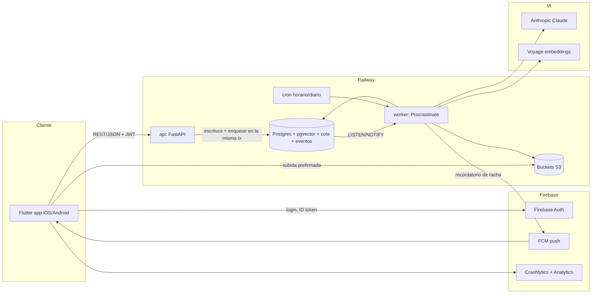
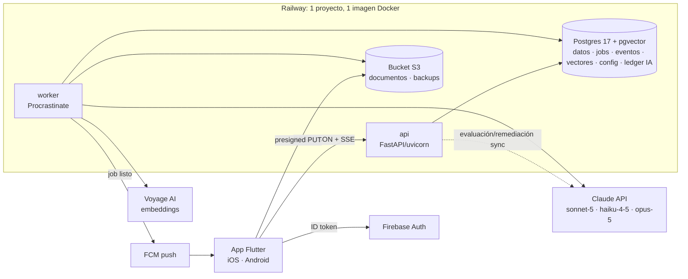
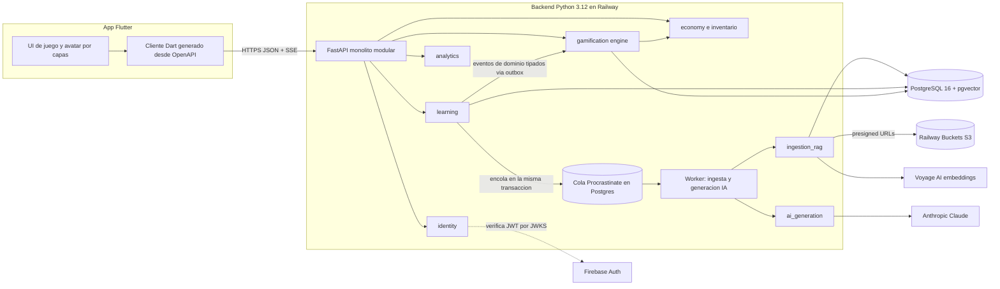

# Anexo A1 — Panel de decisión de stack: propuestas y veredictos

> Material bruto generado el 2026-09-10 por el panel de 3 arquitectos proponentes (ángulos: velocidad al MVP, costo mínimo y simplicidad operativa, calidad/mantenibilidad/escalabilidad) y 3 jueces independientes (lentes: fundador técnico, ingeniería móvil tipo videojuego, arquitectura de plataforma y datos). La numeración de las propuestas es la misma que usaron los jueces. El documento 03-stack-tecnologico.md sintetiza y decide a partir de este anexo.

---

## Propuesta 1: Propuesta "Velocidad al MVP": Flutter + FastAPI (Python) + Postgres/pgvector en Railway + Firebase + Claude

**Enfoque:** Maximizar la velocidad de llegada a un MVP funcional con 1-3 personas y un fundador de perfil Python/data. Un solo lenguaje de backend (Python), servicios gestionados para todo lo no diferencial (auth, push, storage, hosting, observabilidad), UN solo Postgres para datos + vectores + cola de trabajos, e IA usada solo donde aporta valor y con generación perezosa. El código propio se concentra en lo diferencial: motor de gamificación por eventos, pipeline RAG -> ruta -> lecciones, y UI tipo videojuego. Todo containerizado y con estándares abiertos (JWT, S3, SQL) para poder migrar cuando el producto valide.

| Capa | Elección |
|---|---|
| Móvil | Flutter 3.x (Dart) + Riverpod + go_router + Rive/Lottie, por sobre React Native + Expo. Para ESTE producto lo que pesa es la UI tipo videojuego: Flutter dibuja todo con su propio motor (Impeller), da animaciones a 60/120 fps sin puente JS, y Stack/CustomPainter resuelven de forma natural el avatar por capas (z-order por slot) y el mapa de territorios; Rive nació con runtime Flutter de primera clase (rive_flutter) y Lottie está maduro; una sola base de código produce además un build web gratis para demos y admin interno. RN + Expo gana en ecosistema npm, pool de talento y OTA (EAS Update), y con la New Architecture + Reanimated + Skia también rinde, pero exige más piezas (Reanimated, Skia, rive-react-native menos maduro), más churn de dependencias y upgrades, y TypeScript es igual de nuevo que Dart para un perfil Python. Dart es tipado, simple y cercano a Python/Java: 1-2 semanas de curva. Unity/Godot descartados (sobredimensionados para pantallas de lectura/quiz, tamaño de app, licencias); PWA descartada (push y offline poco fiables en iOS; sin presencia en tiendas). Kotlin Multiplatform aún con iOS en maduración. Debilidades aceptadas: menor pool de talento que RN (suficiente en LatAm), OTA requiere un vendor extra (Shorebird, Fase 2), builds iOS requieren Mac o Codemagic (el equipo desarrolla en Windows), y Dart no comparte código con el backend Python (RN tampoco lo haría). |
| Backend | Python 3.12 + FastAPI + SQLAlchemy 2.0 (async) + Pydantic v2 + Alembic. API REST/JSON documentada automáticamente con OpenAPI, desde la cual se genera el cliente Dart (openapi-generator). Monolito modular (módulos auth, learning, ai, gamification, catalog) en un solo despliegue `api` más un proceso `worker`. Justificación: es el lenguaje del fundador; los modelos Pydantic sirven a la vez como esquema de la API y como schema de structured outputs de Claude (`output_config.format` / `messages.parse`); el SDK `anthropic` para Python es de primera clase; FastAPI async encaja con llamadas largas a LLM y streaming. Eventos de dominio en proceso: la API procesa LESSON_COMPLETED en la misma transacción (XP, oro, racha, misiones, logros, desbloqueos) y devuelve el payload de recompensas; lo pesado (notificaciones, prefetch del siguiente módulo) se encola. Descartados: Django + DRF (admin gratis, pero peor encaje con async/structured outputs; SQLAdmin + config-as-code cubre el back-office), NestJS/TS (segundo lenguaje), GraphQL (sobrecosto sin beneficio para un cliente único). |
| Base de datos | PostgreSQL 16 gestionado en Railway (template con extensión pgvector; verificar que la imagen la incluya o usar el template pgvector). Un único Postgres para: datos transaccionales (usuarios, rutas, progreso, economía), vectores (pgvector), cola de trabajos (Procrastinate) y eventos de dominio (tabla append-only `domain_events`). Config de juego (tablas de XP, recompensas de racha, precios, misiones) en tabla `game_config` versionada, sembrada desde YAML en el repo: configurable desde backend sin hardcodear en la app (brief §7). Backups diarios de volumen de Railway + `pg_dump` semanal al bucket. Descartadas para el MVP: Supabase (excelente, pero sería un tercer vendor y duplicaría Auth con Firebase; sigue siendo la mejor alternativa si se prefiere BaaS único), Neon (scale-to-zero genera latencia en frío para una app móvil), Cloud SQL (costo mínimo y plumbing IAM; buen destino en Fase 4+). Limitación aceptada: Railway Postgres no es HA ni tiene PITR; suficiente para validar producto. |
| Vector store | pgvector en el mismo Postgres, índice HNSW (cosine) por `knowledge_base_id`, más búsqueda híbrida con `tsvector` (BM25-like) y fusión RRF simple. Cada base de conocimiento de usuario tiene pocos miles de chunks, por lo que la búsqueda filtrada por usuario es de milisegundos incluso sin índice; trazabilidad lección -> chunk -> documento con claves foráneas en la misma base (brief §26), sin sincronizar dos sistemas. Servicios dedicados (Pinecone, Qdrant Cloud, Weaviate, Turbopuffer) descartados: agregan vendor, salto de red, consistencia eventual y facturación separada sin beneficio por debajo de ~10 M de vectores. Criterio de migración: > 10 M vectores o p95 de búsqueda > 200 ms sostenido, improbable antes de la Fase 5. |
| LLM y embeddings | Anthropic Claude por tarea (precios USD/M tokens in/out dados: Opus 5 $5/$25, Sonnet 5 $2/$10, Haiku 4.5 $1/$5; Batch -50%; caché de prompt con lecturas a ~10% del precio de entrada, verificar por modelo): - Plan de ruta (documento -> Ruta/Módulos/Temas, 1 llamada por ruta, alto impacto): claude-opus-5, structured outputs, effort alto. ~0,25-0,35 USD/ruta. - Generación de lecciones + preguntas (RAG, 1 llamada por módulo de 5-8 lecciones, generación perezosa al llegar el usuario y prefetch del siguiente módulo vía Batch API): claude-sonnet-5, effort medio, structured outputs. ~0,02-0,04 USD/lección. - Corrección de respuestas abiertas cortas y clasificación/etiquetado/moderación de documentos, nombres de territorios: claude-haiku-4-5. ~0,003 USD/corrección. - Corrección de casos prácticos largos y remediación adaptativa (explicación alternativa, nuevos ejercicios): claude-sonnet-5 bajo demanda. - Correctores deterministas primero: selección múltiple, V/F, ordenar, relacionar se corrigen en código; ejercicios SQL se ejecutan en DuckDB en el worker contra datasets pequeños y se compara el result set con la consulta de referencia; el LLM solo redacta feedback. - Trazabilidad: los chunks se pasan numerados y el schema exige `source_chunk_ids` por sección/pregunta, validados en servidor (la API de citations no es compatible con output_config.format en la misma llamada). - Control de costos: cuotas por usuario/tier, contenido generado se persiste y reutiliza, dedupe de documentos por hash, límite de max_tokens, trazas y costo por llamada en Langfuse, alertas de gasto en la consola de Anthropic. Embeddings: Voyage AI (socio recomendado por Anthropic), modelo voyage-3.5-lite o voyage-3-lite, multilingüe, dimensión 512 o 1024 (~0,02 USD/M tokens aprox., a verificar; cuota gratuita inicial a verificar). Respaldo: OpenAI text-embedding-3-small (~0,02 USD/M aprox.). bge-m3 / multilingual-e5 autoalojados descartados en MVP por costo operativo. Un PDF de 100 páginas ≈ 50k tokens ≈ 0,001-0,003 USD: el costo de embeddings es despreciable. |
| Auth | Firebase Authentication (email/contraseña, Google, Apple; Sign in with Apple es obligatorio en iOS al ofrecer login social). El SDK FlutterFire es de primera clase; FastAPI verifica el ID token (JWT RS256) con JWKS cacheado y mapea `firebase_uid` -> tabla `users`. Firebase entra de todos modos por FCM (push para recordatorios de racha en Android), Crashlytics y Analytics, así que no agrega vendor. Costo: gratis en la práctica (Spark/Blaze marginal). Descartados: Supabase Auth (solo si se elige Supabase como BaaS único), Clerk (SDK Flutter débil), fastapi-users/autogestionado (superficie de seguridad y semanas de trabajo). Mitigación de lock-in: verificación JWT estándar y exportación de usuarios de Firebase; eliminación de cuenta implementada desde el MVP (requisito de App Store y Play). |
| Storage | Railway Buckets (object storage S3-compatible, misma red que la API). Flujo: la API valida tipo/tamaño (PDF, MD, TXT; ~30 MB máx. valor inicial configurable) y emite una URL prefirmada de subida (boto3; verificar soporte de presign en Buckets); el worker descarga, extrae texto (PyMuPDF/pymupdf4llm; fallback a lectura nativa de PDF por Claude para escaneados), fragmenta y embebe. Los documentos son privados por usuario; llaves `users/{uid}/docs/{doc_id}`. Assets de items y capas del avatar van en el bundle de la app en el MVP (pocas decenas), con catálogo en DB que referencia `items/{slot}/{item_id}.png`; CDN en Fase 2. Alternativas: GCS/Firebase Storage (válidas, segunda opción por afinidad del fundador con GCP), Supabase Storage. |
| Colas/jobs | Procrastinate (cola de tareas Python sobre Postgres con LISTEN/NOTIFY, async, reintentos, tareas periódicas) ejecutada en un servicio `worker` de Railway, más cron de Railway para tareas horarias/diarias (cierre de racha por zona horaria del usuario, reset de misiones diarias, recordatorios FCM). Por qué: elimina Redis del MVP y da encolado transaccional (patrón outbox gratis: el evento de dominio y el job se insertan en la misma transacción). Pipelines largos (ingesta de documento; plan de ruta; generación de módulo) se modelan como jobs idempotentes con estado por etapa en tablas `document_ingestion` y `generation_job`, resumibles tras fallo; la app consulta `GET /jobs/{id}` cada 2-3 s (SSE en Fase 2). Comparadas: Celery + Redis (configuración pesada), ARQ/Dramatiq + Redis (buenas, pero requieren Redis), Inngest (steps durables y buen SDK Python; upgrade natural si los pipelines se complican), Temporal (sobreingeniería). Redis se agrega solo cuando haga falta rate limiting distribuido (Railway Redis, ~5 USD). |
| Hosting | Railway (cuenta existente) para todo el cómputo: servicios `api` (FastAPI/uvicorn), `worker` (Procrastinate), `postgres` (pgvector), `bucket`, `redis` opcional; despliegue automático desde GitHub, entornos por PR, red privada, cron, métricas y logs incluidos. Dockerfile propio para portabilidad. Comparación: Cloud Run + Cloud SQL + Cloud Tasks (afinidad del fundador con GCP y escala excelente, pero más IAM/YAML, costo mínimo de Cloud SQL y arranques en frío; destino natural en Fase 4+ si el volumen lo justifica), Fly.io (más control y más operación manual), Vercel (serverless TS-céntrico, sin workers largos ni Postgres propio), Supabase (BaaS excelente pero no hospeda Python; opción si se prefiere un solo BaaS en vez de Railway + Firebase). Región: us-east (Railway no tiene región en Sudamérica; ~130 ms desde Chile, aceptable para una app no realtime). |
| Observabilidad/CI-CD | Observabilidad: Sentry (errores API y Flutter, con release tracking), Langfuse cloud (trazas, costo por llamada, versiones de prompts y datasets de evaluación para las generaciones), logs y métricas de Railway, Firebase Crashlytics (crashes nativos) y Firebase Analytics con export gratuito a BigQuery (terreno natural del fundador para DAU/WAU/MAU y retención D1/D7/D30; PostHog como alternativa si se quieren funnels/replay). Los eventos de negocio se guardan además en `domain_events` como fuente de verdad. CI/CD: GitHub Actions (ruff, mypy, pytest con Postgres de servicio, `flutter analyze`/`flutter test`) -> Railway despliega `main` a producción y cada PR a un entorno efímero con migraciones Alembic; Codemagic (CI nativo Flutter con macOS, tier gratuito a verificar) para builds Android/iOS, Firebase App Distribution y TestFlight; Shorebird para parches OTA en Fase 2. Alertas: Sentry -> correo/Slack; alerta de gasto en consola Anthropic. |
| Costo infra MVP | ≈ 270-470 USD/mes con el supuesto de 500 usuarios registrados, 150 DAU, 100 rutas nuevas/mes, ~6.000 lecciones generadas/mes y ~20.000 respuestas abiertas corregidas por LLM (el resto se corrige de forma determinista). Desglose: Railway (api + worker + Postgres + bucket + plan) 40-70; Firebase 0; Sentry/Langfuse/Codemagic/GitHub 0-30 (tiers gratuitos al inicio); Apple Developer + Google Play ~10; embeddings Voyage 1-5; LLM plan de ruta (Opus 5) ~25; LLM lecciones (Sonnet 5, con caché y Batch) 120-240; LLM corrección abierta (Haiku 4.5) ~60; LLM remediación (Sonnet 5) 15-30. Piso fijo sin usuarios ≈ 50-80 USD/mes. La IA es el 60-70% del costo y equivale a ≈ 2-3 USD por DAU-mes: ese número, no la infraestructura, define las cuotas free/premium. |
| Tiempo al MVP | 10-12 semanas con 2-3 personas (una en Flutter, una en backend/IA, arte externalizado); 14-18 semanas con 1 persona a tiempo completo apoyada por asistentes de código. Fases: 0 Fundaciones (1-2), 1 Ingesta + RAG + plan de ruta (2-3), 2 Lecciones, preguntas y correctores (2-3), 3 Motor de gamificación (2-3), 4 Avatar por capas, dashboard, animaciones (2), 5 Beta cerrada e instrumentación (1-2). El mayor riesgo de calendario es el arte del avatar/items sin diseñador, no el código. |

**Riesgos declarados:**
- Costo de IA por DAU (≈2-3 USD/mes) domina el gasto y escala con el uso; sin cuotas, generación perezosa, caché, Batch y reutilización de contenido el MVP puede ser inviable económicamente.
- Calidad y alucinación del contenido generado: mitigar con chunks numerados y source_chunk_ids obligatorios validados, bandera de 'información insuficiente', revisión humana de las primeras rutas y un dataset de evaluación en Langfuse.
- Curva Dart/Flutter y Riverpod para un perfil Python: 1-2 semanas de spike; sin ellas la Fase 4 (avatar, animaciones) se estira.
- Equipo en Windows sin Mac: builds y pruebas iOS dependen de Codemagic/TestFlight; beta Android-first para no bloquear.
- Arte del avatar por capas e items sin diseñador: depende de comprar packs con licencia comercial o contratar freelance; es el cuello de botella real del calendario.
- Railway Postgres sin alta disponibilidad ni PITR y una sola región: aceptable para validar, pero requiere backups verificados y plan de migración (Cloud SQL/Neon) antes de la Fase 4.
- Lock-in moderado: Firebase Auth (mitigado por JWT estándar y export de usuarios), Railway (mitigado por Docker y S3-compatible), Anthropic (abstraer el cliente LLM detrás de una interfaz fina).
- Procrastinate es menos conocido que Celery; si aparecen límites (throughput, tooling) el plan B es ARQ/Dramatiq + Redis o Inngest con un cambio localizado en el módulo de jobs.
- Pipelines de generación largos con fallos parciales: exigen idempotencia y estado por etapa desde el día 1; de lo contrario se paga dos veces la misma generación.
- Abuso y farmeo de XP: toda la economía se calcula en servidor con claves de idempotencia, tiempos mínimos por actividad y topes diarios; el cliente nunca envía XP.
- Cumplimiento de tiendas: eliminación de cuenta, Sign in with Apple, políticas sobre contenido generado por IA y derechos de autor de documentos subidos (privados por usuario en el MVP).
- Bus factor y agotamiento con 1-3 personas: disciplina de alcance (sección 'fuera del MVP') y automatización total de despliegues.
- Regresiones de Flutter/Impeller o del runtime de Rive entre versiones: fijar versiones y actualizar en ventanas planificadas.
- Precios de terceros (Voyage, Codemagic, Railway, Langfuse) son aproximados a 2026-09 y deben verificarse antes de comprometer el presupuesto.

### Propuesta completa

#### Atenea — Propuesta de stack tecnológico (ángulo: Velocidad al MVP)

> Panel de decisión de stack · Propuesta "Velocidad al MVP" · 2026-09-10 · Estado: greenfield, auditoría previa exigida por el brief (§46). No se implementa nada todavía.

#### 1. Tesis
Con 1-3 personas y un fundador de perfil Python/data, el riesgo principal no es técnico sino de tiempo: el MVP debe responder "¿la gente quiere aprender con esta mecánica RPG?" (brief §42, §47) en ≈3 meses. Por eso: (a) un solo lenguaje de backend que el equipo ya domina (Python); (b) servicios gestionados para todo lo no diferencial (auth, push, storage, hosting, observabilidad); (c) UN solo Postgres para datos, vectores y cola de trabajos; (d) IA solo donde aporta valor y con generación perezosa. El código propio se concentra en lo diferencial: motor de gamificación por eventos, pipeline RAG -> ruta -> lecciones y UI tipo videojuego. Todo containerizado y sobre estándares abiertos (JWT, S3, SQL) para migrar cuando el producto valide.

#### 2. Resumen del stack
| Capa | Elección | Alternativas descartadas (por qué) |
|---|---|---|
| App móvil | Flutter 3.x (Dart) + Riverpod + go_router + Rive/Lottie; cliente Dart generado desde OpenAPI | RN + Expo (animación/avatar con más piezas, churn JS), Unity/Godot (sobredimensionados para lectura/quiz), PWA (push/offline iOS), KMP (iOS inmaduro) |
| Backend | Python 3.12 + FastAPI + SQLAlchemy 2 async + Pydantic v2 + Alembic; REST/JSON con OpenAPI; monolito modular `api` + `worker` | Django + DRF (admin gratis, peor encaje async/structured outputs), NestJS (2.º lenguaje), GraphQL (sobrecosto) |
| Base de datos | PostgreSQL 16 en Railway con pgvector; `game_config` versionada sembrada desde YAML | Supabase (excelente, pero 3.er vendor y Auth duplicada), Neon (latencia en frío), Cloud SQL (costo mínimo + IAM) |
| Vectores | pgvector (HNSW, cosine) por base de conocimiento + híbrido con `tsvector` y RRF | Pinecone/Qdrant/Weaviate/Turbopuffer (vendor, salto de red, sincronía; innecesario < 10 M vectores) |
| LLM | Anthropic: `claude-opus-5` (plan de ruta), `claude-sonnet-5` (lecciones RAG, remediación, corrección larga), `claude-haiku-4-5` (clasificar, etiquetar, corrección corta) | Un solo modelo para todo (o caro o flojo); cascada compleja de 4+ modelos (una caché por modelo, más código) |
| Embeddings | Voyage AI voyage-3.5-lite / voyage-3-lite, multilingüe, 512-1024 dims (~0,02 USD/M tokens aprox., verificar) | OpenAI text-embedding-3-small (respaldo), bge-m3 / e5 autoalojados (ops) |
| Auth | Firebase Authentication (email, Google, Apple) verificado por JWT/JWKS en FastAPI | Supabase Auth, Clerk (SDK Flutter débil), fastapi-users (superficie de seguridad propia) |
| Storage | Railway Buckets (S3-compatible) con URLs prefirmadas; assets del juego en el bundle en MVP | GCS / Firebase Storage (2.ª opción), Supabase Storage |
| Colas/jobs | Procrastinate (cola sobre Postgres, async) en servicio `worker`; cron de Railway para tareas horarias/diarias | Celery + Redis (config pesada), ARQ/Dramatiq (requieren Redis), Inngest (upgrade natural), Temporal (sobreingeniería) |
| Hosting | Railway: `api`, `worker`, `postgres`, `bucket` (+ `redis` opcional); deploy desde GitHub, entornos por PR, Dockerfile propio | Cloud Run + Cloud SQL (más plumbing; destino Fase 4+), Fly.io (más ops), Vercel (TS/serverless, sin workers), Supabase (no hospeda Python) |
| Observabilidad | Sentry (API + Flutter) · Langfuse (trazas y costo LLM) · Railway logs/métricas · Firebase Crashlytics + Analytics -> BigQuery | Datadog/New Relic (costo), PostHog (buena alternativa a Firebase Analytics) |
| CI/CD | GitHub Actions (ruff, mypy, pytest, flutter analyze/test) -> Railway auto-deploy; Codemagic para builds iOS/Android, TestFlight y App Distribution | GitHub macOS runners (multiplicador de minutos), Bitrise; Shorebird OTA en Fase 2 |

#### 3. Arquitectura del MVP

Flujo crítico "crear ruta": la app pide URL prefirmada -> sube el PDF al bucket -> `POST /paths` crea `document_ingestion` y encola -> worker extrae texto (PyMuPDF; fallback PDF nativo de Claude), fragmenta, embebe con Voyage y escribe chunks -> Haiku etiqueta el documento -> Opus 5 produce el plan Ruta/Módulos/Temas con structured outputs -> Sonnet 5 genera el módulo 1 (lecciones + preguntas + `source_chunk_ids`) -> la app, que consulta `GET /jobs/{id}` cada 2-3 s, muestra la ruta. Los módulos siguientes se generan de forma perezosa (al desbloquearse) y el siguiente al actual se prefetchea vía Batch API.

#### 4. Móvil: Flutter vs React Native para ESTE producto
| Criterio | Flutter | RN + Expo | Ventaja |
|---|---|---|---|
| Rendimiento de animaciones / UI tipo juego | Motor propio (Impeller), 60-120 fps, sin puente | New Architecture + Reanimated + Skia: bueno, con más piezas | Flutter |
| Avatar por capas, mapa custom | Stack/CustomPainter/Canvas nativos del framework | Skia o vistas nativas; más fricción | Flutter |
| Rive / Lottie | rive_flutter de primera clase; lottie maduro | rive-react-native menos maduro; lottie ok | Flutter |
| Curva para perfil Python | Dart tipado y simple, 1-2 semanas | TS + ecosistema npm, 1-2 semanas más ruido de tooling | Flutter (leve) |
| Mantenimiento / churn | Versiones estables, pocas deps | Upgrades de RN/Expo y deps npm frecuentes | Flutter |
| Talento (Chile/LatAm) | Suficiente, menor que RN | Mayor pool JS | RN |
| OTA updates | Shorebird (vendor extra) | EAS Update integrado | RN |
| Build iOS sin Mac | Codemagic / runners macOS | EAS Build en la nube | RN (leve) |
| Web para admin/demo | Build web incluido | Expo web razonable | Flutter (leve) |
| Madurez 2026 | Alta | Alta | Empate |

Veredicto: Flutter. Otras opciones: Unity/Godot descartadas (peso, licencias, UI de formularios pobre); PWA descartada (push/offline iOS, sin tienda). Avatar en MVP = capas PNG en un Stack con z-order por slot; rig Rive animado en Fase 2. Mapa en MVP = camino lineal de módulos con estados sobre ilustración (CustomPainter), no mundo libre (Flame queda para Fase 3).

#### 5. IA por tarea y control de costos
| Tarea | Modelo | Diseño | Costo aprox. |
|---|---|---|---|
| Plan de ruta (1 vez por ruta) | claude-opus-5, effort alto | Structured outputs; entrada = mapa del documento (títulos + resúmenes de chunks), no el PDF completo | 0,25-0,35 USD/ruta |
| Lecciones + preguntas (RAG) | claude-sonnet-5, effort medio | 1 llamada por módulo (5-8 lecciones), prompt de sistema cacheado, chunks numerados, `source_chunk_ids` obligatorios; perezoso + Batch para prefetch | 0,02-0,04 USD/lección |
| Corrección abierta corta, clasificación, etiquetado, nombres de territorio | claude-haiku-4-5 | Rúbrica cacheada, salida estructurada (puntaje, feedback, concepto débil) | ~0,003 USD |
| Casos prácticos largos, remediación adaptativa | claude-sonnet-5 | Bajo demanda al detectar 2-3 fallos en un concepto; se guarda y reutiliza | 0,02-0,05 USD |
| Selección múltiple, V/F, ordenar, relacionar, SQL | Sin LLM | Correctores deterministas; SQL se ejecuta en DuckDB en el worker y se compara el result set | 0 |

Reglas: nunca regenerar lo ya generado; dedupe de documentos por hash; cuotas por tier (valores iniciales configurables: free 2 rutas/mes y 3 módulos nuevos/día); `max_tokens` acotado; costo por llamada trazado en Langfuse; alerta de gasto en consola Anthropic. Nota de API: citations y `output_config.format` no se combinan en una misma llamada, por eso la trazabilidad se resuelve con IDs de chunk en el schema y validación en servidor.

#### 6. Motor de gamificación (cómo encaja en el stack)
Evento `LESSON_COMPLETED` (con clave de idempotencia por intento) -> la API, en una transacción: persiste `domain_events`, aplica handlers puros sobre `game_config` (XP, oro, racha, progreso por tema, misiones, logros, desbloqueos por conocimiento) y devuelve el payload de recompensas para la animación inmediata (brief §29, §34). Lo asíncrono (FCM, prefetch, estadísticas) se encola en la misma transacción. Dominio = solo desempeño en evaluaciones/ejercicios; XP y tiempo se registran aparte (brief §9). Anti-farmeo: todo se calcula en servidor, tiempos mínimos por actividad y topes diarios de XP por repetición (brief §6).

#### 7. Costo mensual de infraestructura (MVP)
Supuesto: 500 registrados, 150 DAU, 100 rutas nuevas/mes, ~6.000 lecciones generadas/mes, ~20.000 respuestas abiertas corregidas por LLM.
| Ítem | USD/mes | Nota |
|---|---|---|
| Railway api (1 vCPU / 1 GB) | 10-15 | usage-based |
| Railway worker | 10-15 | |
| Railway Postgres (1-2 GB RAM, 10 GB disco) | 10-20 | backups de volumen |
| Railway Buckets (~20 GB) + plan Hobby/Pro | 6-23 | Pro solo si hacen falta más recursos/asientos |
| Firebase (Auth, FCM, Crashlytics, Analytics) | 0 | Spark; Blaze marginal |
| Sentry, Langfuse, Codemagic, GitHub | 0-30 | tiers gratuitos al inicio |
| Apple Developer + Google Play | ~10 | 99 USD/año + 25 USD único |
| Embeddings Voyage | 1-5 | ~50k tokens por PDF de 100 págs |
| LLM plan de ruta (Opus 5) | ~25 | 100 rutas |
| LLM lecciones (Sonnet 5, caché + Batch) | 120-240 | 6.000 lecciones |
| LLM corrección abierta (Haiku 4.5) | ~60 | 20.000 correcciones |
| LLM remediación (Sonnet 5) | 15-30 | bajo demanda |
| **Total** | **≈ 270-470** | piso sin usuarios ≈ 50-80; IA = 60-70% |

Costo ≈ 2-3 USD por DAU-mes: es la cifra que dimensiona las cuotas free/premium (brief §36), no el hosting.

#### 8. Tiempo al MVP
| Fase | Semanas | Entregable |
|---|---|---|
| 0 Fundaciones | 1-2 | Monorepo, Railway, Firebase, CI/CD, design tokens, pipeline de assets, spike Dart |
| 1 Ingesta + RAG + ruta | 2-3 | Subir documento -> chunks -> embeddings -> plan de ruta con Opus 5 |
| 2 Lecciones y preguntas | 2-3 | Generación perezosa, correctores deterministas + LLM, trazabilidad |
| 3 Motor de gamificación | 2-3 | Eventos, XP, oro, rachas, misiones diarias, logros, inventario/tienda, desbloqueos |
| 4 Avatar, dashboard, animaciones | 2 | Avatar por capas, mapa lineal, feedback Rive/Lottie, perfil |
| 5 Beta cerrada | 1-2 | TestFlight / Play interno, instrumentación, ajustes de economía |

Total: 10-12 semanas con 2-3 personas; 14-18 con 1 persona. El cuello de botella es el arte (avatar e items), no el código.

#### 9. Fuera del MVP (y por qué)
Redis (solo cuando haga falta rate limiting distribuido); rig Rive animado del avatar (capas PNG bastan para validar); mapa libre con Flame; offline-first y sincronización; realtime/SSE (polling basta); admin UI propia (SQLAdmin + config-as-code); gemas y pagos (brief §14); social, rankings (brief §37); servicio vectorial dedicado; multi-región/HA; migración a Cloud Run; rutas sin documento a partir del conocimiento del modelo (decisión pendiente).

#### 10. Debilidades honestas del ángulo
- Railway Postgres no es HA ni tiene PITR; una sola región (us-east, ~130 ms desde Chile). Suficiente para validar, no para Fase 4.
- Dos vendors de plataforma (Railway + Firebase) en lugar de uno (Supabase lo unificaría, pero sin Python ni push).
- Procrastinate es menos popular que Celery; el plan B (ARQ/Dramatiq + Redis o Inngest) es un cambio localizado.
- Flutter tiene menor pool de talento que RN y requiere Shorebird para OTA.
- Este stack no resuelve por sí solo el costo de IA por DAU; lo resuelve el diseño de generación (perezosa, por módulo, caché, Batch, deterministas primero).

#### 11. Riesgos del stack
1. Costo de IA por DAU dominante y variable -> cuotas, caché, Batch, reutilización, Langfuse.
2. Alucinación / calidad del contenido -> chunks numerados + IDs validados, bandera de información insuficiente, revisión humana inicial, dataset de evaluación.
3. Curva Dart/Flutter -> spike de 1-2 semanas en Fase 0.
4. Equipo en Windows sin Mac -> Codemagic + TestFlight; beta Android-first.
5. Arte sin diseñador -> packs con licencia comercial o freelance para base + 20-30 items.
6. Postgres sin HA/PITR -> backups verificados y plan de migración antes de Fase 4.
7. Lock-in Firebase/Railway/Anthropic -> JWT estándar, Docker, S3-compatible, interfaz fina de LLM.
8. Pipelines largos con fallos parciales -> idempotencia y estado por etapa desde el día 1.
9. Farmeo de XP -> economía 100% en servidor, idempotencia, tiempos mínimos, topes diarios.
10. Cumplimiento de tiendas -> eliminación de cuenta, Sign in with Apple, contenido IA, derechos de autor (documentos privados).
11. Bus factor / agotamiento -> alcance disciplinado y despliegues automatizados.
12. Precios de terceros aproximados a 2026-09 -> verificar antes de comprometer presupuesto.

#### Decisiones pendientes y preguntas abiertas
1. ¿Beta Android-first (equipo sin Mac) o iOS y Android desde el día 1?
2. Origen y licencia del arte del avatar e items: pack comprado, freelance o generado por IA con retoque.
3. ¿Se acepta us-east como región única (~130 ms desde Chile) o se evalúa Cloud Run en southamerica-west1 desde el inicio?
4. Cuotas free/premium iniciales (rutas/mes, módulos/día) y precio objetivo del plan premium.
5. Confirmar Procrastinate vs ARQ + Redis con un spike de 1 día en Fase 0.
6. Formatos de documento del MVP: PDF/MD/TXT confirmados; ¿DOCX, URLs, videos?
7. Idiomas del MVP: ¿solo español o también inglés? Afecta prompts, embeddings y correctores.
8. Rutas sin material ("quiero aprender SQL"): ¿generar desde el conocimiento del modelo con aviso explícito o exigir documentos?
9. Política de datos: retención de documentos, uso para mejorar prompts, términos y privacidad.
10. Analytics de producto: Firebase -> BigQuery (0 vendors nuevos) vs PostHog (mejores funnels/replay).
11. Nombre definitivo, identidad visual y cuentas de tiendas (fecha de creación de la cuenta Apple Developer).

#### Supuestos
- Equipo de 1-3 personas; fundador con perfil data/BI (SQL, BigQuery, GCP, Python); sin diseñador dedicado; desarrollo en Windows 11 sin Mac.
- Cuenta de Railway existente; proveedor de IA principal Anthropic con los precios indicados (Opus 5 5/25, Sonnet 5 2/10, Haiku 4.5 1/5 USD por M tokens; Batch -50%; caché ≈10% del precio de entrada en lecturas, a verificar).
- Precios de Voyage, Railway, Codemagic, Langfuse, Sentry y Firebase son aproximados a 2026-09 y deben verificarse.
- Usuarios objetivo iniciales en Chile/LatAm, contenido principalmente en español; documentos privados por usuario (sin compartir en MVP).
- MVP online-only; sin monetización real (solo arquitectura preparada para tiers).
- Supuesto de carga para costos: 500 registrados, 150 DAU, 100 rutas/mes, 6.000 lecciones/mes, 20.000 correcciones LLM/mes.
- Todos los valores numéricos de juego (XP, oro, cuotas, umbrales) son valores iniciales configurables en `game_config`.
- Por instrucción del rol, esta propuesta se devuelve como salida estructurada y no se escribió ningún archivo.

---

## Propuesta 2: Propuesta A — «Monolito Postgres-céntrico»: Flutter + FastAPI + Postgres/pgvector + Claude, todo en Railway

**Enfoque:** Costo mínimo y simplicidad operativa para la etapa de validación (0-2.000 usuarios): una sola imagen Docker ejecutada como dos procesos (API + worker), un único Postgres con pgvector que hace de base de datos, cola de jobs, bus de eventos (outbox), índice vectorial, buscador full-text, configuración del juego y ledger de costos de IA, más un bucket S3-compatible; todo en Railway (cuenta ya existente). Cero Redis, cero broker, cero cluster, cero vector DB dedicada. La IA usa tres modelos Claude por tipo de tarea, generación perezosa, prompt caching, Batch API y cuotas por usuario. Se compra ~US$70-110/mes de infraestructura fija y un solo panel donde mirar cuando algo falla; se paga con no escalar a cero, una sola región y la disciplina de sacar de Postgres lo que no le corresponda al pasar de ~10.000 usuarios.

| Capa | Elección |
|---|---|
| Móvil | Flutter 3.x (Dart) con `rive` y `lottie`. Comparación para ESTE producto: (1) UI tipo videojuego (mapa, barras XP, partículas): Flutter renderiza con motor propio (Impeller) + CustomPainter/Flame; React Native lo logra con Fabric + react-native-skia + Reanimated, con más piezas. (2) Animación: Rive tiene runtime oficial y prioritario en Flutter (`rive`/`rive_native`); `rive-react-native` existe pero ha ido rezagado en features (verificar paridad 2026); Lottie equivalente en ambos. (3) Avatar por capas: empate (Stack de PNG/SVG con anclas vs Views absolutas + Skia; Rive nested artboards en ambos). (4) Rendimiento: Flutter AOT, 60-120 fps consistentes e idénticos en iOS/Android; RN muy cercano hoy (New Architecture), con lógica en hilo JS. (5) Curva y mantenimiento para un equipo Python/data sin deuda JS: Dart tipado y un solo toolchain (~2-3 semanas) frente a TS + Node/Metro/Expo SDK/módulos nativos y su churn anual de dependencias → Flutter. (6) Talento y web: ventaja RN (pool JS mayor, comparte código con web/Next); Flutter es fuerte en LatAm pero menor globalmente y Flutter web no sirve para SEO. Decisión: Flutter, porque el brief exige "sentirse videojuego" y no app nativa; debilidad honesta: contratar es más difícil y un pivote web-first favorecería RN; mitigación: lógica de juego 100% en backend + OpenAPI hacen al cliente reemplazable. Descartados: Unity/Godot (UI de texto/formularios costosa, licencias, tamaño), Kotlin/Compose Multiplatform (iOS joven, talento escaso), PWA (sin store y push iOS limitado → mata la racha), nativo x2 (inviable con 1-3 personas). Avatar MVP: capas PNG en Stack con orden Z y anclas configurados desde backend; Rive solo para 5 celebraciones. |
| Backend | Python 3.12 + FastAPI + Pydantic v2 + SQLAlchemy 2 (async) + Alembic; API REST/JSON con OpenAPI generado (cliente Dart generable) y SSE para progreso de jobs y streaming de remediaciones; monolito modular por dominio (auth, learning, ingest, ai, gamification, inventory, analytics) en un solo Dockerfile con comando `api` o `worker`; SQLAdmin como back-office para valores de juego, ítems, cuotas y jobs. Justificación: es el lenguaje del fundador; Pydantic sirve como esquema único para API, validación y `output_config.format` de Claude (structured outputs via `messages.parse()`); async nativo para llamadas LLM y SSE; SDK oficial `anthropic` sin LangChain. Django+Ninja fue la alternativa seria (admin gratis) pero pierde en contrato único y async; NestJS/Go descartados por introducir un segundo lenguaje de backend sin ventaja para 1-3 personas. Motor de gamificación = reglas Python que consumen la tabla `domain_events`, con valores en `game_config` versionada (configurable sin redeploy). Antiabuso sin Redis: idempotencia por `activity_id`, tope diario de XP por tipo de acción, servidor calcula todo, rate limiting token-bucket en fila de Postgres. |
| Base de datos | Postgres 17 (template oficial de Railway con pgvector preinstalado), única fuente de verdad: esquema relacional para las ~33 entidades del brief, `jsonb` solo para payloads de lección/pregunta y `requirements` de ítems; misma instancia aloja la cola de jobs (Procrastinate), el outbox de eventos `domain_events` (retención 90 días + agregados), `tsvector` español/inglés, `game_config`, `feature_flags` y el ledger `ai_calls` (modelo, tokens in/out/cache, costo USD, job, prompt_version). Analytics DAU/WAU/retención con vistas materializadas nocturnas en SQL (fuerte del equipo), export a BigQuery diferido a Fase 4. Dimensionamiento MVP: ~0,5 vCPU, 1-2 GB RAM, volumen 10 GB. Respaldo: `pg_dump` nocturno al Bucket desde el worker (Railway no ofrece PITR) con restore ensayado mensualmente. |
| Vector store | pgvector en el mismo Postgres: columna `vector(512)`, índice HNSW coseno, filtro por `knowledge_base_id`/`document_id` (cada base de conocimiento tiene cientos-miles de chunks, por lo que incluso el escaneo exacto por KB es de milisegundos), búsqueda híbrida con `tsvector` combinada por RRF, y fila con `embedding_model` para permitir re-embed. Volumen previsto a 2.000 usuarios: ~300k vectores (≈0,7 GB con índice). Servicios dedicados (Pinecone, Qdrant, Weaviate, Turbopuffer) descartados: agregan un vendor, un costo fijo (US$25-70/mes) y rompen la trazabilidad transaccional chunk↔lección que exige el brief (§26); solo se justificarían con >5-10M vectores o búsqueda global multi-tenant, fuera del horizonte del MVP. |
| LLM y embeddings | Claude por tarea: (a) esquema de ruta (módulos→temas) desde documentos: `claude-sonnet-5`, effort medium, structured outputs, ~US$0,20/ruta con doc de 60k tokens; (b) lección + preguntas por módulo: `claude-sonnet-5` con prefijo cacheado (documento completo si <150k tokens, chunks si no), generación perezosa (módulo N+1 al 50% del N) y Batch API (-50%) para pre-generación nocturna, ~US$0,05/lección; (c) evaluación de respuestas abiertas/SQL con rúbrica: `claude-haiku-4-5`, sync <3 s, ~US$0,003; (d) remediación "explícamelo distinto": `claude-sonnet-5` streaming, ~US$0,05; (e) narrativa de territorios/misiones: `claude-haiku-4-5` en Batch, una vez por ruta y se guarda; (f) Game Master: reglas SQL, Haiku solo redacta; (g) `claude-opus-5` reservado a evals offline y a un flag premium futuro (+US$0,30/ruta). Preguntas cerradas se corrigen sin IA. Trazabilidad: citations es incompatible con structured outputs, así que se pasan chunks con `chunk_id` y se exige `source_refs[]` en el JSON validado contra la BD. Embeddings: Voyage AI `voyage-3.5-lite` (512 dims, multilingüe, socio recomendado por Anthropic), ≈US$0,02/M tokens (verificado sep-2026, sujeto a cambio) → <US$1/mes a esta escala; alternativa equivalente OpenAI text-embedding-3-small; bge-m3 autoalojado descartado por requerir cómputo propio. Modelos referenciados por alias en `game_config` para migrar sin deploy. Costo IA ≈ US$0,70-1,00 por usuario activo/mes. |
| Auth | Firebase Authentication (email/contraseña, Google, Apple Sign-In obligatorio en iOS): gratis hasta 50k MAU, SDK Flutter maduro, verificación de email y reset de contraseña incluidos; el backend solo verifica el ID token (JWT) con las claves públicas de Google, sin estado ni servicio propio que operar. Tabla `users` propia con `external_auth_id` + proveedor para limitar el lock-in (migración conocida vía reset de contraseña). Alternativas: Supabase Auth (obligaría a adoptar Supabase), Clerk/Auth0 (pago al crecer, orientados a web/RN), auth propia con FastAPI (más código y riesgo de seguridad para 1-3 personas). Autorización en backend: todo recurso filtrado por `user_id`; documentos privados por defecto. |
| Storage | Railway Buckets (S3-compatible, GA nov-2025): US$0,015/GB-mes, egreso y operaciones S3 gratis, mismo proveedor y mismo panel. La app sube con presigned PUT directo al bucket (el API nunca transporta el archivo), el worker descarga para extraer texto; los `pg_dump` nocturnos van al mismo bucket. Límites iniciales configurables: 20 MB y 150 páginas por documento (free). Código con boto3/aioboto3, portable sin cambios a Cloudflare R2 (10 GB gratis, egreso gratis) o GCS si el precio o la región lo aconsejan. Assets del avatar e ítems empaquetados en la app en el MVP; CDN diferido. |
| Colas/jobs | Procrastinate: cola de tareas en Postgres (`FOR UPDATE SKIP LOCKED` + LISTEN/NOTIFY), asíncrona, con retries, prioridades y tareas periódicas; elimina Redis/broker. Jobs largos (ingesta: subido→extraído→fragmentado→embebido→listo; generación: solicitada→esquema listo→módulo 1 listo→…) modelados como máquinas de estados idempotentes por paso, con timeout por paso, 2-4 workers concurrentes en el servicio `worker` y CPU-bound (parsing PDF con `pypdf`/`python-docx`, licencias permisivas; se evita PyMuPDF por AGPL) en `ProcessPool`. Progreso por endpoint de polling/SSE y push FCM al terminar. Periódicos: cierre de día de rachas por zona horaria, reset de misiones diarias, pre-generación Batch, `pg_dump`, vistas materializadas. Umbral para reconsiderar: >100 jobs/min sostenidos o jobs >30 min → Cloud Tasks o Redis; no antes. |
| Hosting | Railway (cuenta existente): un proyecto con servicios `api` y `worker` construidos desde el mismo Dockerfile/repo GitHub, Postgres 17+pgvector (template), Bucket, dominios y variables en un panel; `alembic upgrade` como comando pre-deploy; plan Hobby (US$5 incl. US$5 de uso) al inicio, Pro (US$20) al superar límites. Comparativa: Supabase da Postgres+Auth+Storage+pgvector por US$25 pero no ejecuta workers Python de larga duración (rompe "un solo lugar"); Fly.io sale algo más barato pero exige operar Postgres no gestionado y flyctl; GCP Cloud Run + Cloud SQL + GCS + Cloud Tasks + Scheduler es la ruta natural de migración en Fase 4+ (el fundador conoce GCP) pero hoy son 5 productos, arranques en frío y mínimo de Cloud SQL; Vercel no apto por timeouts serverless y falta de worker. Región única US-West (latencia a Chile ~150 ms, aceptable). Portabilidad garantizada: todo es Docker + Postgres + S3. |
| Observabilidad/CI-CD | Observabilidad en tiers gratuitos: Sentry (SDK Flutter y Python) para errores y performance básica; logs JSON estructurados (structlog) en Railway con `request_id`/`job_id`; métricas de servicio de Railway; tabla `ai_calls` como observabilidad LLM (costo por llamada, tokens de caché, latencia, prompt_version) con alerta diaria por umbral de USD; PostHog Cloud free (1M eventos) para funnels de producto, mientras las métricas del brief (DAU/WAU/D1/D7/D30, racha promedio) se calculan en SQL; uptime con Better Stack/UptimeRobot free; Langfuse pospuesto. CI/CD: GitHub Actions (ruff, mypy, pytest con Postgres como service container, eval set de 20 documentos en job manual/semanal, build Docker) → Railway auto-deploy en push a main con pre-deploy de migraciones y rollback desde el panel; PR environments de Railway opcionales. Móvil: Codemagic free (500 min/mes, especializado en Flutter) para builds firmados, TestFlight y Play interno; se evitan runners macOS de GitHub por su multiplicador de costo. |
| Costo infra MVP | Supuesto: 2.000 usuarios registrados, ~600 MAU (30%), ~200 DAU; por usuario activo/mes: 1 ruta nueva (doc ~80 páginas ≈ 60k tokens), 8 lecciones consumidas, 20 respuestas abiertas evaluadas, 4 remediaciones. Lanzamiento (≤200 MAU): ≈US$210-280/mes. Escenario objetivo (2.000 registrados / 600 MAU): ≈US$500-730/mes, desglosado en Railway ~US$60-115 (plan 5-20, api 16-25, worker 20-30, Postgres 25-40, bucket 1-2), Apple Developer + dominio ~US$10, Firebase Auth/FCM + Sentry + PostHog + GitHub Actions + Codemagic US$0 (free tiers), embeddings Voyage ~US$1, Claude ≈US$420-600 (≈US$0,70-1,00 por usuario activo/mes). La infraestructura fija es ~US$70-110; la IA es ~85% del total y escala con MAU, no con registros. Costo unitario ≈US$1,0-1,2 por usuario activo → un premium de US$5-8/mes financia 5-8 usuarios free. Precios de caching de Claude y de Voyage marcados como aproximados a verificar. |
| Tiempo al MVP | 16-20 semanas con 2 personas (fundador en backend/IA + un dev Flutter), escenario recomendado; 26-32 semanas en solitario (Flutter es el cuello de botella); 14-16 semanas con 3 personas incluyendo artista/diseñador part-time. Hitos (2 personas): S1-2 fundaciones (repo, Docker, Railway, Firebase Auth, esquema, CI); S3-6 ingesta + generación de ruta/lección con eval set de 20 documentos reales; S4-10 app (onboarding, personaje, dashboard, lección, evaluación); S8-12 motor de eventos, XP, niveles, rachas, misiones diarias, logros, inventario/tienda y desbloqueo por conocimiento; S12-14 avatar por capas + celebraciones Rive; S15-18 beta cerrada (TestFlight/Play interno con 30-50 usuarios), cuotas, alertas de costo, hardening; S19-20 publicación. |

**Riesgos declarados:**
- Costo de IA se dispara (PDFs de 500 páginas, usuarios que generan rutas sin estudiarlas): mitigar con cuotas por plan, límite de páginas, generación perezosa, ledger ai_calls con corte automático y catálogo curado compartido.
- Postgres único como punto único de falla y sin PITR en Railway: pg_dump nocturno al bucket, restore ensayado mensual, snapshots de volumen; migrar a Cloud SQL/Neon si el RTO exigido baja de 1 hora.
- La cola en Postgres se vuelve cuello de botella o un job largo bloquea el worker: jobs idempotentes por pasos, 2-4 workers concurrentes, timeout por paso; salto a Cloud Tasks/Redis solo si se superan ~100 jobs/min.
- Flutter: menor pool de talento y dependencia estratégica de Google y de Rive (runtime y licencias del editor): lógica de juego 100% en backend + OpenAPI hacen reemplazable al cliente; Rive limitado a celebraciones al inicio.
- Lock-in a Firebase Auth: users.external_auth_id por proveedor y migración conocida vía reset de contraseña.
- pgvector con dimensiones fijas y proveedor de embeddings pequeño (Voyage): guardar embedding_model por fila; re-embed completo cuesta ~US$1-5 a esta escala.
- Railway: región única, madurez menor que GCP, sin escala a cero y producto Buckets reciente: todo es Docker + Postgres + S3, portable a Cloud Run + Cloud SQL + GCS en días; costo fijo aceptado.
- Alucinaciones o contenido no respaldado por las fuentes: source_refs obligatorios y validados, eval set de 20 documentos con rúbrica, botón 'reportar contenido', Opus solo en evaluaciones offline.
- Bus factor con 1-2 personas y dos lenguajes (Dart + Python): monolito documentado con ADRs, CI que corre todo, freelance Flutter en LatAm como respaldo.
- Cumplimiento de la Ley 21.719 de Chile (datos personales dentro de documentos subidos): cifrado en reposo, borrado en cascada por usuario, consentimiento explícito en ToS para procesar documentos con IA, retención configurable.
- Deprecación de modelos Claude o cambios de precio: alias de modelo en game_config, prompts versionados, eval set reproducible para validar migraciones.
- FastAPI async mal usado (parsing de PDF bloqueando el event loop): trabajo CPU-bound solo en el worker con ProcessPool y lint de llamadas bloqueantes.
- Incompatibilidad de citations con structured outputs obliga a trazabilidad 'manual' (source_refs): validación estricta contra la BD y pruebas de que los ids referenciados existen.

### Propuesta completa

#### Atenea — Propuesta de stack A: «Costo mínimo y simplicidad operativa»

> Panel de decisión de stack · 2026-09-10 · Fuente: `docs/00-brief-producto.md` (§25-26, 31-35, 39-42, 46-47). Todo valor de juego o cuota citado es **valor inicial configurable**.

#### 1. Tesis

Un monolito Python (FastAPI) empaquetado en **una sola imagen Docker**, ejecutado como dos procesos (API + worker) sobre **un único Postgres con pgvector** y un bucket S3-compatible, todo en **Railway**. Postgres hace de base de datos, cola de trabajos, bus de eventos (outbox), índice vectorial, buscador full-text, tabla de configuración del juego y ledger de costos de IA. Cero Redis, cero broker, cero cluster, cero vector DB dedicada. La IA usa tres modelos Claude por tipo de tarea, generación perezosa, prompt caching, Batch API y cuotas por usuario.

**Se compra:** ~US$70-110/mes de infraestructura fija en validación y un solo panel donde mirar cuando algo falla. **Se paga:** no escala a cero, una sola región, y la disciplina de sacar de Postgres lo que no le corresponda al pasar de ~10.000 usuarios.

#### 2. Arquitectura del MVP

#### 3. Tabla de componentes

| Capa | Elección | Alternativas evaluadas | Justificación (ángulo costo/operación) |
|---|---|---|---|
| Móvil | **Flutter 3.x (Dart)** + `rive` + `lottie` | React Native/Expo, KMP, Unity/Godot, PWA | Motor de render propio para UI tipo juego; Rive de primera clase; un toolchain; menos churn de dependencias |
| Backend | **Python 3.12 + FastAPI + Pydantic v2 + SQLAlchemy 2 async + Alembic** | Django+Ninja, NestJS, Go | Lenguaje del fundador; Pydantic = un solo esquema para API, validación y `output_config.format` de Claude; async nativo para LLM/SSE |
| API | **REST/JSON + OpenAPI generado**, SSE para progreso | GraphQL, gRPC, WebSockets | Cero herramientas extra; cliente Dart generable desde OpenAPI |
| Back-office | **SQLAdmin** sobre los mismos modelos | Django admin, Retool | Editar valores de juego, ítems, cuotas y ver jobs sin construir UI |
| Base de datos | **Postgres 17** (template pgvector de Railway) | Supabase, Cloud SQL, Neon | Una sola fuente de verdad transaccional; 10 GB de volumen bastan para 2.000 usuarios |
| Vectores | **pgvector (HNSW, coseno)** + `tsvector` → híbrido RRF | Pinecone, Qdrant, Weaviate, Turbopuffer | Costo 0; filtros por `knowledge_base_id` triviales; trazabilidad chunk↔lección en la misma transacción |
| LLM | **Claude**: `claude-sonnet-5` (generación), `claude-haiku-4-5` (evaluación/narrativa), `claude-opus-5` (evals/flag premium) | OpenAI, Gemini | Proveedor decidido; structured outputs, PDF nativo, caching y Batch cubren toda la tubería |
| Embeddings | **Voyage `voyage-3.5-lite`** (512 dims) | OpenAI text-embedding-3-small, bge-m3 autoalojado | ≈US$0,02/M tokens (verificar), multilingüe, socio recomendado por Anthropic; sin GPU propia |
| Auth | **Firebase Authentication** (email, Google, Apple) | Supabase Auth, Clerk, Auth0, propia | Gratis <50k MAU, SDK Flutter maduro, backend solo verifica JWT (stateless); Apple Sign-In resuelto |
| Archivos | **Railway Buckets** (S3, presigned URLs) | Cloudflare R2, GCS, volumen | US$0,015/GB-mes, egreso y operaciones gratis, mismo proveedor; boto3 portable a R2/GCS |
| Colas/jobs | **Procrastinate** (cola en Postgres, `SKIP LOCKED` + LISTEN/NOTIFY, retries, periódicos) | Celery+Redis, RQ, Cloud Tasks, Temporal | Elimina Redis/broker; jobs durables y visibles con SQL; suficiente para <100 jobs/min |
| Eventos | **Tabla `domain_events` (outbox) + dispatcher en proceso** | Kafka, Pub/Sub, EventBridge | Misma transacción que el progreso → consistencia; reprocesable; base para analytics |
| Hosting | **Railway**: 2 servicios + Postgres + Bucket, deploy desde GitHub | Supabase, Fly.io, Cloud Run, Vercel | Cuenta existente; todo en un panel; sin YAML de cluster ni VPC |
| Push | **Firebase Cloud Messaging** | OneSignal, APNs directo | Gratis; ya usamos Firebase; crítico para rachas |
| Observabilidad | **Sentry** (Flutter+Python), logs JSON en Railway, tabla `ai_calls`, **PostHog** free | Datadog, Grafana Cloud, Langfuse | Todo en tiers gratuitos; el costo IA se vigila con SQL, fuerte del equipo |
| CI/CD | **GitHub Actions** (ruff, pytest+Postgres, build) → Railway auto-deploy con `alembic upgrade` pre-deploy; **Codemagic** free para Flutter | Bitrise, GitLab CI, runners macOS de GitHub | Gratis al volumen del MVP; runners macOS de GitHub son caros |

#### 4. Móvil: Flutter vs React Native para ESTE producto

| Criterio | Flutter | React Native (Expo, New Architecture) | Ventaja |
|---|---|---|---|
| UI tipo videojuego (mapa, barras XP animadas, partículas) | Motor propio (Impeller), `CustomPainter`, `Flame` disponible para el mapa | Fabric + `react-native-skia` + Reanimated worklets: se logra, con más piezas | Flutter |
| Rive / Lottie | Runtime Rive oficial y prioritario (`rive`, `rive_native`); `lottie` | `rive-react-native` oficial pero históricamente rezagado en features; Lottie ok | Flutter (verificar paridad 2026) |
| Avatar por capas (10 slots) | `Stack` de PNG/SVG con anclas; luego artboard Rive con nested artboards | Views absolutas + Skia; Rive | Empate |
| Rendimiento/consistencia | AOT, 60-120 fps estables, render idéntico en iOS/Android | Muy cercano hoy; lógica en hilo JS; arranque algo más rápido | Flutter (leve) |
| Curva para equipo Python/data | Dart tipado, un lenguaje, un toolchain, hot reload; ~2-3 semanas | TS más familiar, pero Node+Metro+Expo SDK+módulos nativos: más superficie | Flutter para este perfil |
| Costo de mantenimiento | Upgrades anuales predecibles, pocas deps nativas | Churn de deps JS/Expo, breaking changes de librerías | Flutter |
| Talento | Menor pool global, fuerte en LatAm; freelancers accesibles | Pool JS mayor | RN |
| Web futura | Flutter web sirve para admin, no para SEO/landing | Comparte lenguaje con web (Next) | RN |
| Madurez/riesgo estratégico | Estable; dependencia de Google | Estable; Expo casi obligatorio; Meta | Empate |

**Decisión: Flutter.** Para una app que debe "sentirse videojuego" (brief §30) y no app nativa, el render propio y Rive de primera clase pesan más que el pool de talento JS. Para un equipo Python sin frontend previo, aprender Dart cuesta lo mismo que aprender TS **más** el ecosistema Node/Expo. **Debilidad honesta:** si el plan pivota a web-first o a contratar rápido en un mercado dominado por JS, RN habría sido mejor; mitigamos con OpenAPI (cliente reemplazable) y toda la lógica de juego en backend. Descartados: Unity/Godot (UI de texto/formularios costosa, licencias, tamaño), KMP/Compose Multiplatform (iOS joven, talento escaso), PWA (sin store, push iOS limitado → mata la racha), nativo x2 (inviable con 1-3 personas).

**Avatar MVP:** capas PNG en `Stack` con orden Z fijo y anclas por slot (config en backend); pack de arte comisionado (~150-300 piezas). Rive solo para 5 celebraciones (XP, lección, level-up, ítem, racha). Migrar avatar a Rive en Fase 2 si el arte lo justifica.

#### 5. Backend y API

- **FastAPI** gana a Django+Ninja por Pydantic-como-contrato-único (API ↔ validación ↔ `output_config.format`) y async nativo; Django habría regalado el admin, lo cubrimos con **SQLAdmin**. NestJS/Go descartados: segundo lenguaje sin ventaja para 1-3 personas.
- **Monolito modular** por dominio (`auth`, `learning`, `ingest`, `ai`, `gamification`, `inventory`, `analytics`); un `Dockerfile`; comando `api` o `worker` según servicio Railway.
- **Motor de gamificación** = reglas Python que consumen `domain_events`; valores (XP, oro, umbrales de racha, precios) en `game_config` versionada y cacheada en memoria 60 s → "configurable desde backend" (§7) sin redeploy.
- **Antiabuso** barato: idempotencia por `activity_id`, tope diario de XP por tipo de acción, el servidor calcula todo (el cliente solo reporta respuestas), rate limiting token-bucket en fila de Postgres, sin Redis.
- Claude vía SDK oficial `anthropic`, sin LangChain; prompts versionados en repo; `messages.parse()` con esquemas Pydantic; streaming SSE solo donde el usuario espera (remediación).

#### 6. Datos: Postgres para todo lo posible

| Necesidad | Cómo se resuelve en Postgres | Cuándo dejaría de servir |
|---|---|---|
| Datos transaccionales (entidades del §33) | Esquema relacional; `jsonb` solo para payloads de lección/pregunta y `requirements` de ítems | Nunca en el horizonte del MVP |
| Cola de jobs | Procrastinate (`SKIP LOCKED`) | >100 jobs/min sostenidos o jobs >30 min |
| Eventos | `domain_events` (outbox) → motor de gamificación; retención 90 días + agregados | Cuando analytics requiera stream real-time |
| Vectores | pgvector HNSW `vector(512)`, filtro por `knowledge_base_id`; ~300k chunks previstos a 2.000 usuarios | >5-10M vectores o búsqueda global multi-tenant |
| Búsqueda léxica | `tsvector` config `spanish`/`english` + RRF con vectores | — |
| Config del juego / feature flags | `game_config`, `feature_flags` | — |
| Ledger IA | `ai_calls` (modelo, tokens in/out/cache, costo USD, job, prompt_version) | — |
| Analytics DAU/WAU/retención | Vistas materializadas nocturnas (SQL) | Export a BigQuery en Fase 4 (el fundador domina BQ) |

Respaldo: `pg_dump` nocturno al Bucket desde el worker (Railway no ofrece PITR); restore ensayado mensualmente.

#### 7. IA: modelo por tarea y control de costo

| Tarea | Modelo | Modo | Costo aprox./llamada |
|---|---|---|---|
| Esquema de ruta (módulos→temas) desde documentos | `claude-sonnet-5`, effort medium, structured outputs | Job worker; el usuario espera 1-3 min | ~US$0,20 (doc 60k tokens) |
| Lección + preguntas de un módulo | `claude-sonnet-5` con prefijo cacheado (doc o chunks) | Perezoso: módulo N+1 al 50% del N; Batch (-50%) para pre-generación nocturna | ~US$0,05 |
| Evaluar respuesta abierta / SQL con rúbrica | `claude-haiku-4-5` | Sync, <3 s | ~US$0,003 |
| Remediación ("explícamelo distinto") | `claude-sonnet-5`, streaming | Sync | ~US$0,05 |
| Narrativa de territorio/misiones | `claude-haiku-4-5` | Batch, una vez por ruta, se guarda | ~US$0,01 |
| Game Master (qué estudiar hoy) | **Reglas SQL**; Haiku solo redacta | Periódico nocturno | ~US$0,005 |
| Evals de calidad / premium futuro | `claude-opus-5` | Offline / flag | +US$0,30/ruta si se activa |

Reglas de costo: (1) todo lo generado se persiste y reutiliza; **catálogo curado** de rutas (SQL, BigQuery, GCP) generado una vez y compartido; (2) cuotas free configurables (ej. 2 rutas/mes, 150 páginas/doc, 30 remediaciones/mes); (3) preguntas cerradas se corrigen sin IA; (4) `ai_calls` con alerta a US$X/día y corte automático; (5) prompt caching con prefijo estable (sistema + documento) → lecturas a ~10% del precio de entrada (verificar tarifa vigente); (6) alias de modelo en `game_config` para migrar sin deploy.

**Ingesta y RAG:** PDF/DOCX/MD/TXT → texto (`pypdf`/`python-docx`, licencias permisivas; se evita PyMuPDF por AGPL; PDF escaneado → Haiku visión con cuota) → chunks 400-800 tokens con solape → Voyage → pgvector. **Decisión clave:** si el documento cabe en contexto (<150k tokens) la generación usa el **documento completo cacheado** (mejor coherencia pedagógica); RAG híbrido para bases multi-documento, remediación y evaluación. Trazabilidad (§26): como citations es incompatible con structured outputs, se pasan chunks con `chunk_id` y se exige `source_refs[]` en el JSON, validado contra la BD.

#### 8. Hosting: por qué Railway y no lo demás

| Opción | Piezas para este MVP | Costo fijo estimado | Veredicto |
|---|---|---|---|
| **Railway** | api + worker + Postgres/pgvector + Bucket, un panel, deploy desde GitHub | ~US$60-115 | **Elegido**: cuenta existente; menos piezas |
| Supabase | Postgres+Auth+Storage+pgvector, pero **sin worker Python de larga duración** → hosting extra | US$25 + cómputo externo | Buen BaaS; rompe "un solo lugar" |
| Fly.io | Machines + volúmenes + Postgres no gestionado | ~US$30-50 | Más barato, más operación manual (flyctl, HA de PG propia) |
| GCP Cloud Run + Cloud SQL | Run (2 svc) + Cloud SQL (mín. ~US$10-30) + GCS + Cloud Tasks + Scheduler | ~US$40-80 | Fundador lo conoce; 5 productos y arranques en frío. Ruta natural de **migración** en Fase 4+ |
| Vercel | Serverless con timeouts; sin worker | — | No apto para ingesta/generación |

#### 9. Costo mensual estimado del MVP

**Supuesto:** 2.000 usuarios registrados, ~600 MAU (30%), ~200 DAU; por usuario activo/mes: 1 ruta nueva (doc ~80 páginas ≈ 60k tokens), 8 lecciones consumidas, 20 respuestas abiertas evaluadas, 4 remediaciones.

| Ítem | Lanzamiento (≤200 MAU) | 2.000 registrados / 600 MAU |
|---|---|---|
| Plan Railway (Hobby US$5 → Pro US$20 al superar límites) | 5 | 20 |
| Servicio api (0,3 vCPU prom., 1 GB) | 12-16 | 16-25 |
| Servicio worker (0,3 vCPU prom., 1-2 GB) | 16 | 20-30 |
| Postgres (0,5 vCPU, 1-2 GB, 10 GB volumen) | 20-25 | 25-40 |
| Bucket (US$0,015/GB-mes, egreso gratis) | <1 | 1-2 |
| Firebase Auth + FCM, Sentry, PostHog, GitHub Actions, Codemagic (free tiers) | 0 | 0 |
| Apple Developer (US$99/año) + dominio | ~10 | ~10 |
| Embeddings Voyage (~36M tokens/mes) | <1 | ~1 |
| Claude (≈US$0,70-1,00 por usuario activo/mes) | 140-200 | 420-600 |
| **Total** | **~US$210-280** | **~US$500-730** |

Lectura: la infraestructura fija es ~US$70-110; **la IA es ~85% del total** y escala con MAU, no con registros. Costo unitario ≈US$1,0-1,2 por usuario activo → un premium de US$5-8/mes financia 5-8 usuarios free. Precios Railway (US$20/vCPU-mes, US$10/GB-mes, Buckets US$0,015/GB-mes) verificados sep-2026; Claude según tabla del panel; caching y Voyage "a verificar".

#### 10. Tiempo al MVP (criterio de éxito §47)

| Equipo | Duración | Notas |
|---|---|---|
| 1 persona (fundador) | 26-32 semanas | Flutter es el cuello de botella; considerar kit de UI comprado |
| **2 personas** (fundador backend/IA + dev Flutter) | **16-20 semanas** | Escenario recomendado |
| 3 personas (+ artista/diseñador part-time) | 14-16 semanas | El arte del avatar deja de ser riesgo |

Hitos (2 personas): S1-2 fundaciones (repo, Docker, Railway, Firebase Auth, esquema, CI) · S3-6 ingesta + generación de ruta/lección con eval set de 20 documentos reales · S4-10 app: onboarding, personaje, dashboard, lección, evaluación · S8-12 motor de eventos, XP, niveles, rachas, misiones diarias, logros, inventario/tienda, desbloqueo por conocimiento · S12-14 avatar por capas + celebraciones Rive · S15-18 beta cerrada (TestFlight/Play interno, 30-50 usuarios), cuotas, alertas de costo, hardening · S19-20 publicación.

#### 11. Fuera del MVP (y por qué)

Redis/broker (Postgres alcanza), Kubernetes/microservicios (1 imagen), vector DB dedicada (<1M vectores), Kafka/Pub-Sub (outbox), BigQuery/warehouse (SQL sobre Postgres; export en Fase 4), WebSockets (SSE + push), CDN propio (assets en la app), multi-región (US-West; latencia a Chile ~150 ms), modelos autoalojados/fine-tuning, LangChain/orquestadores, web pública (solo admin), gemas/pagos (arquitectura lista: `wallet` multi-moneda y `entitlements`), social/leaderboards, ejecución real de SQL del alumno (Fase 2: DuckDB en worker).

#### 12. Riesgos del stack y mitigación

| Riesgo | Prob./Impacto | Mitigación |
|---|---|---|
| Costo IA se dispara (PDF de 500 págs., usuarios que generan sin estudiar) | Alta/Alto | Cuotas por plan, límite de páginas, generación perezosa, `ai_calls` con corte automático, catálogo curado compartido |
| Postgres único = SPOF sin PITR en Railway | Media/Alto | `pg_dump` nocturno a Bucket, restore ensayado, snapshots; migrar a Cloud SQL/Neon si RTO <1 h se vuelve requisito |
| Cola en Postgres se vuelve cuello de botella o un job largo bloquea al worker | Media/Medio | Jobs idempotentes por pasos, 2-4 workers concurrentes, timeout por paso; Cloud Tasks/Redis solo si >100 jobs/min |
| Flutter: talento y dependencia de Google/Rive | Media/Medio | Lógica 100% en backend + OpenAPI → cliente reemplazable; Rive limitado a celebraciones |
| Lock-in Firebase Auth | Baja/Medio | `users.external_auth_id` + proveedor; migración vía reset de contraseña |
| pgvector con dims fijas (cambio de proveedor = re-embed) | Baja/Medio | `embedding_model` por fila; re-embed cuesta ~US$1-5 a esta escala |
| Railway: región única, madurez menor que GCP, sin escala a cero, Buckets reciente | Media/Bajo | Docker + Postgres + S3 → portable a Cloud Run + Cloud SQL + GCS en días |
| Alucinaciones/contenido no respaldado | Media/Alto | `source_refs` obligatorios, eval set de 20 docs con rúbrica, botón "reportar", Opus solo en evals |
| Bus factor 1-2 personas, dos lenguajes (Dart+Python) | Alta/Alto | Monolito documentado, ADRs, CI que corre todo; freelance Flutter en LatAm |
| Ley 21.719 (Chile): datos personales en documentos subidos | Media/Alto | Cifrado en reposo, borrado en cascada por usuario, consentimiento en ToS para procesar con IA, retención configurable |
| Deprecación/cambio de precio de modelos Claude | Media/Medio | Alias en `game_config`, prompts versionados, eval set reproducible |
| FastAPI async mal usado (parsing PDF bloqueando el event loop) | Media/Medio | CPU-bound solo en worker con `ProcessPool`; lint de llamadas bloqueantes |

#### Decisiones pendientes y preguntas abiertas

1. **Región de Railway** (US-West vs EU): latencia Chile vs cumplimiento futuro; ¿hay usuarios objetivo fuera de LatAm?
2. **Documento completo cacheado vs RAG puro** para generar lecciones: proponemos completo <150k tokens; medir calidad/costo en el eval set antes de S6.
3. **Sonnet 5 vs Opus 5 para el esquema de ruta**: +US$0,30/ruta por posible mejor pedagogía; decidir con eval ciego.
4. **Cuotas iniciales del plan free** (rutas/mes, páginas/doc, remediaciones): valores iniciales configurables, a validar con el costo unitario real.
5. **Arte del avatar**: ¿comisionar pack de capas PNG (US$1-3k estimado) o partir con 3 clases y 20 ítems? Impacta los pasos 9-10 del criterio de éxito §47.
6. **Zona horaria de la racha**: por dispositivo vs perfil; define el job nocturno de cierre de día.
7. **Ejecución real de SQL del alumno** (DuckDB en worker) en MVP o Fase 2: alto valor para el nicho data, +2 semanas.
8. **Nombre del producto y dominio**, necesarios para bundle IDs, Firebase y tiendas antes de S4.
9. **Idiomas del contenido**: español-only reduce prompts, evals y `tsvector` a una configuración.
10. **Plan Railway Hobby vs Pro** desde el día 1 (+US$15/mes por límites y soporte).

#### Supuestos

- Equipo 1-3 personas; fundador con Python/SQL/BigQuery/GCP, sin experiencia previa en Flutter ni frontend; sin diseñador dedicado al inicio; hosting Railway ya contratado; Anthropic como proveedor principal de IA.
- Validación: 0-2.000 registrados, ~30% MAU, público inicial hispanohablante (Chile/LatAm), temas iniciales de datos/tecnología.
- Precios Claude según el panel (opus-5 5/25, sonnet-5 2/10, haiku-4-5 1/5 USD/M tokens; Batch -50%; lectura de caché ≈10% de entrada, a verificar). Voyage ≈US$0,02/M tokens (verificado sep-2026, sujeto a cambio).
- Railway: US$20/vCPU-mes, US$10/GB-mes, volumen ≈US$0,15/GB-mes, Buckets US$0,015/GB-mes con egreso gratis; templates Postgres 17/18 con pgvector disponibles (verificado sep-2026).
- Documento típico 30-120 páginas (~20-90k tokens); chunks de 400-800 tokens; ~300k vectores a 2.000 usuarios.
- Free tiers de Firebase Auth/FCM, Sentry, PostHog, GitHub Actions y Codemagic se mantienen en 2026 con los límites conocidos.
- Sin requisito de alta disponibilidad multi-región ni SLA contractual durante la validación; RTO de horas aceptable con restore desde backup.
- Este capítulo cubre stack e infraestructura; modelo de datos detallado, motor de gamificación, UX y roadmap completos corresponden a otros capítulos de la auditoría (§46).

---

## Propuesta 3: Propuesta "Calidad, mantenibilidad y escalabilidad": monolito modular tipado de punta a punta — Flutter + FastAPI/Python + PostgreSQL con pgvector + Claude, desplegado en Railway

**Enfoque:** Arquitectura limpia pragmática para llegar de la Fase 1 a la 4-6 sin reescrituras: un monolito modular en Python con bounded contexts explícitos (identity, learning, ingestion_rag, ai_generation, gamification, economy, analytics), cada uno con capa de dominio pura, casos de uso y adaptadores; comunicación entre módulos únicamente por eventos de dominio tipados con patrón outbox transaccional; un solo motor de datos (PostgreSQL) que sirve relacional, vectores, cola de jobs y outbox; y un puerto (interfaz) en cada frontera con proveedor externo (LLM, embeddings, blobs, identidad, cola) para que lo que cambie entre fases sean adaptadores y topología de despliegue, no reglas de negocio. Tipado fuerte end-to-end: pyright strict + Pydantic v2 en el servidor, contrato OpenAPI 3.1 y cliente Dart generado en la app, Dart con sound null safety. Se acepta ~15% más de esfuerzo inicial (ledgers append-only de XP/oro, tests de contrato, import-linter entre módulos, ADRs) para evitar deuda estructural. Fuera del MVP por decisión: microservicios, CQRS/event sourcing completo, Kubernetes, Redis, vector store dedicado, GraphQL, OCR, modo offline y sistema de cuentas propio.

| Capa | Elección |
|---|---|
| Móvil | Flutter (Dart 3, canal stable; Riverpod + freezed + go_router; rive y lottie para animación). Frente a React Native (New Architecture + Expo): Flutter renderiza toda la UI con su propio motor (Impeller), por lo que la estética de videojuego, el avatar por capas (Stack de capas PNG/SVG, CustomPainter, shaders) y las animaciones se ven idénticas en iOS y Android sin pelear con vistas nativas; Rive tiene en Flutter su runtime más completo y los golden tests permiten verificar píxel a píxel. RN es hoy competitivo en rendimiento (Hermes/JSI, Reanimated, RN Skia) y gana en pool de talento JS y en OTA (expo-updates), pero su historial de upgrades costosos y la UI mediada por componentes nativos son deuda de mantenimiento para un equipo de 1-3. Para un equipo Python/data, Dart es un lenguaje tipado, sencillo y con tooling estable; el costo real es un segundo lenguaje y un mercado laboral menor en Chile, mitigado con el cliente Dart generado desde OpenAPI y con contenido y configuración servidos por backend (compensa la falta de OTA oficial; Shorebird como opción de terceros). Unity/Godot descartados (pésimos para UI densa en texto, binarios enormes); Kotlin Multiplatform descartado por madurez iOS insuficiente para este nivel de UI. Avatar en MVP: paper doll de capas PNG por slot con anclas fijas; Rive para celebraciones (level up, cofre) y avatar animado en Fase 2. |
| Backend | Python 3.12 + FastAPI + Pydantic v2 + SQLAlchemy 2.0 (ORM tipado) + Alembic, gestionado con uv, lint/format con ruff y pyright en modo strict. Estilo de API: REST JSON con OpenAPI 3.1 generado automáticamente, del cual se genera el cliente Dart (contrato tipado end-to-end y verificado en CI); endpoints agregadores tipo BFF para pantallas (p.ej. /home para el dashboard) y Server-Sent Events para progreso de jobs largos (ingesta, generación). Justificación: coincide con el perfil del equipo, tiene el mejor ecosistema para parsing documental y el SDK de Anthropic más maduro, y el tipado estricto recupera la seguridad que Python pierde frente a TS/Go. Estructura: monolito modular con paquetes por bounded context (domain/ puro sin framework, application/ con casos de uso, infrastructure/ con adaptadores), prohibición de imports cruzados entre dominios (import-linter), repositorios por interfaz, eventos de dominio tipados con catálogo versionado y outbox en la misma transacción, motor de gamificación con handlers idempotentes por event_id, XP y oro como ledgers append-only, valores de juego en tabla game_config versionada servida por /config (nunca hardcodeados). GraphQL y gRPC descartados: no pagan su complejidad en pantallas cerradas de una app móvil. |
| Base de datos | PostgreSQL 16 desplegado con la plantilla pgvector de Railway (la imagen Postgres estándar de Railway no incluye la extensión), en plan Pro (el volumen máximo del plan Hobby es 5 GB). Un solo clúster para relacional, vectores, cola de jobs y outbox, con schemas por módulo, JSONB validado por Pydantic para cuerpos de lección y payloads de pregunta, migraciones Alembic con verificación en CI, backups nativos diarios de Railway más volcado lógico al bucket con ensayo de restauración mensual. Camino de escalado: PgBouncer y réplicas de lectura en Fase 2-3, HA con Patroni (disponible en Railway) o Postgres gestionado (Supabase/Cloud SQL) si operar el propio pesa demasiado; analítica histórica exportada a BigQuery (fortaleza del fundador) desde Fase 2, nunca como BD operacional. |
| Vector store | pgvector dentro del mismo PostgreSQL (índice HNSW cosine sobre halfvec(1024)) combinado con búsqueda léxica tsvector('spanish') y fusión RRF (k=60, valor inicial configurable) en una sola consulta SQL. Razones frente a servicios dedicados (Qdrant autoalojado ~$20-40/mes, Pinecone/Turbopuffer ~$25-70/mes): aislamiento multiusuario garantizado por el mismo WHERE que el resto de los datos (sin riesgo de fuga por filtro olvidado en otro servicio), trazabilidad chunk-embedding-lección en la misma transacción, cero servicios adicionales que operar, y capacidad suficiente hasta ~5-10M chunks (el MVP proyecta < 1M). Tabla chunks con document_id, user_id, knowledge_base_id, texto, tokens, embedding, embedding_model, tsvector generado, página y offset. Abstracción VectorIndexPort con implementación pgvector; una segunda implementación (Qdrant) solo si p95 de recuperación > 200 ms o > 5M chunks. Debilidad honesta: pgvector compite por RAM con la carga OLTP; se mitiga con halfvec, maintenance_work_mem dedicado y la separación prevista. |
| LLM y embeddings | Ruteo por tarea, configurable en base de datos sin deploy: (1) análisis del material y esqueleto de ruta (módulos/temas): claude-opus-5 con structured outputs y effort medium, una llamada por ruta con PDF nativo o texto extraído (hasta 1M de contexto), ~$0.4-1.5 por ruta; (2) lecciones, preguntas y evaluaciones grounded en chunks recuperados: claude-sonnet-5 con structured outputs (output_config.format) y prefijo de prompt cacheado por módulo, generación lazy del módulo N+1 vía Batch API (-50%) mientras el usuario estudia el módulo N, ~$0.03-0.05 por lección; (3) corrección de respuestas abiertas y casos prácticos con rúbrica: claude-sonnet-5, ~$0.005-0.01; (4) ejercicios SQL: sin IA, ejecución determinista en DuckDB con el dataset del ejercicio en sandbox del worker; (5) clasificación, etiquetado, pistas cortas y detección de debilidades: claude-haiku-4-5, ~$0.001-0.003; (6) re-explicación adaptativa (brief §24): claude-sonnet-5 con historial de errores, con tope diario por usuario. Embeddings: Voyage AI voyage-3 (1024 dimensiones, multilingüe, ~$0.06 por millón de tokens, precio aproximado a verificar); alternativas voyage-3-lite (~$0.02/M) u OpenAI text-embedding-3-small (~$0.02/M) como fallback; bge-m3 autoalojado queda fuera del MVP. Reglas transversales: trazabilidad mediante source_chunk_ids obligatorios en el JSON generado y validados contra la BD (las citations nativas de Claude y los structured outputs son excluyentes en una misma llamada); todo contenido generado se persiste y reutiliza; ledger ai_usage por usuario con presupuesto mensual y corte duro; puertos LLMPort y EmbeddingPort con columna embedding_model/dim para re-indexar. Advertencia: la caché de prompt es por modelo, así que una cascada multi-modelo en la misma etapa la invalida; antes de fijar Sonnet vs Opus en generación, medir Opus 5 con effort low contra un eval ciego de ~30 documentos reales. |
| Auth | Firebase Authentication (Identity Platform) como proveedor de identidad: email/contraseña, Google y Sign in with Apple (obligatorio en iOS al ofrecer login social), con SDK Flutter maduro y tier gratuito amplio. El backend verifica los ID tokens (JWKS cacheado) y los mapea a la tabla users propia vía auth_provider_id; roles, límites free/premium y toda autorización viven en nuestra BD, sin acoplamiento a Firestore. Puerto IdentityPort para migrar a Ory/Keycloak si se exige soberanía de datos. Descartados: auth propia (riesgo de seguridad para un equipo mínimo), Supabase Auth (introduce un segundo vendor de base de datos), Clerk/Auth0 (costo por MAU escala mal). |
| Storage | Railway Buckets (compatible S3): $0.015/GB-mes con operaciones y egreso gratuitos. Subida directa desde la app con presigned PUT (máximo 25 MB y 300 páginas por documento, valores iniciales configurables), validación de magic bytes y tipo, antivirus opcional; el worker descarga, extrae texto (PyMuPDF, markdown, docx), fragmenta (~400 tokens con solape 15%), embebe e indexa. Assets del avatar y del mundo servidos desde el bucket con caché larga (o empaquetados en la app en MVP). Abstracción BlobStoragePort sobre cliente S3 (boto3/aioboto3), intercambiable por Cloudflare R2, GCS o S3. Debilidades: buckets es un producto joven de Railway y no está en la red privada (la subida desde workers cuenta como egreso de servicio, costo marginal). |
| Colas/jobs | Procrastinate: cola de tareas sobre PostgreSQL (LISTEN/NOTIFY, reintentos exponenciales, queueing_lock por documento, tareas periódicas para cierre de racha, misiones diarias y limpieza), ejecutada por un servicio worker separado en Railway. Ventaja clave para calidad: encolar en la misma transacción que la escritura de dominio (el outbox sale gratis) y ningún servicio adicional (sin Redis) en el MVP. Cada pipeline (ingesta: extraer, fragmentar, embeber, indexar; generación: esqueleto, módulos, lecciones, evaluaciones) se modela como job con steps persistidos, reanudable, idempotente y observable por SSE desde la app. Colas separadas (ingest, generate, housekeeping) con workers asíncronos para que una generación lenta no bloquee la ingesta. Camino de escalado detrás de JobPort: Redis + Dramatiq/arq cuando se superen miles de jobs por minuto, o Temporal si aparecen sagas complejas (Fase 4-5). |
| Hosting | Railway plan Pro ($20/mes con $20 de uso incluidos) hasta la Fase 3: un proyecto con servicios API, worker, Postgres+pgvector (plantilla), buckets, red privada, entornos staging/prod y entornos por PR, backups nativos, HA Patroni disponible. Todo dockerizado y 12-factor sin APIs propietarias de Railway, de modo que migrar a GCP (Cloud Run + Cloud SQL/AlloyDB + Memorystore + GCS, con región Santiago) en Fase 4-6 sea un cambio de despliegue y no de código. Comparación: GCP Cloud Run es excelente y conocido por el fundador, pero exige más piezas (IAM, VPC connector, Cloud Tasks/Jobs) y Cloud SQL parte en ~$50-90/mes; Fly.io implica más DevOps sin ventaja clara; Supabase solo cubre BD/auth/storage y el cómputo iría aparte (dos vendors), aunque queda como alternativa de Postgres gestionado con PITR; Vercel no sirve para workers Python largos (solo landing/web futura). Debilidades de Railway: sin región en Sudamérica (latencia ~120-150 ms desde Chile), Postgres no gestionado (upgrades y restauraciones son responsabilidad nuestra), sin SLA en Pro. |
| Observabilidad/CI-CD | Observabilidad: logs JSON estructurados (structlog) con request_id/user_id/job_id; OpenTelemetry (FastAPI, SQLAlchemy, httpx) exportado a Grafana Cloud free (10k series, 50 GB logs) o a las plantillas Prometheus/Grafana de Railway; Sentry en Flutter y Python con release tracking; Langfuse Cloud (tier gratuito) para trazas de LLM, versiones de prompt y costo por llamada y por usuario; PostHog Cloud (1M eventos gratis, SDK Flutter) para DAU/WAU/MAU, retención D1/D7/D30 y funnels del brief §35, manteniendo la tabla study_activity como fuente de verdad de la gamificación. CI (GitHub Actions) en cada PR: ruff, pyright strict, pytest unitario e integración con Postgres en testcontainers, verificación de que el cliente Dart generado no divergió del OpenAPI, alembic check; Flutter: analyze, tests unitarios y golden tests de pantallas clave. CD: merge a main despliega a staging en Railway (migraciones automáticas con lock), tag a producción; Codemagic construye iOS/Android y publica a TestFlight/Play Internal con Fastlane; ADRs en /docs/adr por cada decisión de este documento. |
| Costo infra MVP | Aproximadamente USD 210-370 al mes (≈ $1.4-2.5 por MAU), con la IA representando el 60-70%. Supuesto: 500 registrados, 150 MAU, 50 DAU, 100 rutas nuevas al mes con 1-3 documentos cada una, ~40% de los módulos generados (lazy) por uso real. Desglose: Railway Pro $20 (incluye $20 de uso); cómputo Railway (API ~0.5 vCPU/1 GB, worker ~0.5 vCPU/1 GB, Postgres 1 vCPU/2 GB, volumen 10 GB, egreso) $45-80 brutos menos los $20 incluidos; buckets ~20 GB < $1; Anthropic (100 esqueletos con Opus 5 + lecciones/preguntas con Sonnet 5 usando caché y Batch + corrección/adaptativo diario con Sonnet/Haiku) $150-250; Voyage embeddings (~15M tokens) ~$1; Firebase Auth, PostHog, Grafana Cloud, Langfuse y Codemagic en tiers gratuitos $0; Sentry $0-26; Apple Developer ($99/año) y dominio ~$10. Sensibilidad: duplicar las rutas creadas al mes agrega ~$120-180. Precios Railway y Anthropic vigentes a 2026-09; precios de embeddings aproximados, a verificar. |
| Tiempo al MVP | 16-20 semanas con 2 personas (fundador en backend/IA + 1 dev Flutter, arte del avatar por encargo): semanas 1-2 fundaciones (monorepo, CI, auth, esquema, contrato OpenAPI); 3-7 ingesta + RAG + generación con eval set; 4-10 pantallas núcleo en Flutter (onboarding, creador de personaje, dashboard, lección, evaluación); 8-12 motor de gamificación (eventos, XP, niveles, racha, misiones, logros, dominio); 11-14 avatar, inventario, tienda y desbloqueos por aprendizaje; 15-16 hardening y beta cerrada en TestFlight/Play Internal; 17-20 colchón e iteración con 20-30 usuarios. Con 3 personas (más diseñador/artista 2D a medio tiempo): 14-16 semanas. Con 1 persona: 30-36 semanas (el cuello de botella es Flutter más el arte). |

**Riesgos declarados:**
- Talento Dart escaso en Chile/LatAm y dos lenguajes (Dart + Python) para un equipo mínimo: mitigación con contrato OpenAPI y cliente generado, y contratación de generalistas TS/Java que aprenden Dart en semanas.
- Flutter no tiene OTA oficial: cada hotfix pasa por revisión de tiendas; mitigación con contenido, textos y configuración de juego servidos por backend y Shorebird como opción de terceros.
- pgvector compite por RAM con la carga OLTP y tiene techo (~5-10M chunks): mitigación con halfvec, maintenance_work_mem dedicado y VectorIndexPort para separar a Qdrant sin tocar el dominio.
- Railway: sin región en Sudamérica (latencia ~120-150 ms desde Chile), Postgres no gestionado, sin SLA en plan Pro y buckets como producto joven; mitigación con Docker portable, backups diarios al bucket, ensayo de restauración mensual y ruta documentada a GCP región Santiago.
- Costo de IA por encima del pronóstico o calidad variable de las rutas generadas: presupuestos duros por usuario (ledger ai_usage), eval set de ~30 documentos reales, generación lazy, Batch API y caché de prefijos.
- Dependencia de Anthropic (no ofrece embeddings, límites de tasa, cambios de API): LLMPort/EmbeddingPort, IDs de modelo en configuración, fallback de embeddings (voyage-3-lite u OpenAI) y columna embedding_model para re-indexar.
- Cola sobre Postgres (Procrastinate) se queda corta con miles de jobs por minuto o jobs de LLM muy largos: workers asíncronos por cola, granularidad de steps, y migración a Redis + Dramatiq o Temporal detrás de JobPort.
- Lock-in de Firebase Auth: tabla users propia, IdentityPort y exportación de usuarios probada antes del lanzamiento.
- Sobreingeniería del propio ángulo (capas hexagonales para un equipo de 1-3): solo tres capas, sin CQRS ni microservicios, ADRs cortos, y regla de eliminar toda abstracción que no tenga un segundo adaptador real antes de Fase 2.
- Citations nativas de Claude incompatibles con structured outputs en la misma llamada: la trazabilidad depende de source_chunk_ids validados contra la BD y verificación de subcadena; riesgo residual de citas imprecisas.
- Calidad de parsing en PDFs escaneados o con tablas complejas: OCR fuera del MVP, mensaje claro al usuario cuando la extracción es insuficiente (brief §25).
- Contenido en varios idiomas: la configuración tsvector('spanish') y la evaluación de embeddings asumen español predominante; contenido en inglés o mixto requiere detección de idioma por documento.

### Propuesta completa

#### Atenea — Stack propuesto (ángulo: calidad, mantenibilidad y escalabilidad)
> Panel de decisión de stack · auditoría previa exigida por el brief §46 · 2026-09-10 · no se implementa nada todavía.

#### 1. Enfoque
Monolito modular en Python tipado de punta a punta, un único motor de datos (PostgreSQL con pgvector) y un puerto explícito en cada frontera con un proveedor externo (LLM, embeddings, blobs, identidad, cola). Se acepta ~15% más de esfuerzo inicial (pyright estricto, contrato OpenAPI con cliente Dart generado, ledgers append-only, tests de contrato y de dominio) para que el mismo dominio sobreviva de la Fase 1 a la 4-6: entre fases cambian adaptadores y topología de despliegue, no las reglas de negocio. Fuera del MVP por decisión: microservicios, CQRS/event sourcing completo, Kubernetes, Redis, vector store dedicado, GraphQL, OCR, modo offline y sistema de cuentas propio.

#### 2. Arquitectura lógica

#### 3. Componentes y justificación
| Capa | Elección | Por qué (y alternativa descartada) |
|---|---|---|
| App móvil | Flutter (Dart 3, stable; Riverpod, freezed, go_router, rive, lottie) | Motor de render propio = UI de videojuego idéntica en iOS/Android; Rive con runtime de primera clase; golden tests. RN descartado por churn de upgrades y UI mediada por vistas nativas |
| Backend | Python 3.12 · FastAPI · Pydantic v2 · SQLAlchemy 2.0 · Alembic · uv · ruff · pyright strict | Perfil del equipo; mejor ecosistema de parsing documental y SDK Anthropic; el tipado estricto recupera lo que Python pierde frente a TS/Go |
| Estilo de API | REST JSON + OpenAPI 3.1 → cliente Dart generado; endpoints BFF por pantalla; SSE para progreso de jobs | Contrato tipado end-to-end; GraphQL/gRPC no pagan su complejidad en pantallas cerradas |
| Base de datos | PostgreSQL 16 (plantilla pgvector de Railway), schemas por módulo, JSONB validado por Pydantic | Relacional + vectores + cola + outbox en una transacción; un solo backup y un solo modelo mental |
| Vector store | pgvector (HNSW, halfvec 1024) + tsvector('spanish') con fusión RRF | Aislamiento por usuario en el mismo WHERE; trazabilidad transaccional; cero servicios extra hasta ~5-10M chunks |
| LLM | claude-opus-5 (esqueleto de ruta), claude-sonnet-5 (lecciones, preguntas, corrección, adaptativo), claude-haiku-4-5 (clasificación, pistas) | Structured outputs, caché de prompt, Batch -50%; ruteo configurable en BD |
| Embeddings | Voyage AI voyage-3 (1024d, multilingüe); fallback voyage-3-lite u OpenAI text-embedding-3-small | Anthropic no ofrece embeddings; EmbeddingPort + columna embedding_model/dim para re-indexar |
| Auth | Firebase Authentication (Identity Platform) como IdP; tabla users propia | Email, Google y Apple (obligatorio en iOS) sin construir auth; JWT verificado por JWKS; sin acoplar a Firestore |
| Storage | Railway Buckets (S3) vía presigned URLs; BlobStoragePort (boto3) | $0.015/GB-mes, egreso y operaciones gratis; intercambiable por R2/GCS/S3 |
| Colas/jobs | Procrastinate (cola sobre PostgreSQL) + worker como servicio Railway aparte | Encolar en la misma transacción del dominio; reintentos, locks, periódicas; sin Redis. Camino a Redis/Temporal detrás de JobPort |
| Hosting | Railway Pro: API, worker, Postgres+pgvector, buckets, entornos staging/prod y por PR | Cuenta existente, red privada, backups nativos, HA Patroni disponible; todo Docker 12-factor para migrar a GCP si hace falta |
| Observabilidad | structlog JSON + OpenTelemetry → Grafana Cloud free; Sentry (Flutter + Python); Langfuse (trazas LLM); PostHog (producto) | Retención D1/D7/D30 y funnels sin construirlos; costo de IA por usuario trazable desde el día 1 |
| CI/CD | GitHub Actions (ruff, pyright, pytest + testcontainers, diff OpenAPI, alembic check) → Railway deploy por rama; Codemagic + Fastlane para iOS/Android | Compuerta de calidad automática; despliegue sin scripts propios |

#### 4. Móvil: Flutter vs React Native para ESTE producto
| Criterio | Flutter | React Native (New Architecture + Expo) | Gana |
|---|---|---|---|
| UI tipo videojuego, fidelidad entre plataformas | Renderiza todo con Impeller: píxel idéntico, sin pelear con el look nativo | Vistas nativas mediadas; inconsistencias de fuentes, sombras y gestos | Flutter |
| Animaciones y avatar por capas | CustomPainter, shaders de fragmento, Stack de capas PNG/SVG, Rive con su runtime original, Lottie | Reanimated 3/4 + RN Skia muy capaces; runtime Rive para RN menos completo | Flutter |
| Rendimiento | Dart AOT sin bridge; 60/120 fps estables | Hermes + JSI cerró la brecha; hilo JS sigue siendo cuello en listas complejas | Flutter (leve) |
| Curva para equipo Python/data | Dart tipado y sencillo, tooling sin churn; un lenguaje nuevo | TS familiar, pero el ecosistema npm y los módulos nativos exigen más decisiones | Empate |
| Mantenimiento | Upgrades de SDK predecibles; pocas dependencias nativas | Upgrades de RN y libs nativas históricamente costosos | Flutter |
| Talento (Chile/LatAm 2026) | Pool menor pero creciente; devs TS/Java aprenden Dart en semanas | Pool JS mucho mayor | RN |
| OTA / hotfix | Sin OTA oficial (Shorebird como opción de terceros) | expo-updates maduro | RN |
| Web/desktop futuro (herramientas de creadores, Fase 5) | Mismo código compila a web | RN Web funciona con fricción | Flutter |
| Madurez 2026 | Estable, usado en fintech y gaming casual | Estable, New Architecture por defecto | Empate |
**Decisión: Flutter.** Pesa más el control total del render y de la animación (el producto ES la sensación de juego) y la mantenibilidad; se aceptan el menor pool de talento y la falta de OTA (mitigada con contenido y configuración servidos por backend). Unity/Godot descartados: pésimos para UI densa en texto y binarios enormes. Kotlin Multiplatform descartado: iOS aún inmaduro para este nivel de UI.
Avatar en MVP: paper doll de capas PNG por slot con anclas fijas en un Stack (orden de capas y anclas como valor inicial configurable); Rive para celebraciones (level up, cofre); avatar animado en Rive en Fase 2.

#### 5. Backend y límites de módulo
- Módulos (bounded contexts) como paquetes Python con `domain/` puro, `application/` (casos de uso) e `infrastructure/` (adaptadores): `identity`, `learning` (rutas, módulos, lecciones, preguntas, evaluaciones), `ingestion_rag`, `ai_generation`, `gamification` (XP, niveles, rachas, misiones, logros, dominio, desbloqueos), `economy` (oro, inventario, tienda, equipamiento), `analytics`.
- Comunicación entre módulos solo por eventos de dominio tipados (Pydantic, catálogo versionado: `LESSON_COMPLETED`, `ASSESSMENT_PASSED`, `STREAK_EXTENDED`, ...) escritos en tabla outbox en la misma transacción; el motor de gamificación consume con handlers idempotentes (clave `event_id`). Hoy in-process; mañana un broker sin tocar handlers (brief §34).
- XP y oro como ledgers append-only (`xp_transactions`, `gold_transactions`) con saldo materializado; valores de juego en tabla `game_config` versionada, servida por `/config` y cacheada en la app (nunca hardcodeados, brief §7).
- Reglas: sin imports cruzados entre `domain/` de módulos (import-linter); repositorios por interfaz; tests de dominio sin BD; tests de integración con testcontainers; ADR por decisión.

#### 6. Datos y almacenamiento vectorial
| Opción | Costo MVP | Aislamiento por usuario | Trazabilidad | Operación | Techo |
|---|---|---|---|---|---|
| pgvector en el mismo Postgres (recomendado) | $0 extra | WHERE nativo | Misma transacción que chunk y lección | Un servicio | ~5-10M vectores / RAM del nodo |
| Qdrant autoalojado en Railway | +$20-40 | Filtros por payload; fuga si falta el filtro | Dos escrituras, consistencia eventual | Segundo servicio a operar | Decenas de millones |
| Pinecone / Turbopuffer (SaaS) | +$25-70 | Namespaces | Dos escrituras | Cero, pero vendor | Ilimitado |
Diseño: `chunks(id, document_id, user_id, knowledge_base_id, text, tokens, embedding halfvec(1024), embedding_model, fts tsvector GENERATED, page, offset)`; índice HNSW cosine + GIN; consulta híbrida FTS + vector con RRF k=60 (valor inicial configurable). `VectorIndexPort` con implementación pgvector; segunda implementación solo si p95 > 200 ms o > 5M chunks. Nota Railway: la imagen Postgres estándar no trae pgvector (usar la plantilla pgvector); plan Pro necesario (volumen Hobby máximo 5 GB).

#### 7. IA: modelo por tarea (precios Anthropic 2026-09; embeddings aproximados, verificar)
| Tarea | Modelo | Modo | Costo unitario estimado |
|---|---|---|---|
| Análisis del material + esqueleto de ruta (módulos/temas) | claude-opus-5, effort medium, structured outputs | 1 llamada por ruta; PDF nativo o texto extraído (hasta 1M ctx) | ~$0.4-1.5 por ruta |
| Lecciones, preguntas y evaluaciones grounded en chunks | claude-sonnet-5, structured outputs, prefijo cacheado por módulo | Lazy: módulo N+1 vía Batch API (-50%) mientras se estudia N | ~$0.03-0.05 por lección |
| Corrección de respuestas abiertas y casos con rúbrica | claude-sonnet-5, structured outputs | Sincrónica, < 3 s | ~$0.005-0.01 |
| Ejercicios SQL | Sin IA: ejecución determinista en DuckDB con el dataset del ejercicio | Sandbox en worker con timeout | $0 |
| Clasificación, etiquetas, pistas cortas, detección de debilidad | claude-haiku-4-5 | Sincrónica | ~$0.001-0.003 |
| Re-explicación adaptativa (brief §24) | claude-sonnet-5 con historial de errores | Bajo demanda, tope diario por usuario | ~$0.02-0.04 |
| Embeddings | voyage-3 (~$0.06/M tokens); alternativas voyage-3-lite (~$0.02/M) u OpenAI text-embedding-3-small (~$0.02/M) | Batch en ingesta | ~$0.003 por documento de 100 páginas |
Reglas: trazabilidad por `source_chunk_ids` obligatorios en el JSON generado y validados contra la BD (las citations nativas y los structured outputs son excluyentes en una misma llamada); todo contenido generado se persiste y reutiliza (brief §40); ledger `ai_usage` por usuario con presupuesto mensual y corte duro; ruteo de modelos en `game_config` para cambiarlo sin deploy; la caché de prompt es por modelo, así que una cascada multi-modelo dentro de una misma etapa la invalida: antes de fijar Sonnet vs Opus en generación, medir Opus 5 con effort low contra un eval ciego de ~30 documentos reales.

#### 8. Identidad, archivos y jobs asíncronos
- Auth: Firebase Auth emite ID tokens; FastAPI los verifica (JWKS cacheado) y resuelve `users.auth_provider_id`; roles y límites free/premium viven en nuestra BD (brief §36). `IdentityPort` para migrar a Ory/Keycloak si se exige soberanía. Descartados: auth propia (riesgo), Supabase Auth (segundo vendor de BD), Clerk/Auth0 (costo por MAU).
- Archivos: subida directa app → bucket con presigned PUT (máximo 25 MB y 300 páginas, valores iniciales configurables), validación de magic bytes, antivirus opcional; el worker descarga, extrae (PyMuPDF, markdown, docx), fragmenta (~400 tokens, solape 15%), embebe e indexa. Assets del avatar servidos desde el bucket con caché larga.
- Jobs: Procrastinate sobre Postgres (LISTEN/NOTIFY, reintentos exponenciales, `queueing_lock` por documento, tareas periódicas para cierre de racha y misiones diarias). Cada pipeline es un `job` con `steps` persistidos: reanudable, idempotente y observable por SSE. Colas separadas (`ingest`, `generate`, `housekeeping`) para que una generación lenta no bloquee la ingesta.

#### 9. Hosting: comparación
| Opción | Encaje MVP | Operación | Costo base | Debilidad clave |
|---|---|---|---|---|
| Railway (recomendado) | API + worker + Postgres/pgvector + buckets en un proyecto; red privada; PR envs | Muy baja; Postgres no gestionado pero con backups nativos y HA Patroni | $20 Pro + uso | Sin región Sudamérica (~120-150 ms desde Chile); sin SLA en Pro; buckets producto joven |
| GCP Cloud Run + Cloud SQL + Cloud Tasks + GCS | Excelente y conocido por el fundador; región Santiago | Media-alta: IAM, VPC connector, jobs | ~$50-90 (mínimo Cloud SQL) | Más piezas y configuración para 1-3 personas |
| Fly.io | Bueno para API global | Postgres semi-gestionado; más DevOps | ~$20-40 | Más operación que Railway sin ventaja clara aquí |
| Supabase (solo BD + auth + storage) | Postgres gestionado con PITR y pgvector | Baja | $25 | El cómputo del backend va aparte → dos vendors |
| Vercel | No apto para workers Python largos | — | — | Solo útil para landing/web futura |
Decisión: Railway hasta Fase 3 con todo dockerizado y sin APIs propietarias; si Fase 4-6 exige región sudamericana, SLA o cumplimiento, la migración a GCP es un cambio de despliegue (Cloud Run, Cloud SQL/AlloyDB, Memorystore) y no de código. Supabase queda como alternativa de Postgres gestionado si operar el propio pesa demasiado.

#### 10. Observabilidad y CI/CD
- Logs JSON con `request_id`/`user_id`/`job_id`; OpenTelemetry (FastAPI, SQLAlchemy, httpx) exportado a Grafana Cloud free (10k series, 50 GB logs); Sentry con release tracking en ambas apps; Langfuse Cloud (free) para trazas, versiones de prompt y costo por llamada; PostHog Cloud (1M eventos gratis) para DAU/WAU/MAU, retención y funnels del brief §35; la tabla `study_activity` sigue siendo la fuente de verdad de la gamificación.
- CI: cada PR corre ruff, pyright strict, pytest (unitario + integración con Postgres en testcontainers), verificación de que el cliente Dart generado no divergió del OpenAPI y `alembic check`. Flutter: analyze, tests unitarios y golden tests de las pantallas clave.
- CD: merge a `main` → Railway staging (migraciones automáticas con lock); tag → producción; Codemagic construye iOS/Android y publica a TestFlight/Play Internal con Fastlane. ADRs en `/docs/adr` por cada decisión de este documento.

#### 11. Costo mensual de infraestructura del MVP (supuesto: 500 registrados, 150 MAU, 50 DAU, 100 rutas nuevas/mes con 1-3 documentos, ~40% de módulos generados por uso real)
| Rubro | USD/mes |
|---|---|
| Railway Pro (suscripción; incluye $20 de uso) | 20 |
| Cómputo Railway: API ~0.5 vCPU/1 GB, worker ~0.5 vCPU/1 GB, Postgres 1 vCPU/2 GB, volumen 10 GB, egreso | 45-80 brutos, menos los $20 incluidos |
| Railway Buckets (~20 GB) | < 1 |
| Anthropic: 100 esqueletos (Opus 5) + lecciones/preguntas (Sonnet 5 con caché y Batch) + corrección/adaptativo diario (Sonnet/Haiku) | 150-250 |
| Voyage embeddings (~15M tokens) | ~1 |
| Firebase Auth, PostHog, Grafana Cloud, Langfuse, Codemagic (tiers gratuitos) | 0 |
| Sentry (Developer gratis o Team) | 0-26 |
| Apple Developer ($99/año) + dominio | ~10 |
| **Total** | **~210-370 (≈ $1.4-2.5 por MAU); la IA es el 60-70% del costo** |
Palancas: generación lazy, Batch API, caché de prefijos, presupuesto por usuario, Haiku donde baste. Sensibilidad: duplicar las rutas por mes agrega ~$120-180.

#### 12. Tiempo al MVP
- 2 personas (fundador backend/IA + 1 dev Flutter; arte del avatar por encargo): 16-20 semanas. Sem 1-2 fundaciones (monorepo, CI, auth, esquema, contrato OpenAPI); 3-7 ingesta + RAG + generación con eval set; 4-10 pantallas núcleo (onboarding, creador de personaje, dashboard, lección, evaluación); 8-12 motor de gamificación (eventos, XP, racha, misiones, logros, dominio); 11-14 avatar, inventario, tienda y desbloqueos por aprendizaje; 15-16 hardening y beta cerrada; 17-20 colchón e iteración con 20-30 usuarios.
- 3 personas (+ diseñador/artista 2D a medio tiempo): 14-16 semanas. 1 persona: 30-36 semanas (el cuello es Flutter + arte).

#### 13. Camino explícito de escalado
| Etapa | Usuarios | Cambios (sin tocar el dominio) |
|---|---|---|
| MVP (Fase 1) | ≤ 1k MAU | 1 API, 1 worker, 1 Postgres + pgvector, buckets |
| Fase 2-3 | ≤ 10k MAU | 2-3 réplicas de API, workers por cola, PgBouncer, Postgres HA (Patroni) o gestionado, Redis (rate limit, caché, futuros leaderboards) |
| Fase 4-5 | ≤ 100k MAU | Read replica, outbox → broker (Redis Streams/PubSub), Qdrant si > 5M chunks, export a BigQuery para analítica, CDN para assets, evaluar GCP región Santiago |
| Fase 6 | > 100k MAU | Extraer `ingestion_rag` y `gamification` a servicios propios solo si el equipo supera ~8 personas; multi-región |

#### 14. Riesgos del stack (honestos con el ángulo)
1. Talento Dart escaso en Chile y dos lenguajes (Dart + Python) para un equipo mínimo → contrato OpenAPI y cliente generado reducen la fricción; contratar generalistas.
2. Sin OTA oficial en Flutter: cada hotfix pasa por revisión de tiendas → contenido, textos y configuración servidos por backend; Shorebird como opción.
3. pgvector compite por RAM con OLTP y tiene techo → halfvec, `maintenance_work_mem` dedicado, puerto para separar.
4. Railway: sin región Sudamérica, Postgres no gestionado, sin SLA en Pro, buckets jóvenes → Docker portable, backups diarios al bucket, ensayo de restauración mensual, ruta a GCP.
5. Costo de IA sobre el pronóstico o calidad variable de las rutas → presupuestos duros, eval set de ~30 documentos, lazy + Batch + caché.
6. Dependencia de Anthropic (sin embeddings, límites de tasa, cambios de API) → `LLMPort`/`EmbeddingPort`, IDs de modelo en configuración, fallback de embeddings.
7. Cola sobre Postgres se queda corta con miles de jobs por minuto → Procrastinate → Redis/Dramatiq o Temporal detrás de `JobPort`.
8. Lock-in de Firebase Auth → tabla `users` propia, `IdentityPort`, exportación de usuarios probada.
9. Sobreingeniería del propio enfoque (capas para un equipo de 1) → solo tres capas, sin CQRS ni microservicios, ADRs cortos, eliminar toda abstracción sin segundo adaptador antes de Fase 2.
10. Citations nativas incompatibles con structured outputs → trazabilidad por IDs de chunk validados y verificación de subcadena; riesgo residual de citas imprecisas.
11. Parsing de PDFs escaneados o con tablas complejas → sin OCR en MVP; mensaje claro al usuario cuando la extracción es insuficiente (brief §25).

#### 15. Decisiones pendientes y preguntas abiertas
- Opus 5 vs Sonnet 5 para el esqueleto de ruta: decidir con eval ciego sobre documentos reales del fundador (y medir Opus 5 con effort low).
- Región Railway (US-West vs US-East) y umbral de latencia aceptable desde Chile antes de considerar GCP Santiago.
- Procrastinate (Postgres) vs Redis + Dramatiq desde el día 1 si se prevé ingesta masiva en la beta.
- Avatar: paper doll PNG en MVP y Rive en Fase 2, o Rive desde el inicio (depende de contratar artista con experiencia en Rive).
- Postgres propio en Railway vs Supabase/Cloud SQL gestionado: quién hace upgrades mayores y PITR.
- Beta Android-first (mercado chileno) o dual desde el inicio; Sign in with Apple obliga a cuenta Apple Developer desde el MVP.
- PostHog vs eventos propios exportados a BigQuery (fortaleza del fundador) como analítica primaria.
- Idiomas de contenido en MVP (¿solo español? impacta `to_tsvector` y la evaluación de embeddings).
- Nombre definitivo del producto y del mundo (afecta bundle IDs, dominios y ASO).

#### 16. Supuestos
- Equipo de 1-3 personas; fundador con perfil data/BI (SQL, BigQuery, GCP, Python); sin diseñador dedicado al inicio; Railway ya contratado; Anthropic como proveedor principal de IA.
- Precios: claude-opus-5 $5/$25, claude-sonnet-5 $2/$10, claude-haiku-4-5 $1/$5 por millón de tokens (entrada/salida); Batch -50%; Railway $20/vCPU-mes, $10/GB RAM-mes, $0.15/GB volumen, $0.05/GB egreso, buckets $0.015/GB-mes; precios de embeddings aproximados, a verificar.
- Escenario de costo: 500 registrados, 150 MAU, 50 DAU, 100 rutas nuevas/mes; documentos de texto (PDF/MD/DOCX) sin OCR; contenido principalmente en español.
- Sin modo offline, social ni monetización en MVP; todos los valores de juego son valores iniciales configurables.
- Esta propuesta se entrega solo como salida estructurada, según la instrucción del rol (no se escribieron archivos).

---

## Veredicto del juez 1

**Ganador:** Propuesta 2 — «Monolito Postgres-céntrico» (47 puntos), por margen estrecho sobre la Propuesta 3 (46) y la Propuesta 1 (44), y con la recomendación explícita de adoptarla como base de un stack híbrido.

**Razonamiento:** Las tres propuestas convergen en el mismo núcleo (Flutter + FastAPI/Python + Postgres 16/17 con pgvector + Procrastinate + Railway + Firebase Auth/FCM + Claude por tarea + Voyage), así que la decisión no es 'qué stack' sino 'qué disciplina de costo, qué ceremonia de ingeniería y qué cronograma' me impone cada una. Con el lente de fundador técnico solo y perfil data/Python, gana la Propuesta 2 por tres razones. Primero, sostenibilidad económica: es la única que trata el costo de IA como el problema de diseño número uno y trae las dos palancas que realmente lo doblegan, el catálogo curado de rutas compartidas (una generación sirve a miles de usuarios) y el ledger ai_calls con corte automático; además elige el modelo más barato que basta en cada etapa (Sonnet 5 para el esqueleto, Haiku para evaluar) y deja Opus tras una bandera. Con IA al 60-85% del gasto en todos los escenarios, esa disciplina vale más que cualquier diferencia de hosting. Segundo, sostenibilidad operativa: una imagen Docker, dos procesos y un Postgres; Sentry y PostHog en tiers gratuitos; el costo se vigila con SQL, que es el idioma nativo del fundador. Un solo panel de fallos es la diferencia entre poder irse de vacaciones o no. Tercero, honestidad: su cronograma (16-20 semanas con dos personas, 26-32 en solitario) y su lectura de que Flutter es el cuello de botella son creíbles, mientras que las 14-18 semanas en solitario de la Propuesta 1 no lo son para alguien que debe aprender Dart, Riverpod y Rive mientras construye RAG, eventos y avatar. También cuida detalles que los otros omiten y que sí muerden a una empresa unipersonal: licencia permisiva de pypdf frente al AGPL de PyMuPDF, Ley 21.719, CPU-bound fuera del event loop, restore de backups ensayado. La Propuesta 3 es técnicamente la más sólida y su diseño de jobs (colas separadas, steps persistidos) y su camino de escalado son los mejores del panel, pero su costo por usuario activo es el doble y carga cinco herramientas de observabilidad más puertos, linters de imports y golden tests sobre una persona que además está aprendiendo un framework nuevo; el brief pide validar rápido si la mecánica RPG hace estudiar más, no llegar a Fase 6 sin refactor. La Propuesta 1 acierta en simplicidad (polling, YAML, DuckDB, Firebase Analytics → BigQuery) y en el ruteo de modelos, pero su calendario optimista, la ausencia de catálogo compartido y el descuido de licencias la dejan tercera. Escepticismo aplicado al ganador: su tesis de 'documento completo cacheado' está sobrevendida porque la caché expira en 5 minutos y la generación perezosa ocurre días después, así que hay que acotar el umbral de tokens; Haiku para toda corrección abierta debe escalar a Sonnet en respuestas técnicas largas; y la ejecución de SQL en DuckDB no debería esperar a Fase 2 en un producto que se validará con temas de datos. Esas correcciones se toman de las otras dos propuestas en el stack híbrido.

**Flutter vs React Native:** Veredicto: Flutter, y las tres propuestas aciertan al elegirlo, pero las razones que pesan para ESTE fundador son distintas de las que suelen citarse. La razón principal no es el rendimiento (RN con New Architecture, Reanimated y Skia hoy llega a 60 fps en este tipo de UI) sino el costo de mantenimiento para una persona sin frontend previo: Flutter tiene un solo toolchain, upgrades anuales predecibles y pocas dependencias nativas, mientras que RN/Expo obliga a decidir y mantener Node, Metro, el SDK de Expo y librerías npm con churn frecuente; una persona sola no puede perder dos semanas al año en upgrades del framework. Segunda razón: Dart es tipado, sencillo y cercano a Python en ergonomía; aprender Dart cuesta lo mismo que aprender TypeScript, pero TS viene con el ecosistema npm encima. Tercera: el producto ES la sensación de videojuego (brief §30) y Flutter renderiza cada píxel igual en iOS y Android con CustomPainter, shaders y el runtime Rive de primera clase; el avatar por capas y el mapa se hacen con Stack y Canvas sin pelear con vistas nativas. Cuarta, específica del entorno: el fundador está en Windows sin Mac; Flutter Android se desarrolla y prueba localmente sin fricción y el build iOS se resuelve con Codemagic, exactamente igual que en RN con EAS, así que aquí no hay ventaja real para RN. Dónde RN sería mejor y hay que decirlo: OTA updates (EAS Update integrado versus Shorebird de terceros y de pago), pool de talento JS mucho mayor si hay que contratar rápido en Chile/LatAm, y compartir lenguaje con una futura web pública en Next.js. Mitigaciones que hacen tolerables esas desventajas: toda la lógica de juego, contenido, textos y configuración viven en el backend, así que la mayoría de los cambios no requieren release de tienda; el cliente es reemplazable porque habla un contrato OpenAPI; y la web futura del MVP es solo admin (SQLAdmin), no landing con SEO. Condiciones bajo las que revisaría la decisión: si se incorpora un cofundador o primer contratado con experiencia sólida en React/TS, o si el producto pivota a web-first. Descarto Unity/Godot (UI densa en texto y formularios, binarios grandes, licencias), PWA (sin tienda, push iOS limitado, mata la mecánica de racha) y KMP/Compose Multiplatform (iOS todavía inmaduro para este nivel de UI). Recomendación práctica: spike de 1-2 semanas en Dart/Flutter/Riverpod antes de comprometer el calendario, comprar un kit de UI Flutter para no diseñar desde cero, y beta Android-first para que la falta de Mac no bloquee la validación.

**Recomendación híbrida:** Sí conviene combinar. Base: Propuesta 2 (una imagen Docker con procesos api y worker; Postgres 17 con pgvector como BD, cola Procrastinate, outbox de eventos, vectores + tsvector con RRF, game_config versionada y ledger ai_calls; Railway Buckets con URLs prefirmadas; Firebase Auth + FCM; pypdf/python-docx (licencias permisivas, nunca PyMuPDF sin licencia); SQLAdmin como back-office; catálogo curado de rutas compartidas para los temas más pedidos; cuotas free como valores iniciales configurables, p. ej. 2 rutas/mes y 150 páginas/documento; corte automático de gasto diario; pg_dump nocturno al bucket con restore ensayado; plan Railway Hobby y salto a Pro cuando el volumen supere 5 GB o haga falta HA). Tomar de la Propuesta 1: polling de GET /jobs/{id} cada 2-3 s más push FCM al terminar en lugar de SSE en el MVP; ejecución real de SQL en DuckDB dentro del worker desde el MVP (corrector determinista, costo 0, valor alto para el nicho data); esqueleto de ruta a partir de un 'mapa del documento' (títulos + resúmenes de chunks) con Sonnet 5 por defecto y Opus 5 detrás de una bandera en game_config que se decide con un eval ciego de 20-30 documentos reales; Haiku 4.5 para corrección corta y clasificación con escalado a Sonnet 5 cuando la respuesta es larga o técnica; Firebase Analytics con export a BigQuery como analítica de producto (aprovecha el perfil del fundador, cero vendors nuevos; PostHog queda como opción si hacen falta funnels y replay); Langfuse en tier gratuito para trazas y versiones de prompt además del ledger SQL. Tomar de la Propuesta 3 solo lo que es barato para una persona y evita pagar dos veces: colas Procrastinate separadas (ingest, generate, housekeeping); cada pipeline como job con steps persistidos, idempotente y reanudable, con queueing_lock por documento; catálogo tipado de eventos de dominio en Pydantic escrito en outbox en la misma transacción; ledgers append-only xp_transactions y gold_transactions con saldo materializado (el brief §33 ya lo pide); columna embedding_model y halfvec en chunks; ruff + pyright (estricto solo en los módulos de dominio gamification y economy) en GitHub Actions con un servicio Postgres en el propio workflow; cliente Dart generado desde OpenAPI. Dejar fuera del MVP, explícitamente: puertos con un solo adaptador (LLMPort, IdentityPort, etc.), import-linter, testcontainers, golden tests, OpenTelemetry → Grafana Cloud, Sentry de pago, Redis, vector DB dedicada, Kubernetes, microservicios, GraphQL, offline, OCR. Móvil: Flutter con avatar de capas PNG en un Stack y Rive solo para 4-5 celebraciones; kit de UI Flutter comprado o plantilla para acortar la curva del fundador. Costo esperado: piso fijo ~70-110 USD/mes; IA gobernada por cuotas y catálogo con objetivo de <0,5 USD/mes por usuario free y ~1 USD por usuario activo (valores iniciales configurables, a verificar con el ledger real). Cronograma realista: 16-20 semanas con dos personas (fundador en backend/IA + dev Flutter, arte por encargo), 24-30 semanas en solitario con beta Android-first.

| Propuesta | Velocidad | Calidad | Mantenibilidad | Ecosistema | Costos | Escalabilidad | Total |
|---|---|---|---|---|---|---|---|
| Propuesta 1 — «Velocidad al MVP»: Flutter + FastAPI + Postgres/pgvector en Railway + Firebase + Claude | 9 | 7 | 7 | 8 | 7 | 6 | **44** |
| Propuesta 2 — Propuesta A «Monolito Postgres-céntrico»: Flutter + FastAPI + Postgres/pgvector + Claude, todo en Railway | 8 | 8 | 8 | 7 | 9 | 7 | **47** |
| Propuesta 3 — «Calidad, mantenibilidad y escalabilidad»: monolito modular tipado de punta a punta — Flutter + FastAPI + Postgres/pgvector + Claude en Railway | 6 | 9 | 8 | 8 | 6 | 9 | **46** |

**Propuesta 1 — «Velocidad al MVP»: Flutter + FastAPI + Postgres/pgvector en Railway + Firebase + Claude**
- Fortalezas: Menos piezas en el camino crítico: polling de GET /jobs/{id} en lugar de SSE, config de juego sembrada desde YAML, SQLAdmin en vez de admin propio. Para una persona sola cada pieza que no existe es una pieza que no se rompe.; Ruteo de modelos bien pensado para costo: Haiku 4.5 para corrección corta/clasificación, Sonnet 5 para lecciones, Opus 5 solo una vez por ruta y alimentado con un 'mapa del documento' (títulos + resúmenes de chunks), no con el PDF completo; eso mantiene el esqueleto en ~0,25-0,35 USD/ruta en vez de 0,4-1,5.; Correctores deterministas primero (selección múltiple, V/F, ordenar, relacionar) y ejecución real de SQL en DuckDB en el worker desde el MVP: cero costo de IA en la mayoría de las respuestas y alto valor para el nicho data del fundador.; Firebase Analytics → BigQuery como analítica de producto: cero vendors nuevos y aprovecha directamente el perfil BigQuery del fundador.; Langfuse desde el día 1 para trazas, versiones de prompt y costo por llamada: es la herramienta que más acelera iterar prompts sin adivinar.; Identifica bien el cuello de botella real (arte del avatar e items, no el código) y propone Android-first para un equipo Windows sin Mac.
- Debilidades: Cronograma optimista: 14-18 semanas para una persona que además debe aprender Dart/Flutter/Riverpod, integrar Rive, construir RAG, motor de eventos y avatar por capas no es creíble; las otras dos propuestas estiman 26-36 semanas en solitario y esa cifra es la realista. 10-12 semanas con 2-3 personas también supone un dev Flutter ya experto.; PyMuPDF es AGPL: en una app comercial cerrada exige licencia comercial de Artifex o liberar el código. La propuesta no lo menciona; pypdf/pdfplumber (permisivas) o el PDF nativo de Claude evitan el problema.; Redundancia operativa: propone cron de Railway más Procrastinate, cuando Procrastinate ya tiene tareas periódicas; y Sentry + Crashlytics + Langfuse + Firebase Analytics son cuatro paneles para una persona.; Sin catálogo de rutas compartidas ni generación 'una vez para todos': cada usuario que pide 'aprender SQL' paga su propia ruta; es la palanca de costo más grande que deja sin usar (y el brief §19 contempla 'seleccionar material existente').; Estimación de 20.000 correcciones LLM/mes para 150 DAU (≈4,4 por DAU al día) es alta si de verdad la mayoría de preguntas son deterministas; su propio supuesto infla el costo de Haiku.; Camino de escalado poco explícito: se limita a 'migrar a Cloud Run antes de Fase 4' sin decir qué sale de Postgres primero ni cuándo.

**Propuesta 2 — Propuesta A «Monolito Postgres-céntrico»: Flutter + FastAPI + Postgres/pgvector + Claude, todo en Railway**
- Fortalezas: La menor superficie operativa de las tres: una imagen Docker, dos procesos, un Postgres que hace de BD, cola, outbox, vectores, FTS, config y ledger de IA, más un bucket. Un solo panel donde mirar a las 2 a.m.; exactamente lo que un fundador solo puede sostener.; Costo fijo más bajo (~70-110 USD/mes) y honestidad en que la IA es ~85% del total y escala con MAU, no con registros; da el costo unitario (≈1,0-1,2 USD por usuario activo) que dimensiona el free/premium.; Catálogo curado de rutas (SQL, BigQuery, GCP) generado una vez y compartido: es la palanca de costo más potente de las tres propuestas y encaja con el brief §19 ('seleccionar material existente').; Ledger ai_calls con alerta diaria y corte automático, cuotas por plan, límite de páginas por documento y alias de modelo en game_config: el control de costos está diseñado, no prometido. Vigilar el gasto con SQL es la fortaleza natural del fundador.; Detalles de criterio que las otras pasan por alto: pypdf/python-docx por licencia permisiva (evita el AGPL de PyMuPDF), Ley 21.719 chilena de datos personales, CPU-bound solo en el worker con ProcessPool, pg_dump nocturno con restore ensayado.; Cronograma realista y con escenarios: 16-20 semanas con 2 personas, 26-32 en solitario, e identifica que Flutter es el cuello de botella para el fundador.
- Debilidades: El beneficio de 'documento completo cacheado' está sobrestimado: la caché de prompt tiene TTL de 5 minutos (1 hora con sobrecosto de escritura) y la generación perezosa del módulo N+1 ocurre días después del N, así que la mayoría de esas llamadas paga entrada completa. Con documentos de 150k tokens en Sonnet 5 son ~0,30 USD de entrada por módulo, no los 0,05 USD por lección que asume; hay que acotar el umbral (p. ej. <60k tokens) o usar RAG para documentos grandes.; Haiku 4.5 para evaluar todas las respuestas abiertas y de SQL con rúbrica es arriesgado en calidad para casos técnicos largos; conviene Haiku por defecto y escalar a Sonnet cuando la respuesta es larga o técnica.; Difiere la ejecución real de SQL (DuckDB) a Fase 2, siendo barata de implementar y de alto valor para el nicho data que el fundador conoce y con el que validará primero.; Sin Langfuse: depurar prompts y comparar versiones solo con una tabla SQL de ai_calls es lento; el tier gratuito de Langfuse cuesta cero y ahorra horas de iteración.; SSE para progreso de jobs añade manejo de conexiones en Flutter y en el proxy de Railway; polling cada 2-3 s más push FCM al terminar es más simple para el MVP.; Sin colas separadas en Procrastinate (una generación lenta puede retrasar la ingesta) ni pasos persistidos por job explícitos; y el camino de escalado ('sacar de Postgres lo que no corresponda a 10k usuarios') queda enunciado más que detallado.

**Propuesta 3 — «Calidad, mantenibilidad y escalabilidad»: monolito modular tipado de punta a punta — Flutter + FastAPI + Postgres/pgvector + Claude en Railway**
- Fortalezas: El diseño de jobs más robusto: colas separadas (ingest, generate, housekeeping), cada pipeline como job con steps persistidos, reanudable e idempotente, queueing_lock por documento. Esto evita pagar dos veces la misma generación, un riesgo real de costo.; Tipado de punta a punta (pyright, Pydantic v2, OpenAPI 3.1 → cliente Dart generado) reduce la categoría de bugs más cara para un equipo de dos lenguajes: los de contrato entre app y API.; Ledgers append-only de XP y oro, outbox transaccional y catálogo tipado de eventos: coinciden con lo que el brief ya exige (§33 XPTransaction, §34 eventos) y son la base correcta contra el farmeo y la inflación.; Camino de escalado explícito por fase (réplicas, PgBouncer, HA Patroni, Redis, broker, Qdrant si >5M chunks, export a BigQuery) y conocimiento fino de Railway (plantilla pgvector, límite de 5 GB en Hobby, HA disponible).; Reconoce su propio riesgo de sobreingeniería y fija una regla sana: eliminar toda abstracción sin segundo adaptador antes de Fase 2.; Detalles técnicos correctos: halfvec(1024), embedding_model por fila para re-indexar, RRF híbrido, límite de 25 MB/300 páginas, validación de magic bytes.
- Debilidades: Es la más cara por usuario activo de las tres: Opus 5 con PDF nativo para el esqueleto (0,4-1,5 USD/ruta = 40-150 USD/mes solo en esqueletos con 100 rutas), Sonnet 5 para toda corrección abierta, voyage-3 en vez de lite, Railway Pro obligatorio, Sentry Team. Normalizando, 210-370 USD para solo 50 DAU equivale a ~4-7 USD por DAU-mes frente a ~2-3 en las otras dos.; La carga de herramientas para una persona es alta: structlog + OpenTelemetry → Grafana Cloud + Sentry + Langfuse + PostHog son cinco sistemas de observabilidad; más import-linter, testcontainers, golden tests, diff de OpenAPI y ADRs por decisión. El '+15% de esfuerzo' declarado es probablemente 25-30% para quien también está aprendiendo Flutter.; Puertos (LLMPort, EmbeddingPort, BlobStoragePort, IdentityPort, JobPort, VectorIndexPort) con un único adaptador cada uno son abstracciones sin uso en el MVP; boto3, el SDK de anthropic y Procrastinate ya son interfaces suficientemente finas.; Usa PyMuPDF sin advertir su licencia AGPL, igual que la Propuesta 1.; Estimación de costo sobre un escenario pequeño (50 DAU) que hace parecer barato un diseño caro; la sensibilidad indicada (duplicar rutas = +120-180 USD) confirma que el esqueleto con Opus domina.; Cronograma en solitario de 30-36 semanas: honesto, pero significa que un fundador solo tardaría ocho o nueve meses en validar la pregunta central del brief §42.

---

## Veredicto del juez 2

**Ganador:** Propuesta 3 — «Calidad, mantenibilidad y escalabilidad» (46/60), con la condición de adelgazar su observabilidad y adoptar la disciplina de costos de la Propuesta 2 y la fase 0 de la Propuesta 1

**Razonamiento:** Las tres propuestas convergen en el mismo núcleo (Flutter + FastAPI + Postgres/pgvector + Procrastinate + Firebase Auth + Railway + Claude/Voyage), así que la decisión no es de stack sino de cómo se construye el cliente móvil y cómo se protege la calidad percibida de juego. Bajo la lente de ingeniería de producto móvil tipo videojuego, la Propuesta 3 gana porque es la única que trata al cliente Flutter como un producto de ingeniería y no como 'la pantalla': estado (Riverpod), modelos inmutables (freezed), navegación (go_router), contrato tipado con verificación de drift en CI, golden tests, configuración de juego servida por backend y cacheada, y assets del avatar fuera del bundle. Eso ataca directamente la mantenibilidad del cliente (un dev Flutter puede rotar sin que el motor de juego se rompa) y la falta de OTA en Flutter (contenido, economía e ítems cambian sin revisión de tiendas). Sus decisiones de IA protegen la integridad del dominio (Sonnet 5 corrige, Haiku solo clasifica), y sus ledgers append-only son la base correcta para antiabuso y para el motor de eventos. Sus debilidades son corregibles por sustracción: quitar Grafana/OTel, pasar el esqueleto de ruta a un mapa del documento (Propuesta 1) o a Sonnet 5 tras eval ciego, y reemplazar PyMuPDF por pypdf. La Propuesta 1 (43) tiene el mejor instinto de alcance móvil (Fase 0 con design tokens y pipeline de assets, mapa lineal, avatar por capas, Android-first, Shorebird) pero su calendario de 10-12 semanas y sus 2 semanas para avatar + animaciones no son creíbles para la parte del producto que decide si 'se siente videojuego'; además empaqueta assets en el bundle y usa PyMuPDF. La Propuesta 2 (42) tiene el mejor modelo de costos y varias decisiones operativas finas (pypdf, SQLAdmin, documento completo cacheado, Ley 21.719), pero es la más débil justo en lo que este juez evalúa: no decide la arquitectura del cliente, propone un kit de UI comprado contrario a la identidad premium del brief y delega la corrección de respuestas abiertas al modelo más débil. Escepticismo transversal: ninguna define presupuesto de rendimiento (60 fps en Android de gama media LatAm, memoria de capas PNG, validación de Impeller), matriz de dispositivos, caché local del módulo en curso ni haptics/sonido; y las cifras de costo de las tres dependen de que la generación perezosa y las cuotas se implementen desde el día 1, cosa que ninguna considera opcional. Verificado con la referencia oficial: citations y output_config.format son excluyentes en una misma llamada (400), por lo que la trazabilidad por IDs de chunk validados que proponen las tres es la solución correcta.

**Flutter vs React Native:** Veredicto: Flutter, con una condición de contratación. Para ESTE producto el cliente es una capa de presentación de juego (avatar por capas con 10 slots, barras de XP animadas, mapa con estados, celebraciones de level-up y racha) sobre una lógica que vive completa en el servidor. Ahí Flutter tiene tres ventajas estructurales que RN no iguala: (a) un solo motor de render (Impeller) que dibuja cada píxel igual en iOS y Android, con CustomPainter y Stack para componer el avatar y el mapa sin depender de vistas nativas ni de la combinación Reanimated + react-native-skia; (b) runtime Rive de primera clase y Lottie maduro, sin el rezago histórico de rive-react-native; (c) Dart AOT sin hilo JS ni puente, lo que hace predecible mantener 60 fps con capas y partículas en Android de gama media, el dispositivo típico en LatAm. En mantenibilidad del cliente, Flutter tiene menos churn de dependencias y upgrades de SDK más predecibles que el ecosistema RN/Expo/npm, lo que pesa con 1-3 personas. Las ventajas reales de RN (mayor pool de talento JS, OTA con expo-updates, EAS Build sin Mac) importan menos aquí: la lógica de juego, la economía, el contenido y la configuración se sirven desde backend (lo que neutraliza gran parte de la necesidad de OTA), Shorebird cubre los hotfixes del cliente, y Codemagic resuelve iOS sin Mac. Escepticismo: las tres propuestas dan por hecho que 'un perfil Python aprende Dart en 1-3 semanas' y que Flutter 'es 60-120 fps'; ninguna fija un dispositivo de referencia ni valida Impeller en Android antiguo, y las tablas comparativas repiten afirmaciones sin medir (p. ej. 'RN Skia con más fricción'). La condición: el dev móvil debe tener experiencia previa en Flutter con animaciones (no aprender Dart en el proyecto); si el equipo disponible fuera JS-nativo y no se pudiera contratar Flutter, RN con New Architecture + Reanimated + Skia sería defendible y produciría un buen producto, pero con más piezas que mantener y más riesgo en el avatar y las celebraciones. Descartados con razón: Unity/Godot (UI densa en texto, binarios grandes, licencias), PWA (push iOS y sin tienda matan la racha), KMP (iOS inmaduro para este nivel de UI), nativo doble (inviable con 1-3 personas). Flame no es necesario en el MVP; el mapa lineal con CustomPainter basta y evita un segundo paradigma de render.

**Recomendación híbrida:** Sí conviene combinar. Stack híbrido recomendado: (1) Cliente móvil de la Propuesta 3: Flutter estable + Riverpod + freezed + go_router + rive + lottie, cliente Dart generado desde OpenAPI 3.1 con verificación de drift en CI, golden tests solo en 4-5 pantallas clave con animaciones congeladas, game_config servida por /config y cacheada, assets de avatar/ítems servidos desde Railway Buckets con caché larga (nunca en el bundle). Añadir lo que ninguna propuso: presupuesto de rendimiento explícito (60 fps sostenidos y < 16 ms por frame en un Android de gama media de 2022-2023 definido como dispositivo de referencia, más un iPhone de 3-4 años), sprites del avatar en resolución acotada por slot con caché de imágenes limitada, validación temprana de Impeller en Android antiguo en la Fase 0, caché local del módulo en curso (Drift o Isar) para redes inestables, haptics y 3-5 sonidos cortos como parte del feedback del brief §29, y Shorebird desde el lanzamiento para hotfixes del cliente. (2) Alcance de UI de juego de la Propuesta 1: Fase 0 con design tokens y pipeline de assets, avatar como Stack de capas PNG con z-order y anclas configurables, mapa lineal con CustomPainter, Rive solo para 5 celebraciones (XP, lección, level-up, ítem, racha), Flame y avatar rigueado en Rive fuera del MVP; beta Android-first con Codemagic para iOS. (3) Backend de la Propuesta 3 aligerado: monolito modular con solo tres módulos con capas domain/application/infrastructure (learning, gamification+economy, ingestion_rag+ai_generation) y el resto como paquetes planos; outbox de eventos tipados, ledgers append-only de XP/oro, colas separadas en Procrastinate, puertos solo para LLM, embeddings y blobs (los que sí tienen segundo adaptador plausible). (4) Operación y costos de la Propuesta 2: una imagen Docker con dos procesos, pypdf/python-docx (sin PyMuPDF por AGPL), SQLAdmin como back-office, ledger ai_calls con presupuesto por usuario y corte automático, alias de modelo en game_config, pg_dump nocturno con restore ensayado, documento completo cacheado cuando cabe (<150k tokens) y RAG híbrido pgvector+tsvector con RRF para multi-documento y remediación, cuotas free iniciales configurables, cobertura de Ley 21.719. (5) IA: esqueleto de ruta con Sonnet 5 sobre un mapa del documento (títulos + resúmenes de chunks) como opción base y Opus 5 solo si un eval ciego de ~30 documentos reales lo justifica; lecciones y preguntas con Sonnet 5 + caché de prefijo + Batch para el módulo N+1; corrección abierta y remediación con Sonnet 5 (no Haiku); Haiku 4.5 solo para clasificar, etiquetar y pistas; correctores deterministas (SQL en DuckDB, cerradas sin LLM). (6) Observabilidad mínima: Sentry (Flutter + Python) + Langfuse + logs de Railway; PostHog free solo si se confirma que la tabla de eventos propia + export a BigQuery (fortaleza del fundador) no basta para retención D1/D7/D30. Calendario honesto del híbrido: 16-20 semanas con 2 personas (fundador backend/IA + 1 dev Flutter con experiencia previa, arte del avatar por encargo); costo mensual en beta ≈ US$250-450 con la IA como 60-80% del total.

| Propuesta | Velocidad | Calidad | Mantenibilidad | Ecosistema | Costos | Escalabilidad | Total |
|---|---|---|---|---|---|---|---|
| Propuesta 1 — «Velocidad al MVP»: Flutter + FastAPI + Postgres/pgvector en Railway + Firebase + Claude | 8 | 7 | 7 | 8 | 7 | 6 | **43** |
| Propuesta 2 — «Monolito Postgres-céntrico / Costo mínimo»: Flutter + FastAPI + Postgres/pgvector + Claude, todo en Railway | 7 | 6 | 7 | 7 | 9 | 6 | **42** |
| Propuesta 3 — «Calidad, mantenibilidad y escalabilidad»: monolito modular tipado de punta a punta — Flutter + FastAPI + Postgres/pgvector + Claude en Railway | 6 | 9 | 9 | 7 | 6 | 9 | **46** |

**Propuesta 1 — «Velocidad al MVP»: Flutter + FastAPI + Postgres/pgvector en Railway + Firebase + Claude**
- Fortalezas: Es la única que nombra desde el día 1 el kit completo del cliente móvil que un equipo pequeño realmente usa: Riverpod + go_router + Rive/Lottie + cliente Dart generado desde OpenAPI, y reserva una Fase 0 con design tokens, pipeline de assets y spike de Dart (justo lo que evita que el 'feel' de juego se improvise al final).; Decisiones de UI de juego bien acotadas al MVP: avatar como Stack de capas PNG con z-order por slot, mapa lineal con CustomPainter (no mundo libre), Flame diferido a Fase 3. Es el nivel de ambición correcto para 60 fps con 1-3 personas.; Identifica correctamente que el cuello de botella real es el arte del avatar/items, no el código, y plantea packs con licencia comercial o freelance.; Motor de gamificación transaccional que devuelve el payload de recompensas en la misma respuesta para animar de inmediato (brief §29): buena decisión para el feedback instantáneo; correctores deterministas (SQL en DuckDB) sin LLM.; Ruteo de modelos razonable (Opus 5 plan, Sonnet 5 lecciones, Haiku 4.5 tareas cortas) y trazabilidad por source_chunk_ids; la nota de que citations y output_config.format no se combinan es correcta (la API devuelve 400).; Menciona Shorebird para OTA y beta Android-first para un equipo Windows sin Mac: pragmatismo móvil real.
- Debilidades: El calendario de 10-12 semanas no es creíble para una app que debe 'sentirse videojuego' con un equipo que está aprendiendo Dart: asigna solo 2 semanas a avatar + dashboard + animaciones + perfil, que es precisamente el bloque que define la calidad percibida. Estimación realista: 16-20 semanas con 2 personas.; No fija presupuesto de rendimiento ni matriz de dispositivos (Android de gama media LatAm, validación de Impeller en Android antiguo, memoria de 10-20 PNG por avatar a alta resolución). Afirma '60-120 fps' sin plan para medirlo.; PyMuPDF es AGPL: usarlo en un backend SaaS cerrado implica riesgo de licencia (la Propuesta 2 lo detecta; esta no). Debe reemplazarse por pypdf/pdfplumber o comprar licencia comercial.; Firebase Analytics -> BigQuery exige plan Blaze y da eventos poco flexibles para funnels de lección; frente a PostHog o una tabla de eventos propia, es la opción más débil para medir la métrica fundamental del brief (§47).; Codemagic free (500 min/mes) se agota rápido con builds iOS; el costo real de CI móvil está subestimado.; Assets del juego empaquetados en el bundle: cada ítem nuevo obliga a publicar versión en tiendas; para una economía de equipamiento que debe crecer (brief §4, §15), los assets deben servirse desde el bucket.; Dos plataformas de vendor (Railway + Firebase) más Langfuse, Sentry, Codemagic: aceptable, pero no es la simplicidad que promete.

**Propuesta 2 — «Monolito Postgres-céntrico / Costo mínimo»: Flutter + FastAPI + Postgres/pgvector + Claude, todo en Railway**
- Fortalezas: El modelo de costos más riguroso de las tres: economía unitaria por usuario activo (~US$0,70-1,00/MAU en IA), separación de costo fijo vs variable, precios Railway verificados, sensibilidad a MAU y no a registros, y ledger ai_calls con corte automático. Es lo que dimensiona free/premium.; Decisiones de licencia y operación correctas y poco visibles: pypdf/python-docx (evita PyMuPDF AGPL), una sola imagen Docker con dos procesos, SQLAdmin como back-office gratis, alias de modelo en game_config, pg_dump nocturno con restore ensayado.; Decisión pedagógica valiosa: documento completo cacheado (<150k tokens) para generar lecciones coherentes, RAG híbrido solo para multi-documento/remediación. Ninguna otra propuesta plantea este trade-off.; Calendario honesto (16-20 semanas con 2 personas; 26-32 solo) y reconoce que Flutter es el cuello de botella para el fundador.; Avatar con anclas por slot configuradas en backend y Rive limitado a 5 celebraciones: alcance de animación bien contenido para el MVP.; Cubre Ley 21.719 (datos personales en documentos), un riesgo que las otras omiten.
- Debilidades: Desde la lente móvil es la propuesta más floja: no decide gestión de estado, navegación, generación de modelos inmutables ni estrategia de tests del cliente Flutter. 'Flutter + rive + lottie' no es una arquitectura de cliente; esas decisiones se tomarán a la carrera en la semana 4.; Sugerir 'kit de UI comprado' para el escenario de 1 persona choca con la exigencia del brief de identidad propia y estética premium (§30); un kit genérico produce exactamente la 'app educativa con elementos medievales' que el brief rechaza.; Usar Haiku 4.5 para evaluar respuestas abiertas y SQL con rúbrica es arriesgado: el dominio (brief §9) es la métrica de conocimiento demostrado y no debe depender del modelo más débil. Sonnet 5 con salida estructurada es el piso razonable para corrección abierta.; Sin OTA (Shorebird) ni plan de hotfix; cada corrección visual pasa por revisión de tiendas.; La tesis 'costo mínimo' es marginal: ~US$70-110 fijos vs ~US$50-80 de la Propuesta 1; la ventaja real está en la disciplina de costos de IA, no en el hosting.; Fuera del MVP deja el rate limiting en 'fila de Postgres' sin detallar; y el SSE para progreso agrega complejidad en el cliente móvil (reconexión, background) sin ventaja clara sobre polling cada 2-3 s para un job de 1-3 minutos.

**Propuesta 3 — «Calidad, mantenibilidad y escalabilidad»: monolito modular tipado de punta a punta — Flutter + FastAPI + Postgres/pgvector + Claude en Railway**
- Fortalezas: Mejor cliente móvil de las tres: Riverpod + freezed + go_router + rive/lottie, cliente Dart generado con verificación de drift del contrato OpenAPI en CI, golden tests de pantallas clave, sound null safety. Es lo que mantiene un cliente de juego mantenible cuando el equipo rota.; Live-ops sin release: valores de juego servidos por /config y cacheados en la app, assets del avatar servidos desde el bucket con caché larga, anclas y orden de capas configurables. Permite agregar ítems, ajustar economía y corregir textos sin pasar por las tiendas: la mitigación correcta a la falta de OTA en Flutter.; Ledgers append-only de XP/oro con saldo materializado, eventos tipados por outbox y handlers idempotentes: la base correcta para antiabuso (brief §6, §13) y para el motor de eventos (§34) sin sobreingeniería real.; Ruteo de IA más sano para la integridad del dominio: Sonnet 5 para corrección abierta y remediación, Haiku solo para clasificación/pistas; DuckDB determinista para SQL; colas separadas (ingest/generate/housekeeping) para que una generación lenta no bloquee la ingesta.; Camino de escalado explícito con umbrales medibles (p95 > 200 ms o > 5M chunks para separar vectores; réplicas, PgBouncer, broker) y regla de 'eliminar toda abstracción sin segundo adaptador antes de Fase 2', que contiene su propio riesgo de sobreingeniería.; Calendario realista (16-20 semanas con 2 personas) con avatar/inventario/tienda ocupando 4 semanas y colchón de iteración con usuarios reales.
- Debilidades: El '~15% más de esfuerzo inicial' no está justificado: pyright strict + import-linter + testcontainers + tests de contrato + golden tests + ADRs sobre 7 bounded contexts es más bien 25-35% para 1-2 personas, y los golden tests sobre pantallas con animaciones son frágiles si no se congelan los tickers.; Observabilidad sobredimensionada para el MVP: Grafana Cloud + OpenTelemetry + Sentry + Langfuse + PostHog son cinco herramientas para 1-3 personas. Sentry + Langfuse + logs de Railway bastan hasta la beta.; Costo de IA más alto: Opus 5 con PDF nativo hasta 1M de contexto para el esqueleto de ruta (US$0,4-1,5 por ruta) es 3-5x la Propuesta 1, que pasa un mapa del documento (títulos + resúmenes). Lo reconoce como pendiente pero lo presupuesta en el caso caro.; Repite el riesgo de licencia de PyMuPDF (AGPL) sin mencionarlo.; Menciona shaders de fragmento y Flame como capacidades sin acotarlos: en un equipo sin diseñador son scope creep; el MVP necesita capas PNG, Rive para 5 celebraciones y CustomPainter para el mapa, nada más.; Igual que las otras, sin presupuesto de rendimiento ni matriz de dispositivos Android de gama media; y sin caché local del módulo en curso para redes móviles inestables (Drift/Isar), que es la mínima resiliencia que una app de estudio de 5-15 minutos necesita aunque sea online-only.

---

## Veredicto del juez 3

**Ganador:** Propuesta 3 — "Calidad, mantenibilidad y escalabilidad" (45/60), con la condición de adoptar la disciplina de costos de la Propuesta 2 y recortar su pila de observabilidad. Segunda: Propuesta 2 (43/60). Tercera: Propuesta 1 (40/60).

**Razonamiento:** Desde el lente de arquitectura de plataforma y datos, la pregunta es qué stack sostiene RAG, generación con IA, motor de eventos, analítica y crecimiento a Fase 4-6 sin reescrituras ni lock-in peligroso. Las tres propuestas convergen de forma independiente en el mismo núcleo (Flutter, FastAPI, un Postgres con pgvector que también hace de cola y outbox, Procrastinate, Firebase Auth verificado por JWT, Railway, tres modelos Claude por tarea, Voyage para embeddings), lo que es una señal fuerte de que ese núcleo es correcto para un equipo de 1-3 personas con perfil Python/data. La decisión se juega en los detalles que diferencian a cada una.

La Propuesta 3 gana porque es la única que diseña las tres piezas que más duelen cambiar después: (1) un catálogo tipado y versionado de eventos de dominio con outbox transaccional y handlers idempotentes, que es lo que permite que el motor de gamificación crezca a misiones avanzadas, narrativa y social (Fases 3-4) y pase de in-process a broker sin tocar reglas; (2) ledgers append-only de XP y oro, imprescindibles para antiabuso, auditoría de economía y rankings; (3) puertos solo en fronteras externas (LLM, embeddings, blobs, cola, vector index) con embedding_model por fila, que convierten el lock-in a Anthropic, Voyage y Railway en un problema de adaptadores. Además aporta detalles de datos correctos (halfvec, tsvector spanish, colas separadas, schemas por módulo) y una tabla de escalado por fase con umbrales concretos. Su tipado end-to-end (pyright strict, contrato OpenAPI con cliente Dart generado y diff en CI) es lo que más reduce el costo de mantenimiento con dos lenguajes y un equipo mínimo.

Sus puntos débiles son reales pero corregibles sin cambiar la arquitectura: cinco herramientas de observabilidad (hay que dejar Sentry + logs + ledger SQL, y Langfuse solo si se hace eval sistemática), Opus 5 con documento completo en cada ruta (adoptar el 'mapa del documento' de P1), PyMuPDF sin advertir la AGPL (usar pypdf/pdfplumber como hace P2), y una afirmación sobre HA/backups de Railway que debe verificarse.

La Propuesta 2 queda muy cerca y en dos aspectos es superior: es la única con criterio legal sobre el parser de PDF, y su decisión 'documento completo cacheado si cabe en contexto; RAG solo para multi-documento, remediación y evaluación' es la arquitectura de generación correcta para el caso dominante. Su catálogo curado de rutas compartidas es la mayor palanca de costo y obliga a separar contenido de progreso, que es precisamente el modelo de datos que Fase 5 (rutas públicas, creadores) necesita. Pierde frente a P3 porque su estructura interna (sin eventos tipados, sin ledgers, sin reglas de dependencia) acumula deuda hacia Fase 3-4, y porque su costo unitario (US$0,70-1,00 por MAU) descansa en un supuesto de engagement de 8 lecciones/mes que, si el producto funciona, se triplica.

La Propuesta 1 tiene buenas ideas puntuales (mapa del documento para Opus, correctores deterministas y DuckDB, Firebase→BigQuery) pero su calendario de 10-12 semanas no es creíble para el alcance del brief §41, usa PyMuPDF sin advertir la licencia, apuesta el prefetch a una Batch API con latencia de hasta 24 h sin fallback, y basa la analítica de producto en eventos de cliente en lugar de los domain_events del servidor, creando dos fuentes de verdad para las métricas del brief §35.

Escepticismo transversal aplicable a las tres: los costos de IA por usuario son escenarios con supuestos muy distintos (150 DAU vs 600 MAU vs 50 DAU) y ninguno contabiliza bien las reescrituras de caché cuando la generación perezosa se reparte en días; el filtrado por usuario en HNSW puede degradar recall con filtros muy selectivos (mitigable con pgvector 0.8 iterative scans o índices parciales por knowledge_base); y las 16-20 semanas con 2 personas son el piso realista, no el techo.

**Flutter vs React Native:** Veredicto: Flutter, y las tres propuestas aciertan al elegirlo, pero la decisión es menos existencial de lo que parece porque toda la lógica de juego vive en el servidor y el cliente es reemplazable vía OpenAPI.

Razones a favor de Flutter para ESTE producto: (1) el brief §30 exige que la app se sienta videojuego, no app nativa; el motor de render propio (Impeller) da píxel idéntico en iOS/Android, CustomPainter/shaders para mapa y barras, y Stack de capas para el avatar por slots (brief §4, §15) sin pelear con vistas nativas; (2) Rive tiene runtime de primera clase en Flutter y es la herramienta natural para las celebraciones del brief §29 y para el avatar animado en Fase 2, mientras que en RN el runtime de Rive ha ido históricamente rezagado; (3) para un fundador Python sin frontend previo, aprender Dart cuesta lo mismo que aprender TypeScript MÁS Node/Metro/Expo SDK/módulos nativos: un solo toolchain y menos churn de dependencias reduce el costo de mantenimiento con 1-3 personas; (4) la build web de Flutter sirve para herramientas internas (admin, herramientas de creadores en Fase 5) aunque no para SEO.

Costos que se aceptan y hay que mitigar: menor pool de talento Dart en Chile/LatAm (mitigar con contrato OpenAPI y cliente generado, y contratando generalistas que aprendan Dart en semanas); sin OTA oficial (mitigar sirviendo contenido, textos y game_config desde backend; Shorebird como opción de terceros); dependencia estratégica de Google; y equipo en Windows sin Mac, que exige Codemagic para iOS (esto también aplica a RN, donde EAS Build cumple el mismo rol, así que no es diferenciador real).

Cuándo React Native habría sido la mejor opción: si el plan pivota a web-first o a una landing/producto web con SEO compartiendo código con Next.js; si se prevé contratar rápido en un mercado dominado por JS; o si los hotfix OTA fueran críticos para el negocio. Ninguna de esas condiciones se cumple hoy con un MVP mobile-first de validación.

Descartados con razón: Unity/Godot (UI densa en texto y formularios muy costosa, binarios grandes, licencias), Kotlin Multiplatform/Compose Multiplatform (iOS aún inmaduro para este nivel de UI), PWA (sin tienda, push en iOS limitado, mata la mecánica de racha), nativo x2 (inviable con 1-3 personas).

Escepticismo sobre lo dicho en las propuestas: la 'ventaja leve' de Flutter en tiempo de aprendizaje o en build iOS no está justificada; en ambos casos es empate. Y el cuello de botella real del calendario no será Flutter vs RN sino el arte del avatar sin diseñador.

**Recomendación híbrida:** Sí conviene combinar. Stack híbrido recomendado (base P3, disciplina de costos P2, trucos puntuales de P1):

1. Estructura (P3): monolito modular Python 3.12 + FastAPI + Pydantic v2 + SQLAlchemy 2 async + Alembic, con bounded contexts (identity, learning, ingestion_rag, ai_generation, gamification, economy, analytics) y tres capas máximo; import-linter y pyright strict en CI. Puertos SOLO donde hay segundo adaptador plausible: LLMPort, EmbeddingPort, BlobStoragePort, JobPort. No crear IdentityPort ni VectorIndexPort hasta que exista un segundo adaptador real (regla de P3 §14.9).

2. Motor de eventos y economía (P3): catálogo tipado y versionado de domain events, outbox en la misma transacción, handlers idempotentes por event_id, ledgers append-only xp_transactions y gold_transactions con saldo materializado, game_config versionada servida por /config. Recompensas devueltas en la misma respuesta para la animación inmediata (P1).

3. Datos (P3 + P2): un Postgres 16/17 (template pgvector de Railway) con schemas por módulo; chunks con halfvec, embedding_model por fila, tsvector('spanish') generado y RRF; Procrastinate con colas separadas ingest/generate/housekeeping y steps persistidos por job; SSE para progreso (no polling). Separar explícitamente 'contenido generado' (ligado a knowledge_base + versión de prompt) de 'progreso del usuario', para habilitar el catálogo compartido de P2 hoy y rutas públicas en Fase 5.

4. Generación con IA (P2 + P1): si el material cabe en contexto (<150k tokens) generar con documento completo cacheado; RAG híbrido solo para multi-documento, remediación y evaluación. Esqueleto de ruta con Opus 5 alimentado por 'mapa del documento' (P1) y eval ciego contra Sonnet 5 sobre 20-30 documentos reales antes de fijar el ruteo (P2/P3). Lecciones con Sonnet 5 y prefijo cacheado, agrupando la generación de un módulo en una sola sesión para amortizar la escritura de caché. Batch API solo para pre-generación nocturna con fallback síncrono (nunca como único camino del módulo siguiente). Correctores deterministas primero; Haiku para corrección corta/clasificación; DuckDB para SQL en el worker (Fase 1 si el tiempo alcanza, si no Fase 2). source_chunk_ids obligatorios y validados contra la BD.

5. Ingesta: pypdf/pdfplumber + python-docx (licencias permisivas; evitar PyMuPDF AGPL salvo licencia comercial), fallback a PDF nativo de Claude bajo cuota para escaneados; límites de 25 MB / 300 páginas como valores iniciales configurables. Embeddings voyage-3.5-lite (512) por defecto; voyage-3 solo si el eval lo justifica.

6. Costos y analítica (P2 + perfil del fundador): ledger ai_calls en Postgres con presupuesto por usuario y corte duro; cuotas por tier en game_config; alias de modelo configurable. Analítica de producto: domain_events + study_activity como fuente de verdad y export nocturno a BigQuery desde Fase 1-2 (costo casi cero, herramienta del fundador) en lugar de posponerlo a Fase 4; PostHog opcional solo para funnels de onboarding. Observabilidad mínima: Sentry (Flutter + Python) + logs JSON en Railway + SQL sobre ai_calls; Langfuse se agrega solo cuando exista un eval set sistemático. Nada de OpenTelemetry/Grafana Cloud en el MVP.

7. Plataforma: Railway Pro con api, worker, Postgres+pgvector y Buckets; pg_dump nocturno al bucket con restore ensayado mensual (no asumir HA/PITR de Railway); todo Docker 12-factor con migración documentada a Cloud Run + Cloud SQL/AlloyDB región Santiago en Fase 4 si latencia, SLA o cumplimiento lo exigen. Firebase Auth como IdP con tabla users propia y exportación de usuarios probada.

8. Móvil: Flutter con cliente Dart generado desde OpenAPI (diff en CI), Riverpod, go_router; avatar paper-doll PNG por slots con anclas configurables; Rive limitado a 5 celebraciones; Codemagic para builds iOS desde Windows; beta Android-first.

9. Calendario realista: 16-20 semanas con 2 personas (fundador backend/IA + dev Flutter, arte por encargo). Descartar los 10-12 de P1 como plan; usarlos, si acaso, como meta de un MVP interno sin tienda ni evaluaciones.

| Propuesta | Velocidad | Calidad | Mantenibilidad | Ecosistema | Costos | Escalabilidad | Total |
|---|---|---|---|---|---|---|---|
| Propuesta 1 — "Velocidad al MVP": Flutter + FastAPI + Postgres/pgvector en Railway + Firebase + Claude | 8 | 6 | 6 | 8 | 6 | 6 | **40** |
| Propuesta 2 — "Monolito Postgres-céntrico / costo mínimo": Flutter + FastAPI + Postgres/pgvector + Claude, todo en Railway | 7 | 7 | 7 | 7 | 9 | 6 | **43** |
| Propuesta 3 — "Calidad, mantenibilidad y escalabilidad": monolito modular tipado de punta a punta — Flutter + FastAPI + Postgres/pgvector + Claude en Railway | 5 | 9 | 9 | 7 | 6 | 9 | **45** |

**Propuesta 1 — "Velocidad al MVP": Flutter + FastAPI + Postgres/pgvector en Railway + Firebase + Claude**
- Fortalezas: Truco de costo inteligente para el plan de ruta: alimentar a Opus 5 con un 'mapa del documento' (títulos + resúmenes de chunks) en vez del PDF completo; baja el costo de Opus a ~0,25-0,35 USD/ruta manteniendo la calidad de planificación.; Correctores deterministas primero (selección múltiple, V/F, ordenar, relacionar) y SQL ejecutado en DuckDB en el worker con comparación de result set: cero IA donde no aporta, alineado con brief §38 y §40.; Firebase Analytics + Crashlytics con export a BigQuery: cero vendors nuevos y aterriza en la herramienta que el fundador domina; buen encaje con el perfil data/BI.; Evento LESSON_COMPLETED con clave de idempotencia por intento, handlers puros sobre game_config y recompensas devueltas en la misma respuesta para la animación inmediata (brief §29, §34).; Cuotas por tier, dedupe de documentos por hash, max_tokens acotado y coste por llamada trazado en Langfuse desde el día 1.; Lista clara y disciplinada de 'fuera del MVP' (Redis, Flame, offline, realtime, admin UI, gemas, social).
- Debilidades: Calendario poco creíble: 10-12 semanas con 2-3 personas para RAG + generación + motor de gamificación + avatar + tienda + evaluaciones + beta; las otras dos propuestas, con el mismo alcance, estiman 16-20 semanas. Con 1 persona, 14-18 semanas es irreal (P2/P3 estiman 26-36).; Usa PyMuPDF sin advertir que es AGPL: en un SaaS cerrado obliga a licencia comercial de Artifex o a abrir el código. Es un riesgo legal y de costo no contabilizado.; Prefetch del módulo siguiente vía Batch API: la Batch tiene latencia de hasta 24 h; si el usuario termina el módulo actual en una sentada, el siguiente no estará listo. Necesita fallback síncrono que no se menciona.; Polling cada 2-3 s para el estado de jobs es simple pero genera carga inútil en la API y peor UX que SSE; barato de corregir pero indica menos cuidado en la capa de plataforma.; Analytics de producto basada en eventos de cliente (Firebase) y no en los domain_events del servidor: dos fuentes de verdad para DAU/retención/dominio, justo lo que el brief §35 quiere medir con rigor.; Costo por usuario más alto de las tres (≈2-3 USD/DAU-mes) y sin palanca de catálogo compartido de rutas; Opus 5 en el 100% de las rutas sin eval comparativo contra Sonnet 5.; Menor rigor de tipado y pruebas (no menciona pyright/mypy estricto en CI de forma vinculante ni tests de contrato OpenAPI→Dart), lo que se paga en Fase 2-3.; Camino de escalado descrito solo como 'migrar a Cloud Run en Fase 4+'; no detalla qué sale de Postgres, cuándo ni cómo se convierte el outbox en stream.

**Propuesta 2 — "Monolito Postgres-céntrico / costo mínimo": Flutter + FastAPI + Postgres/pgvector + Claude, todo en Railway**
- Fortalezas: Única propuesta que detecta la licencia AGPL de PyMuPDF y elige pypdf/python-docx (permisivas) con fallback de visión Haiku para escaneados bajo cuota: criterio legal y de costo correcto.; Decisión arquitectónica clave bien argumentada: si el documento cabe en contexto (<150k tokens), generar con el documento completo cacheado y reservar RAG híbrido para bases multi-documento, remediación y evaluación. Es mejor pedagogía y menos plumbing que RAG puro para el caso dominante (una ruta = 1-3 documentos).; Catálogo curado de rutas compartidas (SQL, BigQuery, GCP) generado una vez: la mayor palanca de costo de IA y, de paso, el habilitador de datos para rutas públicas/creadores (Fase 5). Obliga a separar 'contenido' de 'progreso del usuario' en el modelo, algo que las otras propuestas no fuerzan.; Ledger ai_calls en Postgres (modelo, tokens in/out/cache, costo, job, prompt_version) con alerta y corte automático, vigilado con SQL: cero vendors y encaja con la fortaleza del fundador.; Una sola imagen Docker con dos procesos, SQLAdmin como back-office, tabla domain_events como outbox reprocesable, pg_dump nocturno al bucket con restore ensayado: operación mínima y honesta sobre el SPOF.; Tabla explícita de 'qué resuelve Postgres y cuándo deja de servir' (jobs >100/min, >5-10M vectores, analytics real-time): criterio claro para no sobreingenierizar y saber cuándo salir.; Alias de modelo en game_config y prompts versionados en repo para migrar de modelo sin deploy; Game Master resuelto con reglas SQL y Haiku solo para redactar (brief §38: IA solo donde aporta).; Calendario realista (16-20 semanas con 2 personas; 26-32 en solitario) y eval set de 20 documentos reales antes de S6.; Riesgo regulatorio chileno (Ley 21.719) identificado con mitigaciones concretas: cifrado, borrado en cascada, consentimiento para procesar con IA.
- Debilidades: El costo unitario 'US$0,70-1,00 por MAU' descansa en un supuesto de engagement muy bajo: 8 lecciones consumidas por usuario activo al mes. Si el producto funciona (1 lección/día ≈ 30/mes), la partida de Claude se triplica y el total a 600 MAU se acerca a US$1.200-1.600. La cifra sirve para dimensionar cuotas, no como pronóstico.; La estimación de ~US$0,05 por lección con 'prefijo cacheado (documento)' asume caché caliente; con generación perezosa a lo largo de días la caché (TTL 5 min / 1 h) expira y cada sesión de generación vuelve a pagar la escritura de caché (1,25x entrada) de 60k tokens ≈ US$0,15 en Sonnet. Hay que contabilizarlo o agrupar generaciones.; Sonnet 5 para el esqueleto de ruta por defecto: correcto como hipótesis de costo, pero la planificación pedagógica es la etapa donde un modelo superior más rinde; al menos deja el eval ciego como decisión pendiente.; Sin herramienta de trazas LLM (descarta Langfuse): el ledger ai_calls da costo, pero no versiones de prompt comparadas, evals ni inspección de salidas; se compensa con disciplina manual.; Menor rigor estructural que P3: no hay catálogo tipado de eventos, ledgers append-only de XP/oro ni reglas de dependencia entre módulos; en Fase 3-4 (misiones avanzadas, social) la deuda aparece.; Camino de escalado descrito como 'sacar de Postgres al pasar de ~10.000 usuarios' sin secuencia concreta; la export a BigQuery se pospone a Fase 4 cuando podría ser el warehouse desde el inicio a costo casi cero.; Sin escala a cero y región única aceptadas explícitamente; correcto, pero el costo fijo US$70-110 es igual o mayor que el de P1 pese al ángulo 'costo mínimo'.

**Propuesta 3 — "Calidad, mantenibilidad y escalabilidad": monolito modular tipado de punta a punta — Flutter + FastAPI + Postgres/pgvector + Claude en Railway**
- Fortalezas: Bounded contexts explícitos (identity, learning, ingestion_rag, ai_generation, gamification, economy, analytics) comunicados solo por eventos de dominio tipados con catálogo versionado y outbox transaccional: es la implementación literal de brief §34 y lo que permite pasar de in-process a broker en Fase 4 sin tocar handlers.; XP y oro como ledgers append-only con saldo materializado: auditabilidad, antiabuso (brief §6, §13), base directa para rankings y analítica de economía (Fase 2-4) sin migraciones dolorosas.; Puertos solo en fronteras externas (LLMPort, EmbeddingPort, BlobStoragePort, JobPort, VectorIndexPort) con columna embedding_model/dim por fila: el lock-in a Anthropic/Voyage/Railway se reduce a adaptadores; re-embed y cambio de vector store quedan contenidos.; Detalle de datos correcto: halfvec(1024) para la mitad de RAM, tsvector('spanish') generado, RRF k=60 configurable, schemas por módulo, JSONB validado por Pydantic, colas separadas (ingest/generate/housekeeping) para que una generación lenta no bloquee la ingesta.; Insight de plataforma que los otros no tienen: la caché de prompt es por modelo, así que una cascada multi-modelo dentro de una misma etapa la invalida; y propone medir Opus 5 con effort low antes de fijar el ruteo.; Tabla de escalado por fase (≤1k, ≤10k, ≤100k, >100k MAU) con cambios concretos (réplicas, PgBouncer, outbox→broker, Qdrant si >5M chunks, export a BigQuery, GCP Santiago, extracción de servicios solo si el equipo supera ~8 personas): exactamente el criterio 'sin reescrituras' del lente.; CI como compuerta real: pyright strict, testcontainers, diff del cliente Dart vs OpenAPI, alembic check, golden tests en Flutter; ADRs por decisión.; Autocrítica explícita del riesgo de sobreingeniería con regla operativa: eliminar toda abstracción sin segundo adaptador real antes de Fase 2.
- Debilidades: Pila de observabilidad excesiva para 1-3 personas: structlog + OpenTelemetry + Grafana Cloud + Sentry + Langfuse + PostHog son cinco consolas que operar y mantener; contradice el pragmatismo del resto de la propuesta.; Usa PyMuPDF sin mencionar la licencia AGPL (mismo problema que P1); para una arquitectura que presume de ADRs es una omisión notable.; Opus 5 con PDF nativo o texto completo para el esqueleto (~US$0,4-1,5 por ruta) es la opción más cara de las tres; el 'mapa del documento' de P1 logra lo mismo por un tercio.; Afirma que Railway ofrece 'backups nativos y HA Patroni' y lo usa para relativizar el SPOF; en la práctica Postgres en Railway es un contenedor con volumen y snapshots, sin PITR, y la HA depende de templates comunitarios. Debe verificarse antes de apoyarse en ello.; El ~15% de esfuerzo extra admitido probablemente sea 25-30% en un equipo sin experiencia previa en arquitectura hexagonal ni Flutter; 16-20 semanas con 2 personas es optimista para esta variante y 30-36 en solitario lo confirma.; Escenario de costo con 50 DAU/150 MAU es el más pequeño de los tres; el total 210-370 USD no es comparable directamente y oculta que la infraestructura fija (Railway Pro + cómputo 45-80 + Sentry Team) es la más alta.; No propone catálogo compartido de rutas ni separación explícita contenido/progreso, la palanca de costo y el habilitador de Fase 5 que sí tiene P2.; Voyage-3 a 1024 dims (~3x el precio de la variante lite) sin eval que justifique la diferencia; costo trivial hoy, pero es una decisión tomada sin dato.

---

> Nota: los jueces no conocían la lente de los demás. El orden de los veredictos corresponde a las lentes: fundador técnico / equipo pequeño; ingeniería de producto móvil tipo videojuego; arquitectura de plataforma y datos (sin garantía de correspondencia exacta; los jueces se evalúan por su contenido).
